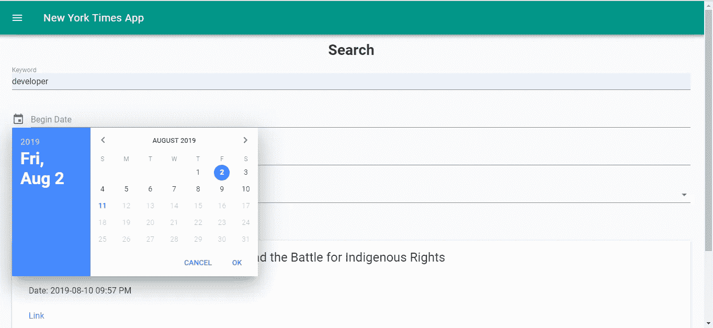
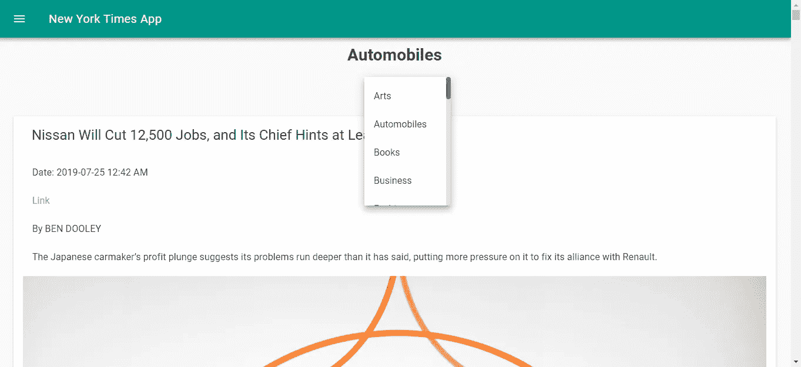
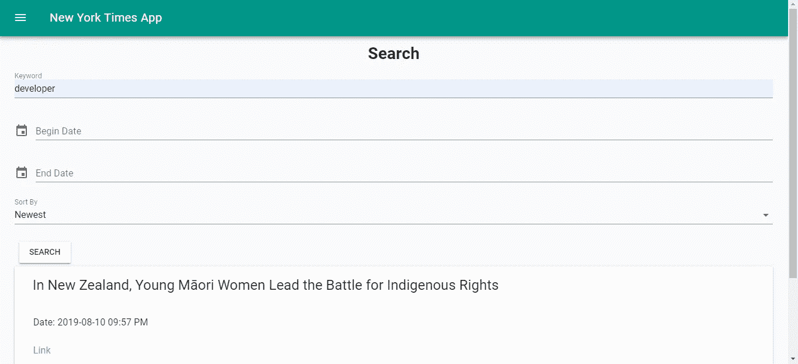

# 如何在你的 Vue.js 应用中使用 Mixins

> 原文：<https://betterprogramming.pub/how-to-use-mixins-in-you-vue-js-apps-b3cf6638cb03>

## Mixins 是可以直接集成到 Vue.js 组件中的代码片段


照片由[费利佩·斯基亚罗利](https://unsplash.com/@flpschi?utm_source=unsplash&utm_medium=referral&utm_content=creditCopyText)在 [Unsplash](https://unsplash.com/search/photos/mix?utm_source=unsplash&utm_medium=referral&utm_content=creditCopyText) 上拍摄

Mixins 是从一个 [Vue.js](https://vuejs.org/) 应用的其他部分分离出来的代码片段，可以合并到组件中。一旦它们被合并，它们就像组件中的其他功能一样工作。

它可以设置直接绑定到模板的变量，并将它们合并到 Vue.js 组件的组件主对象中。Mixins 通过组件的`mixins`字段合并到组件中。它需要一个数组`mixins`。

通过将想要合并到`mixin`对象中的组件对象的属性名，可以选择要合并到组件对象的哪个部分。

例如，如果你想用你的 mixin 给`methods`属性添加一个函数，那么，在你的 mixin 中，你把这个函数放在你的 mixin 的`methods`对象中。

在这一部分，我们将构建一个显示来自纽约时报 API 的数据的应用程序。你可以在[https://developer.nytimes.com/](https://developer.nytimes.com/)注册一个 API 密匙。之后，我们可以开始构建应用程序。

# 开始建造

要开始构建应用程序，我们必须安装 Vue CLI。我们通过运行以下命令来实现这一点:

```
npm install -g @vue/cli
```

运行 Vue CLI 需要 Node.js 8.9 或更高版本。我没能让 Vue CLI 在 Windows 版本的 Node.js 上运行，Ubuntu 帮我运行 Vue CLI 没有问题。

然后，为了创建项目文件夹和文件，我们运行:

```
vue create vue-material-nyt-app
```

在向导中，我们不使用默认选项，而是选择“手动选择功能”。然后，我们通过按空格键从选项列表中选择 [Babel](https://babeljs.io/) 、 [Router](https://router.vuejs.org/) 和 [Vuex](https://vuex.vuejs.org/) 。如果它们是绿色的，就意味着它们被选中了。

现在，我们需要安装一些库。我们需要安装一个 HTTP 客户端，一个用于格式化日期的库，一个用于从对象生成`GET`查询字符串，另一个用于表单验证。

同样，我们需要安装 [Vue 素材](https://vuematerial.io/)库本身。我们通过运行以下命令来实现这一点:

```
npm i axios moment querystring vee-validate vue-material
```

`axios`是我们的 HTTP 客户端，`moment`是操作日期，`querystring`是从对象生成查询字符串，`vee-validate`是 Vue.js 做验证的附加包，`vue-material`是我们的[素材设计](https://material.io/design/)库。

现在我们已经安装了所有的库，我们可以开始构建我们的应用程序了。

首先，我们创建一些组件。在`views`文件夹中，我们创建了`Home.vue`和`Search.vue`。这些是我们页面的代码文件。

然后，创建一个`mixins`文件夹，创建一个名为`nytMixin.js`的文件。Mixins 是代码片段，可以直接合并到我们的 Vue.js 组件中，就像直接在组件中一样使用。

然后，我们添加一些过滤器。过滤器是从一件事映射到另一件事的 Vue.js 代码。

我们创建一个`filters`文件夹并添加`capitalize.js`和`formatDate.js`。然后，在`components`文件夹中，我们创建一个名为`SearchResults.vue`的文件。`components`文件夹包含不是页面的 Vue.js 组件。

为了使组件之间的数据传递更容易、更有组织，我们使用 Vuex 进行状态管理。

因为我们在运行`vue create`时选择了 Vuex，所以在我们的项目文件夹中应该有一个`store.js`。如果没有，就创建它。在`store.js`中，我们输入:

```
import Vue from 'vue'
import Vuex from 'vuex'Vue.use(Vuex)export default new Vuex.Store({
  state: {
    searchResults: []
  },
  mutations: {
    setSearchResults(state, payload) {
      state.searchResults = payload;
    }
  },
  actions: {}
})
```

`state`对象是存储状态的地方。对象是我们可以操纵自己状态的地方。

当我们在代码中调用`this.$store.commit(“setSearchResults”, searchResults)`时，假设`searchResults`被定义，那么`state.searchResults`将被设置为`searchResults`。然后我们可以使用`this.$store.state.searchResults`得到结果。

我们需要添加一些样板代码到我们的应用程序中。首先，我们添加我们的过滤器。在`capitalize.js`中，我们把:

```
export const capitalize = (str) => {
    if (typeof str == 'string') {
        if (str == 'realestate') {
            return 'Real Estate';
        }
        if (str == 'sundayreview') {
            return 'Sunday Review';
        }if (str == 'tmagazine') {
            return 'T Magazine';
        }
        return `${str[0].toUpperCase()}${str.slice(1)}`;
    }
}
```

这使我们能够在[头条新闻链接](https://developer.nytimes.com/docs/top-stories-product/1/routes/%7Bsection%7D.json/get)中列出我们的纽约时报栏目名称。然后，在`formatDate.js`中，为了将我们的日期格式化为人类可读的格式，我们输入:

```
import * as moment from 'moment';export const formatDate = (date) => {
    if (date) {
        return moment(date).format('YYYY-MM-DD hh:mm A');
    }
}
```

在`main.js`中，我们放入:

```
import Vue from 'vue'
import App from './App.vue'
import router from './router'
import store from './store'
import VueMaterial from 'vue-material';
import VeeValidate from 'vee-validate';
import 'vue-material/dist/vue-material.min.css'
import 'vue-material/dist/theme/default.css'
import { formatDate } from './filters/formatDate';
import { capitalize } from './filters/capitalize';Vue.config.productionTip = false;Vue.use(VueMaterial);
Vue.use(VeeValidate);
Vue.filter('formatDate', formatDate);
Vue.filter('capitalize', capitalize);new Vue({
  router,
  store,
  render: h => h(App)
}).$mount('#app')
```

注意在上面的文件中，我们必须通过调用`Vue.use`在 Vue.js 中注册我们使用的库，这样它们就可以在我们的应用模板中使用。

我们在过滤器函数上调用`Vue.filter`，这样我们就可以在模板中使用它们，方法是在变量的右边添加一个管道和过滤器名称。

然后，在`router.js`中，当我们输入列出的 URL 时，我们可以进入页面，我们输入:

```
import Vue from 'vue'
import Router from 'vue-router'
import Home from './views/Home.vue';
import Search from './views/Search.vue';Vue.use(Router)export default new Router({
  mode: 'history',
  base: process.env.BASE_URL,
  routes: [
    {
      path: '/',
      name: 'home',
      component: Home
    },
    {
      path: '/search',
      name: 'search',
      component: Search
    }
  ]
})
```

`mode: ‘history’`意味着在基本 URL 和我们的路由之间不会有散列符号。如果我们部署我们的应用程序，我们需要配置我们的 web 服务器，以便所有请求都将被重定向到`index.html`，这样我们在重新加载应用程序时就不会出错。

例如，在 Apache 中，我们做到了:

```
<IfModule mod_rewrite.c>
  RewriteEngine On
  RewriteBase /
  RewriteRule ^index\.html$ - [L]
  RewriteCond %{REQUEST_FILENAME} !-f
  RewriteCond %{REQUEST_FILENAME} !-d
  RewriteRule . /index.html [L]
</IfModule>
```

并且，在 [Nginx](https://www.nginx.com/) 中，我们把:

```
location / {
  try_files $uri $uri/ /index.html;
}
```

有关如何在您的 web 服务器中执行相同操作的说明，请参阅您的 web 服务器的文档。

现在我们为组件编写代码。在`SearchResult.vue`中，我们放入:

```
<template>
  <div id="search-results">
    <md-card v-for="s in searchResults" :key="s.id">
      <md-card-header>
        <div class="md-title title">{{s.headline.main}}</div>
      </md-card-header><md-card-content>
        <md-list>
          <md-list-item>Date: {{s.pub_date | formatDate}}</md-list-item>
          <md-list-item>
            <a :href="s.web_url">Link</a>
          </md-list-item>
          <md-list-item v-if="s.byline.original">{{s.byline.original}}</md-list-item>
          <md-list-item>{{s.lead_paragraph}}</md-list-item>
          <md-list-item>{{s.snippet}}</md-list-item>
        </md-list>
      </md-card-content>
    </md-card>
  </div>
</template><script>
export default {
  computed: {
    searchResults() {
      return this.$store.state.searchResults;
    }
  }
};
</script><style scoped>
.title {
  margin: 0 15px !important;
}#search-results {
  margin: 0 auto;
  width: 95vw;
}.md-title.title {
  color: rgba(0, 0, 0, 0.87) !important;
}
</style>
```

这是我们从 Vuex 商店获取搜索结果并显示它的地方。

我们在应用程序的`computed`属性的函数中返回`this.$store.state.searchResults`，这样当商店的`searchResults`状态更新时，搜索结果将自动刷新。

`md-card`是一个卡片小部件，用于在一个框中显示数据。`v-for`用于循环数组条目并显示所有内容。`md-list`是一个列表小部件，用于在页面上整齐地显示列表中的项目。`{{s.pub_date | formatDate}}`是我们应用`formatDate`过滤器的地方。

接下来，我们写我们的`mixin`。我们将在 mixin 中为 HTTP 调用添加代码。在`nytMixin.js`中，我们把:

```
const axios = require('axios');
const querystring = require('querystring');
const apiUrl = '[https://api.nytimes.com/svc'](https://api.nytimes.com/svc');
const apikey = 'your api key';export const nytMixin = {
    methods: {
      getArticles(section) {
            return axios.get(`${apiUrl}/topstories/v2/${section}.json?api-key=${apikey}`);
      }, searchArticles(data) {
            let params = Object.assign({}, data);
            params['api-key'] = apikey;
            Object.keys(params).forEach(key => {
                if (!params[key]) {
                    delete params[key];
                }
            })
            const queryString = querystring.stringify(params);
            return axios.get(`${apiUrl}/search/v2/articlesearch.json?${queryString}`);
       }
    }
}
```

注意，我们将函数放在对象的`methods`属性中。这是因为我们希望将函数合并到组件的`methods`属性中。

如果一个对象在组件和 mixin 中有相同的名字，组件的对象将优先。

我们返回对 HTTP 请求的承诺，以在每个函数中获取文章。在`searchArticles`函数中，我们将传递给对象的消息传递到一个查询字符串中，我们将该字符串传递到我们的请求中。

确保将应用程序中的 API 键放入`apiKey`常量中，并删除任何未定义的内容，使用:

```
Object.keys(params).forEach(key => {
  if (!params[key]) {
     delete params[key];
  }
})
```

接下来在`Home.vue`，我们把:

```
<template>
  <div>
    <div class="center">
      <h1>{{selectedSection | capitalize}}</h1>
      <br />
      <md-menu>
        <md-button class="md-raised" md-menu-trigger>Sections</md-button><md-menu-content>
          <md-menu-item v-for="s in sections" :key="s" [@click](http://twitter.com/click)="selectSection(s)">{{s | capitalize}}</md-menu-item>
        </md-menu-content>
      </md-menu>
    </div>
    <br /><md-card v-for="a in articles" :key="a.id">
      <md-card-header>
        <div class="md-title title">{{a.title}}</div>
      </md-card-header><md-card-content>
        <md-list>
          <md-list-item>Date: {{a.published_date | formatDate}}</md-list-item>
          <md-list-item>
            <a :href="a.url">Link</a>
          </md-list-item>
          <md-list-item v-if="a.byline">{{a.byline}}</md-list-item>
          <md-list-item>{{a.abstract}}</md-list-item>
        </md-list>
        
      </md-card-content>
    </md-card>
  </div>
</template><script>
import { nytMixin } from "../mixins/nytMixin";export default {
  name: "home",
  mixins: [nytMixin],
  computed: {},data() {
    return {
      selectedSection: "home",
      articles: [],
      sections: `arts, automobiles, books, business, fashion, food, health,
    home, insider, magazine, movies, national, nyregion, obituaries,
    opinion, politics, realestate, science, sports, sundayreview,
    technology, theater, tmagazine, travel, upshot, world`
        .replace(/ /g, "")
        .split(",")
    };
  },beforeMount() {
    this.getNewsArticles(this.selectedSection);
  },methods: {
    async getNewsArticles(section) {
      const response = await this.getArticles(section);
      this.articles = response.data.results;
    },selectSection(section) {
      this.selectedSection = section;
      this.getNewsArticles(section);
    }
  }
};
</script><style scoped>
.image {
  width: 100%;
}.title {
  color: rgba(0, 0, 0, 0.87) !important;
  margin: 0 15px !important;
}
</style>
```

该页面组件是我们获取所选部分文章的地方，默认为`home`部分。我们还有一个菜单，通过添加以下内容来选择我们想要查看的部分:

```
<md-menu>
  <md-button class="md-raised" md-menu-trigger>Sections</md-button><md-menu-content>
     <md-menu-item v-for="s in sections" :key="s" [@click](http://twitter.com/click)="selectSection(s)">{{s | capitalize}}
     </md-menu-item>
  </md-menu-content>
</md-menu>
```

注意，我们在承诺代码中使用了`async`和`await`关键字，而不是`then`。它要短得多，并且`then`和`await`与`async`之间的功能是等效的。

但是，它在 Internet Explorer 中不受支持。在`beforeMount`块中，我们运行`this.getNewsArticles`在页面加载时获取文章。

然后在`Search.vue`中，我们放入:

```
<template>
  <div>
    <div class="center">
      <h1>Search</h1>
    </div>
    <form [@submit](http://twitter.com/submit)="search" novalidate>
      <md-field :class="{ 'md-invalid': errors.has('keyword') }">
        <label for="keyword">Keyword</label>
        <md-input type="text" name="keyword" v-model="searchData.keyword" v-validate="'required'"></md-input>
        <span class="md-error" v-if="errors.has('keyword')">{{errors.first('keyword')}}</span>
      </md-field><div>
        <md-datepicker v-model="searchData.beginDate" :md-disabled-dates="disabledDates">
          <label>Begin Date</label>
        </md-datepicker>
      </div><div>
        <md-datepicker v-model="searchData.endDate" :md-disabled-dates="disabledDates">
          <label>End Date</label>
        </md-datepicker>
      </div><md-field>
        <label for="movie">Sort By</label>
        <md-select v-model="searchData.sort">
          <md-option value="newest">Newest</md-option>
          <md-option value="oldest">Oldest</md-option>
          <md-option value="relevance">Relevance</md-option>
        </md-select>
      </md-field><md-button class="md-raised" type="submit">Search</md-button>
    </form>
    <SearchResults />
  </div>
</template><script>
import { nytMixin } from "../mixins/nytMixin";
import SearchResults from "@/components/SearchResults.vue";
import * as moment from "moment";export default {
  name: "search",
  mixins: [nytMixin],
  components: {
    SearchResults
  },
  computed: {
    isFormDirty() {
      return Object.keys(this.fields).some(key => this.fields[key].dirty);
    }
  },
  data: () => {
    return {
      searchData: {
        sort: "newest"
      },
      disabledDates: date => {
        return +date >= +new Date();
      }
    };
  },
  methods: {
    async search(evt) {
      evt.preventDefault();
      if (!this.isFormDirty || this.errors.items.length > 0) {
        return;
      }
      const data = {
        q: this.searchData.keyword,
        begin_date: moment(this.searchData.beginDate).format("YYYYMMDD"),
        end_date: moment(this.searchData.endDate).format("YYYYMMDD"),
        sort: this.searchData.sort
      };
      const response = await this.searchArticles(data);
      this.$store.commit("setSearchResults", response.data.response.docs);
    }
  }
};
</script>
```

这是我们用来搜索文章的表单。我们还有两个日期选择器来标记用户，以设置开始和结束日期。我们只将日期限制在今天和更早，以便搜索查询有意义。

在这个街区:

```
<md-field :class="{ 'md-invalid': errors.has('keyword') }">
  <label for="keyword">Keyword</label>
  <md-input type="text" name="keyword" v-model="searchData.keyword" v-validate="'required'"></md-input>
  <span class="md-error" v-if="errors.has('keyword')">{{errors.first('keyword')}}</span>
</md-field>
```

我们使用`vee-validate`来检查所需的搜索关键字字段是否已填写。如果不是，它将显示一条错误消息并阻止查询继续进行。

我们还将`SearchResults`组件嵌套到`Search`页面组件中，包括:

```
components: {
  SearchResults
}
```

在模板中的`script`标签和`<SearchResults />`之间。

最后，我们通过在`App.vue`中输入以下内容来添加顶部栏和菜单:

```
<template>
  <div id="app">
    <md-toolbar>
      <md-button class="md-icon-button" [@click](http://twitter.com/click)="showNavigation = true">
        <md-icon>menu</md-icon>
      </md-button>
      <h3 class="md-title">New York Times App</h3>
    </md-toolbar>
    <md-drawer :md-active.sync="showNavigation" md-swipeable>
      <md-toolbar class="md-transparent" md-elevation="0">
        <span class="md-title">New York Times App</span>
      </md-toolbar><md-list>
        <md-list-item>
          <router-link to="/">
            <span class="md-list-item-text">Home</span>
          </router-link>
        </md-list-item><md-list-item>
          <router-link to="/search">
            <span class="md-list-item-text">Search</span>
          </router-link>
        </md-list-item>
      </md-list>
    </md-drawer><router-view />
  </div>
</template><script>
export default {
  name: "app",
  data: () => {
    return {
      showNavigation: false
    };
  }
};
</script><style>
.center {
  text-align: center;
}form {
  width: 95vw;
  margin: 0 auto;
}.md-toolbar.md-theme-default {
  background: #009688 !important;
  height: 60px;
}.md-title,
.md-toolbar.md-theme-default .md-icon {
  color: #fff !important;
}
</style>
```

如果你想要一个带有左导航抽屉的顶栏，你必须精确地遵循上面的代码结构。

写完所有代码后，我们有以下代码:

