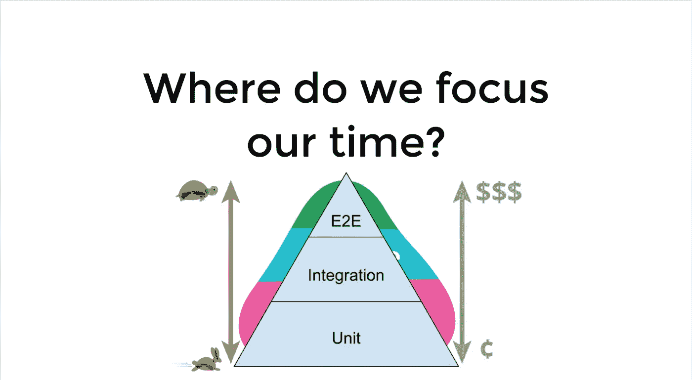

# 如何在使用 Jest 的 JavaScript 测试中使用嘲讽

> 原文：<https://betterprogramming.pub/how-to-use-mocking-in-javascript-tests-using-jest-67cf513f47c0>

## 使用 mocking 轻松编写令人敬畏的测试


卢卡·布拉沃在 [Unsplash](https://unsplash.com?utm_source=medium&utm_medium=referral) 上的照片

如果你曾经在软件项目中编写过测试，那么你可能熟悉各种测试方法。

单元测试是最基本但看似强大的测试方式。单元测试开发成本低，易于执行和调试，因为与端到端测试等更复杂的测试方法相比，单元测试可以隔离故障，并且执行速度相当快。

你可能见过测试金字塔:



用单元测试可以测试什么？

*   功能
*   纯类
*   组件(包括 DOM):例如 Angular / React / Vue.js / Web 组件

[查看这篇文章，了解如何选择最合适的测试方法。](https://medium.com/@ali.dev/how-to-decide-between-unit-tests-end-to-end-tests-in-web-apps-429f53bc7357)

# 为什么函数、类或组件可能很难测试？

*   该类具有难以提供的依赖关系(例如，构造函数需要多个参数)
*   一个类的某些功能可能无法从外部访问(例如，[在 TypeScript](http://www.typescriptlang.org/docs/handbook/classes.html#public-private-and-protected-modifiers) 中使用 private 这样的访问修饰符)
*   函数/类/组件做了太多我们在测试中不想要的事情

## 嘲讽对写出更好的测试有什么帮助？

*   手动模拟用于剔除我们在测试范围内不真正需要的功能。
*   通过避免依赖性(例如，访问真实的数据库，使用第三方库)使您的测试更快、更可靠
*   使事情更容易测试。使用 mocking，您可以很容易地创建理想的测试设置来用于您的测试。
*   减少测试的设置。许多图书馆期望做一些设置以便工作。使用 mocking，您可以忽略所有这些，而是专注于测试实际的功能。
*   我们不需要测试第三方代码，因为它可能已经测试过了。在单元测试中，我们希望专注于我们自己开发的应用程序的较小部分。模仿第三方依赖有助于让测试更关注我们的定制逻辑，而不是内部实现细节。

需要注意的是，在端到端和集成测试中，嘲讽也是可能的。然而，模拟对于单元测试来说更有意义。集成，尤其是端到端的测试，为您的应用程序及其构建块的正常运行提供了更高的有效性。因此，我们将重点放在单元测试中的嘲讽上。

我将在下面的例子中使用 [TypeScript](https://www.typescriptlang.org/) ,但是它也以类似的方式处理普通的 JavaScript。我更喜欢将 [Jest](https://jestjs.io/) 作为 JavaScript 项目中的测试框架。我写过关于在[客户端](https://itnext.io/how-to-use-jest-in-angular-aka-make-unit-testing-great-again-e4be2d2e92d1)和[服务器端](https://itnext.io/test-driven-develop-your-api-with-jest-supertest-in-node-js-7e1c6489b0a6)应用以及[端到端测试](https://medium.com/better-programming/how-to-use-puppeteer-with-jest-typescript-530a139ffe40)中使用 Jest 的帖子。简而言之，Jest 是一个很好的选择，因为它使用简单，功能强大(例如，CLI，许多插件，框架无关的支持，不需要浏览器)。

当然，您可以使用 Jasmine、Mocha 或其他测试框架，因为大多数测试框架都支持模拟，不管是哪种语言。这意味着这个概念也可以应用于其他编程语言，如 Python、Java 或 C#。

# 模仿一个类的函数

```
describe('Email client', () => {
  it('can receive emails', () => {
     // we don't want to access any database in this test so we mock
     // the *get* function of the *UserDao* class which connects to a 
     // database
     spyOn(UserDao, 'get').and.returnValue({id: 123, name: 'John Doe'});
     getEmails(UserDao.get('123'));
  });
});
```

# 模仿导出的函数或常数

```
*// dev.helpers.js contains this exported function**export function isProduction() {
  return process.env.*NODE_ENV === 'production';
*}* *// email-client.spec.ts contains tests**// we need to import with an alias since we can't spy on exported functions or constants directly
import* * *as* devHelpers from "helpers/dev.helpers";describe('Email client', () => {
  it('can send emails', () => {
    spyOn(devHelpers, 'isProduction').and.returnValue(*false*);
    sendEmail(); // we don't want to attempt to send a real email in this test
  });
});
```

# 模仿第三方库或自定义模块

```
// we don't care about the actual implementation of this module (e.g. jQuery) in our tests since it is not important for our testsjest.mock('module_name');
```

# 结论

感谢您阅读这篇关于如何使用嘲讽在 JavaScript 中编写更简单、更可靠的测试的文章。正如您所看到的，嘲讽帮助我们编写更稳定、更容易编写的测试。特别是对于单元测试，它允许我们测试东西而不用担心外部依赖。如果这有帮助，请在评论中告诉我。