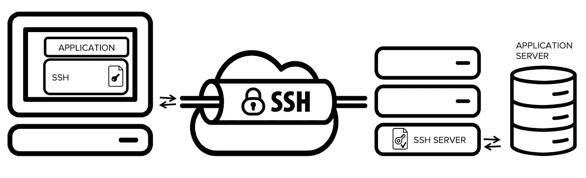
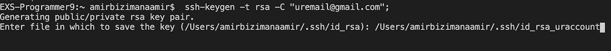

# 如何在一台电脑上使用多个 GitHub 帐户

> 原文：<https://betterprogramming.pub/how-to-use-multiple-github-accounts-with-one-computer-c9ba3f851b75>

## 如何设置和更改 SSH 密钥以在一台机器上使用多个 GitHub 帐户


泰伊斯·里贝罗在 [Unsplash](https://unsplash.com?utm_source=medium&utm_medium=referral) 上拍摄的照片

我目前有两个 GitHub 账户:一个个人账户和一个工作账户。很明显，我的工作电脑是用我的工作账号设置的。我想知道当我在工作电脑上做兼职项目时，如何用我的个人账户推送至 GitHub。

乍一看，对于在两个帐户之间切换这个看似简单的任务来说，这个过程似乎有点复杂。但是一旦你把事情分解成步骤，就不那么令人畏惧了。

# 快速注释上**宋承宪 **

[SSH](https://www.ssh.com/ssh/protocol/#strong-authentication-with-ssh-keys) (或称安全外壳)是一种网络协议，它允许一台计算机通过互联网等不安全的网络与另一台计算机进行通信。

在没有加密的情况下，数据以纯文本形式在网络上传输。因此，有人很容易出于恶意拦截有价值的数据，如用户名或密码。

SSH 允许通过 [*隧道*](https://www.ssh.com/ssh/tunneling/) 对您的数据进行加密，这允许您的计算机安全地连接到另一台计算机。

这是通过使用 [SSH 密钥](https://www.ssh.com/ssh/key/)和[公钥加密](https://en.wikipedia.org/wiki/Public-key_cryptography)(又名非对称加密)来完成的，它们用于所述计算机之间的认证目的，以便解密共享的信息。

[这里有一个很棒的视频](https://www.youtube.com/watch?v=AQDCe585Lnc)进一步解释了非对称加密的概念。

SSH 通常使用客户机-服务器模型来实现。



非对称加密的客户机-服务器模型

当从我们的计算机运行任何远程命令(例如 git push 或 git pull)到远程存储库(GitHub)时，正是这个协议使我们不必每次都提供密码和用户名。

现在让我们来看看它的配置。

# 配置

该配置基本上可以分为四个步骤:

1.  为新帐户生成一个 SSH 密钥。
2.  将此新密钥附加到您的 GitHub 帐户。
3.  向 SSH 代理注册新密钥。
4.  创建一个 SSH 配置文件。

## **第一步。为新帐户**生成一个 *SSH* 密钥

使用 SSH 协议，我们必须为我们想要使用的任何新帐户生成一个密钥。

跳到您的终端上，运行以下命令，并附上您的 GitHub 电子邮件地址:

```
$ ssh-keygen -t rsa -C "uremail@gmail.com" 
```

将生成一个新的密钥对。此时，您需要注意不要覆盖现有的密钥对，如下所示:

```
({your home Directory}/.ssh/id_rsa):
```

相反，您可以复制目录并修改文件名以包含您的帐户名称，如下面的屏幕截图所示:



然后会提示您输入密码。您的新 SSH 密钥将位于如下所示的目录中:

```
{your home Directory}/.ssh/id_rsa_uraccount
```

## **第二步。将新密钥附加到您的 GitHub 帐户**

我们刚刚创建了一个公钥，现在我们需要允许我们的 GitHub 帐户信任它。这使得您不必在每次运行远程命令(git push，git pull)时都进行身份验证。

通过以下命令`pbcopy < ~/.ssh/id_rsa.pub`复制公钥，然后登录您的个人 GitHub 账户:

1.  转到`Settings`。
2.  在左侧导航栏中，点击`SSH and GPG keys`。
3.  点击`New SSH key`，给它命名(以你正在使用它的计算机命名是个好主意)，然后粘贴你之前复制的密钥。
4.  点击`Add key`。

## **第三步。向 *SSH 代理*** 注册新密钥

我们现在需要向 SSH 代理注册我们的密钥。SSH 代理跟踪用户身份密钥和密码，并作为额外的安全层工作。

在您的终端中，编写命令`ssh-add`并添加包含您的密钥的文件的路径。如下所示，我们正在为我们的主帐户和刚刚创建的第二个帐户添加密钥。

```
ssh-add ~/.ssh/id_rsa
ssh-add ~/.ssh/id_rsa_uraccount
```

## **步骤四。创建一个 *SSH* 配置文件**

SSH 配置文件允许我们设置配置规则，这些规则将指定我们希望何时推送至我们的工作帐户还是个人帐户。这是通过定义在哪个域上使用哪个身份文件(我们已经添加到 SSH 代理中的文件)来实现的。

如果文件已经创建，它应该在`~/.ssh/config`。但是默认情况下，它不存在，所以我们需要通过运行命令`touch ~/.ssh/config`来创建它。

您可以使用任何文本编辑器或 IDE 来打开和编辑该文件。我用了终端的文本编辑器[vim](https://www.vim.org/)。我不经常使用它，它确实有一点学习曲线，所以我倾向于使用一个[备忘单](https://devhints.io/vim)来浏览它**。**

要打开文件，使用`vim config`。

```
# Account 1 (work or personal) - the default config
Host github.com
   HostName github.com
   User git
   IdentityFile ~/.ssh/id_rsa

# Account 2 (work or personal) - the config we are adding
Host github-uraccount   
   HostName github.com
   User git
   IdentityFile ~/.ssh/id_rsa_uraccount
```

顶部是默认配置。它包括以下内容:

*   **主机** ( `github.com`)
*   其**主机名** ( `github.com`)
*   一个**用户 ID** ( `git`)
*   其**身份文件** ( `~/.ssh/id_rsa`)

我们基本上可以复制默认配置；我们只需要改变两件事:主机(`github-uraccount`)和身份文件(我们之前创建的密钥，`~/.ssh/id_rsa_uraccount`)。

这应该可以了。使用`:wq`保存并关闭文件(如果使用 vim)。

# 创建新的存储库

现在我们已经完成了配置，让我们用我们的新帐户推送至 GitHub。

在项目的工作目录中，首先使用`git init` 初始化 git，然后转到 GitHub 并创建一个新的存储库。

当您看到现有 Git repo 下的指令时，您通常只需将命令复制并粘贴到您的终端，以将 Repo 作为远程添加到您的本地 Repo，但是在这种情况下，我们需要将“github.com”替换为我们之前在配置文件中设置的主机。所以我们用`git@github-uraccount`代替默认主机`git@github.com`。

```
git remote add origin git@github-uraccount:uraccount/repo_name.git
```

现在，您可以使用以下代码推送到 GitHub:

```
git add .
git commit -m "Initial commit"
git push -u origin master
```

## 将您的提交与特定用户名相关联

对于单个存储库，如果您想更改与您的提交相关联的名称，您还需要更改您的用户名和电子邮件，以反映您希望存储库与如下所示的`[git config](https://help.github.com/en/github/using-git/setting-your-username-in-git)`相关联的 GitHub 帐户(为了全局操作，在`user`之前添加标志`-g`)。

```
git config user.name "uraccount"
git config user.email "uraccount@gmail.com"
```

我们做到了！感谢阅读——我希望这个小小的配置演练对您有所帮助！

# 资源

*   [宋承宪](https://www.ssh.com/ssh/protocol/#typical-uses-of-the-ssh-protocol)
*   [宋承宪地道](https://www.ssh.com/ssh/tunneling/)
*   [SSH 按键](https://www.ssh.com/ssh/key/)
*   [非对称加密](https://www.youtube.com/watch?v=AQDCe585Lnc)
*   [SSH 的用法](https://www.ssh.com/ssh/protocol/#typical-uses-of-the-ssh-protocol)
*   [SSH 代理](https://www.ssh.com/ssh/agent/)
*   [SSH 配置文件](https://www.ssh.com/ssh/config/)
*   [Vim](https://www.vim.org/)
*   [Vim 备忘单](https://devhints.io/vim)
*   [Git 配置](https://help.github.com/en/github/using-git/setting-your-username-in-git)