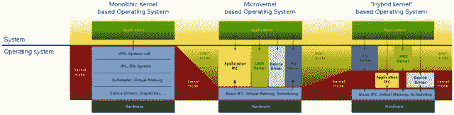
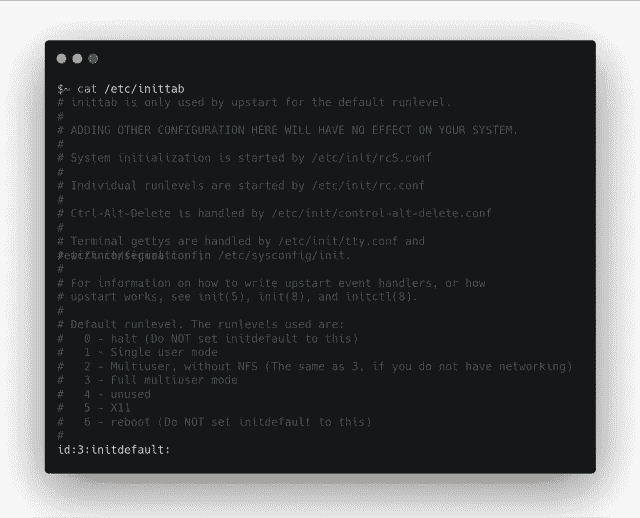
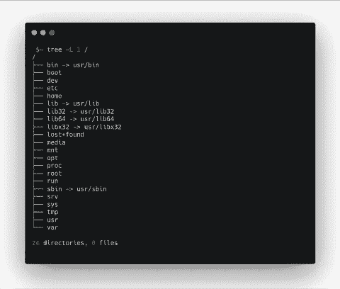
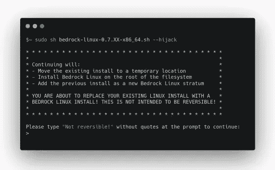
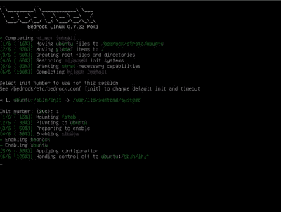
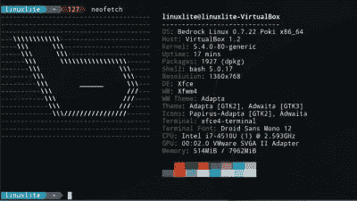
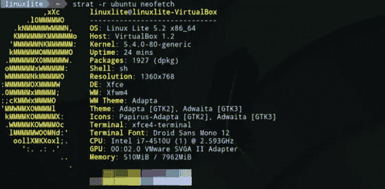
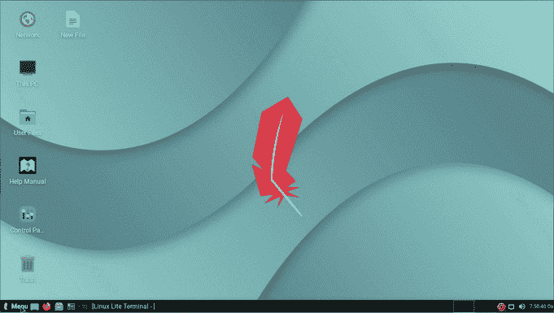
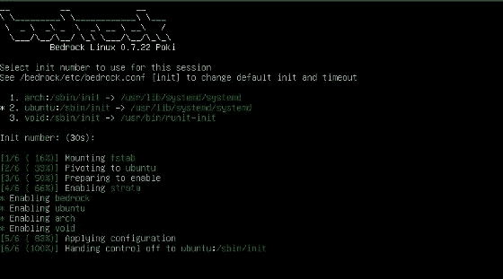

# 如何同时使用多个 GNU/Linux—基岩 Linux

> 原文：<https://betterprogramming.pub/how-to-use-multiple-gnu-linux-at-the-same-time-bedrock-linux-c172ff7e7b50>

## 基本 Linux 元发行版综述


照片由 [Remy_Loz](https://unsplash.com/@remyloz?utm_source=medium&utm_medium=referral) 在 [Unsplash](https://unsplash.com?utm_source=medium&utm_medium=referral) 上拍摄

你好，在这篇文章中，我将谈论基岩 Linux，这是一个守护进程，它允许使用来自多个软件包管理器的软件包，同时也在层中安装和使用多个发行版。

虽然它被描述为一个独立的 Linux 发行版，但我们可以说它是一个守护进程，将安装到根目录的发行版连接到根目录，然后再分层安装。这是一个系统，允许使用多个不同的软件包以及一个非常有用的和可定制的架构。

为了理解这个架构，我先来说说 Linux 系统的层次结构。接下来，我将回顾基本的 Linux 层次结构，并简单解释如何安装和使用它。

# Linux 系统层次结构

Linux 是一个具有类似 Unix 设计的操作系统内核。内核由 Linus Torvalds 设计，目前仍在开源开发中。最新的内核版本是 Linux 5.14。并可通过链接获得。Linus Torvalds 还拥有 git 项目、源代码管理和版本控制软件。这种单片内核于 1991 年命名，广泛用于超级计算机、个人或移动设备使用的操作系统。

例如，Android、Debian、RHEL(Red Hat Enterprise Linux)、CentOS 都是 GNU/Linux 发行版的例子。尤其是 Debian 和基于 Debian 的发行版，RHEL 和基于 RHEL 的发行版经常被用作服务器操作系统。Linux 和 Unix 是整体内核。单片内核比微内核占据更大的面积。本质上，使用单片内核的操作系统在“内核模式”，即内核空间中运行所有的操作系统功能。

每个进程都在独立的地址空间中。内核和操作系统服务在同一个地址空间。进程可以从内核请求服务。这在内核和应用程序之间创建了一个安全层。它还提供了高速度，因为没有消息流量。然而，对内核的更改需要重新编译，内核代码会变得非常复杂。

在使用微内核的系统中，“内核模式”占用的空间更少。文件系统、虚拟内存管理器和 CPU 调度程序等系统服务位于内核的“用户模式”区域，每个服务都有自己的地址空间。应用程序也有自己的地址空间。这种核心是可定制的，并且易于扩展。

在微内核中，由于系统架构，组件中的故障不会影响整个系统。在这方面，我们可以说这种架构是持久的。然而，如果单块系统出错，整个系统都会受到影响，因为服务是相互连接的。但在速度方面，它明显优于单片架构。微内核的例子有 Symbian、Minix 和 GNU。大多数 Linux 发行版不是一个 Linux 项目，而是一个 GNU 项目。因为 Linux 只是一个内核，它只占整个系统的很小一部分。另一方面，混合体系结构结合了单片和微内核的优点，从而减少了缺点。它们在内核空间中保存更多的代码。通信单元和许多驱动程序都嵌入在内核区域。然而，当添加一个新组件时，它不需要像在单片架构中那样重新编译。比如达尔文和 macOS 内核 XNU，基于 BSD 的 FreeBSD，Windows NT 都是在这个架构下编码的。现代操作系统更喜欢这种架构。



来源:[维基百科](https://en.wikipedia.org/wiki/Monolithic_kernel)

图片来源:[维基百科](https://en.wikipedia.org/wiki/Monolithic_kernel)

# 初始化系统

它是 GNU/Linux 系统上的祖先进程。它将 1 作为 PID，在内核加载后，通过检查`/etc/inittab`中的运行级别来决定系统将从哪个运行级别开始，例如我们习惯于从 macOS 使用的 windows 或安全模式。下图显示了运行级别。如 Centos7 系统中的`inittab`文件所示，0 暂停，1 单用户模式，2 多用户等。正在被使用。3，即完全多用户模式，默认使用为`initdefault`。

init 启动后，其他进程依次启动，并在`/etc/rc.d/init.d`下使用该模式。比如 udev，apache，preload 服务可以在 init 之后启动。这是像`/etc/rc.d/init.d/init3.d/S100preload`一样的用法。`init3.d`处于第三模式，S100 表示预载将从第 100 个顺序开始。



inittab-按作者排序的图像

在今天的 GNU/Linux 发行版中，这种结构并不是首选。其中大部分都默认自带了 2010 年写的`systemd`。它还被用于 runit、OpenRC、Upstart 等新一代结构中。旧版本是 SysV init 系统。

在新的结构中，有一些功能，如并行启动进程，自动启动进程需要的进程，如果进程终止，自动重新启动。`systemd`是一个比其他系统稍慢的初始化系统。其中启动时间最快的系统是 Runit，而且是跨平台的。在 GNU/Linux、Solaris、macOS X 上可用。

# 文件系统和目录层次结构

文件系统是磁盘上的标记结构，允许操作系统找到文件。GNU/Linux 发行版通常使用 ext 2–3–4 日志系统。它还可以在 Windows 文件系统 NTFS 上查找文件跟踪。一切都是一个文件，在目录中按层次顺序设计。文件、驱动程序、可执行文件和库都位于这些目录中。这个目录结构可以在下图中看到。



树形文件系统-图片来自作者

在正常使用中，我们可以说使用最多的目录是`/var`、`/lib`、`/usr`、`/home`。此外，目录将自己分支成树。例如，`/usr`目录包含带有二进制文件的`/usr/bin`目录。或者目录`/var/lib`在`/var`下。`/bin`目录在引导时加载，包含基本命令。`/sbin`包含提供系统信息或进行更改的二进制文件。

`/lib`包含共享库，/media 包含可移动磁盘，`/mnt`包含新挂载的文件系统，`/var`包含变量。`/home`目录包含用户的私有文件。`/etc`包含配置文件。`/boot`目录包含了 bootloader 和一些与系统引导相关的核心文件，比如 grub、lilo。这些目录可以分成不同的分区，并连接到系统。这是一种广泛使用的方法。例如，当主目录安装在与根目录不同的分区上时，当重新安装系统或安装不同的 GNU/Linux 发行版时，安装在用户文件和用户目录中的程序不会被删除。基岩 Linux 设计者在这个层次上开发了一个不同的模型。

基岩 Linux 基岩 Linux 是一个面向生产力的守护进程，旨在使用来自许多发行版的模块，定义为一个元发行版，一起放在一个操作系统中。换句话说，你可以在 Debian 上工作，使用来自 Arch Linux 的 **Pacman** 或 **AUR** 包管理器和包。您可以使用不同操作系统中的库和不同系统中安装的字体进行不同的编程。这个系统也有一些缺陷。目前正在 0.7 poki minor 以上进展。另外，也不能说是以安全为导向。这个系统对于那些不仅想从单个系统中获益，而且想从许多系统中获益，并且想同时使用多个包管理器、不同的包或不同的 init 系统的用户来说非常有用。你可以从[链接查看。](https://bedrocklinux.org/index.html)

这个系统使用起来非常简单。一旦很好地理解了层的概念，对于高级用户来说就很容易适应了。从 Github 下载一个 shell 脚本后，它会以 root 用户身份启动，并要求您确认要执行的操作，以此警告您这些操作是不可撤销的。然后，它获取根目录中的发行版，并将其移动到`/bedrock`下的一个层中。您可以使用`**brl**`命令将其他发行版集成到您的系统中。你也可以在`bedrock.conf`文件中配置你的系统。位于`/etc/bedrock`下方。

`**brl apply**`用于应用修改。社区端使用率在基岩 Linux 官方页面[(链接)](https://bedrocklinux.org/0.7/distro-compatibility.html)给出。通常，经常使用的分布的错误率很低。比如 Debian，ubuntu，centos，arch 都用的比较频繁，没有已知问题。但是很多问题在不同的发行版中都有报道，比如 Clear Linux，nixOS。地层的概念将在下一节讨论。

# 地层

基岩将每个发行版安装在一个层上，在它们之间建立一个通信桥梁，并为其他交互使用提供适当的环境。

```
$ brl fetch --list
```

使用该命令，可以看到可用作 stratum 的分布。

```
$ brl fetch void
```

使用这个命令可以创建 void Linux 层。它有 void Linux `runit` init 系统。当基岩初始化接口来的时候，你可以在`init`菜单上看到它是`**void:runit**`。

```
$ strat -r debian neofetch
```

使用该命令时，Debian stratum 中的`neofetch`包将运行，并将 Debian 视为根目录。它将 Debian 作为操作系统版本输出。但是直接用`neofetch`的时候，基岩 Linux 会被看成 os-release。当生成工具扫描环境并从不同的发行版中找到依赖项时发生。

如果像这样的底层环境引起混淆，可以使用 restrict -r 参数绕过层间挂钩。如果你用同一个包管理器使用两个发行版，例如，apt 和 rpm 是最常用的包管理器，那么你可以以`apt`的身份启动 ubuntu。可能需要这样的应用程序，因为源存储库是不同的。

如果一个包存在于多个层中，那么它将在`pinned`层中执行。你可以和`brl which`核实一下。所有层都可以将`/run`、`/temp`、`/home`目录视为一个全局文件路径。

如果需要，您可以启用或禁用某些层。您可以使用`brl enable/disable`命令。您可以使用`brl remove -d`命令直接删除地层。

```
$ brl remove -d fedora
```

# 安装、使用和审查

在本节中，将解释一些主题，如如何通过在 VirtualBox 中基于 Ubuntu 的虚拟 Linux lite 上安装基岩来创建和配置一些地层，如何安装软件包。

您可以选择不同的发行版。特别是，基于常用或经常使用的发行版而没有进行重大更改的发行版可以顺利运行。

对于安装，可以从链接下载适合 CPU 架构的脚本。首先，守护进程的安装应该通过以 root 用户身份运行基岩 shell 脚本来完成。



作者的基岩 Linux 安装图

**“不可逆！”**通过键入，您同意这些条款，安装开始。在安装之前，根目录中的操作系统被带到一个临时位置。

然后在根上安装基岩，在一个层中安装临时位置的 OS。该过程完成后，您可以看到重启后的 init selection 文本模式界面。



基岩 linux 初始化菜单——作者图片

这里，系统从标有`“*”. /sbin/init`的系统引导到这里的`/usr/lib/systemd/systemd`。`Systemd`启动服务，提供系统引导。当 Ubuntu 启动时，名为`crossfs`和`etcfs`的进程是文件系统，用于在层边界之间移动文件、库和字体。此外，包含地层二进制文件的路径被添加到`PATH`变量中。这样，我们可以通过 bash 或任何 shells 访问它们。



neofetch —作者图片

我正在 Ubuntu 上安装`neofetch`包。你可以从 Ubuntu apt 库安装它。然后，当我使用`neofetch`命令时，基本系统显示为基岩。在 Ubuntu 层运行`neofetch`。

```
$ strat -r ubuntu neofetch
```

应该使用命令。受限情况下，跨层挂钩被禁用。这种方式`neofetch`只会在`ubuntu`地层起作用。



Ubuntu startum 中的 nefetch 图片由作者提供

创造另一个阶层，

```
$ brl fetch --list 
alpine
arch
...
...
$ brl fecth void
```

您可以使用命令检查发行版。然后用`brl fetch`从 stratum mirror 下载安装。

比如使用`runit`的 void Linux，拉包之后，可以在 init 菜单看到 void Linux。当`strat -r void neofetch`再次运行时，它会警告包不存在。

因为中间没有钩子，所以无法到达 ubuntu 地层中的`neofetch`包。在这个层中，用`sudo xbps-install neofetch` **安装并运行这个包。**

系统里既有 ubuntu 又有 void `startums`。这里`xbps`包管理器和 apt 包管理器可以联合使用。例如

```
$ sudo xbps-install filezilla
```

通过这个命令，Filezilla 可以在 ubuntu stratum 中安装和运行。反之亦然。例如，在 Arch Linux stratum 中，您可以从 AUR 软件包安装一个软件包，并从其他 startums 访问它。

为此，git 可以与 Pacman 一起安装，spring 助手软件可以从 GitHub repo 安装。使用`yay -Sy brave`一个属于拱形地层的包可以被所有地层使用。

在下一次系统启动时，有三个初始化选择选项。除了使用`systemd`的 arch 和 ubuntu，还可以使用使用`runit`的 void Linux init 系统。



filezilla 是 void stratum，但它可以在 Ubuntu stratum-gif 上访问

在下一次系统启动时，有三个初始化选择选项。除了使用`systemd`的 arch 和 ubuntu，还可以使用使用`runit`的 void Linux init 系统。



初始菜单中有三个发行版——按作者分类的图片

系统相关的设置可以在`bedrock.conf`文件中进行。比如可以改变默认的 init，可以缩短超时时间，可以设置字体所在的目录，也可以进行层间的优先级设置。可以为`brl fetch`更换镜像服务器。详细信息可以通过这个[链接](https://bedrocklinux.org/0.7/configuration.html)。

# 总结和结论

这个系统完全以生产力为导向。可能存在一些与安全相关的问题。官方页面为那些有安全顾虑的人提供了一些答案。但是，如果安全性是您最关心的问题，并且希望同时使用多个发行版的特性，那么使用 Qubes 这样的发行版更合适。

Qubes 将每个操作系统虚拟化到下一个级别。这是一个旨在通过隔离提供安全的系统。它默认推荐 Whonix，但是你也可以安装 windows 或者 fedora，Debian。安全和生产率/速度在这里是两个相互冲突的概念。我认为这个发行版是一个元发行版，将在主要的 1.0.0 版本发布后由**发行商**使用。即使这个版本也没有很多问题，用户体验非常稳定。

我认为它对于使用 Linux 发行版的开发人员来说也是非常有用的。在 Linux 发行版中创建一个广泛而强大的开发环境有时可能非常困难，但是这个元发行版允许我们同时使用更多不同的 Linux 发行版应用程序。在我看来，它将提高每个开发人员或任何执行操作任务的工程师的生产率。