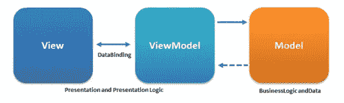
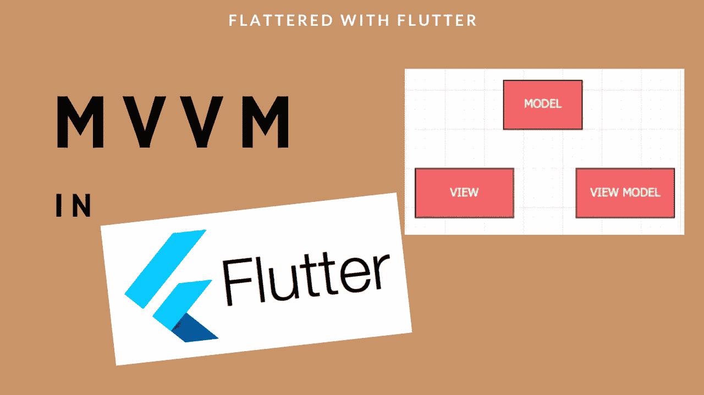
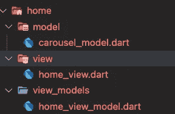
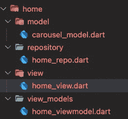
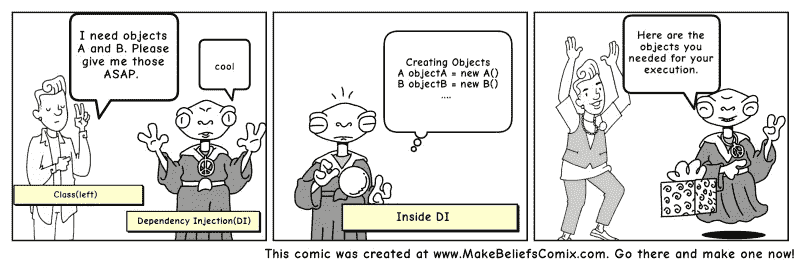
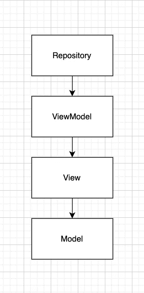

# 如何在颤振中使用 MVVM

> 原文：<https://betterprogramming.pub/how-to-use-mvvm-in-flutter-4b28b63da2ca>

## 颤振开发人员的分步指南


由[雷·轩尼诗](https://unsplash.com/@rayhennessy?utm_source=medium&utm_medium=referral)在 [Unsplash](https://unsplash.com?utm_source=medium&utm_medium=referral) 拍摄的照片

在本指南中，我们将简要介绍以下内容:

```
[What is MVVM](#9fcb)
[Using MVVM in Flutter](#d20e)
[Extending MVVM with Repository and Services](#28b7)
```

> **注意**:本文假设读者知道[提供者](https://pub.dev/packages/provider)。

# 什么是 MVVM

模型-视图-视图模型(MVVM)是一种软件架构模式，支持 UI(视图)与业务逻辑或后端逻辑(模型)的开发分离。MVVM 内部的视图模型是负责数据转换的桥梁，它通过 UI 上发生的变化来表现。

此外，要了解这三个组件的职责，了解它们如何交互也很重要。在最高级别，视图“知道”视图模型，视图模型“知道”模型，但是模型不知道视图模型，视图模型不知道视图。



MVVM 建筑

使用 MVVM 有几个优点:

*   关注点分离:这是一个将计算机程序分成不同部分的设计原则，这样每个部分处理一个单独的关注点。关注点是为问题提供解决方案的任何事情。
*   改进的可测试性
*   定义的项目结构
*   UI 的并行开发
*   抽象出`View`，从而减少其背后代码中所需的业务逻辑数量

使用 MVVM 的一些缺点:

*   它的学习曲线有点陡峭。理解所有层如何协同工作可能需要一些时间。
*   它增加了很多额外的类，所以对于低复杂度的项目来说并不理想。

由于架构或设计模式是平台无关的，它们可以用于任何框架，在我们的例子中，就是 Flutter。

[](https://youtube.com/shorts/naOmmUHJMsQ) [## 在颤振中使用 MVVM🤩👨‍💻#建筑#颤动#短裤

### 模型-视图-视图模型(MVVM)是一种软件架构模式，支持用户界面(即视图)的分离

youtube.com](https://youtube.com/shorts/naOmmUHJMsQ) 

# 成分

模型:这是域模型或者代表来自后端的数据的模型(也称为数据访问层)。模型保存信息，但通常不处理行为。它们不格式化信息，也不影响数据的显示方式。MVVM 设计模式中的模型代表了将在应用程序开发中使用的实际数据

视图:这是用户真正与之交互的应用程序的唯一部分。例如，用户按下按钮、滚动列表、编辑设置等。，然后这些事件被转发给视图模型，视图模型进行处理并返回预期的用户响应(某种形式的 UI)。重要的是要记住视图不负责处理状态。

> 一个`*View*`应该尽可能的哑。千万不要把你的业务逻辑放在`*Views*`里。

视图模型:`ViewModel`作为视图和模型之间的媒介，为 UI 提供数据。`ViewModel`还可以公开帮助维护视图状态的方法，根据视图上的动作更新模型，并触发视图上的事件。对于 Flutter，我们有一个名为`[ChangeNotifier](https://api.flutter.dev/flutter/foundation/ChangeNotifier-class.html)`的侦听器，它允许 ViewModel 在数据更新时通知或更新视图。

`ViewModel`有两个职责:

*   它对用户输入作出反应(例如，通过改变模型、发起网络请求或路由到不同的屏幕)
*   它提供了`View`可以订阅的输出数据

> 总之，`*ViewModel*`位于 UI 层之后。它公开了视图所需的数据，并且可以被看作是视图获取数据和动作的来源。



动荡中的 MVVM

# 什么是 ChangeNotifier？

[ChangeNotifier](https://api.flutter.dev/flutter/foundation/ChangeNotifier-class.html) 是一个向其监听器提供变更通知的类。

根据官方[文件](https://api.flutter.dev/flutter/foundation/ChangeNotifier-class.html):

> 一个可以扩展或混合的类，它使用 [VoidCallback](https://api.flutter.dev/flutter/dart-ui/VoidCallback.html) 来提供变更通知 API。
> 
> 对于添加侦听器，它是 O(1 ),对于删除侦听器和调度通知，它是 O(N )(其中 N 是侦听器的数量)。

有几种方法可以在 Flutter 中使用更改通知程序。

1.  使用`.addListener`方法，因为 ChangeNotifier 是 [Listenable](https://api.flutter.dev/flutter/foundation/Listenable-class.html) 的一种类型。
2.  使用`ChangeNotifierProvider`、消费者和提供者的组合。所有这些功能都由[提供者](https://pub.dev/packages/provider)包提供给我们。

## 我们将使用第二种方法

在现实世界中，其他类可以监听一个`ChangeNotifier`对象。当变更通告程序获得更新的值时，它可以调用一个叫做`[notifyListeners](https://api.flutter.dev/flutter/foundation/ChangeNotifier/notifyListeners.html)` 的方法，然后它的任何一个监听器都会收到更新的值。

更改通知程序

在应用程序中，如果`age`发生变化，任何监听这个`Person`的类都会得到通知。在内部，`notifyListeners`调用注册的监听器。

[](https://medium.com/flutter-community/using-mockito-in-flutter-cd015d338277) [## 在 Flutter 中使用 Mockito

### 在 Flutter 中使用 Mockito

在 Fluttermedium.com 使用 Mockito](https://medium.com/flutter-community/using-mockito-in-flutter-cd015d338277) 

# 在颤振中使用 MVVM

颤动是宣示性的。这意味着 Flutter 通过覆盖您的构建方法来构建 UI，以反映应用程序的当前状态:

```
UI = fn(state)
```

根据 [Flutter 文档](https://docs.flutter.dev/development/data-and-backend/state-mgmt/ephemeral-vs-app)，状态被描述为“在任何时间点重建用户界面所需的数据”

一个状态可以包含在一个小部件中，称为本地状态。Flutter 提供了内置的类和方法来处理像`StatefulWidget`和`setState`这样的自包含状态。

然而，必须在不同小部件之间共享的状态被称为应用程序状态。正是在这一点上，我们引入了状态管理工具。

> 我们将使用[提供者](https://pub.dev/packages/provider)进行状态管理。

假设您要设计一个只包含下图的应用程序。你会怎么做？

提示:使用 MVVM。


样本屏幕

*   每个屏幕都应该有自己的文件夹。创建一个名为`home`的文件夹，其中包含一个名为`home_view`的视图

命名约定:每个屏幕被称为视图，文件以`_view`为后缀。视图将使用`[Consumer](https://pub.dev/documentation/provider/latest/provider/Consumer-class.html)`监听视图模型上发生的变化。

*   每个视图都应该有一个与之关联的视图模型。创建一个名为`home_view_model`的文件，它将负责接受用户交互，通过运行一些业务逻辑来处理它们，并最终做出响应。

命名约定:每个屏幕都有一个与之关联的视图模型，文件以`_view_model`为后缀。视图模型使用`[notifyListeners](https://api.flutter.dev/flutter/foundation/ChangeNotifier/notifyListeners.html)`通知 UI 的变化(如果有的话)。

*   假设按钮调用某个 API(稍后会详细介绍)并用某个响应进行响应。这个响应应该被转换为带有`_model`后缀的模型，并从视图模型返回到视图。



MVVM 项目结构

这是 MVVM 的基本情况，如上面的截图所示。这可以在应用程序的所有屏幕上重复。现在，让我们看看在这个结构上的轻微添加。

# 用存储库和服务扩展 MVVM

在现实世界中，我们的应用程序需要与 API 或第三方集成服务进行交互。所以这里我们介绍一种叫做`Repository`的东西。

存储库模式提供了数据的抽象，因此您的应用程序可以通过一个简单的抽象接口来工作。使用这种模式有助于实现松散耦合。如果实现正确，存储库模式可以很好地确保您遵循数据访问代码的单一责任原则

使用存储库模式的一些好处:

1.  分离访问外部服务的业务逻辑。
2.  使模仿变得更容易，并允许我们进行单元测试。
3.  我们可以轻松地切换数据源，而不需要进行耗时的代码更改

使用存储库模式的一些缺点:

1.  增加了另一个抽象层，这增加了一定程度的复杂性，使它对于小型应用程序来说是多余的。

继续前面的例子，假设我们的按钮需要调用一个 API。让我们使用`Repository`模式来实现它。

Dart 没有 Java 那样的接口，但是我们可以用抽象类来创建它。我们首先创建一个抽象类，为我们的`home_repo`定义接口。

```
abstract class HomeRepository {
  Future<CarouselModel> fetchData();
}
```

> 这个抽象类有助于创建一个边界，我们可以自由地在边界的任何一边工作。我们可以实现主存储库(`*recommended*`)，或者我们可以直接在我们的应用程序中使用实现(`*not recommended*`)。

这里，`HomeRepository`只有一个方法，那就是`fetchData`,这个方法将响应作为一个名为`CarouselModel`的模型返回

接下来，让我们实现`HomeRepository`:

主存储库

在方法`fetchData`中，我们引入了一个延迟，然后从资产中加载数据，这是一个 JSON 文件。这种延迟是对调用 API 的替代，但我希望我能向读者传达我的想法。

随着应用程序的增长，您可能会发现自己向给定的存储库中添加了越来越多的方法。在这种情况下，可以考虑创建多个存储库，并将相关的方法放在一起。



知识库模式

所以，到目前为止，我们有以下的:

*   `carousel_model`代表模特(M)
*   `home_view`代表视图(V)
*   `home_view_model`表示视图模型(VM)
*   `home_repo`代表存储库

[](https://levelup.gitconnected.com/how-to-add-flutter-to-android-app-4d80d9820686) [## 如何给安卓 App 添加 Flutter

### 如何给安卓 App 添加 Flutter

如何给安卓 Applevelup.gitconnected.com 添加 Flutter](https://levelup.gitconnected.com/how-to-add-flutter-to-android-app-4d80d9820686) 

# 注册存储库

既然我们的存储库已经准备好了，我们需要弄清楚如何注册它，并使它在我们的应用程序中可用。这就是我们引入另一个叫做 DI 的概念的时候，也就是依赖注入。我们根据文档使用包`[get_it](https://pub.dev/packages/get_it)`:

> 这是一个用于 Dart 和 Flutter 项目的简单服务定位器，带有一些受到 [Splat](https://github.com/reactiveui/splat) 高度启发的额外好东西。它可以用来代替`*InheritedWidget*`或`*Provider*`来访问对象，例如从您的用户界面。

GetIt 非常快，因为它只使用了一个内部的`Map<Type>`,使得对它的访问为 O(1)。GetIt 是一个 singleton，所以您可以使用它的`instance`属性从任何地方访问它(见下文)。

我们通过将`get_it`包含在`pubspec.yaml`中来安装它，就像这样:

```
dependencies:
  get_it: ^7.2.0
```

通常，在应用程序启动时，您会注册希望以后从应用程序中的任何位置访问的类型。之后，您可以通过再次调用`locator`来访问已注册类型的实例。

好的一面是你可以注册一个接口或者抽象类和一个具体的实现。当访问实例时，您总是会询问接口/抽象类类型。这使得通过在注册时切换具体类型来切换实现变得容易。

我们创建一个名为`locator.dart`的文件，在这个文件中我们将实例化`get_it`的对象。代码如下:

探测器

由于 Dart 支持全局变量，我们将`GetIt`实例分配给一个全局变量，以便尽可能容易地访问它。

尽管 GetIt 是单例的，我们将把它的实例分配给一个全局变量`locator`，以减少访问 GetIt 的代码。一个项目的任何包中对`locator`的任何调用都将得到同一个`GetIt`实例。

接下来，我们使用`locator`并使用`registerFactory`来注册我们的`HomeRepository`

## 作为 GetIt 替代方案的提供者

提供者是 GetIt 的一个强大的替代者。但是人们使用 GetIt 进行依赖注入有一些原因:

*   Provider 需要一个`BuildContext`来访问注册的对象，所以您不能在小部件树之外的业务对象中或者在一个纯 dart 包中使用它。
*   提供者将其自己的小部件类添加到小部件树中，而不需要访问提供者中注册的对象所需的 GUI 元素。

## 测试存储库

您可以为您的 Flutter 应用程序的不同元素实现单元测试，比如小部件、控制器、模型、服务和存储库。可以使用以下策略对基于存储库的颤振代码库进行单元测试:

*   实现一个模拟存储库类并测试逻辑
*   您不需要自己实现模拟类——[mock ITO 包](https://pub.dev/packages/mockito)帮助您快速生成它们，并且[自动生成](https://medium.com/flutter-community/using-mockito-in-flutter-cd015d338277?source=your_stories_page-------------------------------------)。

## 在视图模型中集成存储库

现在是使用依赖注入的时候了。但在此之前，让我们看看它是什么。

> 当类 A 使用类 B 的一些功能时，那么就说类 A 依赖于类 B。

在我们可以使用其他类的方法之前，我们首先需要创建该类的对象(即，类 A 需要创建类 B 的一个实例)。

因此，将创建对象的任务转移给其他人并直接使用依赖项被称为依赖注入。



依赖注入

# 使用 DI 的好处

1.  支持单元测试。
2.  样板代码减少了，因为依赖项的初始化是由另一个组件完成的(在我们的例子中是`locator`)
3.  支持松耦合。

# 使用 DI 的缺点

1.  学习起来很复杂，如果过度使用，会导致管理问题和其他问题。
2.  许多编译时错误被推到运行时。

回到我们的应用程序，让我们看看我们是如何集成的。

```
class HomeViewModel extends ChangeNotifier {
  HomeViewModel({
    required this.homeRepo,
  });final HomeRepository homeRepo;
}
```

这里，我们在我们的`HomeViewModel`中创建一个构造函数，并将`homeRepo`指定为我们需要的参数。这样，我们指示任何需要访问我们的视图模型的人都必须首先通过`homeRepo`

## 初始化服务定位器

你需要在应用程序启动时注册服务，这样你就可以在`*main.dart*`进行注册

替换标准

```
void main() => runApp(MyApp());
```

包含以下内容:

```
import 'locator.dart';void main() {
  // INIT SERVICE LOCATOR  
  setupLocator();

  runApp(MyApp());
}
```

这将在构建小部件树之前向 GetIt 注册您的服务。

如果我们回忆一下，我们的`homeRepo`是在`locator`中注册的，那么为了声明我们的视图模型，我们遵循如下:

主要的。飞镖

在我们的`main`中，我们调用了`setupLocator`，它是包含了`locator.dart`下所有注册的依赖项的方法

接下来，在我们的 [MultiProvider](https://pub.dev/documentation/provider/latest/provider/MultiProvider-class.html) 中，我们在 [ChangeNotifierProvider](https://pub.dev/documentation/provider/latest/provider/ChangeNotifierProvider-class.html) 下指定`HomeViewModel`

> ChangeNotifierProvider 使用`*create*`创建一个 ChangeNotifier，并在它从小部件树中删除时自动处理它。

## 在视图中使用视图模型

我们的存储库被注册并作为一个必需的参数传递给我们的视图模型。让我们看看如何在视图中使用视图模型。

有两种方法可以访问视图内部的视图模型:

1.  使用`Consumer<T>`小部件。
2.  使用`Provider.of<T>(context)`。

视图模型

我们在`home_view`中使用`Provider.of`实例化`viewModel`。

当您需要访问依赖项，但不想对用户界面进行任何更改时，可以使用`Provider.of<T>(context)`。我们简单地设置了`listen: false`,表示我们不需要监听来自 ChangeNotifier 的更新。`listen: false`参数用于指定何时使用 Provider 获取一个实例并调用该实例上的方法。

注意:我们也可以使用以下内容:

```
viewModel = context.read<HomeViewModel>();
```

为了对发生在`viewModel`上的变化做出反应，当一个值发生变化时，当我们想要重建小部件时，我们使用`Consumer<T>`。提供类型`<T>`是必须的，这样提供者就可以理解你指的是哪个依赖项。

```
Consumer<HomeViewModel>(
    builder: (_, model, child) {
     // YOUR WIDGET                     
    },
    child: // SOME EXPENSIVE WIDGET
)
```

消费者小部件不做任何花哨的工作。它只是调用[提供者。并将其`build`实现委托给](https://pub.dev/documentation/provider/latest/provider/Provider/of.html)[构建器](https://pub.dev/documentation/provider/latest/provider/Consumer/builder.html)。

消费者小部件有两个参数，参数`builder`和参数`child`(可选)。`child`参数是一个昂贵的小部件，不会受到 ChangeNotifier 中任何变化的影响。

这个构建器可以被多次调用(比如当提供的值改变时)，这就是我们可以重新构建 UI 的地方。消费者小部件有两个主要用途:

*   当我们没有一个作为提供者后代的`[BuildContext](https://api.flutter.dev/flutter/widgets/BuildContext-class.html)`，因此不能使用`[Provider. of](https://pub.dev/documentation/provider/latest/provider/Provider/of.html)`时，它允许从提供者获得一个值。
*   它通过提供更精细的重建来帮助优化性能。

## 视图模型的单元测试(可选)

您可以通过使用 [Mockito 包](https://pub.dev/packages/mockito)作为快捷方式创建一个替代类实现来模仿依赖关系。



MVVM 建筑+仓库

# 什么是服务

服务是普通的 Dart 类，用于在应用程序中完成一些专门的任务。服务的目的是隔离任务，尤其是易变的第三方包，并对应用程序的其余部分隐藏其实现细节。

您可以创建一个服务来处理一些常见的示例:

*   例如，使用第三方软件包，读取和写入本地存储(共享首选项)
*   使用像 Firebase 或其他第三方软件包这样的云提供商。

假设您正在使用 [package_info](https://pub.dev/packages/package_info_plus) 来获取应用程序的软件包详细信息。

你可以直接在应用程序中使用这个包，一段时间后，你会发现一个更棒的包。你遍历并用新的包`some_great_package`替换掉`package_info`的所有引用。这无疑是浪费你的时间和精力。

假设产品负责人发现没有用户在使用这个特性。相反，他们要求新的功能。你浏览并删除所有关于`some_great_package`的引用，这又是浪费你的时间和精力。

当您与分散在代码中的一些函数紧密耦合时，这使得更改变得困难且容易出错。

干净的编码需要前期的时间和精力，但是从长远来看，会节省你更多的时间和精力。

这就是`services`的用武之地。你创建了一个新类，把它叫做`PackageInfoService`。应用程序中的其余类不知道它的内部工作原理。他们只是调用服务上的方法来获得结果。

包装信息

*   这使得改变变得容易。如果您想将`package_info`切换到`some_great_package`，只需修改服务类中的代码。更新服务代码会自动影响应用程序中使用服务的所有地方。
*   支持交换实现。您可以创建一个“假”实现，在其他团队完成/开发服务实现时返回硬编码数据。
*   有时实现可能依赖于其他服务。例如，您`xyzService`可能使用一个服务进行网络调用来获取其他类型的数据。

# 注册您的服务

使用 GetIt 这样的服务定位器是在整个应用程序中提供服务的一种便捷方式

*   我们使用`locator`来注册我们的`PackageInfoService`
*   我们将把`PackageInfoService`注册为懒惰的单身族。它只有在第一次被使用时才会被初始化。如果你想在应用程序启动时初始化它，那么使用`registerSingleton()`代替它。因为它是单例的，所以你的服务总是有相同的实例。

```
void setupLocator() {locator.registerLazySingleton<PackageInfoService>(() =>
PackageInfoServiceImpl());}
```

# 使用服务

因为我们使用 GetIt 注册了服务，所以我们可以从代码中的任何地方获得对服务的引用

```
class MyClass {PackageInfoService packageService = locator<PackageInfoService>();
}
```

然后，您可以像这样在该类中使用它:

*   `packageService.getSomeValue()`
*   `packageService.doSomething(someValue)`

# 服务的单元测试(可选)

您可以通过使用 [Mockito 包](https://pub.dev/packages/mockito)创建一个替代的服务类实现来模仿依赖关系。

## 简介:

*   一个`repository`用于以类似集合的方式访问对象。
*   `service`是一个具有用于执行业务逻辑的方法的类，这些方法可以协调各种其他服务(例如多个存储库)来执行单个动作或获得单个结果。

*感谢阅读！敬请期待更多，比如这些……*

*网址:*[*https://flattered with flutter . com/using-mvvm-in-flutter-2022/*](https://flatteredwithflutter.com/using-mvvm-in-flutter-2022/)

[](https://levelup.gitconnected.com/using-redis-for-caching-2023-42602603dc8a) [## 使用 Redis 进行缓存(2023)

### 使用 Redis 进行缓存

(2023)为 Cachinglevelup.gitconnected.com 使用 Redis](https://levelup.gitconnected.com/using-redis-for-caching-2023-42602603dc8a) [](https://levelup.gitconnected.com/google-pay-in-flutter-1d9a848cc11a) [## 摇摆中的 Google Pay

### 摇摆中的 Google Pay

Flutterlevelup.gitconnected.com 的 Google Pay](https://levelup.gitconnected.com/google-pay-in-flutter-1d9a848cc11a) 

```
[Source Code](https://github.com/AseemWangoo/dynamism)
```