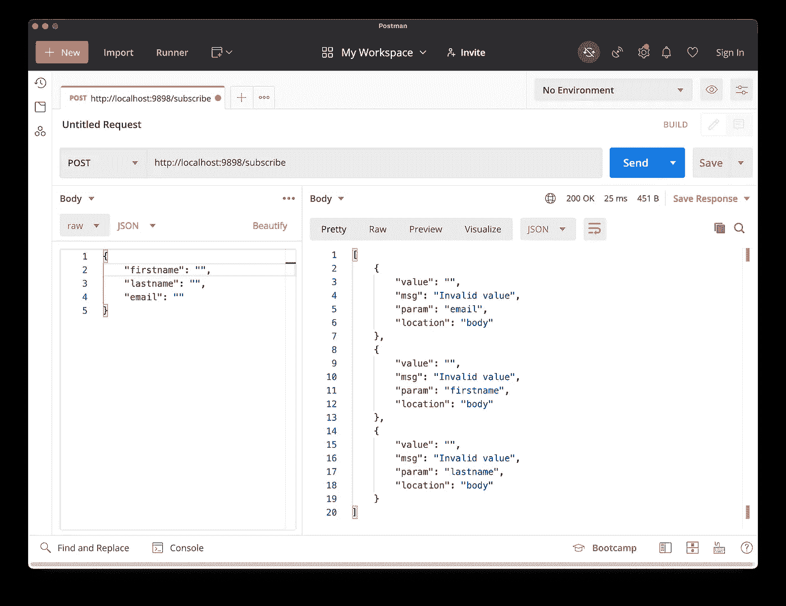
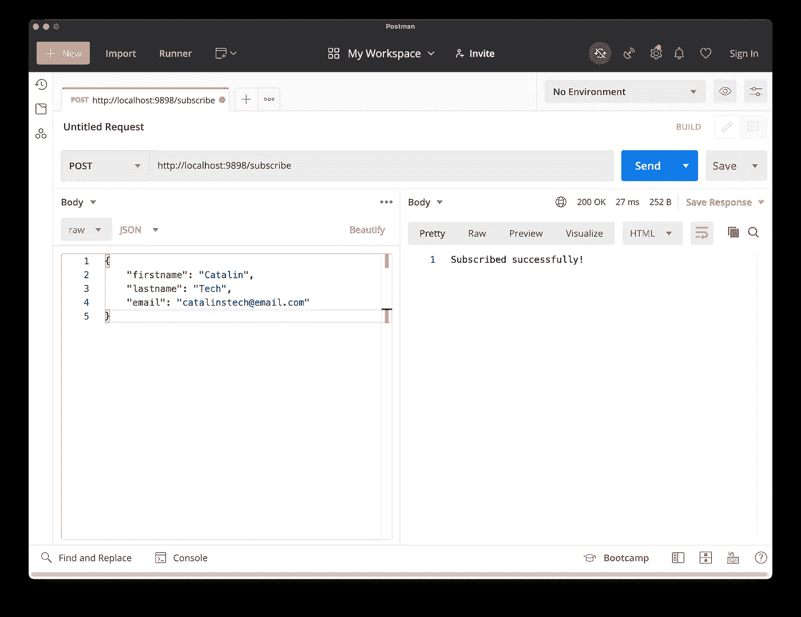
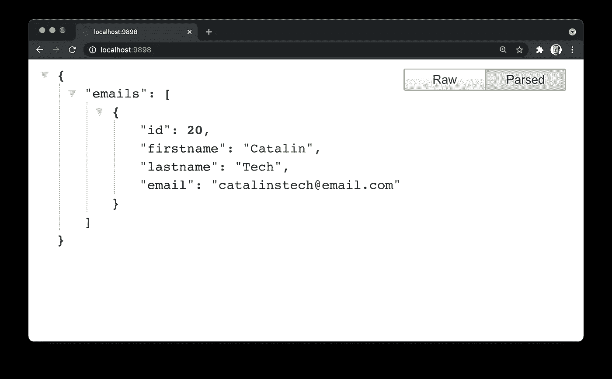

# 如何将 MySQL 与 Node.js 和 Docker 结合使用

> 原文：<https://betterprogramming.pub/how-to-use-mysql-with-node-js-and-docker-7dfc10860e7c>

## 了解如何在 Node.js 项目中实现 MySQL 数据库


图片由作者提供。

在本教程中，您将学习如何通过 Docker 在 Node.js 项目中使用 MySQL 数据库。您将构建一个简单的应用程序，允许您收集人们的电子邮件地址。

本教程中使用的技术有:

*   节点. js
*   码头工人
*   表达
*   关系型数据库

# 创建项目结构

第一步是创建项目结构。目前，您需要:

*   包含所有文件的整体文件夹。
*   一个`.env`文件。
*   带有服务器/数据库配置的文件。

因此，您可以创建所有文件和文件夹，如下所示:

```
take nodejs-mysql
touch index.js
touch .env
```

现在，下一步是运行 MySQL。

# 用 Docker 运行 MySQL

为了避免不一致和在你的机器上安装新的东西，你将使用 MySQL 的官方 Docker 镜像。

在进一步操作之前，请在您的终端中运行以下命令:

```
docker run -p 3306:3306 --name nodejs-mysql -e MYSQL_ROOT_PASSWORD=pass -e MYSQL_DATABASE=emails_db -d mysql:5.7
```

该命令执行以下操作:

1.  它从 DockerHub 中提取图像`mysql:5.7`，然后运行它。
2.  它在端口`3306`上启动 MySQL 数据库。
3.  将数据库密码设置为`pass`。
4.  最后，它创建了一个名为`emails_db`的新数据库。

现在，您可以从终端和应用程序访问数据库。如果您想使用 bash 运行容器，并直接使用 MySQL，请运行以下命令:

```
docker container exec -it nodejs-mysql bash
```

之后，按如下方式启动 MySQL 监控器:

```
mysql -u root -p
```

系统将提示您输入密码。输入您在上面第一个命令中提到的相同密码。在这个例子中，密码是`pass`。

现在，您可以运行 MySQL 命令并使用数据库。此外，您已经准备好在 Node.js 应用程序中使用 MySQL。

# 初始化项目并安装依赖项

下一步是初始化 Node.js 项目并安装所需的依赖项。您可以使用以下命令初始化项目:

```
npm init -y
```

该命令初始化您的项目，并用默认值自动完成`package.json`文件。

这个项目需要的依赖项是`mysql`、`express`、`express-validator`和`dotenv`。使用以下命令安装它们:

```
npm install mysql dotenv express express-validator
```

您将使用`mysql`包来操作您的数据库。您还将使用`express`包来创建两个端点:

*   读取数据。
*   向数据库添加数据。

最后，您需要`express-validator`包来净化用户输入。例如，您不希望有人添加 SQL 查询而不是电子邮件地址，因为这可能会产生问题。

您现在已经准备好构建应用程序了！

# 构建应用程序

第一步是打开`index.js`文件并导入包。因此，在文件顶部添加以下导入:

```
const express = require('express');
const mysql = require('mysql');
const { body, validationResult } = require('express-validator');
const app = express();

require('dotenv').config();
```

下一步是打开`.env`文件并添加数据库细节，如用户名、密码和数据库名称:

```
DB_USER=admin
DB_PASSWORD=pass
DB_NAME=emails_db
```

上面的细节应该也适用于你。但是，请随意更改它们。

下一步是在应用程序中创建数据库连接。转到`index.js`，添加以下代码:

```
const database = mysql.createConnection({
    user: process.env.DB_USER,
    password: process.env.DB_PASSWORD,
    database: process.env.DB_NAME
});
```

现在，您可以使用数据库来创建表、添加、编辑和删除数据以及其他操作。

# 初始化数据库

您必须通过创建一个新表来初始化数据库。你需要一张桌子来存放人们的电子邮件。

因此，打开`index.js`文件并添加以下路径:

现在，当您访问`/init`路线时，应用程序会创建一个名为`emails`的新表，如果它还不存在的话。该表包含以下字段:

*   身份证
*   人的名字和姓氏
*   电子邮件地址

一旦创建了表格，您就可以从人们那里收集电子邮件地址。让我们看看你怎么做！

# 添加电子邮件

该应用程序最重要的部分之一是允许人们订阅你的服务/时事通讯。您可以通过在`index.js`中编写以下代码来实现:

你可以看到这条路线做了很多事情，所以让我们一步一步来:

1.  首先，您允许人们向`/subscribe`端点发出`POST`请求。
2.  其次，您通过使用来自`express-validator`包的方法来净化来自人们的输入。它们确保字段不为空，并且它也对输入进行转义。
3.  最后，检查是否有错误。如果有错误，就返回这些错误。否则，你可以让这个人订阅时事通讯/服务。



上图显示了一个提交空数据的例子。您可以看到，根据请求的错误，您会得到一些错误。

另一方面，如果您使用有效的数据进行请求，那么订户将被添加到列表中。请参见下面的示例:



因此，端点可以正常工作。人们可以订阅您的电子邮件/服务。

# 获取所有电子邮件

最后，您需要一个路径来获取收集到的所有电子邮件地址的列表。因此，在`index.js`中添加以下代码:

`SELECT * FROM emails` SQL 查询从表中选择所有记录。该查询为每个查询返回以下信息:

*   身份证
*   名字和姓氏
*   电子邮件地址

如果您访问 URL `http://localhost:9898/`，您将获得所有订户。下面，你可以看到一个例子:



通过这条路线，您可以看到所有使用您的应用程序订阅的人。

*注意:让每个人都能看到这个端点并不是一个好主意，因为这样会暴露个人信息。因此，一种改进是保护这个端点，只让您自己使用。*

# 清理应用程序

在结束之前，您可以通过重新组织代码来改进应用程序。尽管对于像这样的小应用程序来说，这可能有点过了，但当它变得更大时，还是很有帮助的。

让我们从清理`index.js`文件开始。打开它，用以下内容替换所有内容:

下一步是为数据库配置创建一个特殊的地方。在项目的根目录下，创建`src`文件夹。您可以按如下方式操作:

```
take src
```

该命令创建目录，然后打开它。在`src`文件夹中，创建另一个名为`db.js`的文件。打开它并添加以下代码:

在`db.js`文件中，您配置数据库并创建一个连接。之后，您导出它，以便它可以在其他地方使用。

最后，您需要创建控制器和路线。因此，从项目的根目录创建以下文件夹和文件:

```
take src/controllers/controllers.js
take src/routes/routes.js
```

现在，您已经准备好创建路线并编写控制器了。

## **创建路线**

让我们从路线开始。打开`routes.js`文件，添加以下代码:

在这个文件中，导入`express`以便创建路线。之后，导入控制器，这样就可以为每条路线传递特定的控制器。然后从`express-validator`导入`body`函数，创建一个快速路由器。

在接下来的几行中，您将定义路线并传递特定的控制器。最后，导出`router`，这样就可以在其他地方使用它。

## **编写控制器**

最后一步是为控制器编写代码。实际上，您已经有了前面步骤的代码，但是您需要将它们存储为函数。

获取之前在`index.js`中的代码，并将其添加如下:

如您所见，代码是相同的，但现在它存储在不同的函数中。然后，在文件的末尾，导出这些函数，这样就可以在`routes.js`文件中使用它们。

您已经完成了重构！

# 运行代码

要运行应用程序，请进入应用程序的根目录并运行以下命令:

```
node index.js
```

之后，您应该能够添加新的订户并查看现有的订户了！

你可以在 GitHub 页面上找到完整的代码。

# 结论

这仅仅是应用程序的开始，但是你可以添加许多改进。一些改进可能是:

*   为此应用程序添加前端部分。
*   保护显示所有用户的路由。
*   添加测试。
*   允许人们创建个人账户和收集电子邮件地址。

让我知道在评论中，如果你想让我建立前端部分。如果有足够的兴趣，我会做的！

>*本* [*SQL 训练营*](https://rli.to/4j3yL) *将带你从一个完全的初学者成为 SQL、数据库管理和数据库设计的专家。*

> [*学习 Node.js*](https://rli.to/PhkSl) *，从零开始构建高级大型应用&受聘为后端开发者*