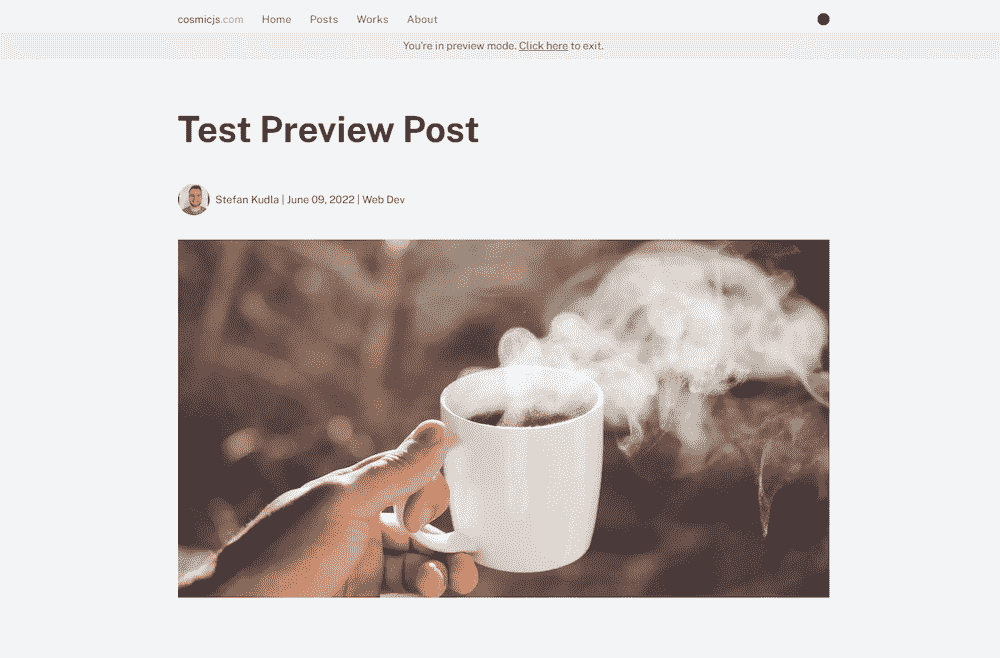
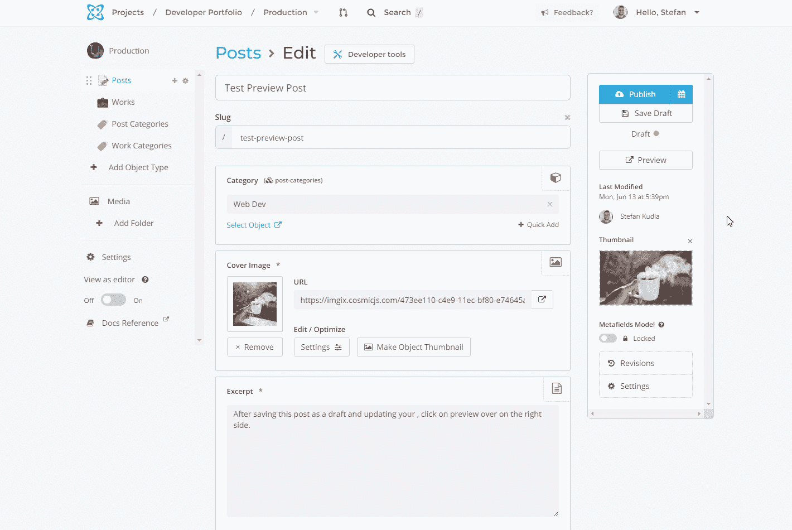
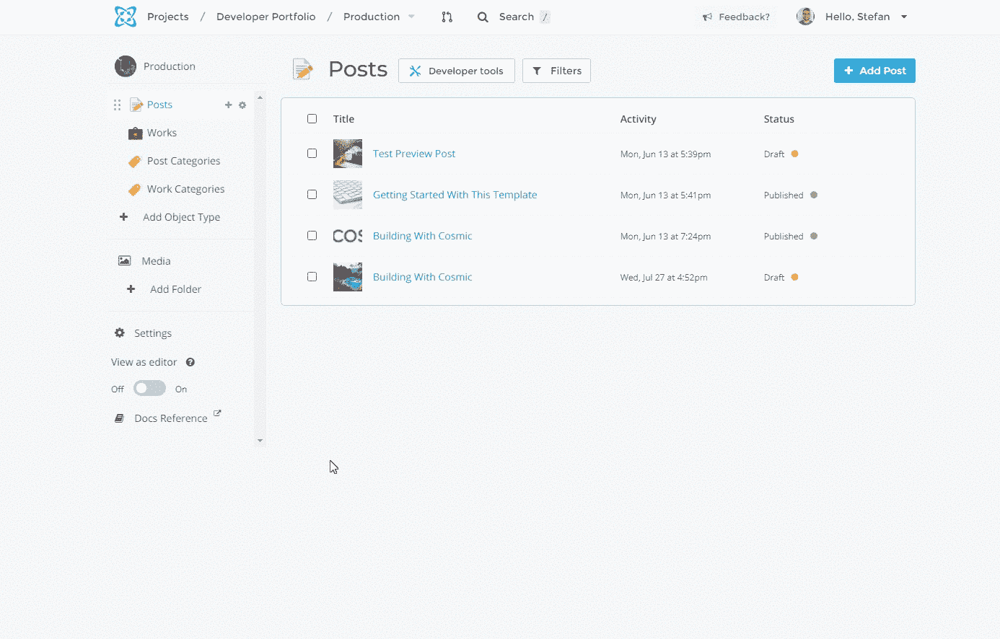
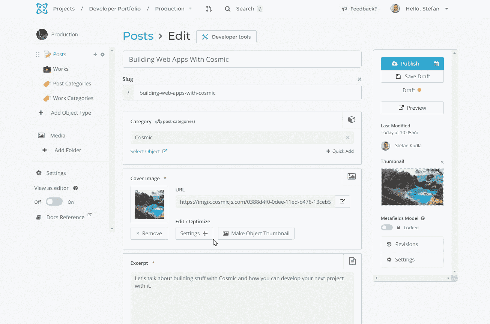
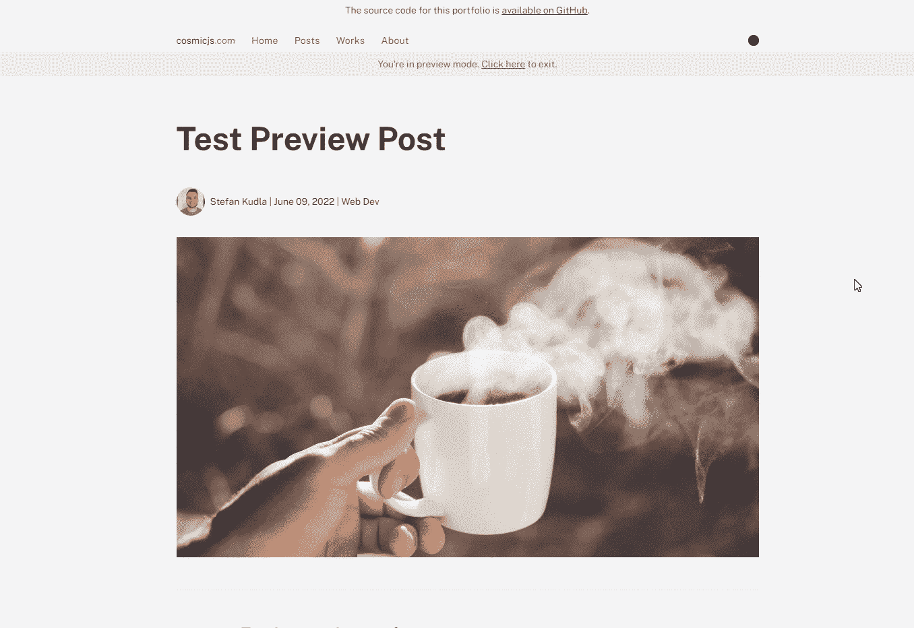

# 如何在 Cosmic Headless CMS 上使用 Next.js 预览模式

> 原文：<https://betterprogramming.pub/how-to-use-next-js-preview-mode-with-the-cosmic-headless-cms-8d9ccb9bd593>

## 帮助您预览草稿的简要指南

马修·施瓦茨在 [Unsplash](https://unsplash.com?utm_source=medium&utm_medium=referral) 上的照片

当从[无头 CMS](https://www.cosmicjs.com/headless-cms) 获取数据时，静态网页生成是实用的。然而，当我们的网站建成后向我们的 CMS 添加新内容时，我们需要一种方法来预览尚未准备好发布的草稿内容。

使用 [Next.js 预览模式](https://nextjs.org/docs/advanced-features/preview-mode)，我们通过在请求时间呈现页面来解决这个问题，允许我们看到静态生成期间不存在的未发布内容。让我们探索一下如何通过[无头 CMS](https://www.cosmicjs.com/headless-cms) 使用 Next.js 预览模式为我们自己和合作者预览草稿内容。

在这个例子中，我们使用 [Cosmic](https://www.cosmicjs.com/) 作为我们的无头 CMS。可以查看[现场演示](https://nextjs-developer-portfolio-cms.vercel.app/)和[克隆开发者组合模板 GitHub 库](https://github.com/cosmicjs/nextjs-developer-portfolio/)。

# 设置我们的秘密预览令牌和 URL

为了确保只有有权访问的人才能看到我们的预览 URL，让我们为我们的秘密预览令牌创建一个字符串。您可以使用这个 [API 密钥生成器](https://generate-random.org/api-key-generator/64-bit/mixed-numbers)来获得 base64 秘密字符串或您创建的简单文本字符串。

将秘密预览令牌作为[环境变量](https://vercel.com/docs/concepts/projects/environment-variables)存储在您的项目中。

在我们的项目中存储秘密预览令牌。这将在“preview . js”API 路径中进行检查和验证。

在 Cosmic 中设置这个预览 URL 很容易。我们可以导航到对象类型的设置，并使用上面的约定设置预览链接。对于开发期间的测试，将其设置为 localhost。否则，将其设置为您想要的 URL。使用 Cosmic，将 slug 参数设置为[object_slug]。Cosmic 会自动将这个短代码转换成给定对象的 slug。

# 通过 Slug 获得预览帖子

首先，让我们创建一个异步函数，使用[宇宙 NPM 模块](https://www.npmjs.com/package/cosmicjs)从我们的无头 CMS 获取预览帖子数据。

从 Cosmic 获取数据

通过将状态参数设置为 any，我们可以根据请求获取所有处于草稿状态的未发布对象和已发布对象的最新草稿。

# 创建预览 API 路由

既然我们已经在 CMS 中配置了秘密预览令牌，我们就创建一个 API route 来检查令牌是否匹配，然后用我们之前设置的预览 URL(如果存在的话)获取我们请求的未发布的帖子。

一旦令牌匹配，并且如果我们请求的 slug 存在于我们的 CMS 中，我们就启用预览模式，并使用一个[临时重定向](https://developer.mozilla.org/en-US/docs/Web/HTTP/Status/307)将 cookies 设置为`res.setPreviewData({})`到我们未发布帖子的位置。

创建一个“预览”API 路径，并使用临时重定向将 cookies 设置到我们未发布帖子的位置

# 正在更新 getStaticProps

现在我们已经用`res.setPreviewData`设置了预览模式 cookies，将根据请求调用`[getStaticProps](https://nextjs.org/docs/basic-features/data-fetching/get-static-props)`。

在我们呈现预览帖子的页面上，`getStaticProps`将接受一个对象作为参数，这将是我们从 headless CMS 获取的未发布数据。

将预览道具添加到 **getStaticProps** 中。可以把它看作是应用程序的全局状态

# 在 Cosmic 中使用预览模式

现在我们已经为预览模式设置了 API 路径和功能，在 Cosmic 中使用它就像点击一个按钮一样简单。Cosmic 将获取我们之前设置的预览 URL，并为我们创建的每个`Object`生成一个查询，自动将`Object` slug 添加到它的末尾。

# 退出预览模式

我们可以再创建一个 API 路由来退出预览模式。我们将清除预览 cookies，并将它们重定向到主页。

创建一个“退出-预览”API 路由，将“预览”状态设置为 false，并且只显示“已发布”的帖子

因为我们正在为应用程序的当前会话设置 cookies，所以我们可以将这些数据视为整个应用程序的上下文。在本教程使用的[现场演示](https://nextjs-developer-portfolio-cms.vercel.app/)中，我创建了一个当应用程序处于预览模式时显示的横幅。在横幅中，我们然后使用一个 [Next.js 链接](https://nextjs.org/docs/api-reference/next/link)来路由到退出预览 API 路由，清除预览模式 cookies 并将应用程序带回主页。

无论您是希望与您的团队共享新内容，还是希望在内容上线之前看到自己的内容，使用 Next.js 预览模式都是实现这一目标的可靠解决方案。分享内容就像与您的团队一起提供预览 URL 或单击 Cosmic 中的按钮一样简单。

我希望这篇文章对你有用。你可以收听我们的新节目[构建时间](https://www.cosmicjs.com/blog/introducing-build-time-a-new-podcast-by-cosmic)，在那里我们涵盖了从 headless CMS，Next.js，React 等等的一切。

*原载于*[*https://www.cosmicjs.com*](https://www.cosmicjs.com/articles/how-to-use-nextjs-preview-mode-with-the-cosmic-headless-cms)*。*