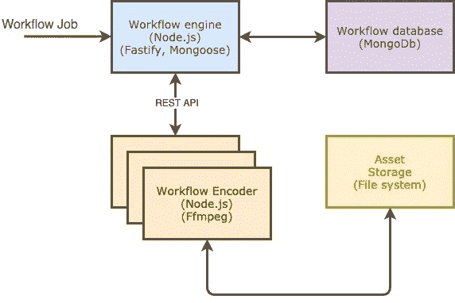
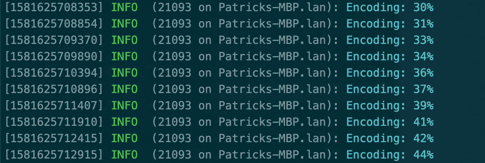

# 如何使用 Node.js Workers 进行视频编码

> 原文：<https://betterprogramming.pub/how-to-use-node-js-workers-for-video-encoding-f1379d3933d0>

## 视频编码非常耗费 CPU 资源，但是让我们看看如何实现这一点

照片由[索尔](https://unsplash.com/@solimonster?utm_source=medium&utm_medium=referral)在 [Unsplash](https://unsplash.com?utm_source=medium&utm_medium=referral) 拍摄

昨晚，我又在做我的兼职项目，[迷你视频编码器](https://medium.com/@pkalkman/new-year-new-side-project-e69991252bf4)。我添加了一个新的视频编码服务。工作流编码器，我称之为服务，使用 Node.js。你可能知道视频编码是非常 CPU 密集型的。

在过去，Node.js 从来都不是执行 CPU 密集型任务的好选择。原因是 Node.js 使用单线程来执行 JavaScript 代码。但是自从 [11.7.0](https://github.com/nodejs/node/blob/master/doc/changelogs/CHANGELOG_V11.md#11.7.0) 发布后，Node.js 有了一个新的模块叫做`worker_threads`。

Node.js 团队这样描述工人:

> “Workers(线程)对于执行 CPU 密集型 JavaScript 操作很有用。它们对 I/O 密集型工作没有多大帮助。Node.js 内置的异步 I/O 操作比 Workers 更高效。”

因此，我使用 Workers 实现了工作流编码器。在这篇文章中，我描述了实现。

# 编码视频

在描述实现之前，我需要谈一谈为什么视频流需要编码。

该工作流编码器是一个名为[迷你视频编码器](https://github.com/PatrickKalkman/MiniVideoEncoder) (MVE)的更大项目的一部分。MVE 是一个转换视频的开源平台。转换后，常规 HTTP 服务器可以使用自适应流传输视频。

## 什么是自适应流？

自适应流在回放过程中改变视频的比特率和分辨率。视频播放器不断测量连接的带宽，并提高或降低视频质量。

为此，Workflow Encoder 创建了同一视频的多个版本。每个版本都有不同的比特率和分辨率。这个比特率和分辨率列表被称为*编码阶梯。*

对于 1080p 视频，Apple 建议使用以下编码阶梯。如果你对你的视频进行编码，使用这个梯子——视频将在苹果设备上正确播放。

[苹果为 HLS x264 推荐的编码阶梯](https://developer.apple.com/documentation/http_live_streaming/hls_authoring_specification_for_apple_devices)

使用这个阶梯意味着工作流编码器必须创建九种不同的编码。所以你明白为什么我们需要使用最有效的方法进行视频编码。

工作流编码器使用 [FFmpeg](https://www.ffmpeg.org/) 4.2.2 **。** FFmpeg 是一个开源的视频和音频编码器。它还使用了 [Fluent ffmpeg-API](https://github.com/fluent-ffmpeg/node-fluent-ffmpeg#fluent-ffmpeg-api-for-nodejs-) 来简化与 ffmpeg 的交互。

为了测试，我使用了 1080p 版本的 [Caminandes 3: Llamigos](http://www.caminandes.com/) 。Caminandes 3 是来自 [Blender Institute](https://www.blender.org/institute/) 的一个 2.5 分钟的搞笑小开源动画视频。

Caminandes 3，用于测试视频编码的视频

# 使用 Workers 实现工作流编码器

当工作流引擎接收到视频作业时，它首先拆分作业。对于编码阶梯中的每个比特率和分辨率组合，工作流引擎都会创建一个任务。

工作流编码器与工作流引擎通信，并询问是否有任务要执行。工作流编码器使用工作流引擎的 REST API 进行通信。

## 创建和启动工作进程

如果有任务要执行，工作流编码器调用函数`startEncoder`。`startEncoder`函数创建并启动工人。它通过调用构造函数并传递一个 JavaScript 文件的相对路径来创建`Worker`对象。该文件包含必须在不同线程上执行的函数。

通过创建工作线程启动编码器

`Worker`构造函数的第二个参数是一个选项对象。我用这个来设置`workerData`到`encodingInstructions`。这个赋值克隆了`encodingInstructions`，并使它在 Worker 函数中可用。

执行工作的实际函数是`encoder.js`中的`encode`。该文件包含一个工人执行的函数。我省略了大部分，只关注最重要的部分。

encoder.js 中的编码器函数是工作线程

在第 5 行，我通过读取`workerData`得到了`encodingInstructions`。在文件的开头，我还需要`parentPort`，函数使用它来执行主线程和工作线程之间的通信。

## 如何从工作线程与主线程通信

工作模块允许主线程和工作线程之间的双向通信。我想从主线程上的工作线程获得进度反馈。

从工作线程向主线程发送消息

大多数例子使用`postMessage`来发送一个字符串。相反，我传达的是一个物体。我想发送不同的消息，并能够在主线程中区分它们。

另一方面，主线程通过事件接收这些消息。在第 8 行，`worker.on`定义了接收消息事件的函数。

启动工作进程并接收消息事件

根据消息的类型，该函数执行特定的操作。对于`PROGRESS`消息，它使用 log 对象记录消息。这样，我们可以在主线程中看到工作线程的进度。

工作线程向主线程报告进度

## 如何从主线程与辅助线程通信

我们还希望能够以相反的方式进行通信，从主线程到工作线程——例如，当我们想要停止正在运行的编码任务时。

该机制几乎与从工作线程到主线程的通信相同。这里，我们对`worker`对象使用了`postMessage`方法。

从主线程向工作线程发送消息

Worker 使用`parentPort`创建一个接收消息的事件处理程序。

从工作线程上的主线程接收消息

当 Worker 收到`STOP_ENCODING`时，它停止正在运行的编码任务。它通过调用`ffmpegCommand.kill()`来停止任务。这将`SIGKILL`到 FFmpeg 进程并停止它。

工作线程在收到主线程的停止消息时停止

# 结论

我喜欢 Node.js 团队使用 Workers 实现线程的方式。通过在线程之间建立显式的通信通道，它们可以防止同步问题。同步会给其他编程语言带来很多问题。

工作流编码器的当前实现使用工作器来编码视频。你可以在 [GitHub](https://github.com/PatrickKalkman/MiniVideoEncoder) 上找到源码。这仍然是一项正在进行的工作。

感谢您的阅读。