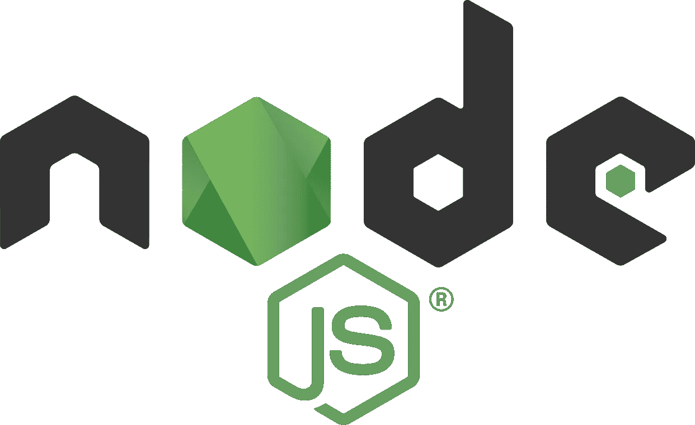

# 如何使用 npm 管理 JavaScript 依赖关系

> 原文：<https://betterprogramming.pub/how-to-use-npm-to-manage-javascript-dependencies-40754585b844>

## 深入了解最常见的国家预防机制运作



NPM 是 Node.js 最流行的包管理器。它经常用于安装和卸载包。但也可用于运行自定义脚本和对包执行其他操作。

开发人员最常见的操作是安装、清理、删除重复和运行脚本。

## npm 安装

`npm install`，简称`npm i`，用于安装包。如果您没有在`install`后面加上一个包名，如果依赖项还没有安装或者安装的版本已经过期，它会下载`package.json`中列出的所有包。如果你在`npm install`后面放一个包名，只要找到这个包，它就会用这个名字安装这个包。在安装过程中，`npm`会运行`npm run link`和`npm run build`来编译软件包。您可以通过运行`npm install -g packageName`来全局安装软件包

## npm 审计

`npm audit`用于对您安装的 npm 软件包进行安全审计。它将以各种格式显示审计结果。你也可以用`npm audit fix`修复任何安全漏洞。要做预演，可以做 `npm audit fix --dry-run`。

通过在命令中包含`--json`，例如`npm audit --json`和`npm audit fix --json`，可以在 JSON 中显示审计和修复。

示例输出:

```
=== npm audit security report ===# Run  npm update set-value --depth 12  to resolve 66 vulnerabilitiesHigh            Prototype PollutionPackage         set-valueDependency of   [@angular](http://twitter.com/angular)-devkit/build-angular [dev]Path            [@angular](http://twitter.com/angular)-devkit/build-angular > sass > chokidar > anymatch >
                  micromatch > braces > snapdragon > base > cache-base >
                  set-valueMore info       [https://npmjs.com/advisories/1012](https://npmjs.com/advisories/1012)High            Prototype PollutionPackage         set-valueDependency of   [@angular](http://twitter.com/angular)-devkit/build-angular [dev]Path            [@angular](http://twitter.com/angular)-devkit/build-angular > webpack > watchpack >
                  chokidar > anymatch > micromatch > braces > snapdragon >
                  base > cache-base > set-valueMore info       [https://npmjs.com/advisories/1012](https://npmjs.com/advisories/1012)High            Prototype PollutionPackage         set-valueDependency of   [@angular](http://twitter.com/angular)-devkit/build-angular [dev]Path            [@angular](http://twitter.com/angular)-devkit/build-angular > webpack-dev-server >
                  chokidar > anymatch > micromatch > braces > snapdragon >
                  base > cache-base > set-valueMore info       [https://npmjs.com/advisories/1012](https://npmjs.com/advisories/1012)High            Prototype PollutionPackage         set-valueDependency of   [@angular/compiler-cli](http://twitter.com/angular/compiler-cli) [dev]Path            [@angular/compiler-cli](http://twitter.com/angular/compiler-cli) > chokidar > anymatch > micromatch >
                  braces > snapdragon > base > cache-base > set-valueMore info       [https://npmjs.com/advisories/1012](https://npmjs.com/advisories/1012)...
```

## npm 箱

`npm bin`打印安装软件包的文件夹。

示例输出:

```
c:\math-calculator>npm bin
c:\math-calculator\node_modules\.bin
```

## `npm ci`

`npm ci`用于从`package-lock.json`开始安装所有软件包。如果`package.json`和`package-lock.json`之间有任何差异，将会失败。`node_modules`将被删除，所有的东西都将被重新安装。

通过将`npm completion`包含在您的`~/.bashrc`或`~/.zshrc`中，您可以将完成标记为`npm`。

## NPM-配置

`npm-config`用于将配置键值对保存到`npmrc`。为了在`npmrc`中设置一个键值对，我们将:

```
npm config set key value
```

为了从键中获得一个值，我们运行:

```
npm config get key
```

我们可以通过运行以下命令列出所有值:

```
npm config list
```

我们可以通过运行以下命令来删除键值对:

```
npm config delete key
```

我们可以通过运行以下命令来编辑键值对:

```
npm config edit
```

您可以在上述命令后添加`— global` 来更改全局配置。

## npm 重复数据删除

`npm dedupe`将从您的`node_modules`文件夹中移除重复的依赖关系，方法是在依赖关系树上向上移动依赖关系，允许多个包的公共依赖关系引用一个依赖关系。

## npm 医生

运行检查以确保您的环境拥有管理 Git 包的一切。它检查 Node.js 和 Git 是否可以运行。它还检查主 npm 注册表或替代注册表是否可访问。`node_modules`检查它是否可访问和可写，并检查 npm 缓存是否存在以及是否有损坏的包:

`npm doctor:`的输出示例

```
npm notice PING [https://registry.npmjs.org/](https://registry.npmjs.org/)
npm WARN verifyCachedFiles Content garbage-collected: 1328 (139761056 bytes)
npm WARN verifyCachedFiles Missing content: 5
npm WARN verifyCachedFiles Cache issues have been fixed
Check                               Value                             Recommendation
npm ping                            OK
npm -v                              v6.9.0                            Use npm v6.10.3
node -v                             v10.16.0                          Use node v10.16.2
npm config get registry             [https://registry.npmjs.org/](https://registry.npmjs.org/)
which git                           C:\Program Files\Git\cmd\git.EXE
Perms check on cached files         ok
Perms check on global node_modules  ok
Perms check on local node_modules   ok
Verify cache contents               verified 8899 tarballs
```

## npm 探索

`npm explore`用于需要浏览已安装的软件包时。一旦进入包目录，就可以在那里运行命令。

## npm 帮助

`npm help-search`和`npm help`命令用于查找 npm 命令的帮助。

## `npm init`

`npm init`用于将`package.json`添加到不存在的项目中。`npm init -y`用于跳过创建文件前询问的所有问题。

## `npm outdated`

`npm outdated`用于检查过期包装。

示例输出:

```
Package                            Current   Wanted   Latest  Location
[@angular](http://twitter.com/angular)-devkit/build-angular      0.800.3  0.800.6  0.802.1  math-calculator
[@angular/animations](http://twitter.com/angular/animations)                  8.0.2    8.2.1    8.2.1  math-calculator
[@angular/cdk](http://twitter.com/angular/cdk)                         8.0.1    8.1.2    8.1.2  math-calculator
[@angular/cli](http://twitter.com/angular/cli)                         8.0.3    8.0.6    8.2.1  math-calculator
[@angular/common](http://twitter.com/angular/common)                      8.0.2    8.0.3    8.2.1  math-calculator
[@angular/compiler](http://twitter.com/angular/compiler)                    8.0.2    8.0.3    8.2.1  math-calculator
[@angular/compiler-cli](http://twitter.com/angular/compiler-cli)                8.0.2    8.0.3    8.2.1  math-calculator
[@angular/core](http://twitter.com/angular/core)                        8.0.2    8.0.3    8.2.1  math-calculator
[@angular/forms](http://twitter.com/angular/forms)                       8.0.2    8.0.3    8.2.1  math-calculator
[@angular/language-service](http://twitter.com/angular/language-service)            8.0.2    8.0.3    8.2.1  math-calculator
[@angular/material](http://twitter.com/angular/material)                    8.0.1    8.1.2    8.1.2  math-calculator
[@angular/platform-browser](http://twitter.com/angular/platform-browser)            8.0.2    8.0.3    8.2.1  math-calculator
[@angular/platform-browser-dynamic](http://twitter.com/angular/platform-browser-dynamic)    8.0.2    8.0.3    8.2.1  math-calculator
[@angular/router](http://twitter.com/angular/router)                      8.0.2    8.0.3    8.2.1  math-calculator
[@ngrx/store](http://twitter.com/ngrx/store)                          8.0.1    8.2.0    8.2.0  math-calculator
[@types/jasmine](http://twitter.com/types/jasmine)                      3.3.13   3.3.16    3.4.0  math-calculator
[@types/node](http://twitter.com/types/node)                          8.9.5    8.9.5   12.7.1  math-calculator
karma                                4.1.0    4.1.0    4.2.0  math-calculator
karma-chrome-launcher                2.2.0    2.2.0    3.0.0  math-calculator
karma-coverage-istanbul-reporter     2.0.5    2.0.6    2.1.0  math-calculator
mathjs                               6.0.2    6.0.4    6.0.4  math-calculator
rxjs                                 6.4.0    6.4.0    6.5.2  math-calculator
ts-node                              7.0.1    7.0.1    8.3.0  math-calculator
tslint                              5.15.0   5.15.0   5.18.0  math-calculator
typescript                           3.4.5    3.4.5    3.5.3  math-calculator
zone.js                              0.9.1    0.9.1   0.10.1  math-calculator
```

## `npm ls`

`npm ls`列出当前项目中已安装的包。`npm list`和`npm la`是该命令的别名。

## `npm prune`

`npm prune`移除未使用的包装。`npm run --production`用于从`devDependencies`部分删除包。`--dry-run`选项用于在实际运行前检查哪些包将被删除。`--json`选项可用于在 JSON 中显示结果。启用包锁定后，修剪是自动进行的。

## `npm root`

`npm root`显示项目中节点包的根文件夹。

## `npm run`

`npm run-script`让您运行自己编写的自定义脚本。`npm run`是这个命令的别名。

## `npm start`

`npm start`通过运行您定义的命令启动一个包。

## `npm search`

`npm search`用于按名称搜索包。

## `npm shrinkwrap`

`npm shrinkwrap`通过重新利用`package-lock.json`或从头开始创建`npm-shrinkwrap.json`。`npm-shrinkwrap.json`优先于`package-lock.json`。

## `npm stop`

`npm stop`通过运行您定义的停止命令来停止软件包。

## `npm test`

`npm test`允许您使用自己定义的脚本运行测试。

## `npm uninstall`

`npm uninstall`用于卸载软件包。您可以在末尾添加`-g`来删除全球包。

## `npm update`

`npm update`更新项目中的包。`npm update packageName`仅更新名为`packageName`的包。它会将最新版本记录到`package-lock.json`。

要将 npm 升级到最新版本，请运行`npm install -g npm`。