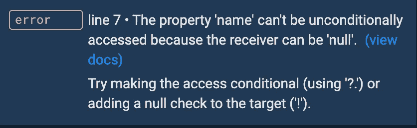

# 如何在 Dart 2.12 中使用空安全

> 原文：<https://betterprogramming.pub/how-to-use-null-safety-in-dart-e0eb6bc02734>

## 开始使用最新的 Dart 功能


🇻🇪·何塞·g·奥尔特加·卡斯特罗·🇲🇽在 [Unsplash](https://unsplash.com?utm_source=medium&utm_medium=referral) 上拍摄的照片。

在本文中，我们将在 [Dart](https://dart.dev/) 中尝试新的空安全特性，看看它如何帮助我们避免恼人的错误。

# 零安全性入门

从 Dart 2.12 开始，空安全现在稳定了！如果您正在使用 Flutter，可以通过执行以下命令升级到最新版本:

```
flutter upgrade
```

为了确保更新正确运行，您可以执行`flutter --version`，它将给出以下输出:

```
Flutter 2.0.0 • channel stable • https://github.com/flutter/flutter Framework • revision 60bd88df91 **(**14 hours ago**)** • 2021-03-03 09:13:17 -0800 Engine • revision 40441def69 Tools • Dart 2.12.0
```

# 什么是零安全？

简单来说，当我们在 Dart 中编写任何代码并运行它时，代码都将通过 Dart VM。如果我们不初始化这些变量，那么我们将得到一个错误。例如:

在上面的 Dart 代码中，我们用一个实例变量创建了一个`Students`类。然后在`main()`函数中，我们创建一个`Students`类型的变量，并对其调用`name`。但这里的问题是，我们没有创造任何学生！因此，上面的代码将返回一个错误:

通常，当我们得到这个错误时，我们会检查对象是否被初始化。在我们的例子中，它没有被初始化。要解决这个问题，我们可以做到:

在上面的简单代码中，很容易确定哪个变量没有初始化。但是在大型代码库中，这变得困难且耗时——而这正是 null safety 要解决的问题。

# 使用零安全

使用上一节中的代码，我们甚至在运行应用程序之前就会得到以下错误:


作者照片。

这意味着`students`变量不能是`null`。在 Flutter/Dart 中启用空安全时，除非指定，否则不能有任何等于`null`的变量。这非常有帮助，因为您甚至可以在运行代码之前就发现问题，现在您不必在对变量使用属性或方法之前一直检查变量是否是`null`。为了解决这个错误，我们可以初始化`student`变量，正如我在上一节中展示的那样。

# 可空类型

要指定变量是否可以是`null`，可以使用可空类型`?`操作符。例如:

在 Dart 中使用操作符`?`基本上意味着`student`变量可以等于`null`。现在如果你想在`student`上调用`name`，你会得到如下错误:



作者照片。

正如错误所说，您需要使用`?.`操作符，因为`student`可以是`null`，所以您必须执行以下操作:

这将在控制台中打印`null`。

另一种方法是使用后缀运算符`!`。使用此运算符时，控制台中将会抛出一个错误。例如:

这将在控制台中引发以下错误:

```
Uncaught TypeError: Cannot read property 'get$name' of nullError: TypeError: Cannot read property 'get$name' of null
```

此外，后缀运算符`!`会将变量转换为其基础的不可空类型。例如:

```
 class HomePage extends StatefulWidget {
    final String? message;
```

如果在`HomePage`声明下有上述内容，那么您需要在文本小部件中使用那个`message`:

```
Text(widget.message!)
```

这里我们必须使用后缀运算符，因为`Text()`小部件将类型为`String`的值作为参数，而变量`message`是类型为`String?`的，这意味着它可以是 null。因此，通过使用后缀运算符，它会将变量`message`转换为`String`。这里可以查看更多[。](https://dart.dev/null-safety/understanding-null-safety#null-assertion-operator)

# 必需的关键字

Dart 新增的另一个关键词是`required`。`required`关键字可以与可选的命名参数一起使用。这样，在调用函数时，任何属于`required`的变量都必须作为参数传递。让我们看一下计数器应用示例:

如您所见，默认情况下，`title`变量是非`null`变量。因此，上面的代码将给出以下错误:


作者照片。

要解决这个错误，您可以在变量前添加`required`关键字:

# 晚期关键字

Dart 新增的另一个关键词是`late`。由于默认情况下所有变量都是非`null`的，我们可以使用`?`操作符，也可以使用`late`关键字。例如:

通过使用不可空的类型操作符`?`，这意味着`name`可以是`null`。为了解决这个问题，我们使用`late`，这基本上意味着延迟初始化:

我希望你喜欢这篇文章。更多详细信息，请查看 [Dart 的文档](https://dart.dev/null-safety)。

*原载于*[*https://petercoding.com*](https://petercoding.com/flutter/2021/03/04/using-null-safety-in-dart/)*。*