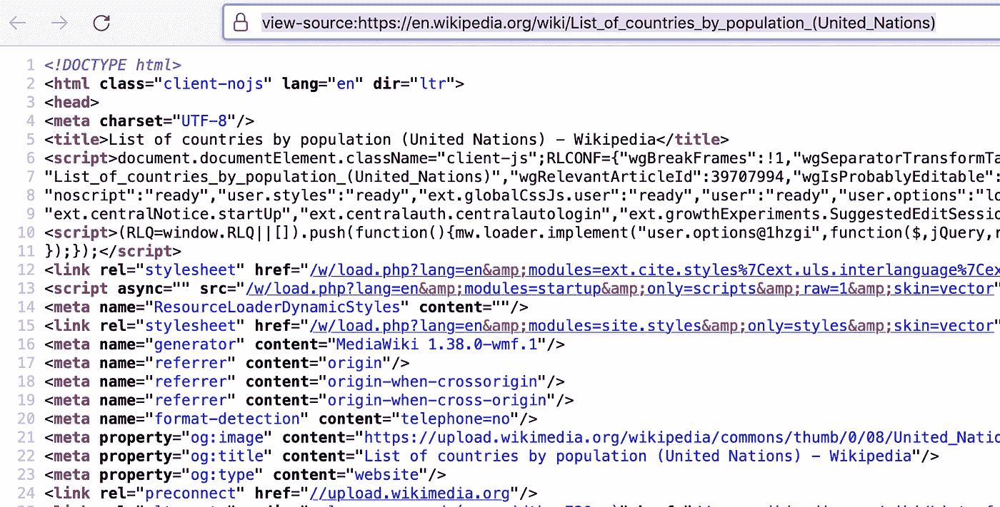
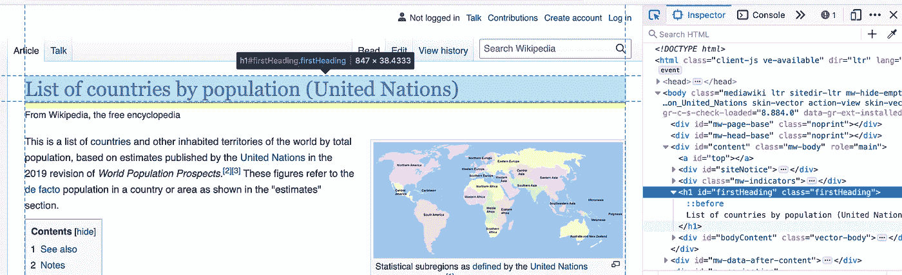

# 熊猫用于网页抓取还不够吗？尝尝美味的汤

> 原文：<https://betterprogramming.pub/how-to-use-pandas-for-web-scraping-not-enough-try-beautiful-soup-98d0362d5bb1>

## 从熊猫到美味的汤——高级网页抓取变得简单


照片由[萨加尔·库尔卡尼](https://unsplash.com/@sagarkulkarni?utm_source=medium&utm_medium=referral)在 [Unsplash](https://unsplash.com?utm_source=medium&utm_medium=referral) 上拍摄

我们已经进入互联网时代几十年了，在此期间，互联网积累了大量的数据。无论你的专业是什么，你都会在互联网的某个地方找到有用的数据。如果你正在考虑从事数据科学职业，你不应该担心没有玩具数据集可以玩，只要从互联网上抓取一些数据就可以了。

等等，我忘了网站上显示的许多数据都不是数据科学友好的格式。相反，它们是作为适用的 HTML 元素呈现的。因此，获取这些数据的一个必要步骤是将 HTML 格式转换成表格格式。在本教程中，我们将学习如何使用网络抓取技术从网站获取类似表格的数据。

免责声明:可能有关于网页抓取的法律规定。这篇文章并不打算作为一个网页抓取的认可。在这里，我们将专注于一个技术细节，并使用维基百科作为数据源，这是在[自由文档许可](https://en.wikipedia.org/wiki/Wikipedia:Copyrights)下。

# 是的，熊猫是可能的

毫无疑问，许多数据科学家使用 Python 作为他们数据科学项目的工作语言。如果你在 Python 阵营中，你可能也使用 Pandas，它是最通用的数据处理和操作库之一。信不信由你，你可以用熊猫来完成原始的网页抓取工作——就像一行代码那么简单。

```
dfs = pd.read_html("the_url_to_the_website")
```

与创建单个`DataFrame`的其他`read_`函数不同，`read_html`函数返回一个`DataFrame`列表，每个列表对应于网页中的一个表。让我们用一个例子([网页链接](https://en.wikipedia.org/wiki/List_of_countries_by_population_(United_Nations))):

熊猫读 HTML

如上图，熊猫看了这个网页，得到了两个`DataFrame`物体。当然，当您有两个表格时，您很容易就能判断出哪个是哪个——您可以简单地查看两个表格，然后选择您想要使用的表格。我

在我们的例子中，这是我们需要按国家研究人口的第一个表。

通过 read_html 创建了数据帧

值得注意的是，在原始网页上，原始群体使用逗号来分隔每三个数字，Pandas 删除了这些逗号，并正确地将它们转换为整数——这是一种数据科学家友好的数据类型。它再次强调了 Pandas 作为一个有用的数据处理库的多功能性。

通常，网页上有多个表格。虽然我们可以仔细检查每个数据帧，看看哪一个是我们需要的数据，但定位它可能很繁琐。这不是 Python 或熊猫的工作方式，因为它应该是简洁的，让我们的生活变得简单。毫不奇怪，`read_html`有一个您想要使用的参数— `match`，您可以为它指定表应该包含的文本(字符串或正则表达式)。

表中文本的规格

如上所示，我们指定表应该包含`“UN statistical”`，这样就只创建了一个`DataFrame`。

需要注意的是，当在 HTML 文档中找不到表格时，`read_html`会抛出`Value_Error`。换句话说，这个函数只能抓取网页上的表格，如果你想获取其他数据，这就构成了一个限制。因此，我们应该考虑替代方案——更高级的 web 抓取的 [Beautiful Soup](https://pypi.org/project/beautifulsoup4/) 库。

# 美丽的汤

Beautiful Soup 是一个强大的库，专门处理 HTML 或 XML 文档。您可以使用这个库来搜索和修改解析树，您可以将解析树想象成使用一系列分层标签的有组织的结构。您可以使用`pip`或`conda`安装这个库。

```
# using pip
pip install beautifulsoup4# using conda
conda install beautifulsoup4
```

顺便提一下，当你对熊猫使用`read_html`时，你可能会注意到你会被要求安装漂亮的汤和其他支持包(例如`lxml`或`html5lib`)。您想要安装的另一个库是`requests`，它对于发出 web 请求以获取 web 页面的原始源代码特别方便。

## 第一步。获取 HTML 文档

在我们开始抓取 web 页面之前，让我们首先获取 HTML 文档以进行离线处理。下面的代码向您展示了第一步。

获取 HTML 文档

在上面的代码中，我们使用`requests`来运行获取 web 页面的 GET 请求，并且我们可以通过访问响应的`text`属性来获取文档。这份文件已经准备好了。

## 第二步。检查所需的元件

对源页面有一个很好的理解是提取你需要的信息的基本步骤。事实上，你可能知道，你可以在你的网络浏览器中查看网页的源代码，比如 Chrome 或者 Firefox。在我们的情况下，您可以通过链接查看:view-source:[https://en . Wikipedia . org/wiki/List _ of _ countries _ by _ population _(United Nations)](https://en.wikipedia.org/wiki/List_of_countries_by_population_(United_Nations))，如下图快速浏览。



网页源代码的屏幕截图

除了在 web 浏览器中查看代码之外，Beautiful Soup 还提供了一种以可读方式查看源代码的编程方式，如下所示。

由美汤整理的网页源代码

查看静态源代码可能没有帮助，因为文本太多了！相反，使用 Chrome 或 Firefox 的开发工具检查这些元素是个好主意。



检查 HTML 元素

您只需将鼠标放在您感兴趣的元素上，检查器就会突出显示该元素的信息。例如，我们知道标题有一个标签 h1，它的 id 是`firstHeading`，它的类是`firstHeading`。

检查的想法是为您需要的元素收集可识别的信息，如`tag`、`id`和`class`。

## 第三步。提取数据

一旦有了商品的可识别信息，就该从网页中提取数据了。有几种方法可以做到这一点，选择哪种方法完全取决于您的需求。让我们一个一个来看。

如果您对特定的元素感兴趣，并且知道它的 id，这可能是最简单的场景:

```
>>> heading = soup.find(id="firstHeading")
heading
>>> <h1 class="firstHeading" id="firstHeading">List of countries by population (United Nations)</h1>
>>> type(heading)
<class 'bs4.element.Tag'>
>>> heading.text
'List of countries by population (United Nations)'
```

如您所见，我们通过指定元素的`id`来使用`find`方法，并获得元素，该元素被 Beautiful Soup 解析为一个`Tag`对象。对于这个对象，我们可以通过访问它的`text`属性来检索标题。

这样，您只需获得网页的第一个标题。如果您有多个网页，您可以按顺序处理它们以检索第一个标题。

或者，您可以通过指定标记名来使用`find`方法。但是，它将返回匹配标签的第一个元素。因为我们知道只有 h1 元素，所以我们可以通过调用:

```
soup.find("h1")
```

如果您对一组元素感兴趣，您应该考虑`find_all`方法。例如，让我们检索所有 h2 标题，以了解 web 文档的组织。

找到一组元素

在上面的代码中，我向您展示了使用`find_all`方法将检索带有标签 h2 的所有元素。对于这些元素，我们可以得到所有的字幕，因为`headings`是一个迭代器。

如果您不知道要查找什么元素，但是您有兴趣找出包含某个字符串的元素，该怎么办？在这种情况下，您可以简单地让 Beautiful Soup 为您完成繁重的工作—它可以搜索特定的字符串，如下所示。

```
>>> soup.find(text="United Nations").parent
<a href="/wiki/United_Nations" title="United Nations">United Nations</a>
```

使用文本`“United Nations”`的规范，`find`方法定位元素。通常，元素本身并不是您想要的，在大多数情况下，您可以通过访问`parent`属性来检查元素的父元素。当然，如果您想用这个字符串找出更多的元素，您可以简单地使用`find_all`方法。

虽然我们已经向您展示了如何在 Pandas 中使用 read_html 来刮擦一张表，但是这是一个可行的任务，您可以自己用漂亮的汤来完成。

用美味的汤解析桌子

上面的代码片段向您展示了解析表的一种可能的解决方案。有几点值得注意:

*   表格元素有`“table”`标签。我们可以用`find`的方法来定位。
*   在 HTML 文档中，每个表格行都有一个标签`“tr”`。在每一行中，使用标签`“td”`将数据显示为列。因此，我们迭代行，对于每一行，我们迭代列。
*   所有数据都保存为字符串。所以，如果你想进行你的项目，进一步清理桌子是很重要的。

# 结论

在本文中，我们首先回顾了如何通过一个熊猫函数调用——`read_html`函数轻松地抓取表格。与其他 Pandas `read_*`方法不同，`read_html`调用创建了一个`DataFrame`列表。请注意，只有当网页上有表格元素时，该函数才起作用。

如果您有更高级的 web 抓取需求，您可能想要尝试 Beautiful Soup library，它专门处理 HTML 和 XML 文档。通过创建解析树，Beautiful Soup 可以很容易地通过 id、类、标签甚至属性来定位所需的元素，尽管最后一种方法不在本文讨论范围内。

总之，Beautiful Soup 提供的所有功能几乎都可以满足您处理网页以提取所需数据的需要。正如您可能已经发现的那样，web 抓取听起来可能非常技术性，但是对于像获取一些数据这样的基本用例来说，它并没有那么难，对吗？