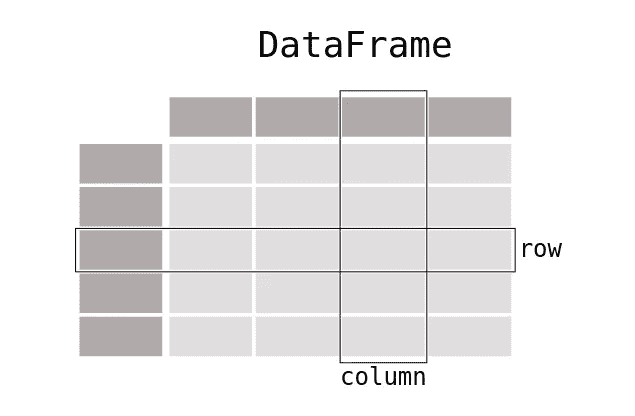
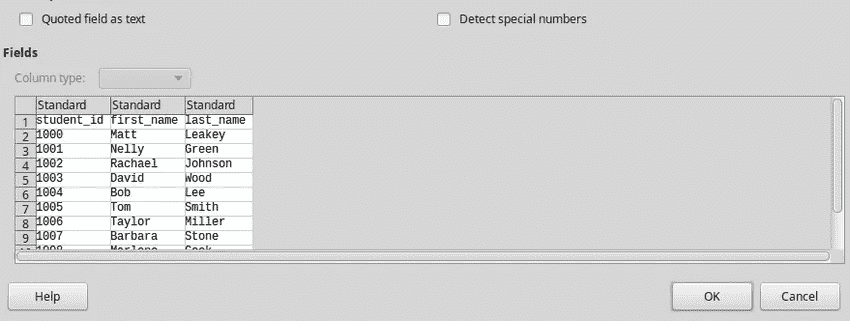

# 如何使用熊猫消费数据和执行数据分析

> 原文：<https://betterprogramming.pub/how-to-use-pandas-to-consume-data-and-perform-data-analysis-76e000ad5480>

## 熊猫数据分析导论


[活动创作者](https://unsplash.com/@campaign_creators?utm_source=unsplash&utm_medium=referral&utm_content=creditCopyText)在 [Unsplash](https://unsplash.com/s/photos/spreadsheet?utm_source=unsplash&utm_medium=referral&utm_content=creditCopyText) 上的照片

> Pandas 是一个 [Python](https://www.python.org) 包，提供了快速、灵活、富于表现力的数据结构，旨在使处理“关系”或“标签”数据变得既简单又直观。它的目标是成为用 Python 进行实际的、真实世界的数据分析的基础高级构建块。此外，它还有一个更广泛的目标，那就是成为任何语言中最强大、最灵活的开源数据分析/操作工具。它已经朝着这个目标前进了——来源([https://pandas.pydata.org/](https://pandas.pydata.org/))

## 装置

熊猫入门，先安装一下。建议将 pandas 安装为 Anaconda 的一部分，但是我们仍然可以使用 pip 来安装它。

```
pip install pandas
```

`pandas`模块通常作为别名`pd`导入，所有操作都使用`pd`完成，如下图。

```
import pandas as pd
```

Pandas 支持两种类型的数据结构，即:

*   系列
*   数据帧

一个`DataFrame`是一个二维数据结构(**数组中的数组)**可以在行和列中存储不同类型的数据。你可以把它想象成一个电子表格或 SQL 表。



截图来自[https://pandas.pydata.org/docs/](https://pandas.pydata.org/docs/)

# 数据帧

让我们首先用下面的数据创建一个简单的数据框架。

这里我们创建一个 Python 字典，它的键用作列标题，值用作列

结果将是:

```
 First_name Last_name                  Email
0       Matt  Mckinney     [mattneey@gmail.com](mailto:mattneey@gmail.com)
1      Harry   ndarray  [Harryndarry@gmail.com](mailto:Harryndarry@gmail.com)
2        ete       Wes      [petewes@gmail.com](mailto:petewes@gmail.com)
```

我们的表格有 3 列，即名字、姓氏和电子邮件。

要获得前两行

```
df.head(2)
```

结果是:

```
 First_name Last_name                  Email
0       Matt  Mckinney     [mattneey@gmail.com](mailto:mattneey@gmail.com)
1      Harry   ndarray  [Harryndarry@gmail.com](mailto:Harryndarry@gmail.com)
```

创建数据帧的另一种方法是使用如下所示的列表

## 读写表格数据

让我们从下面的 CSV 文件中读取数据。CSV(逗号分隔值)包含用逗号分隔的数据。



pandas 提供了 read_csv()函数，用于将 csv 文件读入 pandas DataFrame。其他支持的文件格式包括:

*   csv，
*   excel，
*   SQL，
*   JSON，
*   镶木地板

```
import pandas as pd
df = pd.read_csv('students.csv')print(df)
```

结果将是:

```
 student_id first_name last_name
0         1000       Matt    Leakey
1         1001      Nelly     Green
2         1002    Rachael   Johnson
3         1003      David      Wood
4         1004        Bob       Lee
5         1005        Tom     Smith
6         1006     Taylor    Miller
7         1007    Barbara     Stone
8         1008    Marlene      Cook
9         1009     Marlon    Marlon
10        1010     selene    martin
```

您也可以使用`.csv`功能将数据加载到 CSV。让我们将数据写入 CSV 文件。

输出将是:

```
,First_name,Last_name,Email
[0,Matt,Mckinney,mattneey@gmail.com](mailto:0,Matt,Mckinney,mattneey@gmail.com)
[1,Harry,ndarray,Harryndarry@gmail.com](mailto:1,Harry,ndarray,Harryndarry@gmail.com)
[2,ete,Wes,petewes@gmail.com](mailto:2,ete,Wes,petewes@gmail.com)
```

# 系列

系列是可以容纳任何数据类型的一维数组。简单来说，系列就是一列。让我们看看如何使用列。

让我们假设我们正在处理下面的数据帧

```
 Name Math Calculus Statistics
0       Matt Harry    70       50         56
1  Mckinney ndarray   67       56         78
2        Cathy Matt   63       65         60
3        Leakey Wes   54       55         56
```

选择列有两种方式，可以使用`dictionary[key]`格式或`dictionary.key`格式。

如果我们希望选择数学列，我们应该

```
print(df['Math'])
    #orprint(df.Math)
```

两个 print 语句的结果应该如下所示。

```
0     70
1     67
2     63
3     54
Name: Math, dtype: object
0     70
1     67
2     63
3     54
Name: Math, dtype: object
```

如果列包含空格或特殊字符，则使用 dictionary[key]格式；例如，如果我们有一个名为“体育”的列，我们将选择它，如下所示

```
df['physical education']
```

## 使用列

我们已经学习了如何从列中选择数据，现在让我们开始处理这些数据；让我们将数学列中的数据存储在一个名为 math_data 的变量中

```
math = df.Math
print(math)
```

我们也可以选择多个列，如下所示

```
df_data =df[['Math','Calculus']]print(df_data)
```

结果将是:

```
 Math Calculus
0   70       50
1   67       56
2   63       65
3   54       55
```

因为数据包含不止一列，所以它不再是一个系列，而是一个数据框架。

```
print(type(df_data))
```

输出是

```
<class 'pandas.core.frame.DataFrame'>
```

## 使用行

要选择一行，我们使用 `dataframe. iloc` 属性并传入该行的索引。例如，要获得我们的`dataframe`中最后一个学生的行数据，我们应该这样做:

```
print(df.iloc[-1])
```

结果将是:

```
Name          Leakey Wes
Math                  54
Calculus              55
Statistics            56
```

如果你传递一个不存在的索引，`iloc`属性将引发一个 IndexError。例如，如果您传递 6 作为索引

```
print(df.iloc[6])
```

您将得到以下错误

```
raise IndexError("single positional indexer is out-of-bounds")
IndexError: single positional indexer is out-of-bounds
```

您也可以选择多行，就像我们选择列一样。但是首先，让我们向数据框架添加更多的数据。它现在应该是这样的:

```
Name Math Calculus Statistics
0       Matt Harry    70       50         56
1  Mckinney ndarray   67       56         78
2        Cathy Matt   63       65         60
3     Thomas Thomas   64       75         46
4      Richard Grey   74       65         56
5       Ching Chang   44       55         46
6          Jim Cary   64       65         76
```

例如，让我们选择第二、第三和第四行中的数据

```
print(df.iloc[2:5])
```

结果将是:

```
 Name Math Calculus Statistics
2     Cathy Matt   63       65         60
3  Thomas Thomas   64       75         46
4   Richard Grey   74       65         56
```

# 添加和修改行和列

到目前为止，我们已经能够使用现有数据，现在让我们学习如何

*   向行和列中添加新数据
*   重命名列

## 添加新列

假设我们想为一个新的主题添加一个新的列，让我们这样做。

```
df['Quantitative Analysis'] = [60,56,78,45,64,78,69]print(df)
```

我们的新数据将是:

```
Name Math Calculus Statistics  Quantitative Analysis
0       Matt Harry    70       50         56                     60
1  Mckinney ndarray   67       56         78                     56
2        Cathy Matt   63       65         60                     78
3     Thomas Thomas   64       75         46                     45
4      Richard Grey   74       65         56                     64
5       Ching Chang   44       55         46                     78
6          Jim Cary   64       65         76                     69
```

## 重命名列

考虑以下数据帧:

```
 Product Name   Cost
0  Tony valencia 7047   36.5
1  Tony valencia 6171   28.5
2  Tony valencia 7050   36.5
3  Tony valencia 7056   28.5
4  Tony valencia 6170   28.5
5       Rayban Rb3025  200.0
```

让我们将成本列重命名为商品成本

```
df.columns = ['Product Name', 'Cost of goods']print(df)
```

该表现在看起来像这样:

```
 Product Name  Cost of goods  
0  Tony valencia 7047           36.5    
1  Tony valencia 6171           28.5    
2  Tony valencia 7050           36.5    
3  Tony valencia 7056           28.5    
4  Tony valencia 6170           28.5    
5       Rayban Rb3025          200.0 
```

## 使用现有数据添加新列

对于上面的数据，添加一个等于`Cost*0.4`的利润列

```
df['Profit'] = df.Cost *0.4print(df)
```

我们的表格现在看起来像这样:

```
 Product Name   Cost  Profit
0  Tony valencia 7047   36.5    14.6
1  Tony valencia 6171   28.5    11.4
2  Tony valencia 7050   36.5    14.6
3  Tony valencia 7056   28.5    11.4
4  Tony valencia 6170   28.5    11.4
5       Rayban Rb3025  200.0    80.0
```

## 将 Lamba 应用于行和列

兰姆达斯被用来在行和列上用熊猫执行复杂的操作。lambda 函数的语法是:

```
lambda *args* : *expression*
```

考虑下面的数据框架，

假设我们想要创建一个列平均值来显示每个学生的总体表现。创建一个 lambda 函数平均值，取一个值，然后除以 3(受试者总数)

```
average = lambda a : a/3
```

现在将 lambda 函数应用于 Total_marks 列

```
df["average"] = df.Total_marks.apply(average)
```

输出将是:

本教程涵盖了开始使用`pandas`模块所需要知道的一切。更多高级示例，请参考[烹饪书](https://pandas.pydata.org/docs/user_guide/cookbook.html#cookbook)指南。