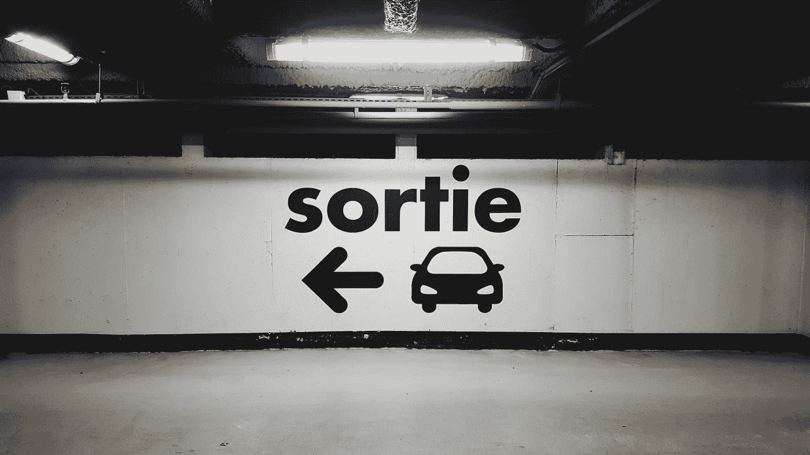

# 如何在 Python 中使用传递、中断和继续

> 原文：<https://betterprogramming.pub/how-to-use-pass-break-and-continue-in-python-6e0201fc032a>

## Python 初学者

## Python 中退出子句的 3 种方法



卢卡斯·加洛内在 [Unsplash](https://unsplash.com?utm_source=medium&utm_medium=referral) 上拍摄的照片

学习如何用 Python 编程并不容易。也许你在 Python 中利用了包含其他语句组的**复合语句**，或者影响控制流的**子句**。您是否遇到过无法在循环或 if-else 中实现所需内容的情况？

你可能需要更多地了解如何使用`pass`、`break`和`continue`来退出一个子句。在学习这三种方法之前，先熟悉一下本文中的一些内置 Python 特性:

[](https://towardsdatascience.com/5-python-features-i-wish-i-had-known-earlier-bc16e4a13bf4) [## 我希望我能早点知道的 5 个 Python 特性

### 超越 lambda、map 和 filter 的 Python 技巧

towardsdatascience.com](https://towardsdatascience.com/5-python-features-i-wish-i-had-known-earlier-bc16e4a13bf4) 

## 条款

Python 中的一个子句——比如`if`、`for`和`while`循环——由一个**头**和它的**组**组成，由一个**冒号** `:`隔开。它的套件执行的次数取决于头条件的满足情况。

```
# The following is a clause
if a > 0:    # This is a header
    print(a) # This is a suite
```

# 1.及格

让我们从相对简单(但不直接)的事情开始。**当`pass`被执行时**什么也没发生。它的主要目的是充当解释器**期望**一条语句的**占位符**。

还记得冒号分隔的复合语句需要一个头和一个套件吗？如果你想让一个 suite 什么都不做，你不能用冒号`:`结束语句。这就是`pass`派上用场的地方，因为从语法上来说**需要一个语句。**

```
def foo():
    pass
```

但是为什么我们首先要一个复合语句什么都不做呢？


[费德里科·博托斯](https://unsplash.com/@landscapeplaces?utm_source=medium&utm_medium=referral)在 [Unsplash](https://unsplash.com?utm_source=medium&utm_medium=referral) 上的照片

如果有一个函数或循环，我们想在将来实现，我们可以先用一个空体构造一个空函数或循环。由于这在语法上是非法的，我们使用 null 语句`pass`作为占位符，以符合语法要求。

这对于在项目开发中创建空子句非常有用。

# 2.破裂

`break`语句允许你提前离开`for`或`while`循环。

在下面的例子中，当`a == 2`满足时，执行`break`语句。它会提前终止循环。执行`break`时，循环控制目标(即本例中的`a`)保持其当前值。

您也可以以类似的方式使用`break`提前退出`while`循环。没有一个循环可以抵抗`break`，甚至没有一个`while True`循环可以无限期地执行它的套件。


照片由[卡伦·艾姆斯利](https://unsplash.com/@kalenemsley?utm_source=medium&utm_medium=referral)在 [Unsplash](https://unsplash.com?utm_source=medium&utm_medium=referral) 上拍摄

# 3.继续

`continue`语句忽略循环中的其余语句，并继续下一次迭代。注意`continue` *不像`break`那样*停止循环，而是跳过并继续下一次迭代。

# 相关文章

感谢阅读！你可以[注册我的时事通讯](http://edenau.mailchimpsites.com/)来接收我的新文章的更新。如果您对 Python 感兴趣，您可能会对以下文章感兴趣:

[](https://towardsdatascience.com/5-python-features-i-wish-i-had-known-earlier-bc16e4a13bf4) [## 我希望我能早点知道的 5 个 Python 特性

### 超越 lambda、map 和 filter 的 Python 技巧

towardsdatascience.com](https://towardsdatascience.com/5-python-features-i-wish-i-had-known-earlier-bc16e4a13bf4) [](https://towardsdatascience.com/6-new-features-in-python-3-8-for-python-newbies-dc2e7b804acc) [## Python 3.8 中针对 Python 新手的 6 项新特性

### 请做好准备，因为 Python 2 不再受支持

towardsdatascience.com](https://towardsdatascience.com/6-new-features-in-python-3-8-for-python-newbies-dc2e7b804acc) [](https://towardsdatascience.com/4-common-mistakes-python-beginners-should-avoid-89bcebd2c628) [## Python 初学者应该避免的 4 个常见错误

### 我很艰难地学会了，但你不需要

towardsdatascience.com](https://towardsdatascience.com/4-common-mistakes-python-beginners-should-avoid-89bcebd2c628) 

*快乐编码！*