# 如何在仙丹中使用模式匹配

> 原文：<https://betterprogramming.pub/how-to-use-pattern-matching-in-elixir-426709bb179a>

## 了解等号运算符实际上是如何工作的

摘自[https://elixir-lang.org/](https://elixir-lang.org/)

这是我喜欢长生不老药的原因之一；这是我每天都在使用的非常强大的特性之一，但当我使用 Python 或其他编程语言时，我却怀念它。

赋值运算符“=”是一个等价运算符。在 Elixir 中，我们让一个变量等于一个值，反之亦然。让我们看一个例子:给变量 x 赋值“hello”

因此，我们可以对变量的值进行评估，使其返回原始值。

当我们用“hello”之外的值对变量求值时，它会给我们一个 MatchError 错误。唯一可行的方法是变量在操作的左边。然而，这覆盖了我们的原始变量。

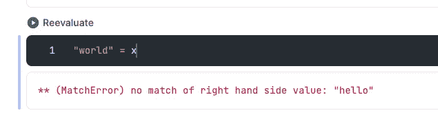

MatchError 错误。

# 通过模式匹配解构数据结构

之前我们讨论了几种数据结构，元组。我们说过它们类似于列表，但是它们在内存中的存储方式不同。结构的类型是非常重要的谈论数据分解与模式匹配。我们很快就会看到。首先，让我们看一个元组析构的例子。

如果我们的元组中有三个元素，我们可以用一种非常简单的方式为每个元素初始化一个变量:

因此，在`x`中，我们有`atom :hello`，在`y`中有`atom :world`，以此类推。

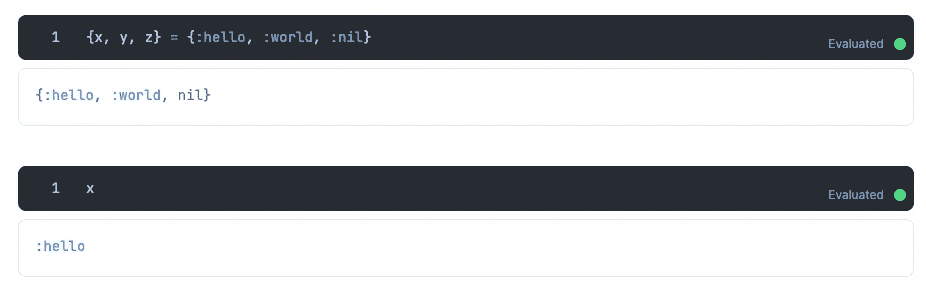

模式匹配的结果

这是通过将变量的数量与值的数量相匹配来实现的。如果我们的值比变量少，我们将得到一个 MatchError 错误。

由于模式匹配不匹配而导致的匹配错误

当结构的类型不同时，我们不能以这种方式分配变量，例如，比较元组和列表。

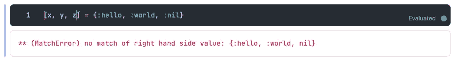

由于模式匹配不匹配而导致的匹配错误

很多时候，在 Phoenix 中，作为操作的结果，我们有一个元组，其中第一个值是一个原子`type :ok`(或`:error`)，第二个值是结果(或错误的原因)，这些原子必须在`=`操作符的两边匹配。

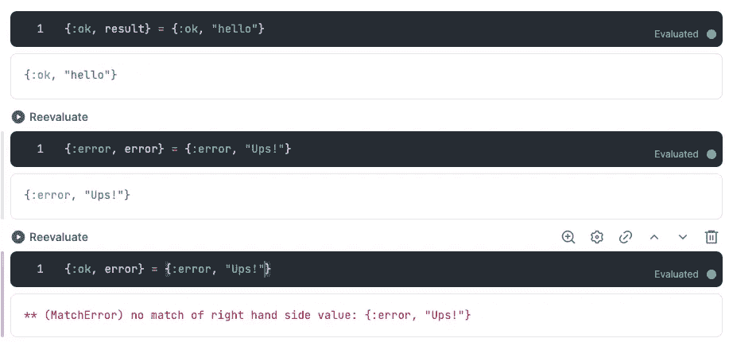

MatchError 由于模式匹配和评估结果不匹配而导致的错误。

对于列表的析构，我们可以用一种类似的非常简单的方式提取第一个元素(或最后一个元素):将一个名为`head`的变量赋给第一个元素，然后放置操作符`|`，并将一个变量放在列表其余元素所在的位置。

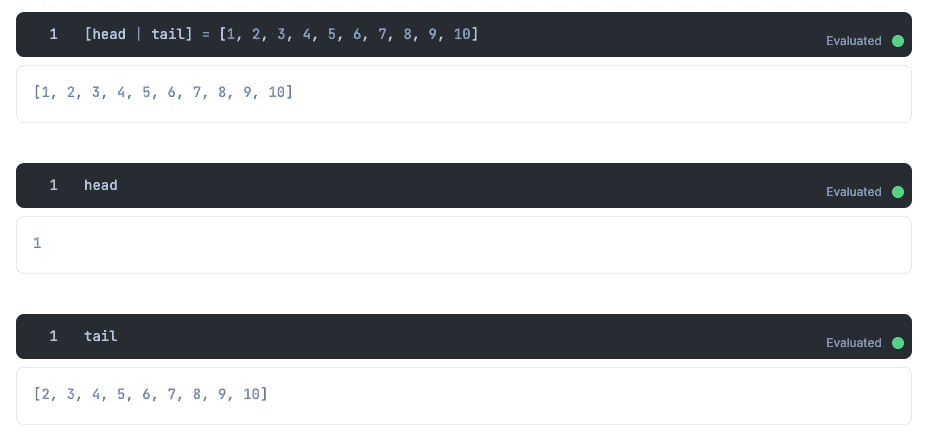

评估结果

我们可以析构几个元素，不仅仅是第一个。让我们看一个提取前两个元素的例子:

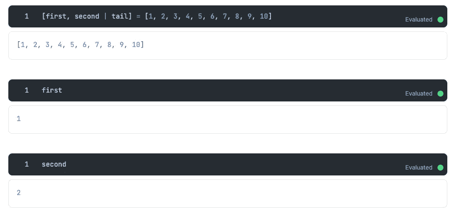

评估结果

不能将空列表赋给两个变量，因为没有匹配的元素。

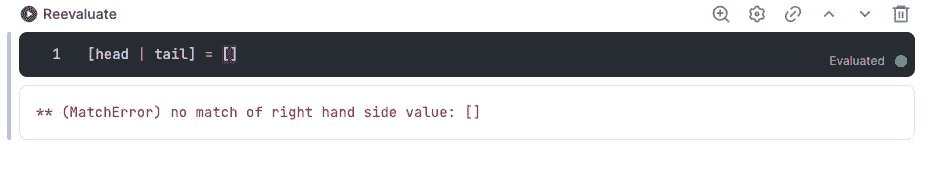

MatchError 错误。

这也是函数`hd/1`(或`tl/1`)不能处理空列表的原因。在函数的情况下返回一个类型为`ArgumentError`的错误，或者像前面的情况一样返回一个匹配错误。

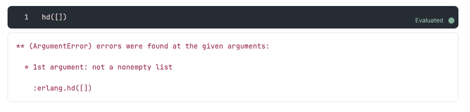

ArgumentError 消息

# 带有模式匹配的列表连接

假设我们有一个列表，我们想在它的开头添加一个元素。我们可以做的是在列表之间使用`++`操作符。但是，我们也可以为此使用模式匹配。

或者，如我所说，使用`++`操作符。然而，我们必须把我们的元素放到一个新的列表中。

# Pin ^算子

可以重新分配或覆盖 Elixir 中的变量。有时候，这不是我们想要的；有时候，我们想要的是做一个模式匹配。让我们用本帖开头的例子看得更清楚。

如果我们想知道`x`是否等同于另一个值，我们将不得不使用 pin 操作符。这样就可以匹配而不是重新分配。

MatchError 错误。

当我们已经有了一个初始化的变量，并且我们想知道一个操作的结果是否有那个值来给操作的其余部分分配一个新的变量时，这是非常有用的。这里有一个例子:

因为有一个匹配，现在我们在变量`x`中有了字符串“这是另一个操作的结果。”如果没有匹配，我们得到一个 MatchError 类型的错误，并且我们的变量`x`没有被赋值。

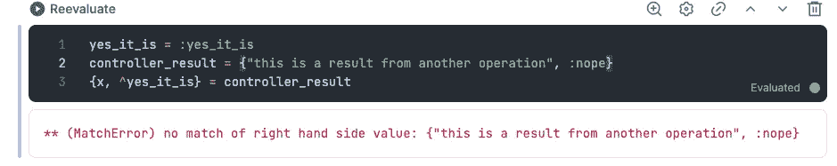

MatchError 错误。

这是因为我们在比较`:yes_it_is`和`:nope`原子，但它们并不相同。

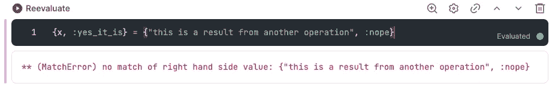

MatchError 错误。

# 未使用的变量

我们通常对将运算结果保存在变量中不感兴趣。然而，由于结果返回的元素数量，我们必须放置一个变量，以便模式匹配正确工作。

为此，我们使用`_`来表示一个在模式中被忽略的值。让我们看一个前面代码的例子。

如果我们不想使用给我们赋值的右边的字符串，我们仍然必须放置一个变量来使模式匹配工作。以下内容不起作用:

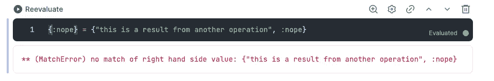

MatchError 错误。

因此，我们决定将其放置如下:

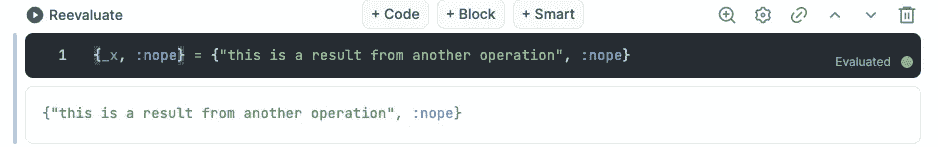

评估结果

# 结论

正如您所看到的，模式匹配是提取信息的一个非常好的工具。它提供了多功能性，在我看来，这样工作要快得多。如果你懂 JS，你肯定会熟悉这种声明变量的方式。

在下一篇文章中，我们将看到 Elixir 中不同的控制结构以及它们与模式匹配的关系。

这里是这个系列的第一部分的链接。

# 参考

 [## 模式匹配

### 从本章开始，我们将展示 Elixir 中的=操作符实际上是一个匹配操作符，以及如何使用…

elixir-lang.org](https://elixir-lang.org/getting-started/pattern-matching.html)