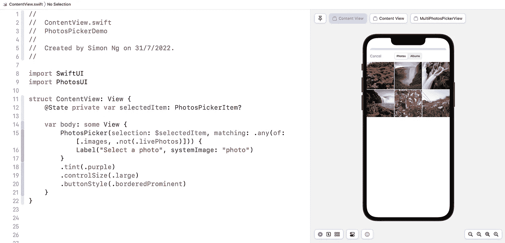
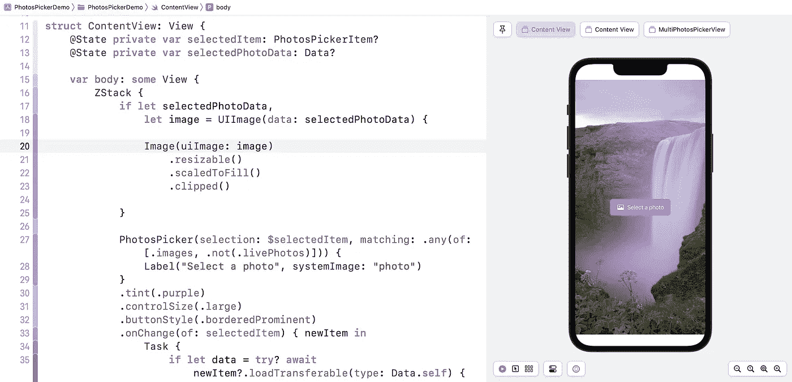
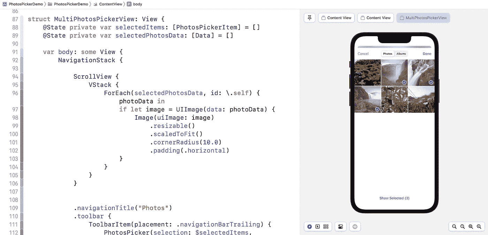

# 如何在 SwiftUI 中使用 PhotosPicker

> 原文：<https://betterprogramming.pub/how-to-use-photospicker-in-swiftui-637d2d362a60>

## SwiftUI 中的原生照片拾取器？你猜对了！


在 iOS 16 之前，如果需要显示照片拾取器供用户从照片库中选择照片，就不得不依靠 UIKit 的`[PHPickerViewController](https://www.appcoda.com/phpicker/)`或者更老的`[UIImagePickerController](https://www.appcoda.com/swiftui-camera-photo-library/)`。使用它并不困难，因为你可以将 UIKit 组件与`UIViewControllerRepresentable`集成。也就是说，如果 SwiftUI 框架带有 photo picker 的原生视图，那就太好了。

在 iOS 16 中，苹果终于为 SwiftUI 带来了 Photos Picker，它与 UIKit 具有相同的功能。如果你的应用程序只支持运行 iOS 16 或更高版本的设备，你可以使用这个新视图来处理照片选择。

让我们用一些示例代码来看看它是如何工作的。请注意，您需要使用 [Xcode 14 beta 4](https://developer.apple.com/xcode/) 来跟随本教程。

# 在 SwiftUI 中使用 PhotosPicker

`PhotosPicker`视图被捆绑在`PhotosUI`框架中。在使用它之前，您必须首先导入框架:

```
import PhotosUI
```

接下来，我们声明一个状态变量来保存选中的照片:

```
@State private var selectedItem: PhotosPickerItem?
```

打开照片拾取器非常简单。下面是`PhotosPicker`的基本用法:

```
PhotosPicker(selection: $selectedItem, matching: .images)) {
   Label("Select a photo", systemImage: "photo")
}
.tint(.purple)
.controlSize(.large)
.buttonStyle(.borderedProminent)
```

通过将绑定传递给所选项目和照片过滤器来实例化`PhotosPicker`。在闭包中，描述按钮的外观。通过几行代码，Xcode 应该会在预览中显示一个按钮。


如果您点按该按钮，它会显示一个照片选取器，用于从照片图库中选取图像。当您选择一张照片时，照片拾取器会自动关闭，所选照片项目会存储在`selectedItem`变量中。



# 过滤照片

`matching`参数允许您指定要应用于照片图库的照片滤镜。在上面的代码中，我们将其值设置为`.images`以仅显示图像。如果要同时显示图像和视频，请将参数值设置为以下值:

```
.any(of: [.images, .videos])
```

`.images`滤镜包括用户照片库中的所有图像。如果想从图像集中排除现场照片怎么办？您可以像这样设置该值:

```
.any(of: [.images, .not(.livePhotos)])
```

您使用`.not`滤镜来排除实时照片。

# 处理照片选择

如前所述，选中的照片会自动存储在`selectedItem`变量中，该变量的类型为`PhotoPickerItem`。那么，我们如何加载照片并显示在屏幕上呢？

首先，我们附加了`onChange`修饰符来监听`selectedItem`变量的更新。每当有变化时，我们调用`loadTransferable`方法来加载资产数据。

```
.onChange(of: selectedItem) { newItem in
   Task {
       if let data = try? await newItem?.loadTransferable(type:Data.self) {
           selectedPhotoData = data
       }
   }
}
```

在 WWDC22 会议中([照片拾取器的新功能](https://developer.apple.com/videos/play/wwdc2022-10023))，苹果的工程师向我们展示了如何将类型指定为`Image.self`。这是为了指示`loadTransferable`返回一个`Image`的实例。然而，我无法让它在 Xcode 14 beta 4 上工作。这也是我用`Data.self`代替的原因。稍后，我们可以将数据转换成一个`UIImage`对象，用于在`Image`视图中显示。

`selectedPhotoData`变量是另一个用于保存数据对象的状态变量:

```
@State private var selectedPhotoData: Data?
```

为了在图像视图中显示所选图像，我们使用图像数据创建了一个`UIImage`实例，然后将其传递给`Image`视图:

```
if let selectedPhotoData,
   let image = UIImage(data: selectedPhotoData) {

   Image(uiImage: image)
       .resizable()
       .scaledToFill()
       .clipped()

}
```

这就是你处理图像选择的方式。概括地说，当用户从内置的照片库中选择图像时，我们检索图像数据。我们将图像数据保存到一个状态变量中(即`selectedPhotoData`)。SwiftUI 检测到值的变化，并触发 UI 更新以在屏幕上呈现照片。



# 选择多张照片

`PhotosPicker`视图也可以支持多张照片选择。让我们构建另一个快速演示来看看它是如何工作的。同样，我们有两个状态变量来保存`PhotosPickerItem`对象和`Data`对象。因为用户可能选择多张照片，所以两个变量都变成了一个数组:

```
@State private var selectedItems: [PhotosPickerItem] = []
@State private var selectedPhotosData: [Data] = []
```

为了支持多张照片选择，技巧是使用`PhotosPicker`的另一种初始化方法:

```
PhotosPicker(selection: $selectedItems, maxSelectionCount: 5,matching: .images) {
   Image(systemName: "photo.on.rectangle.angled")
}
.onChange(of: selectedItems) { newItems in
   for newItem in newItems {

       Task {
           if let data = try? await newItem.loadTransferable(type:Data.self) {
               selectedPhotosData.append(data)
           }
       }

   }
}
```

这个方法有一个名为`maxSelection`的附加参数。我们将该值设置为`5`，这意味着允许用户最多支持 5 张照片。在这种情况下，我们可能会在`onChange`闭合中捕获多张照片。我们所做的是加载每个照片项，并将其添加到数据数组中(即`selectedPhotosData`)。

对于这个演示视图，我们没有在屏幕中央创建按钮，而是将按钮放在了导航栏中。以下是完整的代码片段:

```
NavigationStack {

   ScrollView {
       VStack {
           ForEach(selectedPhotosData, id: \.self) { photoData in
               if let image = UIImage(data: photoData) {
                   Image(uiImage: image)
                       .resizable()
                       .scaledToFit()
                       .cornerRadius(10.0)
                       .padding(.horizontal)
               }
           }
       }
   }

   .navigationTitle("Photos")
   .toolbar {
       ToolbarItem(placement: .navigationBarTrailing) {
           PhotosPicker(selection: $selectedItems,maxSelectionCount: 5, matching: .images) {
               Image(systemName: "photo.on.rectangle.angled")
           }
           .onChange(of: selectedItems) { newItems in
               for newItem in newItems {

                   Task {
                       if let data = try? awaitnewItem.loadTransferable(type: Data.self) {
                           selectedPhotosData.append(data)
                       }
                   }

               }
           }
       }
   }
}
```

当`selectedPhotosData`变量有任何变化时，SwiftUI 将刷新 UI 并在滚动视图中显示照片。



```
**Want to Connect?**If you enjoy this article and want to dive deeper into SwiftUI, you may check out my [Mastering SwiftUI book](https://www.appcoda.com/swiftui).
```