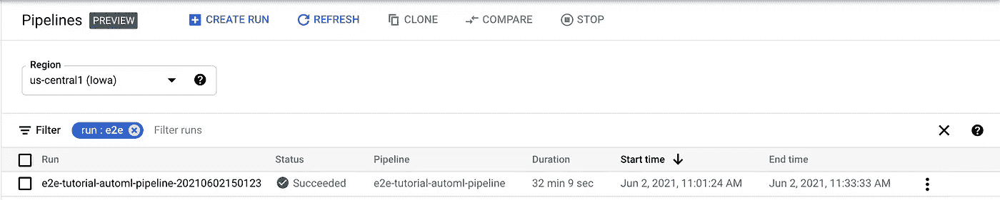
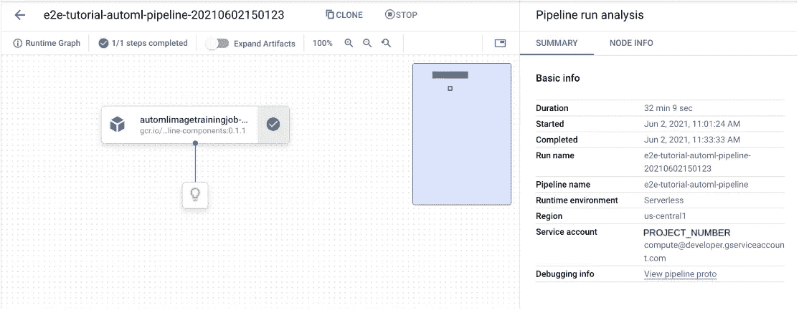
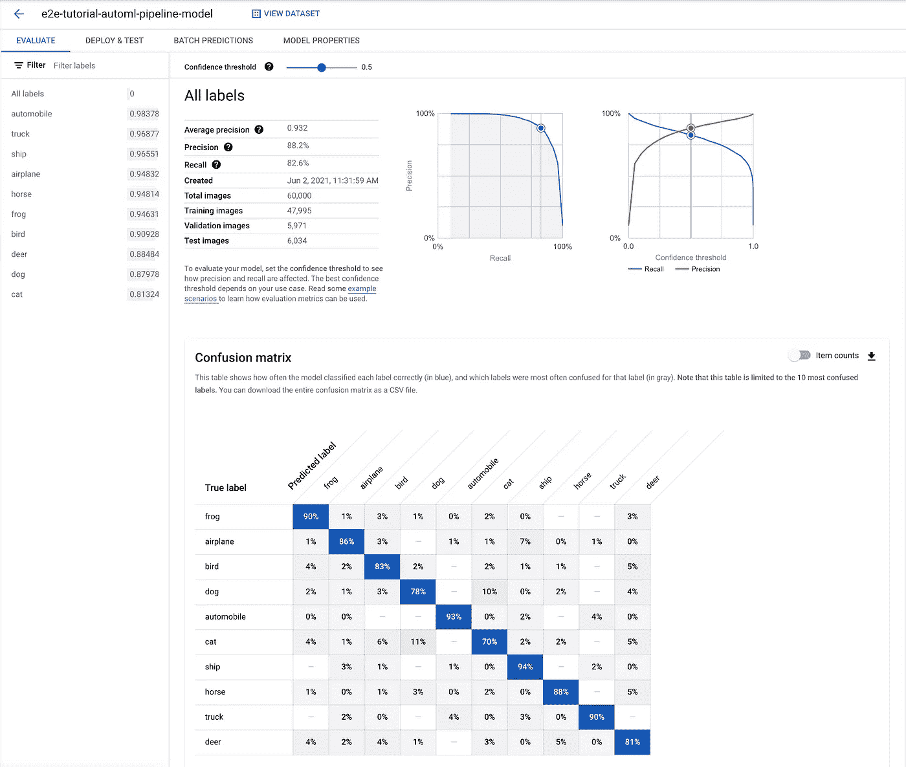
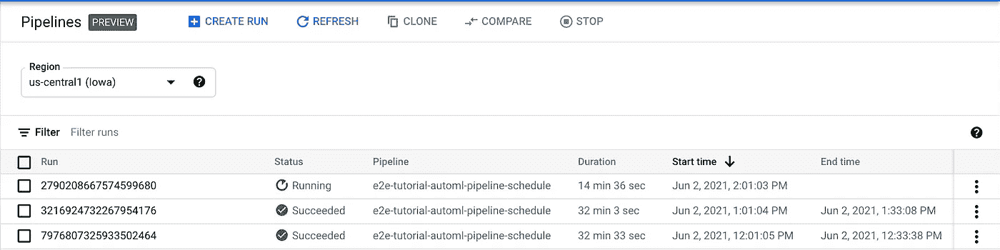
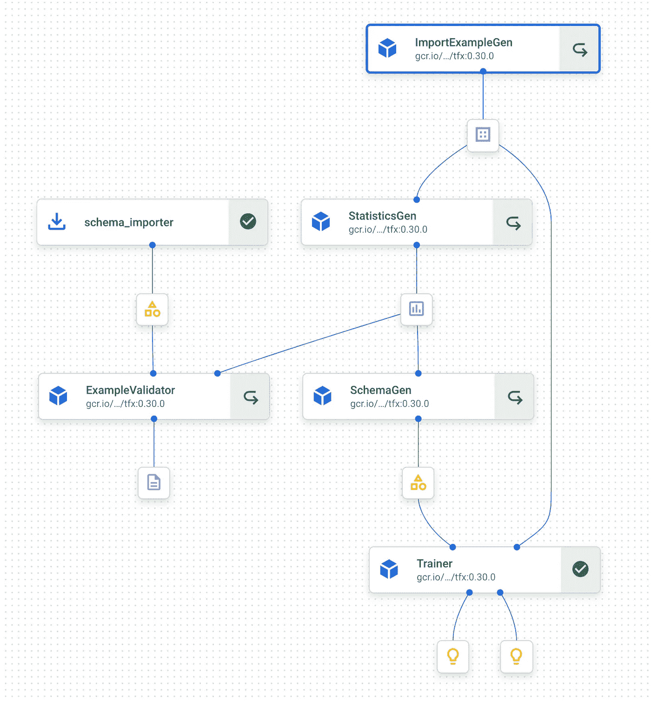
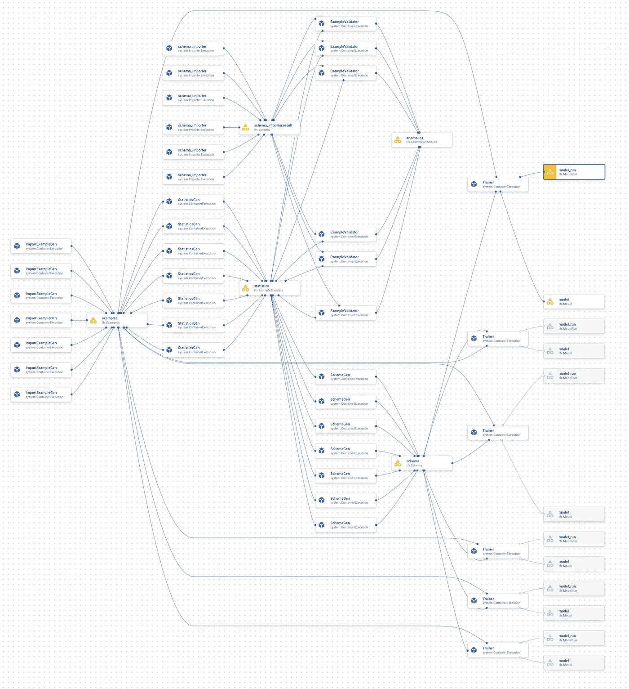
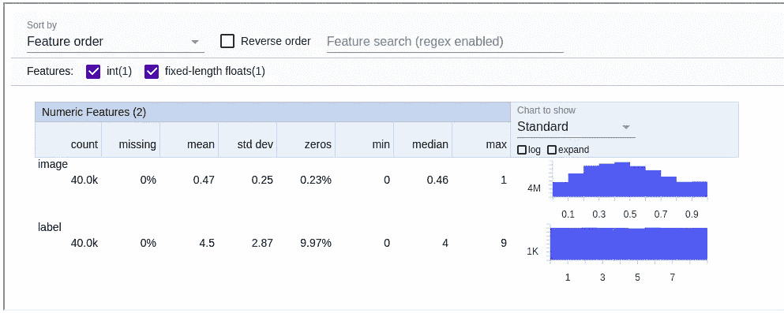
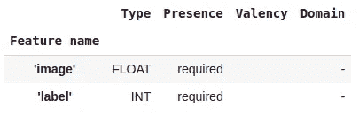

# 如何在谷歌云的 Vertex AI 上使用管道

> 原文：<https://betterprogramming.pub/how-to-use-pipeline-on-google-clouds-vertex-ai-863b429c811f>

## 顶点 AI 管道的一个简单例子 Google Cloud 支持 MLOps 的基础


在 [Unsplash](https://unsplash.com?utm_source=medium&utm_medium=referral) 上由 [Rodion Kutsaev](https://unsplash.com/@frostroomhead?utm_source=medium&utm_medium=referral) 拍照

# 顶点 AI 教程系列

1.  [在谷歌云的顶点人工智能上训练模型的逐步指南](/a-step-by-step-guide-to-train-a-model-on-google-clouds-vertex-ai-47faafae1330)
2.  [在谷歌云的顶点人工智能上调整模型的逐步指南](/a-step-by-step-guide-to-tune-a-model-on-google-clouds-vertex-ai-afd2e72af595)
3.  [如何在谷歌云的顶点人工智能上操作模型](/how-to-operationalize-a-model-on-google-clouds-vertex-ai-53298b530703)
4.  [如何在 Google Cloud 的 Vertex AI 上使用 AutoML](/how-to-use-automl-on-google-clouds-vertex-ai-27f8778239ea)
5.  [如何在 Google Cloud 的 Vertex AI 上使用 big query ML](/how-to-use-bigquery-ml-on-google-clouds-vertex-ai-23b1ca0b635)
6.  如何在 Google Cloud 的 Vertex AI 上使用 Pipeline(本文)

# *背景*

这是本系列的第六篇也是最后一篇文章。到目前为止，我们已经在谷歌云的 [Vertex AI](https://cloud.google.com/vertex-ai) 上训练、优化和部署了模型。我们还探索了如何使用 AutoML 和 BigQuery ML。在这最后一篇文章中，我们将看看[顶点 AI 流水线](https://cloud.google.com/vertex-ai/docs/pipelines)。Pipeline 是 Google Cloud 的无服务器平台，用于机器学习工作流。当我们说*机器学习工作流*时，我们指的是模型开发和部署周期中的一系列步骤，例如数据准备/验证、模型训练、超参数调整、模型验证和模型部署。

为了在生产中采用 ML，我们需要一个可重复的、可验证的、自动化的过程来对生产模型进行任何更改。这个过程类似于 DevOps 中的 CI/CD，这就是 MLOps 这个时髦名称的由来。我们将展示 Vertex AI Pipeline 管理这一过程的核心能力。

简单回顾一下，我们正在解决的问题是在 [CIFAR10](https://www.tensorflow.org/datasets/catalog/cifar10) 数据集上的图像分类任务，该数据集包含 10 个类别的 60，000 张 32x32 图像。

# 推出我们的第一条管道

我们将使用 [Kubeflow](https://www.kubeflow.org/) 构建一个简单的管道。在文章的最后，我们还将展示一个用 [Tensorflow Extended](https://www.tensorflow.org/tfx) 编写的更加复杂的管道的例子。但是现在，让我们尝试一个非常简单的任务:我们将启动一个单步流水线来训练一个 AutoML 模型。调用 AutoML 的 Kubeflow 组件已经包含在公共库中，这使得我们的示例更加简单。

提示:尝试使用 Vertex AI 笔记本。它将您从许多样板配置中拯救出来。请参考第一篇文章，了解为什么它是首选的更多细节。

首先，在笔记本上安装几个包。

```
pip install google-cloud-aiplatform==1.0.0 --upgradepip install kfp --upgradepip install kfp google-cloud-pipeline-components==0.1.1 --upgrade
```

下面是我们如何构建管道。

管道施工规范

就这么简单。

几个亮点:`dsl.pipeline`装饰器将函数包装在管道中。`AutoMLImageTrainingJobRunOp`是围绕`AutoMLImageTrainingJob`及其`run`方法的组件包装器([文档](https://googleapis.dev/python/aiplatform/latest/_modules/google/cloud/aiplatform/training_jobs.html))。它通过其接口公开了底层`AutoMLImageTrainingJob.__init__`和`AutoMLImageTrainingJob.run`的基本输入和输出参数。`PROJECT_ID`常量是您的 Google Cloud 项目 ID。`GCS_PATH_FOR_PIPELINE`常量是项目中的 Google 云存储桶文件夹。管道服务使用它来暂存执行工件。

`DATASET_NAME`常量是以`projects/123/locations/us-central1/datasets/456`形式的全限定顶点 AI 数据集名称。在之前的 AutoML 文章中，我们已经有了这样一个数据集。所以我们在这里重复使用它。您可能会注意到，`AutoMLImageTrainingJob.run`的数据集输入参数实际上是一个`Dataset`对象，而不是一个字符串。但是组件包装器改变了接口，并允许基于输入数据集名称对`Dataset`进行运行时实例化。

接下来，我们编译管道，生成一个 YAML 文件。然后，我们根据 YAML 文件启动管道。

发射管道

只需在 Vertex AI 笔记本中运行以上两段代码即可。然后，我们将启动并运行管道。我们可以进入 UI: Vertex AI -> Pipelines 来查看创建的管道并检查其细节。我们还可以访问 UI: Vertex AI -> Models，在管道完成时检查新创建的模型。



管道概述



管道详情



模型结果

# 计划重复运行

现在我们已经完成了管道的第一次运行。我们希望创建一个每小时重复 AutoML 训练的计划。因为谁知道呢，Google Cloud 可能会发布新的 AutoML 增强功能，我们希望这些改进功能一发布就能被整合进来。

安排一个重复的管道是微不足道的。简单地拿我们已经建立的管道来说，把`schedule`附加到它所有的名字上，只是为了让它更清楚。然后编译，而不是创建一个作业，为它创建一个时间表。

调度重复管道

我们可以进入 UI: Vertex AI -> Pipelines，看到管道正在有规律地运行。



重复管道运行

我们已经完成了基于 Kubeflow 的 Vertex AI 管道的简单演示。实际上，我们的流水线可能包含许多不同的步骤和各种复杂的控制逻辑。这是一篇[关于将云构建和 Vertex AI 链接在一起以实现模型开发和部署的真正 CI/CD 的好文章](https://cloud.google.com/architecture/architecture-for-mlops-using-tfx-kubeflow-pipelines-and-cloud-build)。

我还有一个用 Tensorflow Extended 编写的示例，演示了导入数据、收集输入统计数据、根据统计异常值检测输入中的异常以及训练模型的步骤。在 GitHub 上查看完整的[源代码。以下是管道的图形结构。](https://github.com/eileen-code4fun/MachineLearning/blob/main/tfx/tfx.ipynb)



复杂管道

我运行了多次管道。Vertex AI [Metadata](https://cloud.google.com/vertex-ai/docs/ml-metadata) 服务跟踪管道执行的所有历史、沿袭和工件位置，当我们想要检查工作流的所有移动部分时，这非常方便。



管道元数据

我们可以点击元数据图中的节点来检查工件的位置，并且我们可以使用 [Tensorflow 数据验证](https://www.tensorflow.org/tfx/data_validation/api_docs/python/tfdv)库来可视化它们。

可视化管道工件的代码



数据统计可视化



数据模式可视化

# 事后思考

本文和本系列教程到此结束。Vertex AI 还有其他有趣的功能我没有涉及，比如[特征存储](https://cloud.google.com/vertex-ai/docs/featurestore)、[元数据](https://cloud.google.com/vertex-ai/docs/ml-metadata)、[标签服务](https://cloud.google.com/vertex-ai/docs/datasets/data-labeling-job)、[监控&安全](https://cloud.google.com/vertex-ai/docs/general/monitoring-security)等。所以你可以自己去看看。

本系列的目标是满足对 Vertex AI 进行连贯的端到端用户案例演示的需求。我不从 Vertex AI 获得创作这个系列的报酬。作为一个涉足 ML 的常规软件工程师，我只想和大家分享一下我的学习历程。希望你觉得这个系列值得你花时间。