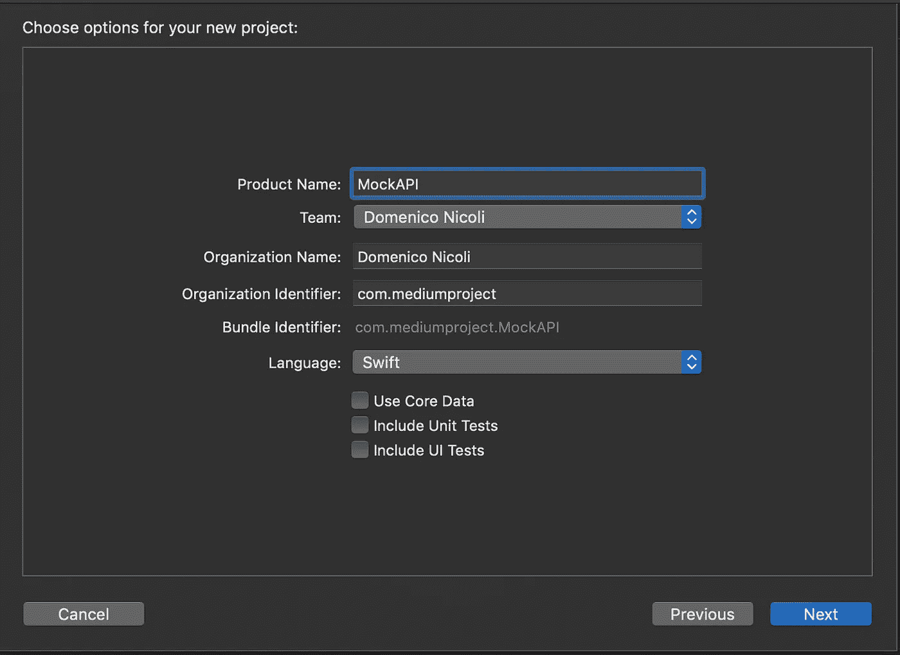

# 如何在 Swift 中使用协议模拟 API 调用

> 原文：<https://betterprogramming.pub/how-to-use-protocols-to-mock-api-calls-in-swift-c69f7567f77a>

## 通过模仿提高您的开发、测试和预览速度

José Alejandro Cuffia 在 [Unsplash](https://unsplash.com?utm_source=medium&utm_medium=referral) 上拍摄的照片

# 介绍

模仿背后的基本概念很简单:不使用软件组件(本例中是 API)，可以用模拟响应的假组件来代替它。

现在，您可能会想，这种方法的利弊是什么，为什么我们要用一个假的 API 替换一个真的 API 呢？下面你可以找到主要原因，并简单解释一下:

*   **更快的开发过程:**你的团队本周必须开发一个新的应用，但是开发 API 的后端团队要到下个月才开始。您已经知道了方法和响应应该如何工作，使用这种方法，您可以开始开发、使用模拟实现和测试您的应用程序。当真正的 API 准备好了，你只需要修改一行代码。
*   **集成测试**:通常我们会测试代码的业务逻辑。不需要验证 API 响应。(警告:这并不总是对的。也许在某些情况下，您还想测试 API 响应，所以在继续之前，考虑一下这个实现是否适合您的情况。)
*   **测试和预览:**你想向客户展示你的应用程序的预览，但是一些 API 部分仍然缺失，测试数据库上只有几个数据点可以显示。

# 履行

让我们创建一个新项目，它使用协议为我们的`RealAPI`类和`MockAPI`类创建一个抽象层。

首先，新建一个 Xcode 项目。可以从单视图 app 开始。

现在创建一个新文件，命名为`RequestProtocol`。这里我们应该添加我们的 API 方法。下面你可以找到一个例子:

添加两个实现`RequestProtocol`的类(`RealAPI`和`MockAPI`)。遵循 Xcode 的建议，添加所有可用的方法。

现在将您的真实网络请求放入您的`RealAPI`类，并在`MockAPI`上虚拟返回值，如下所示:

# 是时候测试一下了

为了测试我们的代码是否工作正常，我们将在我们的`ViewController`类上添加一个对`isAlive` 方法的调用，并运行项目。

如果您打印变量值，您将看到该方法总是如我们所期望的那样返回 true(当然，我们硬编码了它)。

最后，为了使用您真正的 API，您唯一需要做的就是更改`apiManager` 变量初始化，以便使用`RealAPI`类而不是`MockAPI`。

你可以在 [GitHub](https://github.com/domeniconicoli/MockAPI) 上找到完整代码。

# 结论

关于如何使用协议创建一个假 API 的教程到此结束。如果你有任何问题或建议，请在下面留下评论。