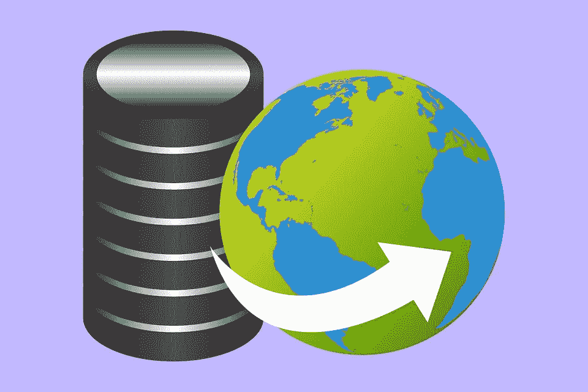
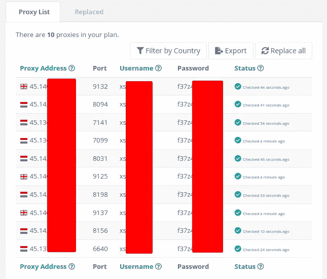
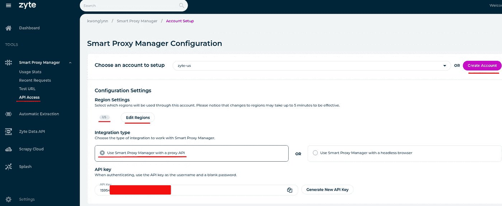
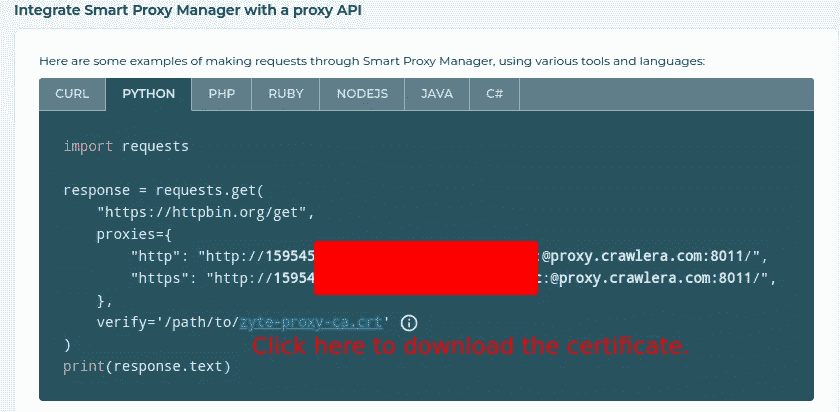
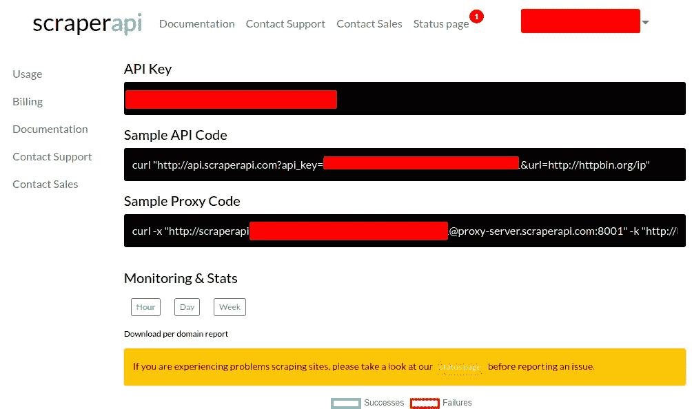

# 如何使用 Python 在地理定位 Web 抓取中使用代理

> 原文：<https://betterprogramming.pub/how-to-use-proxies-in-geotargeting-web-scraping-ae9effa8b28f>

## 通过代理为您的应用获取准确的数据



图片由 Pixabay 的 [kreatikar](https://pixabay.com/illustrations/cloud-data-internet-connection-4828224/) 拍摄

代理是介于你和目标网站之间的东西。当你用代理抓取网站时，用来抓取目标网站的是代理的 IP，而不是你的。

如果您的应用程序严重依赖于 web 抓取，出于各种原因，您可能会希望使用代理。其中之一是地理定位，这意味着我们希望从特定的地区或国家抓取目标网站，而不是从我们的本地 IP。这对于在线零售商来说尤其重要，因为他们通常会在不同的地区展示不同的内容。

在本文中，我们将通过`requests`和`Scrapy`库介绍在 Python 中使用 web 抓取代理的不同方式。测试的免费代理和生产的专用代理都将被引入。

免费代理适合测试，通常只用于测试。这是因为免费代理通常由许多用户共享。因此，性能远远低于专用的，你可以很容易被禁止。此外，如果使用了不良代理，还会有安全问题。

另一方面，专用代理都是商业性的，根据计划的不同，可能会相当昂贵。然而，它们更加安全和稳定，通常应该用于生产。尽管如此，不要担心，这篇文章中介绍的都有免费试用计划，你不必为学习目的支付任何费用。

# 准备

首先，我们需要安装网页抓取的软件包。我们将为本文安装`requests`和`Scapy`库。建议[创建一个虚拟环境](https://medium.com/codex/how-to-create-virtual-environments-with-venv-and-conda-in-python-31814c0a8ec2)并在那里安装软件包，这样它们就不会搞乱系统库。

为了简单起见，我们将使用`[conda](https://medium.com/codex/how-to-create-virtual-environments-with-venv-and-conda-in-python-31814c0a8ec2)`来创建虚拟环境。此外，我们将安装 [iPython](https://ipython.org/) ，以便更方便地交互式运行 Python 代码。

现在我们可以开始用 Python 写一些测试代码了。为了测试请求库，我们可以直接在 iPython 上运行代码。不过，对于 Scrapy web scraping 框架来说，最好还是在某个 IDE 里写代码，比如 [VS Code](https://levelup.gitconnected.com/some-tips-to-make-your-vs-code-more-efficient-db77ec7071f8) 。

让我们首先尝试在不使用代理的情况下进行基本的抓取。我们将刮[https://httpbin.org/ip](https://httpbin.org/ip)并且得到我们的 IP。在 iPython 中运行以下代码，或者直接将其作为脚本运行:

要使用 Scrapy 框架进行抓取，我们需要首先创建一个抓取项目和一个蜘蛛:

使用 Scrapy 框架，代码也非常简单。在蜘蛛文件`proxy_tutorial/spiders/ipinfo.py`中添加以下代码。请注意，应该按照指定更新`start_urls`以获取 IP 地址。

现在运行蜘蛛来获取您的 IP 地址:

请注意，`-L`选项用于静音抓取过程的日志记录。使用请求模块可以获得相同的结果。现在让我们使用一个代理，看看会发生什么神奇的事情。

## 共享/免费代理

网上有一些免费的共享代理服务。一个值得推荐的是 Webshare，它是一个著名的代理提供商，因此使用起来很安全。它有一个免费的计划，包括在不同国家的 10 个代理，是完美的测试目的。此外，如果你想要更好的代理服务，你可以将你的计划升级为付费的私人计划或专用计划。

当您登录 Webshare 时，您会看到您的免费代理列表如下:



## 对请求库使用共享代理

现在让我们在 web 抓取中使用共享代理。如上图所示，将*用户名*、*密码*、*代理地址、*和*端口*替换为您自己的，然后您将看到代理的 IP，而不是如上图所示的您的 IP:

注意，在代理中，我们需要一个分别用于 HTTP 和 HTTPS 请求的代理。但是，它们的值是一样的，都是以`http`开头。它是带有认证信息的代理的 URL。这个语法是 requests 库所需要的，但是 Scrapy 框架不需要，我们很快就会看到。

您可以在 [https://ipinfo.io](https://ipinfo.io) 或其他类似的在线 IP 服务上查看您的代理 IP 的地理位置。

## 为 Scrapy 框架使用共享代理

使用 Scrapy 框架，我们可以用两种方式添加代理。首先，我们可以用`meta`请求参数来添加它:

或者，我们可以在定制的中间件中添加代理。在我们简单的 Scrapy 项目文件夹中，有一个名为`middlewares.py`的文件，其中有许多样板代码。将它们全部删除，并添加以下代码:

要让中间件中指定的代理真正工作，注释掉或删除上面添加的`start_requests`函数。然后将下面的代码添加到`settings.py`中。为了简单起见，您也可以删除`settings.py`中的样板代码，只保留这里显示的内容:

注意代理中间件的顺序很重要，自定义中间件应该放在内置的`HttpProxyMiddleware`之前，否则它不能正常工作。

当我们再次运行蜘蛛时，我们看到它也显示了代理的 IP 地址:

使用如上所示的免费或共享代理，我们将总是从代理的相同 IP 抓取网站，因此也很容易被阻止。要解决这个问题，你应该有大量的代理，并定期更新/轮换。

这是一项要求很高且耗时的工作。第一次可能很有趣，但如果你每天都要做，那就一点也不有趣了。因此，对于生产使用，我们通常应该寻找具有良好支持的商业解决方案，这样我们就不需要担心代理更新和轮换。

# 专用/智能代理服务

现在让我们检查一些专用的代理服务。有相当多的代理提供商提供专门的代理，也为你自动和智能地管理 IP 轮换。举几个例子，有 [Zyte](https://www.zyte.com/) 、[scrape pi](https://www.scraperapi.com/)、 [ProxyCrawl](https://lynn-kwong.medium.com/how-to-scrape-javascript-webpages-using-proxycrawl-in-python-a4de7182d996) 等。这三个提供商都有免费试用计划，你可以玩几天来学习。要获得详尽的列表，你可以在网上查看[这篇文章](https://www.webscrapingapi.com/best-proxies-web-scraping/)或其他类似文章。代理提供商的排名非常主观，你应该仔细检查和比较，选择最适合你的需求和预算的。

我们将在本帖中介绍 Zyte 和 ScraperAPI，因为它们价格相对低廉，文档也非常好。

# Zyte 智能代理管理器

Zyte 是由上面介绍的流行的抓取框架 Scrapy 的同一组开发人员开发的。因此，Zyte 和 Scrapy 的集成是原生的，做起来非常简单。如果你在项目中使用 Scrapy，Zyte 可以成为第一个考虑的代理提供商。

实际上，Zyte 是一个独立的代理服务，可以独立于 Scrapy 工作。因此，我们也可以将 Zyte 与请求库一起使用。用法与上面的共享代理非常相似:

要使用 Zyte 智能代理管理器，您需要在 Zyte[创建一个帐户，并添加您的信用卡以获得 14 天的试用期。在试用期结束或您过度使用配额之前，不会向您收费。因此，请密切关注您的使用情况，并记住在您完成测试后取消订阅。](https://www.zyte.com/smart-proxy-manager/)

完成注册后，您将进入“智能代理管理器入门”页面，在这里您可以设置一些“配置设置”。要稍后打开此页面，您可以单击左侧导航栏中“智能代理管理器”下的“API 访问”选项卡。

对于地理定位抓取，您需要为每个地区创建一个帐户。在这里的演示中，将创建两个帐户，一个用于美国，另一个用于英国。将为每个帐户自动生成一个 API 密钥。现在让我们分别在 requests 和 Scrapy 框架中使用 API 键。



## 对请求库使用 Zyte 代理

对于请求库，我们需要下载抓取 HTTPS 网页的证书。下载名为`zyte-proxy-ca.crt`的证书并保存在您的电脑上。



我们再刮一下[https://httpbin.org/ip](https://httpbin.org/ip)看看代理的 IP:

应该注意的是，当我们用请求库发出 HTTPS 请求时，我们需要指定参数`verify`。该值是您刚刚下载的证书文件`zyte-proxy-ca.crt`的路径。

## 为 Scrapy 框架使用 Zyte 代理

由于 Scrapy 和 Zyte 都是由同一家公司开发的，所以在 Scrapy 框架内使用 Zyte 非常简单。但是，首先，您需要在您的虚拟环境中安装 Zyte 智能代理管理器中间件:

```
$ **pip install scrapy-zyte-smartproxy**
```

然后您需要将 Zyte 智能代理管理器中间件添加到您的`settings.py`文件中的`DOWNLOADER_MIDDLEWARES`:

注意，您需要删除上面添加的定制代理中间件。订单值 610 由 Zyte 的[官方文档提供。](https://scrapy-zyte-smartproxy.readthedocs.io/en/latest/)

之后，您可以在`setttings.py`中全局启用 Zyte 智能代理，或者只为特定的蜘蛛启用它。

在`settings.py`中启用 Zyte:

为特定的蜘蛛启用 Zyte:

这两种方法都可以，你可以选择一个适合你的需要。当我们现在运行蜘蛛时，我们也可以看到代理的 IP。

注意，当你多次运行蜘蛛时，每次都会得到一个不同的 IP，由 Zyte 智能旋转。

## 谢尔普拉皮

我想介绍的第二个专用代理提供者是 ScraperAPI。它可能是 Zyte 的潜在替代品，因为对于业余爱好来说，它在[相对便宜](https://www.scraperapi.com/pricing/)，在[有非常好的文档](https://www.scraperapi.com/documentation/)。此外，用单个参数抓取 JavaScript 网页也很方便。缺点是拥有地理定位功能并不便宜。尽管如此，如果您的抓取项目没有地理定位的要求，这可能是一个可行的选择。一旦您学会了如何使用本文中介绍的免费和专用代理，您就可以非常容易地开始使用任何代理提供商。

要测试 ScraperAPI，可以在 ScraperAPI 的[主页](https://www.scraperapi.com/)点击“免费试用”。在那里，您可以获得 5000 个免费 API 积分。与 Zyte 不同，免费试用不需要信用卡。

注册并登录后，您将进入 ScraperAPI 仪表板，在这里您可以看到 API 密钥和一些示例代码:



## 对请求库使用 ScraperAPI 代理

使用 ScraperAPI 有多种方式，我们将坚持使用代理模式，因为它是通用的，因此对于不同的代理提供者来说是相似的。在 ScraperAPI 中使用请求库的代码与上面显示的 Zyte 智能代理非常相似，只是有一些特定于提供者的设置:

此处的主题演讲:

*   要启用地理定位特性，我们需要在代理中指定`country_code`。要检查其他自定义参数，请查看[官方文档](https://www.scraperapi.com/documentation/)。
*   当使用 ScraperAPI 时，我们必须为请求库指定`verify=False`。对于您的情况，这可能是也可能不是一个问题，这取决于您正在搜索的网站。

## 将 Scrapy 代理用于 Scrapy 框架

要将 Scrapy 与 Scrapy 一起使用，我们不能像启用 Zyte 智能代理一样启用它，而是需要像启用 Webshare 的免费代理一样启用它。这是因为 Zyte 是 Scrapy 原生的，其他代理提供商都是 Scrapy 的第三方。

我们可以在`start_requests`方法中添加代理，或者通过如上所示的定制代理中间件。为简单起见，我们将在这里向`start_requests`方法添加代理:

注意，类似于 Webshare 免费代理，我们只需要为 Scrapy 添加一个 HTTP 代理。当我们现在运行这个蜘蛛时，我们可以获得代理的 IP:

我们将国家代码指定为法国，只是为了确保代理按预期工作。

# 结论

在本文中，我们介绍了在 web 抓取中使用代理的不同方式。你可以使用免费的代理来学习和测试。但是，当它用于生产时，您需要考虑使用一个能够提供智能 IP 轮换并为您节省大量维护时间的专用服务器。

市场上有大量的代理提供商。它们之间的主要区别是地理位置覆盖范围、IP 池的大小和速度，这些共同决定了价格。您需要自己仔细检查和比较它们，选择最适合您的需求和预算的一个。

如果你碰巧使用 Scrapy 框架进行网页抓取，Zyte 智能代理可能是一个不错的选择，因为它易于使用，并且具有相对经济的计划。顺便说一下，如果你只是想做一些测试，不要忘记取消订阅 Zyte 智能代理，否则，试用期过后，你将被收费。