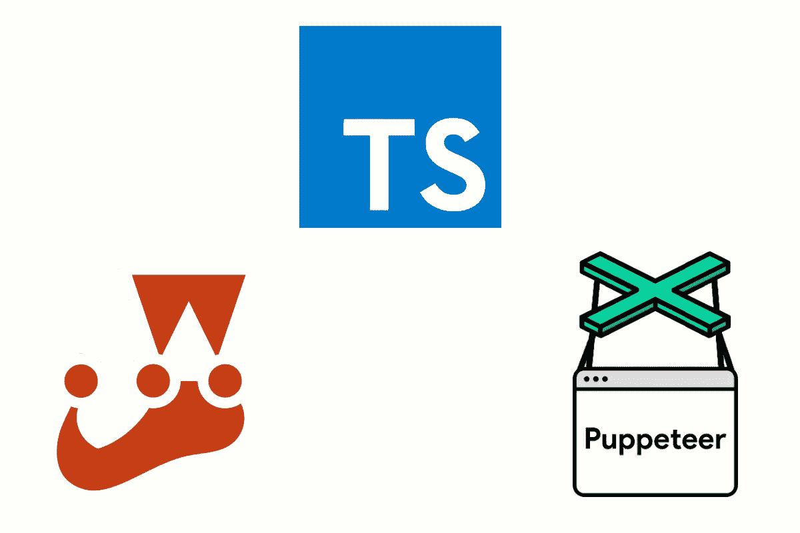

# 如何在 Jest & TypeScript 中使用木偶师

> 原文：<https://betterprogramming.pub/how-to-use-puppeteer-with-jest-typescript-530a139ffe40>

## 自动化和测试 Chrome 中的一切

多梅尼科·洛亚在 [Unsplash](https://unsplash.com?utm_source=medium&utm_medium=referral) 上拍摄的照片

端到端测试经常使用 [Selenium](https://www.seleniumhq.org/) ，它可以用来自动化任务。

然而，您可能不需要 Selenium 的重量和特性集。如果你正在寻找一个更加轻量级和易于使用的工具来自动化任务或运行端到端测试，那么[puppeter](https://developers.google.com/web/tools/puppeteer/)是一个不错的选择。

在本帖中，我们将使用:

*   **木偶师**:一个[节点](https://nodejs.org/)库，用于控制和自动化基于 [Chromium](https://www.chromium.org/) 的浏览器(例如 Google Chrome)，可用于持续集成工具，例如 [GitLab](https://gitlab.com/) 和 [Jenkins](https://jenkins.io/) 。我写了一篇[以前的文章](https://medium.com/@ali.dev/how-to-setup-chrome-headless-on-gitlab-ci-with-puppeteer-docker-fbb562cbaee1)关于用于端到端测试的木偶师。
*   [**Jest**](https://jestjs.io/) :一个壮观的测试运行器，用于编写和执行用 JavaScript 或 [TypeScript](https://www.typescriptlang.org/) 编写的测试。和 Node.js 以及流行的前端框架玩的很好，比如 [Angular](https://angular.io/) 和 [React](https://reactjs.org/) 。我已经在[之前的文章](https://itnext.io/how-to-use-jest-in-angular-aka-make-unit-testing-great-again-e4be2d2e92d1)中写过关于 Angular 的笑话。
*   **TypeScript**:JavaScript 的一个超集，它增加了静态类型和其他漂亮的特性。像 [IntelliJ](https://www.jetbrains.com/idea/) 和 [Visual Studio Code](https://code.visualstudio.com/) 这样的流行 ide 对 TypeScript 有很大的支持，这改善了开发人员的体验。

所有这些库都是受欢迎的开源项目，由知名软件公司(谷歌、脸书和微软)维护，这意味着这些工具不会很快用完。

在这篇文章的最后，我们应该有一个可以可靠地运行测试或自动化任务的项目，它是在 Chromium 浏览器中用 TypeScript 编写的。

# 如何设置 Jest、木偶师和打字稿

1.  安装`[TypeScript](https://www.npmjs.com/package/typescript)`。
2.  创建一个`[tsconfig.json](https://www.typescriptlang.org/docs/handbook/tsconfig-json.html)`文件(TypeScript 可以为您完成这项工作)。
3.  安装`[Jest](https://www.npmjs.com/package/jest)`及其型号`[@types/jest](https://www.npmjs.com/package/@types/jest)`。
4.  安装`[Puppeteer](https://www.npmjs.com/package/puppeteer)`及其型号`[@types/puppeteer](https://www.npmjs.com/package/@types/puppeteer)`。这将下载一个版本的铬。如果你已经有 Chrome，不需要下载，可以用`[puppeteer-core](https://www.npmjs.com/package/puppeteer-core)`。
5.  安装`[jest-puppeteer](https://www.npmjs.com/package/jest-puppeteer)`预设。这使事情对你来说更容易，因为它大大减少了设置。
6.  安装`[@types/jest-environment-puppeteer](https://www.npmjs.com/package/@types/jest-environment-puppeteer)`以在您的测试中拥有正确的类型脚本支持。
7.  创建一个`[jest.config.js](https://jestjs.io/docs/en/configuration)`。它应该使用`jest-puppeteer`预置。
8.  创建一个`jest-puppeteer.config.js`。你可以使用这个文件来设置自定义的 Chrome 选项(比如在非 headless 模式下运行)。
9.  创建您的测试。API 或端到端测试应该放在一个专用的测试目录中，并且在文件名中包含单词`spec`或`test`。如果没有找到您的测试，您可以在`jest.config.js`中定制`[testMatch](https://jestjs.io/docs/en/configuration#testmatch-array-string)`。
10.  运行测试:`jest --runInBand`。`[runInBand](https://jestjs.io/docs/en/cli#runinband)`将禁用并行测试执行，这对于运行 API 或端到端测试是可行的。
11.  可选:如果您需要在所有测试开始之前或之后执行任务，您可以使用 Jest `[globalSetup](https://jestjs.io/docs/en/configuration#globalsetup-string)` / `[globalTeardown](https://jestjs.io/docs/en/configuration#globalteardown-string)`。如果这样做，您需要自己调用`globalSetup` / `globalTeardown`，由`jest-puppeteer`完成(例如，当测试完成时关闭浏览器)。

# 结论

谢谢你能走到这一步。如您所见，连接 Jest、Puppeteer 和 TypeScript 需要几个步骤。一旦设置完成，你可以实现很多。

感谢阅读！