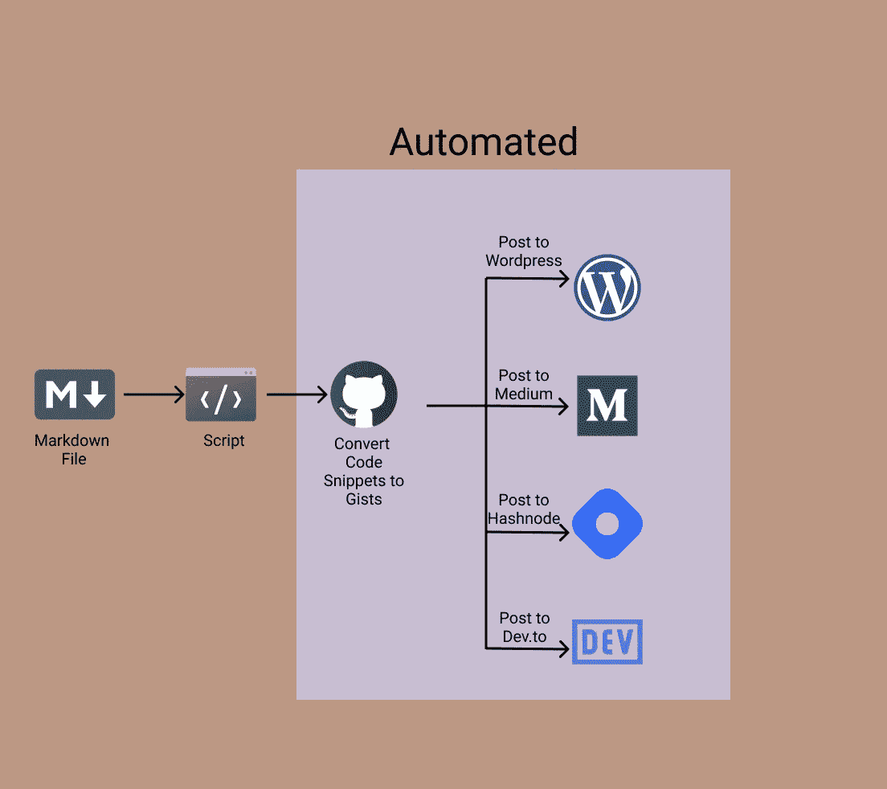

# 如何使用 Python 在流行的博客网站上发帖

> 原文：<https://betterprogramming.pub/how-to-use-python-to-post-on-popular-blogging-websites-bae27407335f>

## 创建一次；多次发布。使用 Python 自动化手动工作



显示自动化流程的屏幕截图

在本文中，我们将使用 Python 来自动化以下任务:

*   为代码片段创建 gists
*   将 gists 嵌入到对 WordPress、Medium、Dev.to 和 Hashnode 有不同要求的文章中
*   在 WordPress 上发布文章
*   用 WordPress 规范链接在媒体上发布文章
*   用 WordPress 规范链接在 Dev.to 上发布文章
*   用 WordPress 规范链接在 Hashnode 上发布文章

本质上，我们将使用 Python 来自动交叉发布到多个网站。我们将使用各种 API 来完成上述任务。

你可以在我的 GitHub repo 里找到所有的代码[。](https://github.com/rahulbanerjee26/Automate_Cross_Poster)

# 设置项目

首先，为项目创建一个新文件夹:

```
mkdir crossPoster
cd crossPoster
```

接下来，创建一个虚拟环境并激活它，如下所示:

```
python3 -m venv venvsource venv/bin/activate
```

安装所需的库，如下所示:

```
pip3 install requests, Markdown, python-dotenv
```

在根目录下创建一个名为`.env`的文件。这将用于存储您的所有凭据。您还需要一个测试降价文件，以便能够交叉发布。在本教程中，我将假设所有的图像都有公共 URL，并且不是从本地文件加载的。

# 1️.如何使用 GitHub API 为代码片段创建 Gists

在继续之前，我们需要一个 GitHub 令牌。前往[您的开发者设置令牌页面](https://github.com/settings/tokens)获取您的 GitHub 令牌。创建令牌时，确保选中“创建要点”选项。这允许您使用 GitHub 令牌创建 gists。复制令牌并将其保存在您的。环境文件。

```
GITHUB_TOKEN = "YOUR_GITHUB_TOKEN"
```

首先，我们需要编写一个函数来从 markdown 文件中获取所有代码片段。我们将使用正则表达式模式来获取代码片段块。现在，忽略函数“getSnippetName”假设它返回一个由文件名和实际代码组成的元组。如果代码片段有语言“bash”，我们忽略它。您可以扩展要忽略的语言列表。

我们将假设用户将以注释开始他们的代码片段，并且注释将具有要点的名称(基本上类似于上面的代码片段)。如果没有提供这样的注释，gist 将有一个默认的名称，例如，`index.js`代表 JavaScript 文件，`init.py`代表 Python 文件。现在，让我们看看`getSnippetName`功能:

它在代码片段的第一行搜索注释。如果有注释，它会从第一行提取文件名。如果没有注释，它使用字典返回默认文件名。您可以扩展代码以支持其他语言的注释。

现在我们有了一个元组数组。元组中的第一个元素是要点的名称，第二个元素是要点的内容。我们可以用这个来创作我们的 gists。

我们将向以下端点发出 post 请求:

```
[https://api.github.com/gists](https://api.github.com/gists)
```

如果希望创建的 gists 是私有的，可以将参数“public”设置为`False`。该函数将返回创建的 gists 的所有 URL。

现在，我们需要用相关的 gist URLs 替换 markdown 文件中的代码片段。Medium、WordPress、Dev.to 和 Hashnode 有不同的格式来嵌入 gists，所以让我们为此创建一个字典。它看起来是这样的:

每个 lambda 函数将接受 gist URL 作为参数，并返回相应的 embed 元素。替换代码片段的逻辑类似于获取所有代码片段的逻辑。它看起来是这样的:

我们保留一个计数器来跟踪哪个代码片段对应于哪个 gist URL。因为我们在创建 gists 时忽略了“bash ”,所以我们将计数器增加了`1`,而没有实际替换任何东西。在所有其他情况下，我们在“计数器”索引处用 gist URL 替换代码片段，并将计数器递增`1`。这个函数将为 WordPress、Medium、Dev.to 和 Hashnode 创建新文件。

检查下面的代码片段，它使用了上面创建的函数。它将为出现在`index.md`中的代码片段创建 public gists，并为 WordPress、Medium 等创建一个 markdown。

# 2️.如何使用 WordPress API 创建文章

你可以在这里找到[文档](https://developer.wordpress.org/rest-api/using-the-rest-api/global-parameters/)。

你必须安装一个插件来为你的帐户生成一个应用程序密码。搜索插件[应用密码](https://wordpress.org/plugins/application-passwords/)，并安装。安装好之后，进入你的`Users>Profile`。应该有一个叫`Application Passwords`的选项和一个到`Add new application password`的按钮。给它一个名称，并创建一个新的应用程序密码。复制新密码。

更新您的。环境文件

```
WP_USERNAME = "YOUR ADMIN USERNAME"
WP_PASSWORD = "YOUR NEW APPLICATION PASSWORD"
```

你的 WordPress 用户名显示在`Users>Profile`中。

我们将创建一个类来发布到 WordPress。WordPress API 端点的格式如下:

```
{Your Website Domain}/wp-json/wp/v2/{route}
```

查看下面创建该类的代码片段:

现在，我们将不得不添加一些方法到这个类中，这些方法将用于发布到 WordPress。

第一种方法将用于上传我们的封面图片或标题图片到 WordPress。

它有三个输入:图像路径、可选文本和图像标题。必须向以下端点发出 post 请求:

```
{Your Website Domain}/wp-json/wp/v2/media
```

响应将有一个名为`id`的字段。这将在我们发布文章时使用。它将有另一个名为`jetpack_featured_media_url`的字段，包含图像的 URL。

接下来，我们需要一个方法来为我们的文章创建标签 id。看起来是这样的:

它有一个输入—标签列表。对于每个标签，它将尝试创建一个新标签。响应要么包含新创建的标签的 id。如果标签已经存在，响应将包含现有的标签 id。我们将组合 id 并返回它们。

也可以为类别创建类似的函数。

最后，我们将添加一个方法来发布到 WordPress。

函数逻辑本身非常简单，让我们看看将要添加到 post 请求中的 JSON 数据:

*   `title`:你文章的标题字符串
*   `content`:HTML 格式的文章内容。(我将向您展示如何将您的 markdown 文件转换为 HTML)
*   `status`:字符串“发布”或“草稿”，取决于你是否想把你的文章作为草稿发布
*   `categories`:由`get_category_ids`方法返回的类别 id
*   `tags`:由`get_category_ids`方法返回的标签 id
*   `featured_media`:由`upload_media`方法返回的封面/页眉图像的 ID

为了将你的 markdown 文件转换成 HTML，我们将使用一个名为`markdown`的库:

```
pip3 install Markdown
```

我们需要编写下面的助手函数来完成转换。代码如下:

以下是`wordpress class`的使用示例:

如果您正在发布草稿，您可以创建一个新变量来存储 post slug。文章链接是文章发表后的链接。该段应该出现在响应对象中。

# 3️.如何使用 Medium API 创建帖子

这部分我们将使用 Medium 的 REST API。你可以在这里找到文档。

要获取您的访问令牌，请转到您的[简档设置](https://medium.com/me/settings)并转到`Integration Tokens`。输入描述，然后单击“获取集成令牌”按钮。

将令牌保存在您的中。环境文件。

```
MEDIUM_TOKEN = "Your Meidum Token"
```

类似于我们为 WordPress 创建的类，我们也将为 Medium 创建一个类。

现在让我们定义一下`getUserID`方法。

这只是向下面的端点发出一个 GET 请求，并返回您的用户 ID。注意:这与您的用户名不同。

```
[https://api.medium.com/v1/me](https://api.medium.com/v1/me)
```

现在，我们可以添加方法来创建一个中等职位。代码如下:

让我们看看添加到 post 请求中的 JSON 数据。

*   你文章的标题
*   `content`:HTML 格式的文章内容
*   `publishStatus`:字符串“草稿”、“已发布”或“未列出”
*   `contentFormat`:在我们的例子中，这将是“HTML”
*   `tags`:文章标签的字符串列表。
*   `notifyFollowers`:布尔值
*   `canonicalUrl`:如果适用，规范的 URL。在我的例子中，我将把它设置为 WordPress 文章的 URL。

现在，让我们来看看这个类的一个示例用法:

# 4️.如何使用 Dev.to API 创建帖子

Dev.to 实现非常相似，我不打算详细介绍。您可以在这里找到您的令牌。滚动到底部以生成令牌并更新您的。环境文件。

```
DEVTO_TOKEN = "GCP1itdmDAmVzfTjEQRRnnFc"
```

你可以在这里找到文档

下面显示了 dev.to 类:

对于 dev.to，我们不需要将 markdown 文件转换成 HTML。我们可以直接使用降价内容。

# 5️.如何使用 Hashnode API 创建帖子

hashnode 有一个 GraphQL API，我花了相当多的时间才弄清楚正确的查询以及如何发出正确的请求。您应该能够直接使用本节中显示的代码片段。你可以在这里生成你的令牌[。](https://hashnode.com/settings/developer)

你可以在这里玩他们的 API。

下面是`Hashnode`类的实现:

如果您不熟悉 GraphQL，可以尝试在他们的 API 游乐场中使用该 API。让我们看看传递给查询的一些变量:

*   `title`:你文章的标题。
*   `content`:你的文章内容在 markdown。类似于 dev.to，不需要转换成 HTML。
*   `publicationID`:这是一个必需的参数。如果您不将其添加到您的查询中，您的文章将不会列在您的个人资料下，但仍会被发布。它将在`hashnode.com`下，而不是你的个人博客或账户。要查找您的出版物 ID，请转到您的仪表板并从 URL 复制它。

```
https://hashnode.com/{YOUR PUBLICATION ID}/dashboard
```

*   `tags`:标签列表
*   `canonicalUrl`:文章的规范 URL
*   `hideFromHashnodeFeed`:API 不支持张贴草稿(或者至少我找不到张贴草稿的方法)。将`hideFromHashnodeFeed`设置为`True`会发布文章，但它不会显示在其他任何人的订阅源上。您也可以在 hashnode 编辑器中进行切换。

# 未来的改进

您可以在 repo 中的这个[文件中找到所有上述类创建“自动化管道”的示例用法。](https://github.com/rahulbanerjee26/Automate_Cross_Poster/blob/main/sample.py)

您可以将此视为自动化流程的概念验证。它显然没有涵盖所有用例。你可以随意克隆和编辑回购协议。以下是一些可以改进的地方:

*   对本地图像的支持——逻辑应该类似于代码片段如何转换成 gists。既可以使用现有的 API，也可以使用像 Imgur 这样的新 API
*   扩展它，自动将你的文章分享到各种子网站或 Twitter 上
*   添加对其他博客编辑器的支持

请在评论中告诉我你是否觉得这篇文章有用，或者你是否对可以自动化、改进的特性有任何建议。

```
**Want to Connect?**Find me on LinkedIn at [https://www.linkedin.com/in/rahulbanerjee2699/](https://www.linkedin.com/in/rahulbanerjee2699/)This article was originally posted on [https://www.realpythonproject.com/how-to-use-python-to-post-on-popular-blogging-websites/](https://www.realpythonproject.com/how-to-use-python-to-post-on-popular-blogging-websites/)
```