# 使用 Python 来增强您的日常工作

> 原文：<https://betterprogramming.pub/how-to-use-python-to-power-up-your-day-job-c6cd835a7c92>

## 有两个真实的例子


照片由[马里乌斯·马萨拉尔](https://unsplash.com/@marius?utm_source=unsplash&utm_medium=referral&utm_content=creditCopyText)在 [Unsplash](https://unsplash.com/s/photos/digital?utm_source=unsplash&utm_medium=referral&utm_content=creditCopyText) 拍摄

我们不可能都是程序员——那会是一个奇怪的世界！然而，*任何人*都可以从一些基本的编程技能中受益。

从事会计工作？编程可以帮助你。你是设计师吗？编程可以帮助你。你用电脑工作吗？编程可以帮助你。

你看到这里的模式了吗？如果你不止一次地做过同样的任务，一个有用的程序就等着被制作出来。

当你在开发环境中编写代码时，你必须遵循一定的规则。这很好，因为它使程序保持有序，并使项目中的每个人都容易处理代码。

但是当你写你自己的程序时，你不需要遵守所有这些规则。它可能只是一小段代码，帮助你完成只有你才能完成的小任务。一些公司有一个开发部门，他们会清理你的代码，让其他人也可以使用。可能别人一直在抱怨你刚刚解决的问题。

## 我们将编写以下工具

*   **一个发布工具**。发布工作文件，让你的同事知道工作已经完成，他们可以拿起文件。
*   **一个摄取工具**。保管好从客户那里收到的文件，并将其内容分发给你的同事。

*注意:我在本文中使用的是 Python 3.8，但是大多数编程语言都可以完成类似的任务。您还可以看到这两个工具的编码水平略有不同。第一个有点手动，而第二个试图更加专业*

# 一个发布工具

发布工具会将一个`work-file`提升为一个`publish-file`。一个`publish-file`是一个准备好供下一个部门使用的文件。它的出版表明你已经完成了这项工作(至少现在是这样)。该文件位于预定义的位置，其名称不会改变。因此，当您发布新版本时，任何以此为参考的软件都将获得自动更新。

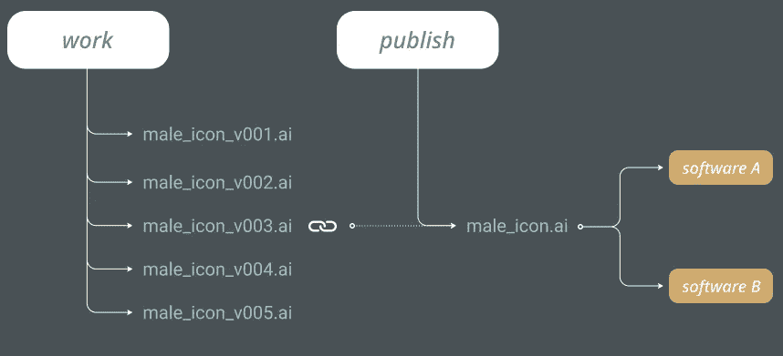

v003 是我们当前发布的版本。员工可以开始使用发布的“male_icon.ai”文件

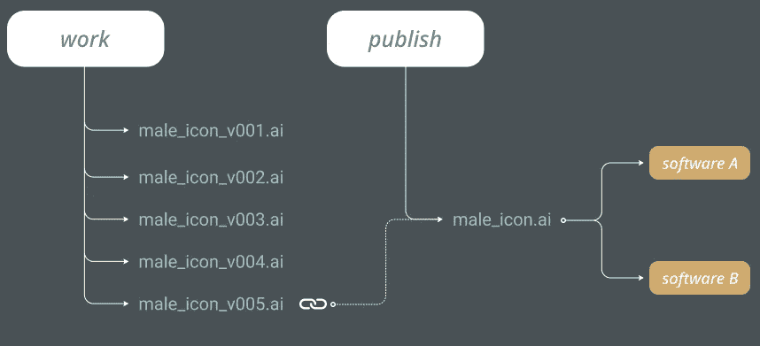

v005 是我们当前发布的版本。使用该文件的软件也将获得更新

我所在行业的大多数公司——VFX 和动画公司——都有自己的出版系统。如果你是一名自由职业者，或者是另一家随机公司的员工，你可能还没有这方面的设置。

在下面的示例中，您正在为公司的 Q1 报表处理各种文件。可以是图标，可以是文案，可以是任何东西。重要的是，当你的文件准备好了，你就发布它们。

当您完成工作后，演示者将接管并在他们的演示中使用您发布的文件。如果演示者需要问你文件存储在哪里，你已经失败了。但是如果你发布了这些文件，下一个排队的人总是知道去哪里找。

假设这是您的文件和文件夹结构:

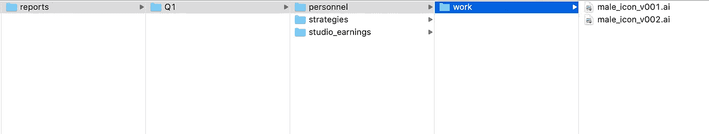

潜在文件夹结构

它看起来很有条理，文件也很好地保存在各自的文件夹中。现在，让我们确保演示者确切地知道他们将为演示选取哪个`male_icon ai`文件。

这就是我们要找的:


史蒂文刚刚被公共汽车撞了！没问题，我知道他发布的文件在哪里…

## **我们来码！**

该程序使用两个程序:`publish()`和`main()`

## **发布(搜索路径):**

发布过程要求搜索路径。在此路径中，它将查找工作文件夹和发布文件夹。如果工作文件夹存在并且包含任何文件，我们就可以开始工作了。

`scan_search_path`使用 list comprehension 来存储我们传递的项目文件夹中的所有文件夹。

`if folder.name != ‘.DS_Store’`确保我们不会列出`.DS_Store`文件夹——我们只对“真正的”文件夹感兴趣。

`scan_work_files`做类似的事情。它列出了不以`.`开头的文件。

发布文件是指向最新工作文件的符号链接。我们假设我们的命名约定有 v001、v002、v003 等。这样，最新的数字就是我们工作的最新文件——我们想要发布的文件。您还可以使用日期戳来查找最新的文件，或者让用户定义要发布的文件。

但是，发布文件不需要版本号，如果您将该文件引用到另一个软件中，它会自动更新。这意味着发布的文件可以在星期一符号链接到 v001，在星期五符号链接到 v005。发布的文件名不会改变。

这段代码从发布的文件中删除了版本控制:

```
file_data = list(os.path.splitext(source_file))
remove_version = '_'.join(file_data[0].split('_')[0:-1])
publish_file = remove_version + file_data[1]
```

## **main()**

因为这是帮助您发布文件的内部脚本，所以在本例中,`root_path`是硬编码的(查看下面的摄取工具以获得处理文件路径的更好方法)。

`root_path`是我们的项目文件夹。我们想浏览里面的文件夹，看看我们想发布什么。

我们为自己创建了一个菜单，这样我们就可以发布我们想要的内容。该代码只是寻找可用的文件夹，并要求输入。我们可以使用逗号来选择多个文件夹。`split_input`会处理好的

我们在 for 循环中使用`index+1`的原因是提供一个从`1`到多个的选项。`0`作为第一指数不是一般用户会认为正常的东西。

我们在实际发布时使用正确的索引:

```
publish(root_path+folder_list[int(current_folder)-1])
```

这是与用户的互动

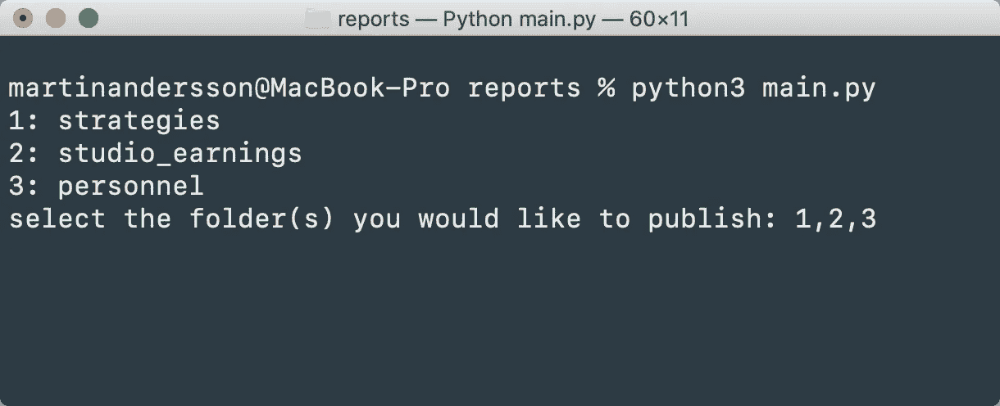

创建一份菜单对他人和你自己都有好处

此外，我会考虑这个项目的更多选项

*   添加一个元数据文件，该文件共享发布的时间戳和以前使用过的文件的历史记录，以防出现文件损坏等错误。
*   一个选择所有文件夹的选项，这样你可以一次发布所有内容。

# 摄取工具

摄取工具处理您从工作室外部收到的文件。必须有人对客户文件进行解包，并确保它们位于磁盘上的正确位置，以便所有参与该项目的员工使用。

如果您负责客户端文件，您会希望有一个可以解压缩文件并很好地对它们进行排序的设置。这些文件通常会被压缩。然后解压 zip 文件(我们的例子只支持 zip)并对材料进行分类。

让我们假设我们仍然为同一家公司工作。这是客户将发送给我们的内容:

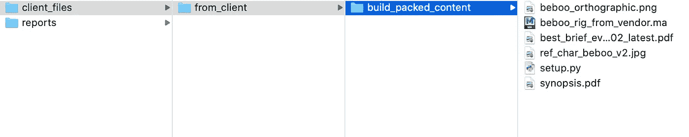

这些文件将以 zip 文件的形式发送给我们。

有些文件我们马上就能认出来。PDF 文件是包含书面信息的文档。客户简报、便条或我们想看的东西。然后，我们有几个图像文件，最后，我们有一个 Autodesk Maya 文件。ma)和一个我们需要运行的 Python 脚本。

是时候拉上拉链，假装是客户寄来的了:

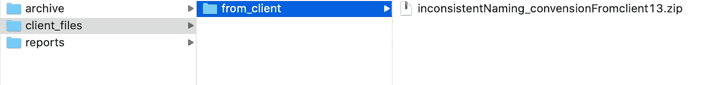

这还差不多！

下面是我们的伪代码，解释了我们需要采取的步骤:

```
# unzip the file# create a folder for the current date# create folders for the files based on pre-defined filetypes# move the files into the correct folders# archive the zip file
```

下面是最终的代码:

这是一个大问题，我们有很多要讨论的。让我们直接开始吧。

## **def 摄取()**

如果我们先看最后一个过程，我们可以看到我们定义了工作文件:`sys.argv[1]`

这意味着我们可以从终端执行 Python 脚本，并在执行程序时直接传递参数。您应该很快就会发现，这是一种比硬编码根路径更好的方法，就像我们对发布工具所做的那样。

假设我们决定将 Python 文件放在`from_client`文件夹之外:

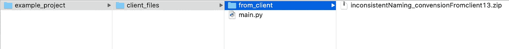

现在我们可以从终端运行这个命令来执行来自`client_files`文件夹的脚本，并处理所选的 zip 文件(`from_client/inconsistentNaming_convensionFromclient13.zip`)

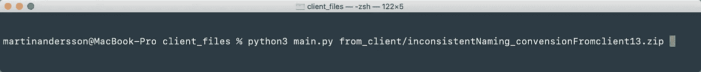

我们使用`sys.argv[1]`的原因是`[0]`是为文件名本身保留的。

```
import sysprint(sys.argv[0])
>>> main.py
```

这样，我们可以将文件的任何路径作为参数传递给程序，非常聪明！

当我们将想要处理的文件存储在变量中时，我们就可以开始执行各种命令了。`working_file`是传递给几个函数和程序的。我们将逐一查看它们。

## **解包 _ 文件(zipfile)**

这很简单。我们向过程传递一个文件名，这样它就可以解包我们的文件。

它使用了一些支持功能，`get_directory_path(zipfile)`、`get_date_path()`和`get_file_path()`。让我们看看这些。

*   `get_directory_path(filename)` **:** 这个函数返回我们正在工作的路径。
*   `get_date_path()` : 该函数使用`datetime`库返回今天的日期。
*   `get_file_path()`:该函数返回文件的完整路径，包括文件名。

## 定义位置文件(输入文件)

既然 zip 文件已经解压缩，我们可以开始处理我们的文件了。我们希望根据文件类型放置文件，因此我们需要定义这些文件。我们不希望扩展名是文件夹名，因为我们需要几个文件类型存在于同一个文件夹中。

这个过程还使用了几个支持函数。当我们列出文件和文件夹时，我们同时使用`list_files_in_dir(scan_dir)`和`list_folders_in_dir(scan_dir)`。

## 定义目录中的列表文件夹(扫描目录)

列表理解用于返回您选择的文件夹中的文件夹。在我们的例子中，它是我们将文件解压到的文件夹。

## 定义目录中的文件列表(扫描目录)

你能猜到这是干什么的吗？

现在我们已经将所有的文件和文件夹存储在变量中，我们开始循环排序它们。所有文件都被发送到分类文件夹中。如果你特别注意，你可以看到在文件循环内部有一个字典循环。这是因为我们使用字典来定义我们的文件类型。我们使用函数`filetype()`来获得文件应该放在哪里的概述。

## 定义文件类型()

Filetype 是一种保持对排序控制的聪明方法。在这个例子中，我选择定义三个类别:`documents`、`project_files`、*、*和`reference`、*。*

您可以随时更新该词典，根据自己的喜好添加或删除扩展名。我排除了。txt 向您展示我们对未列出的文件做了什么。

清理完所有定义的文件类型后，程序会查看剩余的文件。这些文件没有归宿，所以它们都被发送到一个叫做`_not_defined`的文件夹(或者你想叫它什么都行。)

在我的例子中，我还想从解包中删除 __MACOSX 文件夹，所以我添加了代码的最后一部分来处理这个问题。这是可选的，会因您的软件而异

## def archive_zip(zipfile)

在这种情况下，我希望在解压缩 zip 文件时对其进行归档。这样，它总是可以转到存档文件夹删除或备份原始 zip 文件。

这里没有魔法。它使用前面的函数来处理路径，并去掉参数中的任何破折号，将文件移动到正确的位置。

你可能已经注意到我正在用`os.rename()`移动文件。你也可以用`shutil.move()`来做同样的事情。`os.rename()`需要目标和源中的文件名，而`shutil.move()`不需要移动到的路径中的文件名。我没有个人偏好，我只是想试试`os.rename()`

## 定义创建元文件(源文件)

我经常谈论元文件，但我很少向您展示它的任何代码。这样做的目的是将我们解压文件的文件名添加到一个文本文件中。这样我们可以回溯文件的来源。记住，我们存档了我们的 zip 文件来清理东西。

我们使用`os.path.join()`来创建我们想要使用的路径。然后我们使用`with`创建一个文件。比起`file.open` → `do things` → `file.close`，我更喜欢这种方法，因为动作以一种更漂亮的方式封装，并且它在完成后自动关闭。对我来说，这更像是 Pythonic 式的:

```
with open (full_path , 'w') as metafile:
    metafile.write(source_file)
```

反馈在终端中为用户打印出来

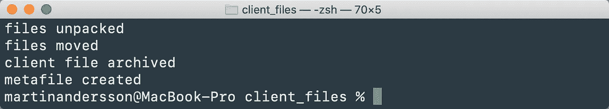

我们刚刚从一个 zip 文件变成了这个:

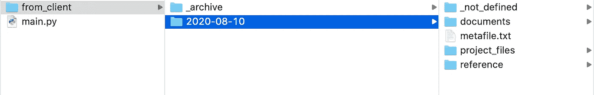

文件被很好地解包和分类

文件被送到他们家里:

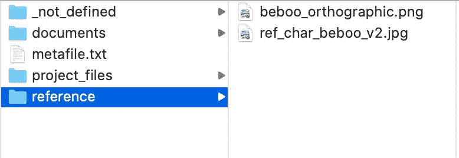

png 和 jpg 都位于此文件夹中，因为它们都被定义为引用

元文件包含 zip 的名称:

```
from_client/inconsistentNaming_convensionFromclient13.zip
```

拍拍自己的肩膀——你刚刚花了一个小时编写了一个程序，它将为你节省几天时间。当前版本不支持解压缩目录中的文件夹，但是现在你应该能够写入了。

# 最后

编程是一件你可以让别人为你做的事情，或者你可以学着做一些小的片段——就像我们今天看到的。

如果你自己写程序，它会当场发生。当你面对一个问题时，你会马上去做，你不会被任何规则所束缚。但是要小心——这也意味着你会犯开发团队不会犯的错误。仅仅因为你不知道你在做什么而删除整个项目是非常可怕的！

大多数时候你会感觉很好，你的工作日会感觉好很多。相信我，我已经数周没工作了！

一件很酷的事情是，从理论上讲，你现在是一名职业程序员，因为你写程序是有报酬的——很酷的奖励！

谢谢你的时间。