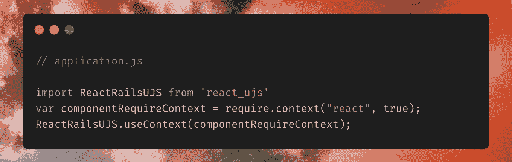
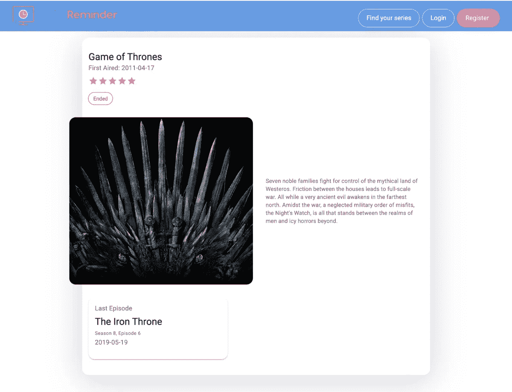
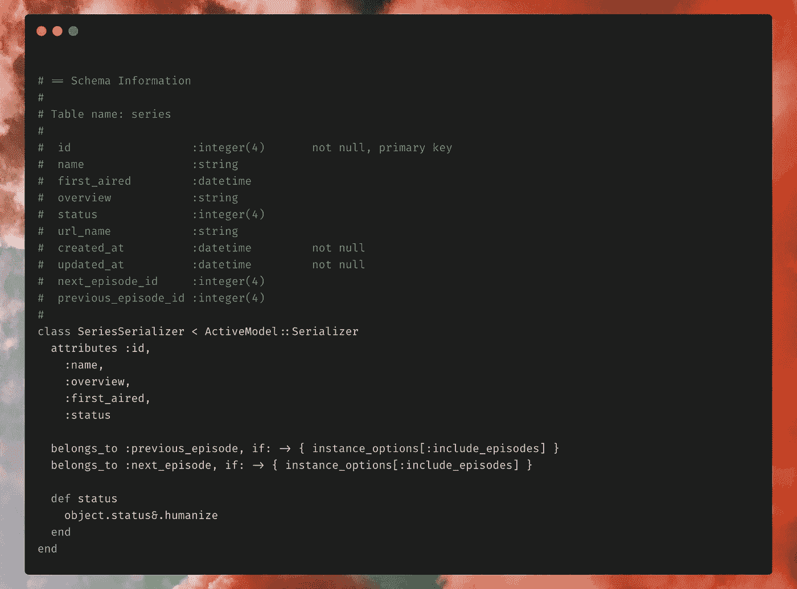
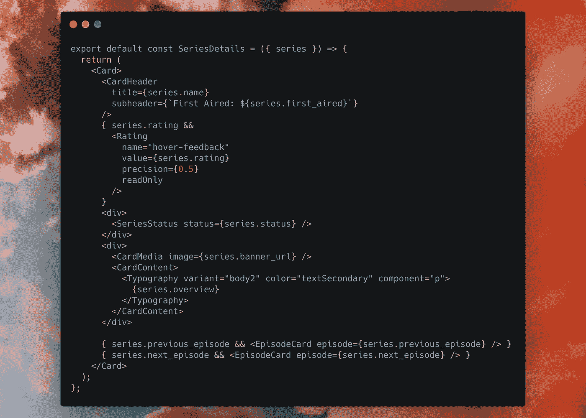

# 如何在 Rails 6 中使用 React 组件

> 原文：<https://betterprogramming.pub/how-to-use-react-components-in-rails-6-7ef460894be>

## 构建混合 React/Rails web 应用程序的简单方法


照片由[路德维希·沃伦多夫](https://unsplash.com/@wallendorff?utm_source=medium&utm_medium=referral)在 [Unsplash](https://unsplash.com?utm_source=medium&utm_medium=referral) 上拍摄。

虽然网上有很多关于在 Rails 中设置 react 的文章(我推荐使用 webpacker 和 [react_rails](https://github.com/reactjs/react-rails) )，但我想更深入地探索一些可以用 React 做的伟大事情。

让我们开始吧。

如果你还没有为开发设置 Ruby on Rails，看看这个教程。

我们将假设您已经安装了 webpacker 和 react_rails。在您的包条目文件中，您将需要启用 React 组件的渲染:



在`app/javascript`文件夹下，我为 React 组件做了一个单独的文件夹。下面是我使用的文件结构图:

```
.├── app│   ├─── controllers│   └─── javascript│       ├── packs│           └─── application.js│       └── react│           └─── SeriesDetails│               └─── index.js
```

在 Rails 方面，react_rails 附带了一个用于呈现组件的视图助手。下面的屏幕截图是使用以下命令生成的:

```
= react_component 'SeriesDetails/index', { series: SeriesSerializer.new(@series).as_json }
```



让我们来分解一下:

*   `react_component`视图助手有三个参数:组件名(记住，在`application.js`中，我们在`/react`中定义了组件的上下文)，要传递给组件的属性(这就是为什么散列值必须是字符串)，第三个参数是包装器的 HTML 选项。
*   我们使用[activemodelserializer](https://github.com/rails-api/active_model_serializers)来定义如何将 series 对象序列化为 JSON 对象。



*有兴趣知道这个文件顶部的评论是什么吗？这是 Rails 中的注释宝石。* [*查看*](https://medium.com/the-side-hustler/how-to-use-the-annotate-gem-c44bfec97d03) *。*

让我们直接进入组件。序列化的序列将作为参数传递给这个组件，所以我们不需要反序列化 JSON 对象。



为简洁起见，省略了样式。让我们来分解一下:

*   我们使用 Material-UI 中的基本卡片组件。
*   `SeriesStatus`组件使用 Material-UI 中的[芯片组件。](https://material-ui.com/components/chips/)
*   `EpisodeCard`组件使用简单卡组件。

# 结论

我们已经介绍了在 Rails 中设置 React 组件的基础知识。如果你想要更高级的用例，看看这篇文章[。](https://medium.com/the-side-hustler/how-to-use-react-components-in-active-admin-184ff63b378d)

今天到此为止。感谢阅读。如果您有任何建议，请随时联系我们。