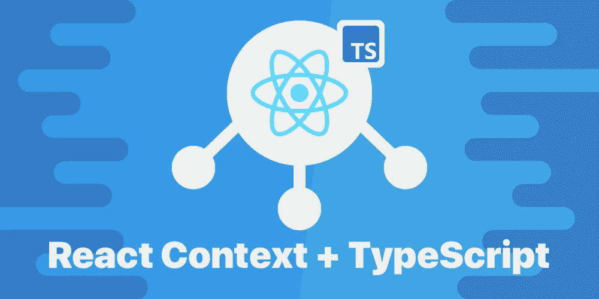

# React Context + TypeScript —最简单的方法

> 原文：<https://betterprogramming.pub/how-to-use-react-context-with-typescript-the-easy-way-2ed1010f6e84>

## …为什么 React 开发人员教你不正确

作者图片

前几天，我在将一个 JavaScript 组件转换为 TypeScript 时，在一个特定的领域被绊倒了:React Context。

不要误解我的意思，我以前已经使用过无数次 TypeScript，但是由于某种原因，我不喜欢上下文。于是我回到画板，查了一些教程，再次熟悉了一下语境。

也就是说，在这个过程中，我发现了一些清晰的思维模式和捷径，可以让理解毫不费力地对背景做出反应。

这就是我今天在这里分享的内容。

# React 上下文的 3 个部分—可视化

我喜欢认为上下文需要三个部分。官方文档称之为创建上下文、生产者和消费者。但是，我认为用一个普通变量的比喻来思考这些更容易。

## 上下文创建者

把这看作是你的上下文的`let myContext;`。它只是创建上下文，但还没有填充任何功能。

## 上下文提供者

将此视为您的上下文的`myContext = [];`。它用一些合理的默认数据填充已经创建的上下文。

## 上下文消费者

把这个想象成`myContext = [1,2,3];`或者`let myData = myContext[0]`。这是您操作上下文或读取其数据的地方(因此命名为“消费者”)。

# 但是…这些打字有个问题。

因为我们在创建上下文时使用了`undefined`,所以当我们消费它时没有得到好的类型。

每当我们想使用上下文时，我们必须先检查它是否未定义。这意味着如果我们想使用`addTodo`功能，例如，我们必须做`myContext ? myContext.addTodo() : null`。

然而，这种检查有点奇怪，因为如果我们正确地使用上下文，它应该永远不会是未定义的。如果使用上下文的组件在提供者之下，那么上下文将总是具有从提供者传入的默认值。

我们需要给它一个默认类型`undefined`的唯一原因是如果消费者不是提供者的子组件。

我经常看到的一种解决方案是给出更具体的字段级默认值，如下所示:

注意，我们没有将整个上下文默认设置为`undefined`，而是为每个字段插入了合理的默认值。在某种意义上，这更好，因为我们不再需要在消费时检查它是否是未定义的。

这意味着代码是这样的:

可以变成这样:

用我们的变量比喻再次解释这一点:在我们做`let myContext`之前，然后是`myContext = []`。这很糟糕，因为您将上下文的类型从`undefined`更改为数组。一般来说，你不希望在数据被创建后改变它的数据类型。

有了这种更好的输入方式，现在我们马上开始做`let myContext = []`。我相信你能明白为什么这样更好。

# 但是这带来了另一个问题…

如果我们做了这样的改变，消费上下文就更容易了，但是如果你有一个组件试图消费非子上下文呢？

这个组件现在将调用`myContext.addTodo()`函数，但是它没有做它所期望的，而是静静地失败了。那是因为函数只是长这样:`() => {}`。

现在您可能会想:“好吧，您可以更改该功能，将一些内容记录到控制台中”。你可以。但是，如果它不是一个函数，而是一个字段呢？在这种情况下，您将如何登录控制台？

所以，这并不能解决根本问题。

潜在的问题是 React 允许组件使用上下文，即使它们不是子组件(尽管它不做任何事情)。此外，由于 React 在这种情况下不会显式抛出错误，这使得键入内容和管理它们的依赖关系变得更加困难。

我个人认为 React 的设计很糟糕。

如果一个组件试图使用一个上下文，但不是该上下文的子组件，那么*应该*抛出一个显式错误并崩溃。这是因为只有在用户出错时才会出现这种情况。要么是开发人员把组件移到了不应该的地方，要么是他们把上下文移到了不应该的地方。

按照 React 目前的处理方式，除非您对组件进行了功能测试，否则您不会知道事情无法正常工作。如果它抛出了一个显式错误，您将立即知道页面何时呈现。

这也带来了最后一个问题:

> 无论如何，为什么我必须为我的上下文显式定义类型？难道不应该根据传递给提供者的内容自动生成类型吗？

嘣！如果你是这样想的，你是对的。但遗憾的是，因为上下文在任何组件(不仅仅是子组件)中都是可访问的，所以你必须提供默认值以防它不是子组件。这是因为两种情况中的一种会发生。要么:

(a)上下文消费者是提供者的子代→它将使用传递给提供者的数据。

(b)上下文消费者不是提供者的子代→它将使用传递给`createContext`函数的默认数据。

# 那么，我们如何解决这两个问题呢？

好事是我们可以在这里一举两得。解决方案很简单:

> 如果一个组件试图使用一个上下文并且不是提供者的子组件，抛出一个显式错误。

如果这样做，那么上下文可以根据传递给提供者的属性自动类型化。这是因为没有组件会使用提供者范围之外的上下文，所以我们不需要为那个用例添加类型。

此外，我们现在可以明确保证组件没有被意外地移动到它需要的上下文之外。

所以，这就对了。一石二鸟！

实现这一点也不难。您可以在当前上下文 API 的基础上实现这个附加功能，或者使用一个库。我个人使用一个名为 [unstated-next](https://github.com/jamiebuilds/unstated-next) 的库来为我实现这些更改。这个库有 40 行长，为上下文添加了正确的输入和显式错误。

如果你想了解这个库的更多信息，我实际上写了一篇关于使用 unstated-next 进行状态管理的文章[。否则，可以随意使用本文中讨论的任何方法来键入组件。它们都是有效的解决方案，只是有你想要知道的权衡和风险。](/the-container-pattern-for-better-state-management-in-react-9351fe4381d1)