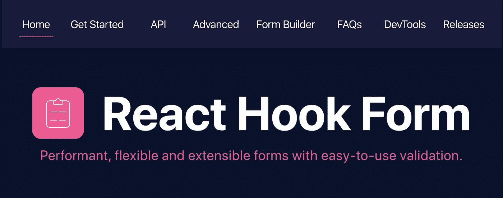
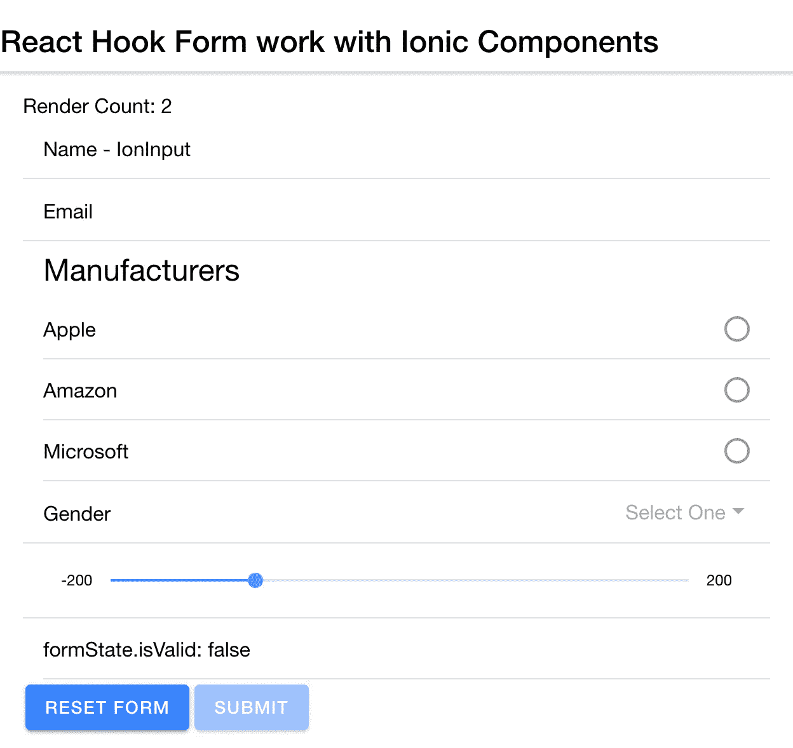

# 如何使用带有离子反应成分的反应钩形式

> 原文：<https://betterprogramming.pub/how-to-use-react-hook-form-with-ionic-react-components-eaa4426d8a2d>

## 具有易于使用的验证的高性能、灵活且可扩展的表单



设置 [react-hook-form](https://react-hook-form.com/) 非常简单。您可以通过导入库并用任何默认值定义和初始化定制钩子来开始。

我不打算涵盖太多的基础知识，因为在该库的网站上提供了大量的文档: [*入门*](https://react-hook-form.com/get-started) 。

然后我们有了提交表单时调用的`onSubmit`函数。

我们使用这个函数来添加表单中的值。最后，我们还使用`useState`在本地管理状态。我们将本地状态信息存储在变量`data`中。

接下来，我们设置在应用程序中使用的表单；请注意表格中`onSubmit`功能的使用。

我已经排除了许多用于设置页面、页眉等的 [Ionic](https://ionicframework.com/) 组件，但是它们包含在本文末尾提供的项目和示例代码中。

Ionic framework 的大多数组件的基本功能都可以正常工作，跟踪错误并提供值，而没有你在 React 应用程序中经常看到的所有额外的`useState`样板代码。

然而，为了获得验证和错误检查的真正好处，您需要将 Ionic 组件包装在`[Controller](https://react-hook-form.com/get-started#ControlledInput)` [组件](https://react-hook-form.com/get-started#ControlledInput)中

在深入研究控制包装的离子组件之前，我们将从 react-hook-form 的基本用法开始。

如您所见，简单的`IonInput`是开箱即用的。

我创建了一个简单的错误处理函数来显示来自 react-hook-form 钩子的错误消息。该库创建一个对象作为钩子的一部分，该钩子保存验证表单时生成的错误。

# 使用 React-Hook 表单控件组件

必须使用`Controller`组件的一个例子是使用`IonRange`组件。

使用`IonRange`组件需要使用 react-hook-form `controller`属性并监听`onIonChange`事件以从`IonRange`组件获得适当的值。

我们使用`selected.detail.value`属性从`IonRange`组件获取值，并适当地设置对象。我们让 react-hook-form 钩子从那里处理它。

最后，为了从库和 Ionic framework 的 web 组件中获得真正的价值，我建议您把所有东西都包装起来。

我根据需要挑选要包装的特定组件，当我检查表单的状态以查看表单是否有效时，我就完全投入了。

# 将所有内容包装在控件中



对于像`IonRadioGroup`这样更复杂的控件，我们不能像上面那样包装组件名，因为这里有子组件。

# 错误检查和表单验证

为了验证表单的内容，您可以访问`formState`对象来确定表单是否有效。您可以使用它来保持提交按钮被禁用。

```
<IonButton type="submit" disabled={formState.isValid === false}>
  submit
</IonButton>
```

如果您要检查错误，您设置`mode`用于检查错误的时间...

```
const { control, register, handleSubmit, errors, formState } = useForm({
  defaultValues: initialValues,
  mode : 'onChange' // when the values change... check for errors
});
```

或者，我们可以检查字段何时模糊，更多信息可在 [react-form-hooks 文档](https://react-hook-form.com/get-started#Handleerrors)中获得。

```
const { control, register, handleSubmit, errors, formState } = useForm({
  defaultValues: initialValues,
  mode : 'onBlur' // when the you blur... check for errors
});
```

# 录像

# 源代码/项目

*   在 [CodeSandbox.io](https://codesandbox.io/s/react-hook-form-ionic-input-components-29zur) 上的项目。
*   项目的[脚本版本的 GitHub 要点。](https://gist.github.com/aaronksaunders/86251779cbefacf4c9397ea6a574809a#file-app-tsx)