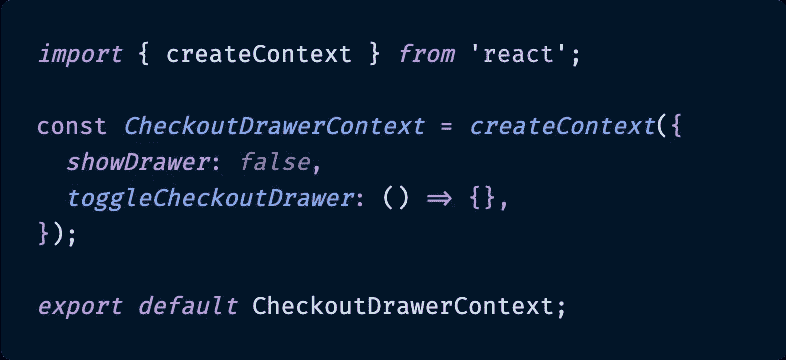
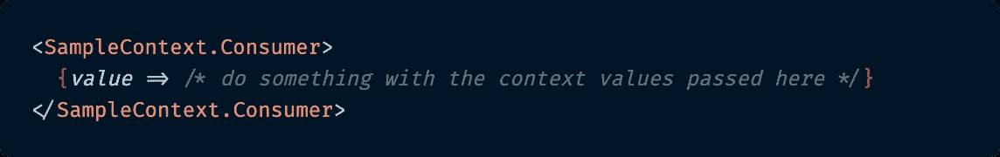
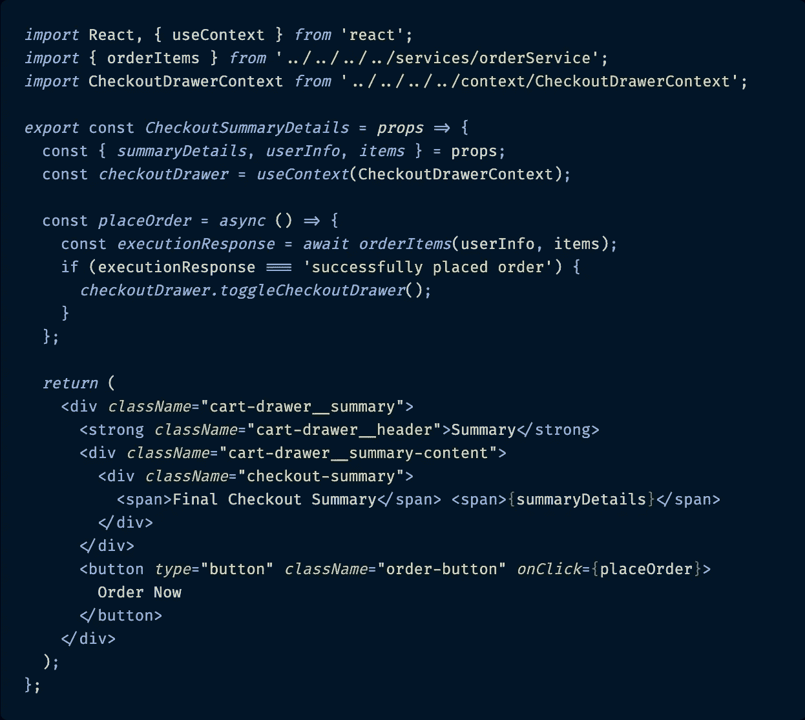

# 如何有效地使用 React 的上下文 API 和 useContext()钩子

> 原文：<https://betterprogramming.pub/how-to-use-reacts-context-api-and-usecontext-hooks-effectively-ed98ad9343b6>

## 避免在上下文的帮助下对你的价值观和你的职能进行正确的操练

罗伯特·霍维克在 Unsplash[上的照片](https://unsplash.com/s/photos/pattern?utm_source=unsplash&utm_medium=referral&utm_content=creditCopyText)

# 介绍

在最近的工作中，由于 React 的单向数据流，我遇到了一个很常见的问题。在我的应用程序的高层，我打开了一个收银台抽屉，里面有用户选择订购的商品。在另一个低得多的组件中，我触发了这些项目的实际订购。订单成功下达后，我需要抽屉再次自动滑动关闭。

跟了这么远？

由于我的应用程序的结帐过程的性质，在顶层的父组件(控制抽屉的打开或关闭状态)和抽屉内部的最终结帐子组件(包含下订单的按钮和功能)之间有很多中间组件。

我想避免传递包含抽屉打开状态的属性和在订单成功时将抽屉状态切换回关闭状态的函数。其他中间组件都不需要这些道具，所以这是不需要的额外代码。然后我想到了一个解决方案——我听说过一些，但从来没有必要使用的东西:React 的上下文。

今天，我将详细介绍我是如何使用 React 的上下文 API 和它的`useContext`钩子来避免对应用程序状态和函数的钻取。

# 什么是 React 上下文 API？

在我深入讨论如何使用 [**上下文 API**](https://reactjs.org/docs/context.html) 来帮助解决我的问题之前，让我回顾一下它是什么以及它是如何工作的，这样我们就都在同一页上了。

React 的官方文档在定义上下文方面做得最好:

> 上下文提供了一种通过组件树传递数据的方式，而不必在每一层手动向下传递属性。— [反应文件](https://reactjs.org/docs/context.html#when-to-use-context)

正如我在上面描述的场景中一样，React 中的上下文是一种在应用程序中传递数据的方式，而不必通过树的每一层显式地传递属性。这是 React 内置的共享数据的方式，对于 React 组件树来说，这可以被认为是“全局的”。

这方面的例子包括用户认证、首选语言或主题设置，或者像我的情况一样，子组件告诉父组件将其状态从打开的抽屉切换到关闭的抽屉。

是的，您也可以使用 Redux 进行这种全局状态管理，但是设置 Redux、它的动作和调度程序所需的样板代码对于一组相对简单的任务来说是一项额外的工作。另外，随着 [**React 钩子**](https://reactjs.org/docs/hooks-intro.html) 的发布，使用上下文变得比以前更容易了。

好了，我们来谈谈如何使用 React 的上下文 API 和`useContext`钩子。我将向您展示如何使用我自己的应用程序来实现它。

# 使用反应上下文

使用上下文 API 的第一件事是创建一个新的上下文文件。这个文件将保存任何数据变量、默认值和函数，当使用这个上下文时，您可能希望这些数据变量、默认值和函数对组件是可访问的。

## [React.createContext()](https://reactjs.org/docs/context.html#reactcreatecontext)

在您的上下文文件中，我倾向于将其命名为`XyzContext.js`，您将**创建`Context`的这个特定实例**，并为其分配一些默认值。

这是我为应用程序创建的上下文文件，用于处理收银台的可见性及其可见性状态的切换。

`createContext()`

`CheckoutDrawerContext.js`

实际上，使用上下文没什么大不了的，设置起来很简单。

从我的代码片段中可以看出，创建一个新的上下文实例相对容易。在我的例子中，在调用了`creatContext()`之后，我只是传入了一个对象，该对象带有一个关于收银台抽屉当前可见性的布尔值(`showDrawer`，默认初始值为`false`)和一个名为`toggleCheckoutDrawer()`的空箭头函数，该函数最终将与一个实际影响抽屉显示或隐藏状态的函数相关联。

当 React 呈现订阅这个`CheckoutDrawerContext`对象的组件时，它将从树中它上面最匹配的`Provider`中读取当前上下文值。

缺省值参数(在本例中为`showDrawer`)是*唯一的*，当一个组件在树中没有匹配的提供者时使用。

既然已经创建了这个特定的上下文实例，我们可以继续在我的应用程序中使用它。

## [上下文。提供者](https://reactjs.org/docs/context.html#contextprovider)及其值

每个上下文对象都带有一个提供者 React 组件，该组件允许消费组件订阅上下文更改。

提供者接受传递给消费组件的`value`属性，这些组件是该提供者的后代。同样值得一提的是，一个提供商可以连接到许多消费者。如果多个孩子需要知道或更改提供者的值，他们可以。

`Context.Provider`

`**Cart.js**`

同样，向现有组件添加上下文提供者相当容易，只需包装 JSX 并从组件传递必要的值或函数。

对于我的应用程序，在我的顶层`Cart`组件中，我将我的`CartDrawer`组件包装在我的`CheckoutDrawerContext.Provider`中。我这样做是因为嵌套在`CartDrawer`中的子组件需要访问`CheckoutDrawerContext.Provider`包含的值——在本例中，是`showDrawer`状态和`toggleCheckoutDrawer()`函数。

至于传递给`CheckoutDrawerContext.Provider`的值，我也是在`Cart.js`文件中创建的。

`Context.Provider`值

`Cart.js`

这些功能一点都不复杂。但它们是我需要传递给上下文的。提供程序，这样它就知道在应用程序中触发同名占位符值时该做什么。

使用`Cart`组件文件中的`useState()` React 钩子，我用它的 setter 创建了一个名为`showDrawer`的状态来更新布尔值`setShowDrawer`。我创建了一个名为`toggleCheckoutDrawer()`的函数，它将把`showDrawer`的值转换成它的相反值。

我在我的`CheckoutDrawerContext`文件中用默认值命名了这些状态和函数，但是这并不是必须的——我这样做只是为了方便自己。

好的，现在`Context.Provider`启动并运行，它有自己的值`showDrawer`和`toggleCheckoutDrawer()`。我准备好进入消费价值观部分了。

## [做出反应。消费者](https://reactjs.org/docs/context.html#contextconsumer)和[做出反应](https://reactjs.org/docs/hooks-reference.html#usecontext)

最初，当上下文第一次与 React 一起发布时，它只对有状态的、基于类的组件可用。

上下文使用者的语法类似于提供者将其添加到项目中的语法——将使用者包装在需要访问值的代码周围，如下面的示例代码所示。

`React.Consumer`样品。

`ClassBasedChildComponent.js`

这是一个基于类的上下文消费者的 JSX 看起来像什么的例子。

但是因为我的应用程序使用 React 钩子，而结帐流程是使用功能组件编写的，所以我为需要访问`CheckoutDrawerContext`的组件利用了`useContext()`钩子。在我看来，这是更干净的代码，更容易理解。

`React.useContext()`

`CheckoutSummaryDetails.js`

这是 CheckoutSummaryDetails 组件的精简版本，它使用 useContext 挂钩来切换收银台的打开或关闭。

上面的组件`CheckoutSummaryDetails.js`是我的应用程序中实际结帐的一个非常精简的版本，但是它服务于这个例子的目的。

首先，注意`CheckoutDrawerContext`被导入到这个`CheckoutSummaryDetails.js`文件中。为了实际访问这个上下文的值，我创建了一个新的常量(`checkoutDrawer`)，并将命名的上下文包装在`useContext()`钩子中。这使我能够访问`CheckoutDrawerContext`中的值。剩下的就相当简单了。

当用户单击标题为“Order Now”的按钮时，组件中的`placeOrder()`函数被触发，它触发对 API 或数据库或其他任何可能需要发送用户信息和所订购商品的地方的`orderItems()`调用。当订单发出成功信息时，通过`checkoutDrawer.toggleCheckoutDrawer()`触发关闭`CartDrawer`的组件。这将把`showDrawer`的状态切换到该组件树中更高的四或五层，从`true`回到`false`，并且`CartDrawer`组件将再次从视图中隐藏。

就是这样！React 的上下文已经阻止了不必要的属性传递*和*允许子组件更新父组件的状态。太棒了。

现在没那么难了，是吗？相信我，一旦你成功地使用了一次上下文，在许多其他地方实现它就不在话下了。

# 结论

React 的上下文 API 和`useContext` Hook 在理论上是相当容易理解的。第一次实施时，他们就不太清楚了。

但他们帮了大忙。当只有第二层和第六层子组件真正需要这些属性时，通过组件树的几层传递不需要的数据是没有帮助的。这意味着需要跟踪更多的道具，即使所有的中间组件都不需要这些数据。

是的，Redux 可以做同样的事情，但是即使是最简单的数据也需要很多额外的设置。与 Redux 不同的是，Context 是天生的 React——它已经是内置的，随时可以使用，一旦您开始使用它，它就非常直观。一开始我很犹豫要不要试试，但是一旦想通了，我就成了大粉丝。我想你也会的。

过几周再来看看——我会写更多关于 JavaScript、React、ES6 或其他与 web 开发相关的东西。

感谢阅读。我希望我已经揭开了 React 的上下文 API 和`useContext`钩子的神秘面纱，这样你就可以在你自己的 React 项目中成功地使用它。你不会后悔它使更干净的代码成为可能！

## 如果你喜欢读这篇文章，你可能也会喜欢我在《更好的编程》中的其他文章:

*   [“React Socks 和 React 响应式网页设计”](https://medium.com/better-programming/react-socks-and-responsive-web-design-with-react-63b766d000bd)
*   [“如何在 React URL 路径中传递多个路由参数](https://medium.com/better-programming/how-to-pass-multiple-route-parameters-in-a-react-url-path-4b919de0abbe)
*   [“GitHub 模板:在开发团队中形式化拉取请求的更聪明的方法](https://medium.com/better-programming/github-templates-the-smarter-way-to-formalize-pull-requests-among-development-teams-89f8d6a204f)”

# 参考资料和更多资源

*   React [上下文 API](https://reactjs.org/docs/context.html#updating-context-from-a-nested-component) 文档
*   React 钩子[使用上下文](https://reactjs.org/docs/hooks-reference.html#usecontext)文档