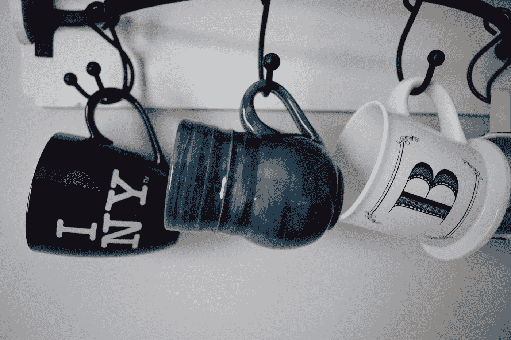

# 如何使用 React 的 useState()钩子

> 原文：<https://betterprogramming.pub/how-to-use-reacts-usestate-hook-ee0dc6da54f8>

## 从类到功能组件的状态管理



克里斯·斯科特在 [Unsplash](https://unsplash.com?utm_source=medium&utm_medium=referral) 上拍摄的照片。

[React](https://reactjs.org/) 是一个开源的 JavaScript 库，它智能地从虚拟 DOM 中分割出 DOM，并在构建 web 应用程序时带来了一种创新的状态管理方法。它遵循基于组件的架构和创新的状态管理方法。

# React 中的组件

在 React 中，组件是用一个 JavaScript 类、一个状态和一个`render`方法实现的。

但是，不建议总是使用类组件。这是相当沉重的，如果组件中有状态管理的需要，最好只使用类组件*。*

# 功能组件

当我们遇到没有状态的组件时，我们可以简单地使用功能组件来呈现它们。

下面是一个不一定有状态的欢迎消息的示例:

```
function Welcome(props){
    return <h1>Hello World</h1>;
}
```

功能组件不是类组件，所以我们没有`this`。因此，我们在组件内部直接调用`useState`钩子。

你可以通过 JSX 表达式`{props.<property>}`将道具传入功能组件并访问和读取它们，或者你可以析构道具`{prop1, prop2, prop3}`并用`{prop1}`直接调用它们。

# 使用功能组件进行状态管理

如果你正在开发一个功能组件，并且你意识到它需要添加一些状态，你不必把它转换成一个类组件。

React 使用`[useState](https://reactjs.org/docs/hooks-reference.html#usestate)`钩子在功能组件中提供简单的状态管理。

# 使用状态挂钩

让我们构建一个简单的应用程序，当你点击“关注”按钮时，它可以让你统计脸书的关注者。

`useState`钩子可以从 React 本身导入。

在上面的例子中，追随者的初始计数被传递到`useState`函数中，并被设置为初始状态。当点击“跟随”按钮时，计数增加`1`。

`useState`挂钩由三个主要部分组成:

*   状态变量
*   更新状态的函数
*   初始状态变量

初始状态是*只有* 实参可以传入`useState`钩子。

不像在类组件中，“初始状态”是一个*对象*，在函数组件中，它可以是任何东西:数字、字符串、布尔值、数组或对象。

在我们的例子中使用`useState`返回`followers`状态变量，使用`setFollowers` 函数更新状态。

这个`setFollowers` 功能类似于类组件中的`this.setState({followers: followers + 1})`。

React 记住重新渲染之间的当前值，并将最近的值提供给`setFollowers` 函数。

## 处理数字

在上面的例子中，初始计数被设置为`0`。每点击一次按钮，它就调用`setCount()`函数并加 1，从而显示按钮被点击的次数。

## 处理字符串

在上面的例子中，颜色变量的初始状态是`‘red’`。点击按钮时，按钮名称从“红色”变为“蓝色”

## 处理布尔值

在上面的例子中，每次点击按钮时，调用`setOn()`函数并否定当前状态。在初始状态设置为`false`的情况下，当点击按钮时，`setOn()`函数将`false`值取反，变为`true`(反之亦然)。

## 处理对象

在上面的例子中，记分板包含玩家 Sam 的名字和分数。点击“重新开始游戏”按钮后，Sam 的分数被重置为`0`。

## 处理数组

在上面的例子中，当点击按钮时，使用`setItems()`函数将一个新项目添加到项目数组中。您可以注意到按钮顶部的数组长度会动态变化。

要查看项目数组，请通过按 Ctrl+Shift+I 访问浏览器的控制台。

# 最佳实践

我们中的许多人在开始时都面临这个问题:“我应该使用类组件还是功能组件？”

类组件和功能组件都有它们的好处。有些人可能对这个问题有偏见。然而，如果类组件是最好的，他们就不会创建功能组件，反之亦然。那么你应该选择哪一个呢？

问你自己这个问题:这个组件有某种状态吗？

如果是这样，用类组件实现它。否则，用功能组件实现它。充分利用两者，实现更有效的应用。

# 结论

下次当你使用一个功能组件并想添加一些状态时，记住`useState`钩子！

分享知识是获取知识的唯一途径。欢迎在评论区贡献你自己的一些想法。

编码快乐！