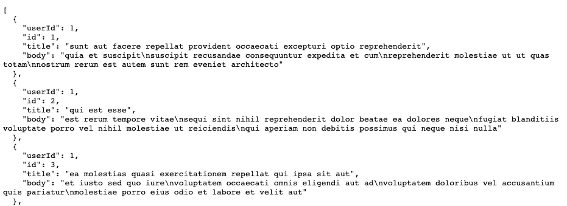

# 如何在 Android 中使用网络改造

> 原文：<https://betterprogramming.pub/how-to-use-retrofit-for-networking-in-android-for-beginners-ef6bae5ef113>

## 拨打网络电话从未如此简单


照片由 [Ludovic Toinel](https://unsplash.com/@ltoinel?utm_source=medium&utm_medium=referral) 在 [Unsplash](https://unsplash.com?utm_source=medium&utm_medium=referral) 上拍摄

# 1.添加依赖项

在您项目的`build.gradle`

```
implementation 'com.squareup.retrofit2:retrofit:2.9.0'
implementation 'com.squareup.retrofit2:converter-gson:2.9.0'
implementation 'com.google.code.gson:gson:2.8.7'
```

另外，一定要在您的`manifest.xml`中添加`INTERNET`权限

```
<uses-permission android:name="android.permission.INTERNET"/>
```

# 2.入门指南

对于我们的教程，我们将使用这个特定的[端点](https://jsonplaceholder.typicode.com/posts)。打开链接，观察它的 JSON 响应。



如果你看一看它，你会发现它是一个 POST JSON 对象的数组。

# 3.创建模型

创建我们试图在应用程序中使用的数据模型总是一个很好的实践，所以让我们开始吧。

# 4.创建网络存储库

*   在项目结构中创建一个名为“网络”的包。
*   在其中创建一个新的 Java 接口，并给它命名为`JsonPlaceHolderAPI`，这是我们试图使用的 API 的名称。
*   根据端点的数量，创建不同的方法。对我们来说，我们只是在消费 GET Posts 端点。所以我们将为它创建一个方法。

```
public interface JsonPlaceholderAPI {@GET("posts")
    Call<List<Post>> getPosts();}
```

*   注意我们在`@GET("posts")`中提到了端点后缀，这样改型将知道什么是端点。
*   我们还提到了我们期望从这个端点返回的数据类型。
*   创建好界面后，让我们继续下一步。

# 5.提出网络改造要求

*对于本教程，我们主要将逻辑放在活动中，但是在现实世界的项目中，您可以将它放在 UI 文件之外，放在一个视图模型中，您可以在那里保存 UI 的业务逻辑。*

我们将使用的导入如下:

```
import retrofit2.Call;
import retrofit2.Callback;
import retrofit2.Response;
import retrofit2.Retrofit;
import retrofit2.converter.gson.GsonConverterFactory;
```

1.  **让我们初始化改造。**

```
Retrofit retrofit = new Retrofit.Builder()
        .baseUrl("https://jsonplaceholder.typicode.com/")
        .addConverterFactory(GsonConverterFactory.*create*())
        .build();
```

请注意，我们传递的是基本 URL，而不是完整的 URL，因为接口会负责为所需的端点添加后缀。

**2。现在，让我们使用我们的网络接口。**

```
// We can't do this, guess Why? Hint: Interface
JsonPlaceholderAPI jsonPlaceholderAPI = new JsonPlaceholderAPI();// Retrofit will actually do that for you
JsonPlaceholderAPI jsonPlaceholderAPI = retrofit.create(JsonPlaceholderAPI.class);// Create the Retrofit Call using the interface method
Call<List<Post>> apiCall = jsonPlaceholderAPI.getPosts();
```

**3。现在我们必须最终执行我们的调用。**

我们可以做`apiCall.execute();`，但是它会在我们的主 UI 线程上执行我们的调用，阻塞我们的 UI。

所以我们应该在后台线程上调用 execute，为此我们必须从后台线程管理线程和更新 UI。

不要担心，翻新已经为你提供了保障。使用如下所示的`.enqueue()`操作。

# 结论

如果一切顺利，您的应用程序应该能够进行网络呼叫并无缝更新 UI。

感谢阅读！