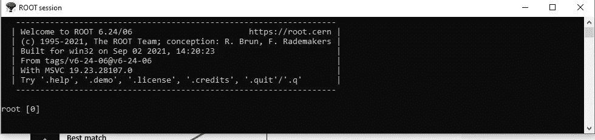

# 如何使用根 C++解释器外壳编写 C++程序

> 原文：<https://betterprogramming.pub/how-to-use-root-c-interpreter-shell-to-write-c-code-ebfd52d2642d>

## 使用根 C++解释器编写基本的 C++构造


丹尼尔·伊德里在 [Unsplash](https://unsplash.com?utm_source=medium&utm_medium=referral) 上的照片

我在 20 世纪 70 年代末上大学时学习了计算机编程。这意味着我学习的前几门编程课程使用了基于大型机的编程语言:Fortran、PL/I 和 Cobol，仅举三个例子。

直到我大学毕业并开始在 It 行业工作后，我才开始使用基于 PC 的语言，比如 BASIC，有趣的是，还有 Logo。这些语言是基于翻译的，让我感受到了和翻译一起工作的乐趣。

在过去的 23 年里，我一直在教初级计算机科学学生 C++，并且使用过各种不同的编译器，从基于 DOS 的 Borland 编译器到各种开源编译器和不同的 Microsoft C++编译器。

几个月前，我偶然发现了一些关于 CERN 正在运行的[根数据分析项目](https://root.cern/)的信息。这组计算机科学家和物理学家已经围绕 C++构建了他们的数据分析框架项目(同时也提供了对 Python 的支持，并且很快会提供对 JavaScript 的支持)，并且，为了帮助他们的用户的计算创造力，该组已经实现了一个 C++解释器。

在本文中，我将讨论这个解释器的特性，并演示如何使用这些特性来编写重要的 C++程序。在以后的文章中，我将使用这个解释器向不熟悉 C++的程序员介绍这种语言，我希望这种方式能与我学习一种基于解释器的新编程语言时的兴奋感相匹配。

# 关于根 C++解释器

根 C++解释器是 LLVM 项目的一部分。LLVM 是一个低级编译器基础设施，可以与许多编程语言的前端编译器进行交互。Clang 是 LLVM 的 C++前端编译器。

该解释器有一个 REPL(读取-求值-打印-循环)外壳，允许您单独输入 C++语句，并在输入时对它们进行求值。您也可以编写可以是独立程序或函数的宏。独立程序以 void 函数的形式输入，并在装入 shell 时执行。您还可以直接从 shell 中执行宏，而无需加载它们。我将在本文的后面演示这一切。

# 安装根和首次使用

我已经在我的 Ubuntu Virtual Box 和 Windows 笔记本电脑上安装了 ROOT。这两种安装都很容易做到。只需遵循您的环境的说明[这里](https://root.cern/install/)。

您可以通过在命令提示符下键入 root 或单击其图标来启动 ROOT。根 shell 启动时会显示一个通知，然后是命令行提示符:



如果您键入一个数字，就会返回该数字。在这里，解释器读取输入，对其进行评估(数字总是自己评估)，并打印出来:

```
root [0] 1
(int) 1
root [1]
```

请注意，shell 还会告诉您输出的数据类型(这对学习数据类型的学生很有帮助)。

现在您已经看到了如何安装和启动 ROOT，让我们更深入地了解如何使用 shell 进行计算。

# 将 ROOT 用作计算器

让我们从将 shell 用作计算器开始。以下是我做的一些计算:

```
root [0] 1+1
(int) 2
root [1] 2.2 * 3.1
(double) 6.8200000
root [2] TMath::Pi() * (5 * 5)
(double) 78.539816
root [4] TMath::Factorial(5)
(double) 120.00000
```

TMath 库有大量的数学和三角函数可供您使用。这里不胜枚举，所以我将为这个库写一篇完整文章。

# 在 Shell 中编写 C++语句

让我们从声明和定义几个变量开始:

```
root [0] int x = 100
(int) 100
root [1] double y = 2.345
(double) 2.3450000
root [2] string s = "Hello, world!"
(std::string &) "Hello, world!"
root [3] bool flag = true
(bool) true
```

请注意，您不必在使用根 shell 的语句末尾使用分号，但是如果您愿意，您可以这样做。还要注意，shell 让您知道在评估语句时使用的数据类型。我们在前面的部分也看到了这一点，我在那里进行了一些计算。

所有常见的算术和关系运算符都可以通过 shell 获得。

以下是一些例子:

```
root [0] int x = 25
(int) 25
root [1] x++
(int) 25
root [2] std::cout << x
26(std::basic_ostream &) @0x64ad5a40
root [3] x += 2
(int) 28
root [4] --x
(int) 27
root [5] x > 30
(bool) false
root [6] x <= 30
(bool) true
root [7]
```

也可以编写更复杂的语句，例如 an `if-else`:

```
root [8] if (x < 30) { std::cout << x << " is less than 30."; }
else { std::cout << x << " is not less than 30."; }
```

对于像这样的语句，必须在需要分号的地方包含分号，否则 shell 将抛出一条错误消息:

```
root [7] if (x < 30) { std::cout << x << " is less than 30."; } else { std::cout << x << " is not less than 30." }
ROOT_prompt_7:1:104: error: expected ';' after expression
if (x < 30) { std::cout << x << " is less than 30."; } else { std::cout << x << " is not less than 30." }
```

现在让我们来看一些`for`和`whil` e 语句的例子:

```
root [0] int fact = 1;
root [1] for (int i = 5; i >= 1; i--) { fact *= i; } std::cout << fact << endl;
120
root [2] fact = 1;
root [3] int num = 5;
root [4] while (num >= 1) { fact *= num; num--; } std::cout << fact << endl;
120
root [5]
```

正如您在这个例子中看到的，您可以使用`cout`对象来执行输出。您也可以使用`cin`接收输入:

```
root [0] int fact = 1
(int) 1
root [1] std::cout << "Compute factorial for: "
Compute factorial for: (std::basic_ostream<char, std::char_traits<char> > &) @0x77090b68
root [2] int num
(int) 0
root [3] cin >> num
5
(std::basic_istream &) @0x77090d20
root [4] for (int i = num; i >= 1; i--) { fact *= i; } std::cout << fact << endl
120
```

# 在根中定义函数

您可以在 shell 中定义函数。你可以用传统的方法或者创建一个 lambda 函数。以下是使用标准技术定义的阶乘函数:

```
root [0] double factorial(int n) { int f = 1; for (int i = n; i >= 1; i--) { f *= i; } return f; }
root [1] factorial(5)
(double) 120.00000
root [2] int num
(int) 0
root [3] std::cout << "Compute factorial of? "
Compute factorial of? (std::basic_ostream<char, std::char_traits<char> > &) @0x64ad5a40
root [4] cin >> num
4
(std::basic_istream &) @0x64ad5928
root [5] factorial(num)
(double) 24.000000
root [6]
```

这是用λ定义的同一个函数:

```
root [0] auto factorial = [] (int n) { int f = 1; for (int i = n; i >= 1; i--) { f *= i; } return f; }
((lambda) &) @0x3d80020
root [1] std::cout << factorial(5) << endl;
120
root [2] factorial(4)
(int) 24
root [3]
```

# 定义和使用数组

我们可以在根 shell 中定义和使用数组。这里有一个例子:

```
root [0] const int NUM_GRADES = 5;
root [1] int grades[] = {81, 77, 85, 91, 72};
root [2] int total = 0;
root [3] for (int i = 0; i < NUM_GRADES; i++) { total += grades[i]; }
root [4] double average = static_cast<double>(total) / NUM_GRADES;
root [5] std::cout << "The average grade: " << average << endl;
The average grade: 81.2
root [6]
```

让我们通过创建一个返回数组平均值的函数来改进这个程序:

```
root [0] double array_avg(int arr[], int num_elements) {
root (cont'ed, cancel with .@) [1]int total = 0;
root (cont'ed, cancel with .@) [2]for (int i = 0; i < num_elements; i++) { total += arr[i]; }
root (cont'ed, cancel with .@) [3]return static_cast<double>(total) / num_elements;
root (cont'ed, cancel with .@) [4]}
root [5] const int NUM_GRADES = 5;
root [6] int grades[] = {91, 88, 77, 88, 71};
root [7] double average = array_avg(grades, NUM_GRADES);
root [8] std::cout << "The average grade: " << average << endl;
The average grade: 83
root [9]
```

# 最后的想法

在本文中，我向您介绍了如何使用根 C++解释器外壳编写一些基本的 C++结构。在我的下一篇文章中，我将扩展 shell 的使用，包括定义和使用类，以及使用标准模板库的各种元素。

感谢阅读。