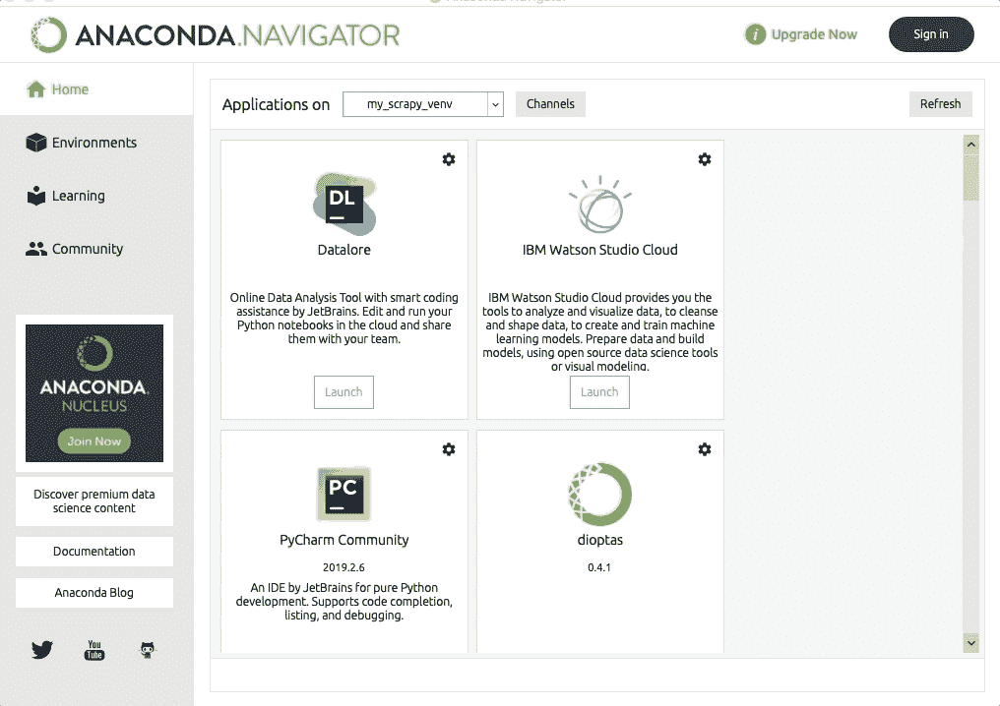
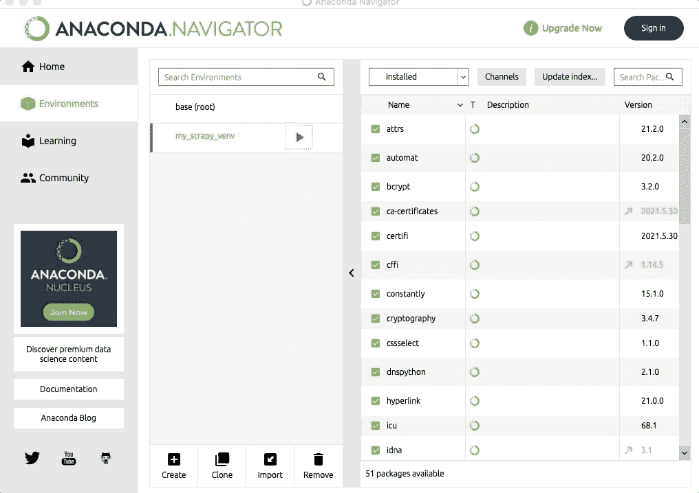
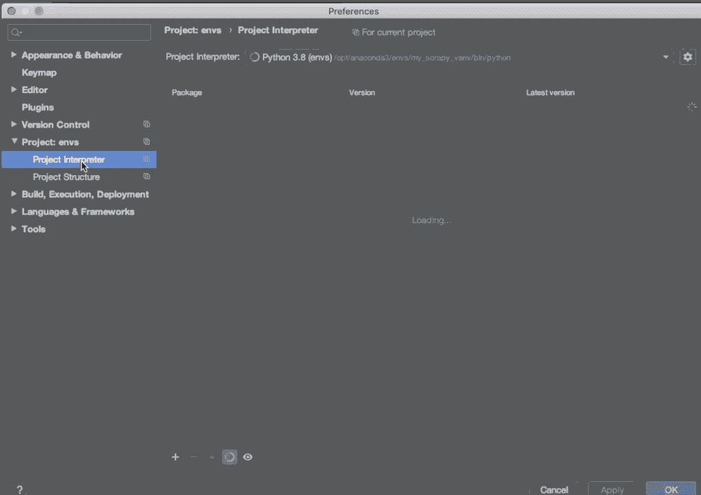
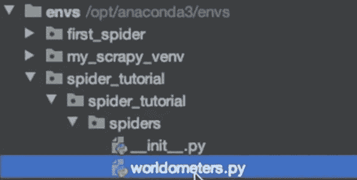
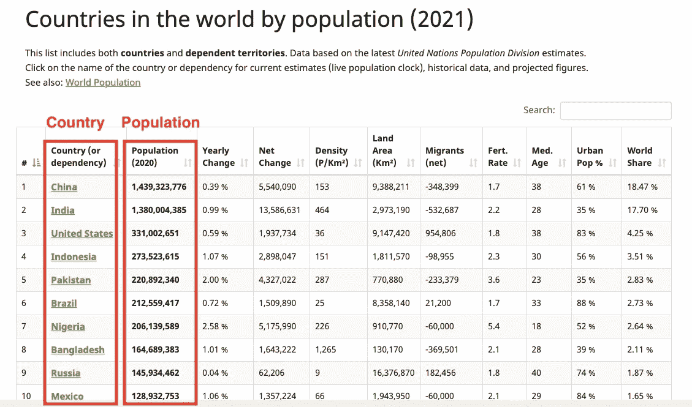
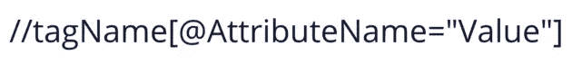
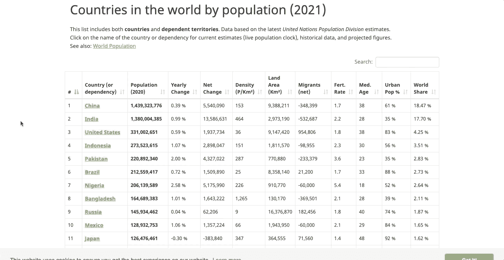
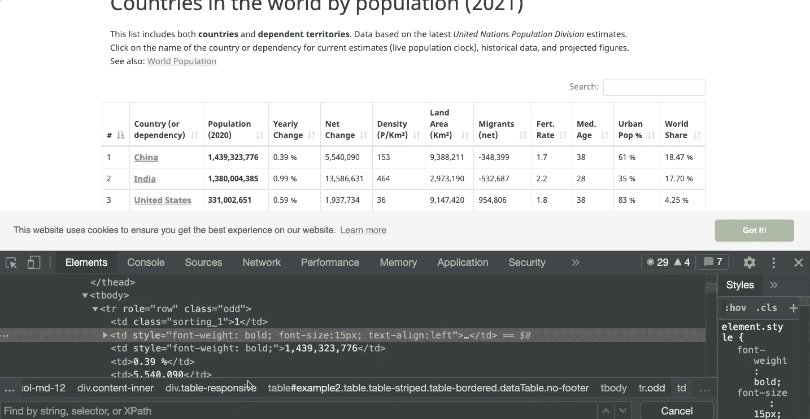
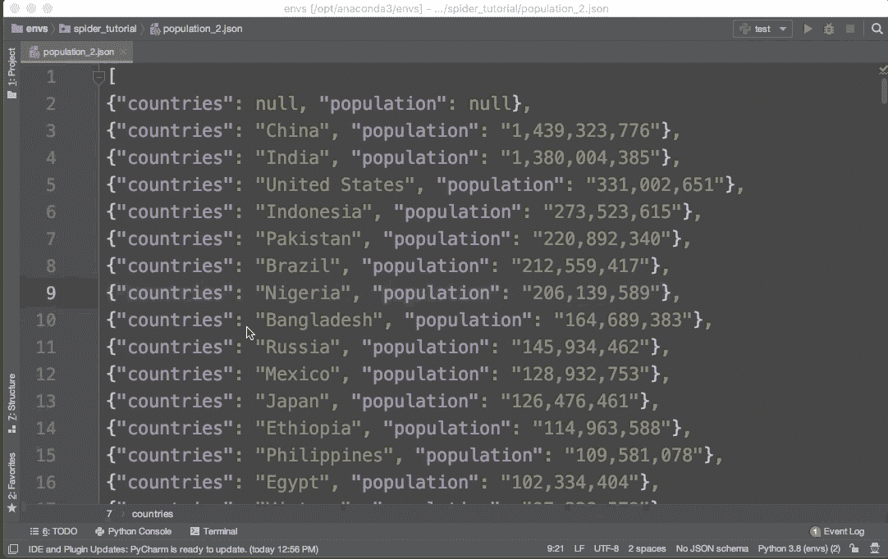

# 如何使用 Scrapy 为您的数据科学项目构建数据集

> 原文：<https://betterprogramming.pub/how-to-use-scrapy-to-build-a-dataset-for-your-data-science-project-8f04af3548c6>

## 使用 Scrapy 蜘蛛从 Python 网站中提取数据


若昂·路易斯在 [Unsplash](https://unsplash.com?utm_source=medium&utm_medium=referral) 上的照片

数据科学项目的第一步是数据收集。现实世界的数据可以在无数网站上获得，但有些网站没有 API，即使有 API，免费版本也会限制请求的数量，除非你升级。这就是网络抓取派上用场的时候了。网络抓取是使用机器人从网站提取公共数据的过程。

为了抓取网站和建立我们自己的数据集，我们将使用 Scrapy，这是 Python 中最强大和最快的 web 抓取框架。这也是 Scrapy 优于美汤、硒等其他刮痧工具的原因。

在本指南中，我们将构建一个人口数据集，这将为我们提供一个如何使用 Scrapy 创建数据集的好主意。本指南将涵盖以下主题:

```
**Table of Contents** 1\. [Setup](#1615)
 - [Installing Anaconda](#ad9b)
 - [Installing Scrapy](#0618)
 - [Open conda environment within an IDE and add Python interpreter](#6f9d)
2\. [Creating a Project and Spider](#deef)
 - [The Template](#c932)
3\. [Building The Spider](#f42a)
 - [Finding elements with Scrapy](#c524)
 - [Locating the rows](#52da)
 - [Locating the country names and population](#547e)
 - [Returning Elements](#ff49)
 - [Run the spider and export data to CSV or JSON File](#a035)
```

# 设置

## 安装 Anaconda

根据 Scrapy 的[官方文档](https://docs.scrapy.org/en/latest/intro/install.html)，建议通过 Anaconda 或者 Miniconda 安装 Scrapy，所以去这个[链接](https://www.anaconda.com/)下载 Anaconda 然后安装。

然后打开 Anaconda 并创建一个新环境。为此，请按照下列步骤操作:



之后，选择 Python 版本并点击绿色的“创建”按钮。然后应该安装虚拟环境。

## 安装刮刀

现在是时候安装 Scrapy 了。首先，打开一个终端(单击您环境中的 play 按钮，然后单击“打开终端”)。



终端将激活虚拟环境“my_scrapy_venv”。从现在开始，每次我们运行一个命令，确保这个环境出现在括号中。

要安装 Scrapy，请在终端上运行以下命令。

```
(my_scrapy_venv) conda install -c conda-forge scrapy
```

## 在 IDE 中打开 conda 环境，并添加 Python 解释器

如果您使用的是 IDE 或文本编辑器，您必须执行一些额外的步骤来设置我们创建的这个新的虚拟环境。在我的例子中，我使用 Pycharm，所以我必须遵循下面的步骤(对于大多数文本编辑器来说应该是类似的)

首先，在终端上运行以下命令:

```
(my_scrapy_venv) which Python # mac
(my_scrapy_venv) where Python # windows
```

输出将是 Python 解释器所在的路径。我的如下:

```
/opt/anaconda3/**envs**/my_scrapy_venv/bin/python
```

复制这个路径，然后打开 Pycharm。然后点击“创建新项目”下面的“打开”按钮将弹出一个窗口，然后找到“envs”文件夹并打开它。这个文件夹包含我们在 Anaconda 中创建的虚拟环境。

在这之后，您应该会看到 Pycharm 中的“envs”文件夹。现在转到 Windows 上的设置(文件->设置)或 Mac 上的首选项(Pycharm ->首选项)。然后转到“Project: envs”中的“Project Interpreter ”,按照以下步骤选择 Python 解释器:



如您所见，我们粘贴了之前获得的 Python 解释器的路径。然后我们点击“Ok”按钮来添加解释器。

最后，确保你安装了`protego`来开始使用 Scrapy。为此，请在终端中运行命令:

```
(my_scrapy_venv) conda install -c conda-forge protego
```

# 创建项目和蜘蛛

要开始使用 Scrapy，我们需要创建一个项目。让我们创建一个名为`spider_tutorial`的项目。为此，我们使用如下所示的`startproject`命令:

```
(my_scrapy_venv) scrapy startproject spider_tutorial
```

然后我们必须创造一只蜘蛛。不像美汤或硒，我们不是从 Scrapy 上的空白脚本开始，而是使用模板。在这种情况下，我们将使用`scrapy.Spider`模板。

在我们创建一个蜘蛛之前，我们必须将目录更改为项目的文件夹。

```
(my_scrapy_venv) cd spider_tutorial
```

为了创建一个蜘蛛，我们使用`genspider`命令。我们还需要为蜘蛛添加一个独特的名称和我们希望抓取的网站的链接。

```
(my_scrapy_venv) scrapy genspider worldometers www.worldometers.info/world-population/population-by-country
```

注意这个链接没有 HTTP 协议，因为 Scrapy 是自动添加的。此外，删除链接末尾的任何附加斜杠(/)。

在这之后，一个名为`worldometers`的新蜘蛛应该被创建在`spider_tutorial`文件夹内的蜘蛛文件夹中。打开脚本，你会看到用 Scrapy 刮一个网站的基本模板。

目录树应该如下图所示:



现在一切都准备好了，开始刮刮。

## 模板

`worldometers`蜘蛛包含如下所示的模板:

请注意，我对模板做了一些小的修改。首先，`allowed_domains` 变量应该只包含网站的根，而 start_urls 包含我们想要抓取的确切链接。此外，手动将“s”添加到 HTTP 协议中，以防“s”出现在网站的链接中。

在解析方法中，我们将使用响应对象来查找元素，然后提取我们想要的数据。让我们在下一节看看如何做到这一点。

# 建造蜘蛛

在构建蜘蛛之前，先来看看我们要刮的[网站](https://www.worldometers.info/world-population/population-by-country/)。



我们要提取的两个字段是国家和人口列。然后，我们将这个数据集导出到一个 CSV 或 JSON 文件。

## 用 Scrapy 寻找元素

Scrapy 允许我们用 XPath 和 CSS 选择器找到元素。在本指南中，我们将使用 XPath。为了构建 XPath，我们需要标记名、属性名和属性值。所有这些都是 HTML 元素，所以如果你不熟悉 HTML，可以看看这个 [HTML 网页抓取指南](https://medium.com/geekculture/web-scraping-cheat-sheet-2021-python-for-web-scraping-cad1540ce21c#2773)。

让我们来看看 XPath 语法:



## 定位行

当抓取表中的数据时，通常首先定位行。

要获取行后面的 HTML 元素，请转到页面并检查任何一行。您应该看到一个`tr`标记(`tr`代表表格行)。这是我们将要用来构建 XPath 的元素。

在这种特殊情况下，标记名应该足以构建它的 XPath。XPath 将会是`//tr`。要测试这个 XPath，在页面上按 CTRL+F，然后编写`//tr`，应该选择表示第一行的 HTML 元素，如下所示:



有多行，因此将使用此 XPath 选择多个元素。它们都将存储在一个列表中。为了获得国家名称和人口，我们必须遍历这个列表。

到目前为止，我们构建的脚本应该类似于下面的代码片段:

## 查找国家名称和人口

为了定位国家名称和人口，我们需要检查表中的任何国家和人口值。为此，请按照以下步骤操作:



正如我们所看到的，为了获得国家名称和人口中的文本值，我们必须分别遵循序列`tr, td, a`和`tr, td[3]`(`[3]`表示应该选择索引为 3 的`td`节点)

也就是说，我们将在 for 循环中使用`row`变量作为上下文。也就是说，我们不需要再次编写`//tr` XPath，而只需要使用特殊字符`.`来表示应该使用当前上下文(行)。

for 循环中的代码如下:

```
for row in rows:
    # Locating country names and population
    countries = row.xpath(**'./td/a/text()'**).get()
    population = row.xpath(**'./td[3]/text()'**).get()
```

注意，我们使用文本属性`text()`和`.get()`来获取文本值。

要验证 XPath 是否正常工作，请按照我们定位行的相同步骤:复制 XPath，转到页面，检查它，按 CTRL+F 并粘贴 XPath。

## 返回元素

最后一步是返回所有提取的数据。为此，我们使用 yield 关键字。这与 return 关键字的工作方式类似，但它不会破坏其局部变量的状态**。**

我们产生在`for`循环中提取的数据。

```
 # Return data extracted
   yield {
          'countries': countries,
          'population': population, 
```

## 运行 spider 并将数据导出到 CSV 或 JSON 文件

在运行 spider 之前，打开终端并确保用 anaconda 创建的虚拟环境(在我的例子中是激活的`my_scrapy_venv)`)。此外，检查您是否在项目的文件夹中，该文件夹包含一个名为`scrapy.cfg`的文件(在本指南中，我们将该项目命名为`spider_tutorial`)。

要运行蜘蛛程序，我们使用如下所示的`crawl`命令:

```
(my_scrapy_venv) scrapy crawl worldometers
```

如果您想要运行 spider 并将其导出到 CSV 或 JSON 文件，请运行以下命令:

```
(my_scrapy_venv) scrapy crawl worldometers -o name_of_file.csv
(my_scrapy_venv) scrapy crawl worldometers -o name_of_file.json
```

就是这样！之后，转到 Pycharm，在项目的文件夹中应该可以找到创建的 CSV 或 JSON 文件。



恭喜你！您成功构建了人口数据集。下面是我们构建的蜘蛛的完整代码:

[在这里](https://medium.com/geekculture/4-web-scraping-projects-that-will-help-automate-your-life-6c6d43aefeb5)你可以找到四个网页抓取项目来练习这项新技能。

感谢阅读。

# 想联系作者？

[与 3k 以上的人一起加入我的电子邮件列表，获取我在所有教程中使用的 Python for Data Science 备忘单(免费 PDF)](https://frankandrade.ck.page/bd063ff2d3)