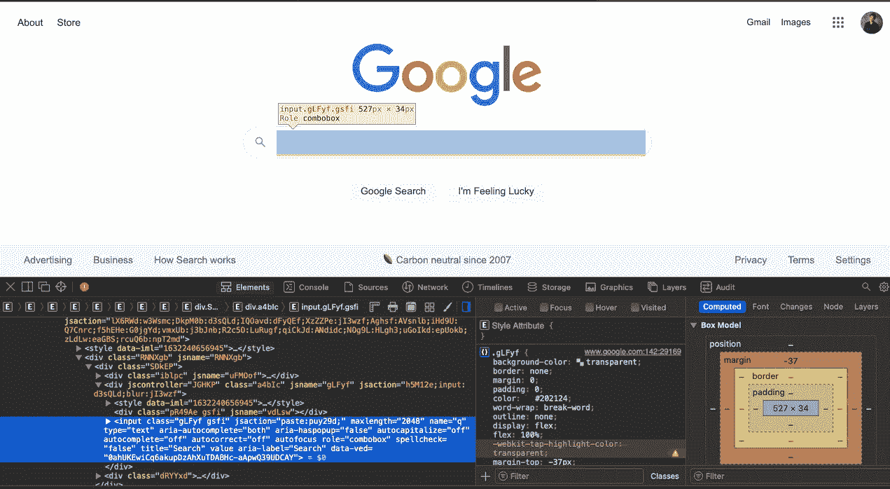
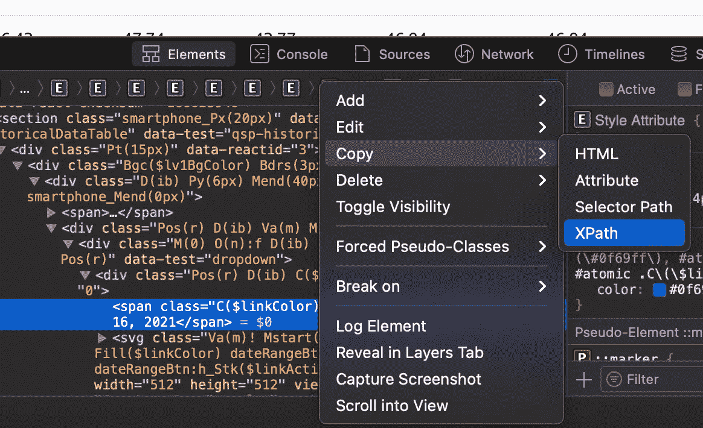

# 如何使用 Selenium 自动化任何网站

> 原文：<https://betterprogramming.pub/how-to-use-selenium-to-automate-any-website-89677293d1f3>

## 对于不仅仅需要美丽的声音的网站


由[罗伯特·鲁杰罗](https://unsplash.com/@robert2301?utm_source=medium&utm_medium=referral)在 [Unsplash](https://unsplash.com?utm_source=medium&utm_medium=referral) 上拍摄的照片

作为一个使用 beautifulsoup 的人，我知道使用代码来自动化和导航网站的力量。但是，也有 beautifulsoup 用不上的时候。例如，每当您需要点击页面中的按钮来访问更多内容时。在这种情况下， [Selenium](https://selenium-python.readthedocs.io) 将会是替代的工具。

使用 Selenium，您可以像普通人一样浏览页面——点击、键入等等。除了你可以自动化这一切！在本文中，我将向您展示如何设置 Selenium 并导航几个网页。以下是您将看到的与 Selenium 一起使用的内容:

*   下载和设置 Selenium
*   使用浏览器扩展
*   打开网页
*   在搜索栏中键入
*   点击一个链接
*   下载文件

最后，在没有 GUI 的情况下完成以上所有工作！

在接下来的几节中，我将向您展示如何从 Google 搜索页面开始从 Yahoo Finance 下载股票的每日价格历史。

# 设置 Selenium

首先，你需要在你的终端上安装带有`pip install selenium`的 Selenium。顺便说一下，我们将使用 Python 作为 Selenium 的主要编码语言。

## 下载网络驱动程序

接下来，你需要 [**从这个网站**](https://sites.google.com/chromium.org/driver/) 下载 Chrome 网络驱动。正确操作 Selenium 需要这个 web 驱动程序。Chrome 驱动程序基本上是一个可执行的浏览器，只要 Selenium 函数运行，它就会启动。

在下面几节中，您需要参考 chromedriver 可执行文件的文件路径位置，以便正确启动 Selenium。

## 导入库

要开始编写代码，您需要导入以下库:

```
import selenium
from selenium import webdriver
from selenium.webdriver.common.by import By
from selenium.webdriver.common.keys import Keys
from selenium.webdriver.support.ui import WebDriverWait
from selenium.webdriver.support import expected_conditions as EC
from selenium.webdriver.chrome.options import Options
import time
```

太好了！—您已经准备好使用 Selenium 启动浏览器了！

# 打开浏览器

为了从 IDE 中打开浏览器，您将运行这行代码:

```
driver = webdriver.Chrome(
    executable_path="/Users/marcosantos/Downloads/chromedriver"
)
```

在`executable_path`中，我指定了下载的 chromedriver 可执行文件的路径，该文件方便地存储在我的“Downloads”文件夹中。

运行这行代码会打开一个空浏览器。要打开特定的网页，您只需要网页 URL:

```
driver.get("[https://www.google.com](https://www.google.com)")
```

总的来说，它将如下所示:

```
# Opening the browser
driver = webdriver.Chrome(
    executable_path="/Users/marcosantos/Downloads/chromedriver"
)# Designating which site to open to
driver.get("[https://www.google.com](https://www.google.com)")# Closing the browser after a bit
time.sleep(1)
driver.quit()
```

如果您运行上面的代码，您将在 Google 搜索页面上打开一个浏览器，并在浏览器关闭前观察一秒钟(`driver.quit()`)。

# 输入搜索结果，然后按回车键

现在对于这一部分，你需要在网页中做一些 HTML 分析。为此，只需**选择或突出显示搜索字段**，**右键单击**，然后**选择检查元素**。您将看到一个弹出的新窗口，其中包含 HTML 代码:



搜索字段的 HTML 代码窗口

您需要这一行 HTML(以`input class=`开头)来指导 webdriver 命令。**获得正确的 HTML 代码行需要一些反复试验**。帮助准确指向正确代码行的一个好方法是使用 [**XPath**](https://www.w3schools.com/xml/xpath_syntax.asp) 。如果您需要一些帮助来从 HTML 行中获取 XPath——右键单击代码，您可以选择直接复制 XPath:



右键单击一段 HTML 代码来复制 XPath

使用 XPath 语法 Selenium 命令，并将其添加到前面的代码中，以便在 Google 上执行搜索:

# 点击正确的搜索结果

这里您需要做一些 HTML 检查来点击正确的搜索结果。和以前一样，右键单击所需的搜索结果，并使用那行 HTML 来引导 Selenium:

上面的代码再次增加了我们之前写的内容。现在，它能够通过使用 Selenium 的附加在`find_element()`上的`click()`命令点击想要的搜索结果。你现在应该发现自己在雅虎财经网页上。现在你可以用你以前的知识开始浏览网页，并通过下载一只股票的历史数据来完成。

但是在我们继续之前，让我们回顾一下硒的另一个方面。

# 向 Selenium 添加浏览器扩展

为了处理那些可能会妨碍 Selenium 找到所需 HTML 代码的讨厌广告，您可以下载一个阻止广告的浏览器扩展，并将其添加到 webdriver 中。

为此，你需要下载扩展的 [CRX 文件](https://www.lifewire.com/crx-file-2620391)。找到广告拦截扩展的 CRX 文件，并将其保存到您知道的位置。要将其附加到 chromedriver，请遵循以下代码:

正如你所看到的，我把我的`.crx`文件保存在我的下载文件夹中，并在那里访问它。我将它添加到 Selenium 中的 options 对象，并将其插入到 webdriver 中。

现在，无论何时你启动你的自动化网络驱动，它将是无广告的！

# 从网页导航和下载

使用广告拦截器扩展和以前的工具，我们可以开始点击并导航到股票历史数据的下载链接:

让我们看一下上面代码的过程:

1.  添加扩展并打开浏览器到 Google.com。
2.  谷歌搜索“雅虎财经”，点击想要的搜索结果。
3.  在雅虎财经上搜索 **AMC** 并点击回车。
4.  点击“历史数据”标签。
5.  点击“时间段”,弹出一个下拉菜单，Selenium 可以点击“最大”日期范围。
6.  点击应用并下载 CSV 文件！

成功！您应该有一个包含 AMC 历史数据的 csv 文件。如果您愿意，可以对任何有效的股票代码重复这个过程。

这很好，但是让我们试着让脚本运行得更快。

# 让硒更快

现在，我们可以在整个脚本中删除`time.sleep(1)`命令，但它的主要目的是等待元素显示或可用，否则可能会发生错误。有时 Selenium 运行得太快，会试图点击一个尚不存在的链接，直到页面加载了更多的链接。

为了解决这个问题，你可以使用 Selenium 的`WebDriverWait`功能来代替`time.sleep()`。这可以用来代替前面的许多命令，还有一个额外的好处，就是它会等到特定的元素出现后再执行！

在上面的代码中，`WebDriverWait`几乎取代了所有的`find_element()`命令。即使我们替换了它们，**我们仍然可以像之前的**一样点击并输入文本。在整个脚本中，我们给网页三秒钟的时间让元素或链接出现。之后，它将按照命令与该元素进行交互，或者，如果它仍然没有出现，那么它将显示一个超时错误。

运行上面的代码，你会发现你的自动化浏览器导航每个页面的速度比以前快了多少。但是，如果您根本不想让浏览器出现，或者您想让它在后台运行，该怎么办呢？

# 不使用 GUI 运行 Selenium

要在后台运行整个脚本，您需要为 Selenium 启用**无头模式**。这种模式基本上告诉网络驱动程序不要打开浏览器，但仍然导航网站。你甚至可以删除广告拦截扩展，因为广告不会出现没有浏览器启用！

这是您应该在启动 webdriver 以正确启用 headless 模式之前添加的代码:

将这段代码添加到上面的脚本后，您的整个 Selenium 脚本将在后台完全下载一个 csv 文件:

这段代码与前面的代码几乎相同，但是它启用了 headless 模式，并且通篇使用了几个 print 语句。这些语句只是为了您的利益，并作为了解 Selenium 脚本当前状态的检查点。

# 关闭

当你需要与网站互动以获取更多信息时，Selenium 是一个很好的工具。正如你在雅虎财经网站上看到的——要访问更长的日期范围，你必须点击一个按钮。这个简单的任务在 Beatifulsoup 上要么复杂得多，要么完全不可能完成。但是如果你同时使用 Selenium 和 Beatifulsoup，那么你将会创建一个令人惊奇的 webscraper。

需要注意的一些事情——即使 XPaths 是准确的，它们也会随着时间而改变。我上面的代码完全有可能不再适用于久而久之。网站更新会改变底层的 HTML 代码。因此，您可能需要对 Selenium 脚本进行一些维护，以保持它长期运行。

无论如何，我希望您对 Selenium 有了足够的了解，可以构建自己的脚本来访问和导航更多的网站。祝你用 Selenium 自动化和导航网站好运！

> 在这里注册一个中级会员，可以无限制地访问和支持像我这样的内容！在你的支持下，我赚了一小部分会费。谢谢！

## 开源代码库

[](https://github.com/marcosan93/Medium-Misc-Tutorials/blob/main/Selenium-Tutorial.ipynb) [## Medium-Misc-Tutorials/Selenium-tutorial . ipynb at main Marcos an 93/Medium-Misc-Tutorials

### 一组随机的中等教程。为 Marcos an 93/Medium-Misc-Tutorials 开发做出贡献，创建一个…

github.com](https://github.com/marcosan93/Medium-Misc-Tutorials/blob/main/Selenium-Tutorial.ipynb)