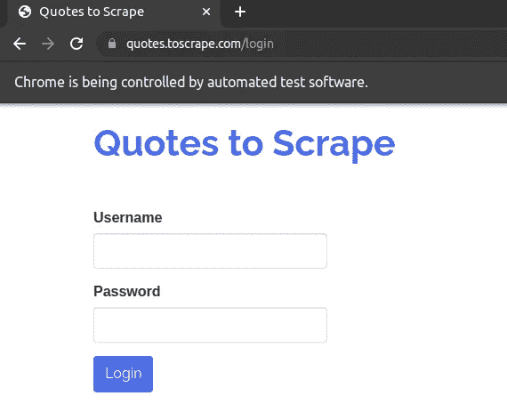
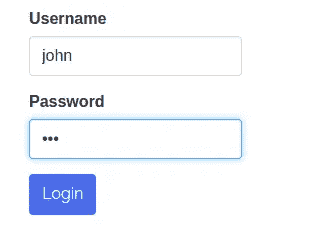
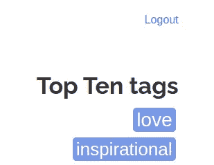
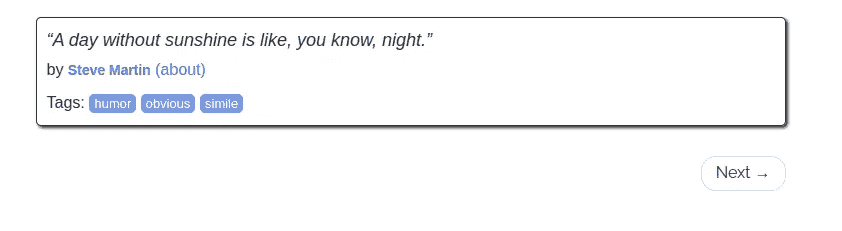
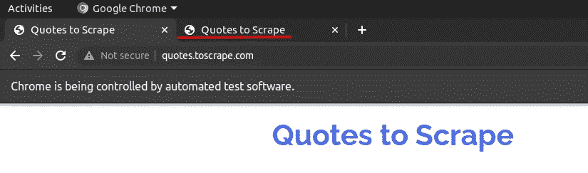
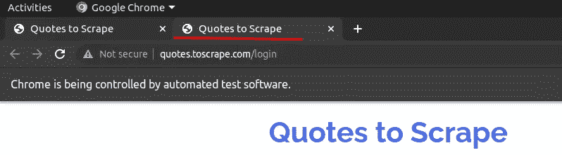

# 如何使用 Selenium 在 Python 中模拟网站测试的手动操作

> 原文：<https://betterprogramming.pub/how-to-use-selenium-to-simulate-manual-actions-c00aecbfbd45>

## 几分钟内学会基本的网站测试自动化

图片由皮沙贝的[杰拉德](https://pixabay.com/photos/turn-on-switch-off-energy-power-2933016/)拍摄。

[Selenium](https://www.selenium.dev/) 是一款常用于在浏览器中自动化网站测试的工具。可以用 Selenium 模拟各种手动动作。在本帖中，我们将介绍一些在网站测试或网页抓取中常用的手动操作。

# 准备

在开始之前，我们需要安装 Selenium 和一些依赖项。为了达到最佳实践，我们应该将库安装在一个虚拟环境中。推荐使用 [*conda*](https://medium.com/codex/how-to-create-virtual-environments-with-venv-and-conda-in-python-31814c0a8ec2) 来管理环境，因为我们可以在每个环境中安装特定版本的 Python。

为了使用最新版本的 Selenium，最好也使用最新版本的 Python。我们还将安装 iPython 库，以便更方便地运行交互式 Python 代码。您可以在 iPython 中复制并粘贴下面所示的 Python 代码来查看结果。

尤其是有了[*web driver-manager*](https://pypi.org/project/webdriver-manager/)，我们不需要像以前那样下载管理浏览器驱动，省了我们不少力气。

# 如何开一个驱动，开一个网站？

启动驱动程序现在简单多了，因为我们不需要单独管理浏览器驱动程序:

将自动下载并使用`webdriver`，在本例中为`chromedriver`:

然后我们可以用驱动程序打开一个网站:

通常我们会为了测试而最大化窗口，但是你也可以用 [set_window_size](https://www.selenium.dev/documentation/webdriver/browser/windows/#set-window-size) 方法将其设置为一个特定的大小。

我们现在可以对网站进行截屏，以确保它被正确打开和显示。

# 如何点击一个元素？

我们可以点击各种元素，如链接、按钮、单选按钮等。让我们点击[quotes.toscrape.com](https://quotes.toscrape.com/)主页上的“登录”链接。我们需要首先找到链接的 XPath。

如果你不知道如何获得一个 web 元素的 XPath，[这篇文章](https://lynn-kwong.medium.com/simple-web-scraping-using-requests-beautiful-soup-and-lxml-in-python-4f5903c67db2)会有所帮助。

选择 XPath 有多种方法。您的方法可以不同于这里使用的方法，只要它能够正确定位元素。登录页面将如下打开:

图片作者。

# 如何在文本框中输入文本？

我们可以通过`send_keys`的方法在这个页面输入一个假的用户名和密码。任何文本都可以，因为它只是一个演示。

图片作者。

我们现在可以单击“登录”按钮，如上一步所示。或者，我们可以发送一个“输入”键，其效果与单击相同:

现在我们“登录”了:

图片作者。

# 如何将视图滚动到一个元素？

对于一些 JavaScript 框架，元素的内容(或相关内容)只有在滚动到视图时才会显示。为此，我们需要执行一些脚本。让我们将视图滚动到“下一步”按钮:

现在视图滚动到“下一步”按钮:

图片作者。

# 如何在新标签页中打开链接？

这是一个比较棘手的问题，因为大多数在线参考都是针对 Java 代码的，而针对 Python 的参考大多已经过时了。要在新标签页中打开一个链接，我们需要使用`ActionChains`，它模拟 CTRL + CLICK:

现在“登录”页面在一个新选项卡中打开:

图片作者。

请注意，如果您已登录，您需要先注销才能在新选项卡中打开登录链接。此外，您仍将停留在原来的选项卡上。现在让我们切换到带有 Selenium 的新选项卡。

# 如何用 Selenium 切换到新标签页？

有时一个链接会在一个新的标签页中打开。然而，驱动程序不会直接切换到新的选项卡，我们需要显式地这样做。为此，我们需要获取窗口处理程序并切换到其中一个新标签页:

现在，我们切换到新选项卡，现在可以处理该选项卡的网页中显示的元素:

图片作者。

在这篇文章中，我们介绍了一些在网站测试或网页抓取中常用的手动操作。希望对你的工作也有帮助。

相关文章:

*   [如何在 Python 中使用 Selenium 抓取 JavaScript 网页](https://lynn-kwong.medium.com/how-to-scrape-javascript-webpages-using-selenium-in-python-21d56731bb1f)