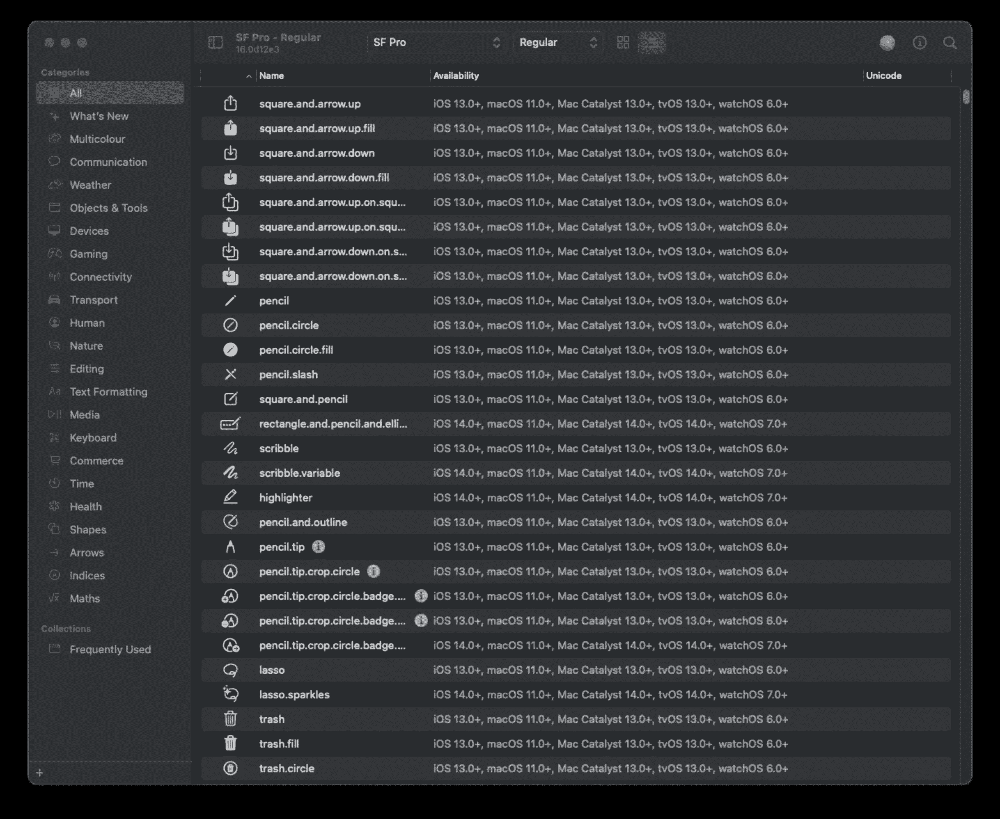
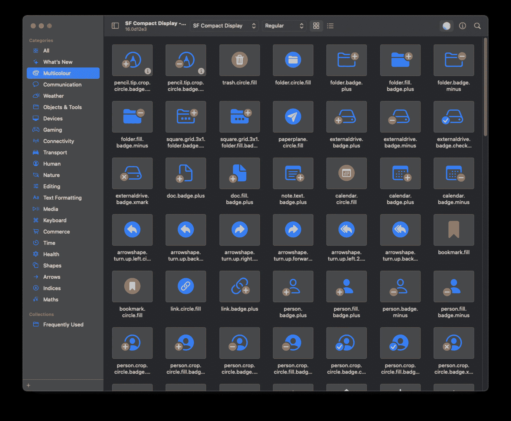
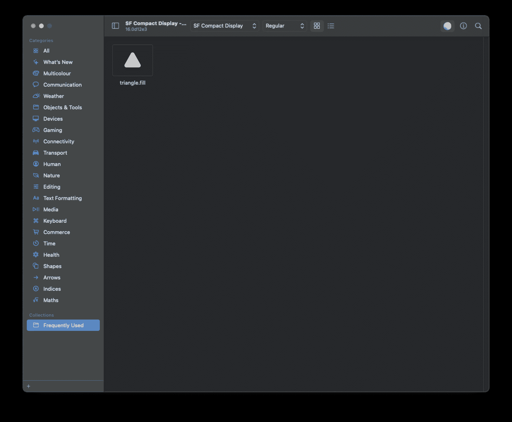
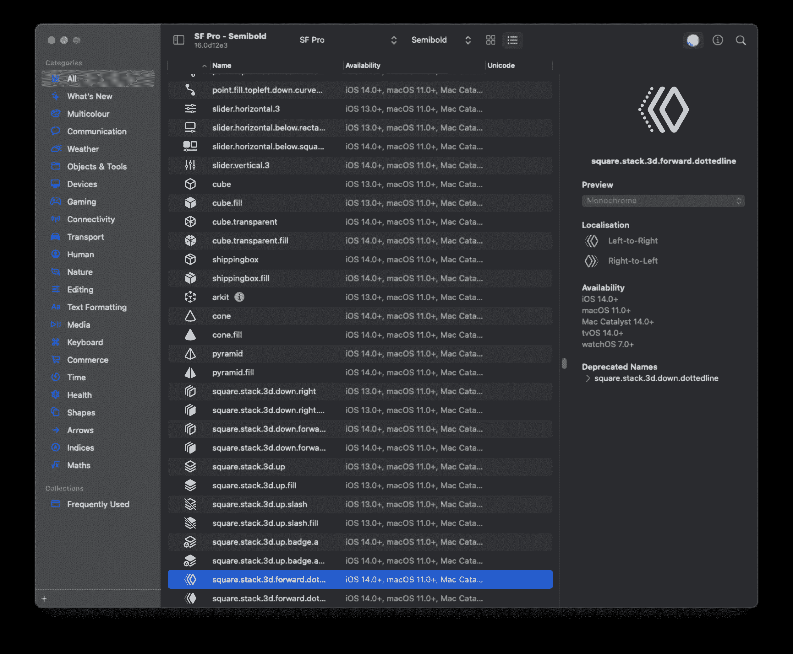
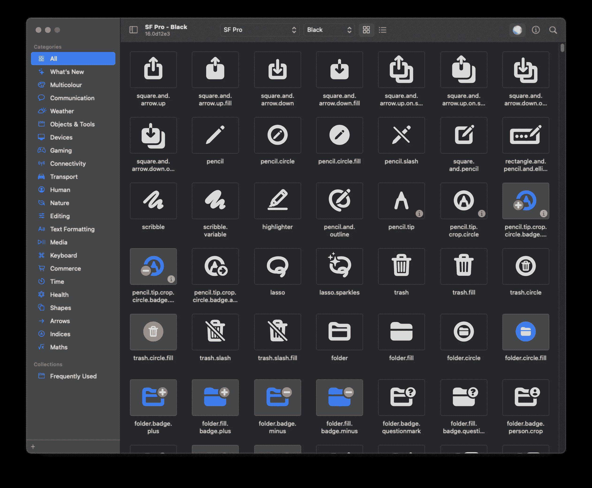
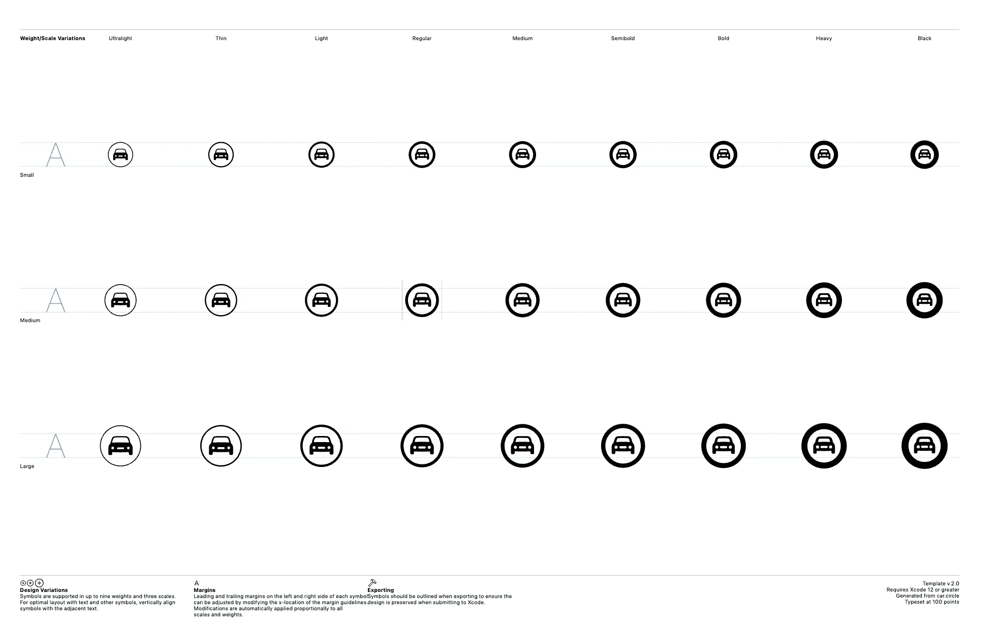
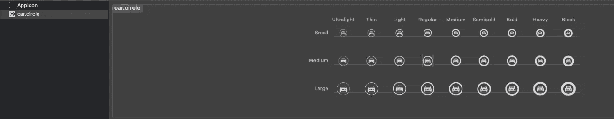

# 如何使用 SF 符号

> 原文：<https://betterprogramming.pub/how-to-use-sf-symbols-c643af2ec13c>

## 利用庞大的系统映像库


由[大卫·格兰穆金](https://unsplash.com/@davidgrdm?utm_source=medium&utm_medium=referral)在 [Unsplash](https://unsplash.com?utm_source=medium&utm_medium=referral) 拍摄的照片

[SF Symbols](https://developer.apple.com/design/human-interface-guidelines/sf-symbols/overview/) 是一款 Mac 应用，截至 2021 年，包含超过 2400 个图标，可用于您自己的 iOS 项目。我相信随着时间的推移，这个数字还会继续增加。

实话实说:我们都有过为应用程序寻找某个图标的时候。当我们开始搜索这个图标时，我们会遇到一些问题，比如:

*   图标没有您想要的尺寸
*   图标需要被认可
*   图标需要付费

这样的例子不胜枚举。

苹果在 2019 年 WWDC 展会上推出了 SF Symbols，在 2020 年 WWDC 展会上推出了 SF Symbols 2.0。每个版本都引入了新的图标和功能。

请注意，SF 符号仅支持:

*   iOS 13 及更高版本
*   macOS 11 及更高版本
*   watchOS 6 及更高版本
*   tvOS 13 和更高版本

# 快速浏览 SF 符号

借助该应用程序，您将能够:

1.  探索不同类别下的不同图标—网格或列表。
2.  查看图标支持的版本。



3.查看颜色图标。



4.用你选择的图标创建你的个人文件夹。



5.LTR 或 RTL 支持某些图标。您可以通过单击搜索按钮旁边的信息来访问该信息。



6.查看不同字体粗细或字体下的图标。



7.通过文件>导出自定义符号模板或`CMD + E`导出符号。格式将是 SVG。



下载的文件可以插入 Xcode。如果你想支持 iOS 12 及以下版本，你可以选择这种方法。



# 如何使用 SF 符号

SF 符号在 Xcode 上很容易使用，但是你必须知道你喜欢的图标的名字才能使用它。

```
let image = UIImage(systemName: "pencil")
```

通过指定图标的名称，您可以立即使用该图像。

```
let image = UIImage(systemName: "moon.fill")
```


您可以更改图标的字体。

```
let image = UIImage(systemName: "folder", withConfiguration: UIImage.SymbolConfiguration(weight: .black))
```


您可以更改图标的颜色。

```
let image = UIImage(systemName: "moon.fill")?.withTintColor(.green)
```


# 结论

SF Symbols 是一个很好的工具，它可以帮助你弥补在创建图标时缺乏创造力的缺陷，因为大多数图标都是现成可用的。它仍然是一个正在开发的工具，你将继续看到它的更多改进，就像我们在 SF Symbol 1.0 和 SF Symbol 2.0 中看到的那样。

唯一的问题是新版本的图标不是向后兼容的，这意味着你必须导出图标来支持它。总的来说，这是一个很棒的工具，到目前为止我很喜欢使用它。