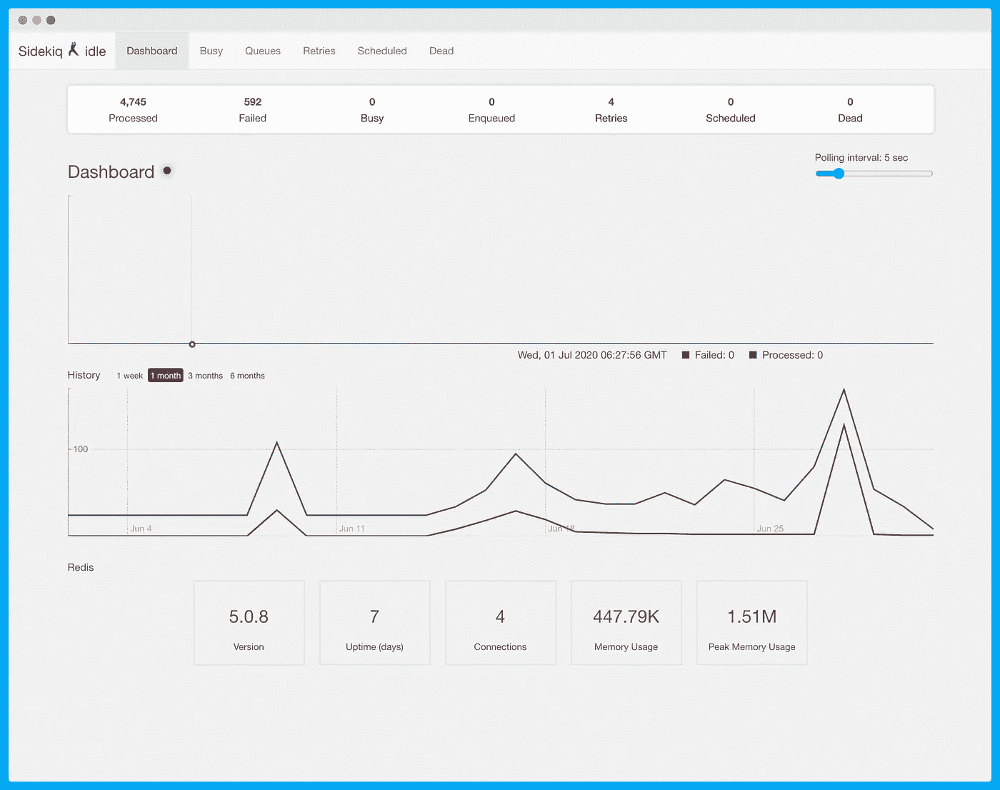
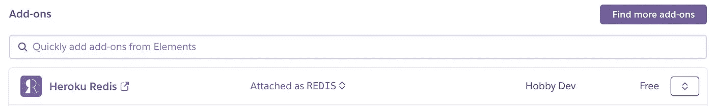
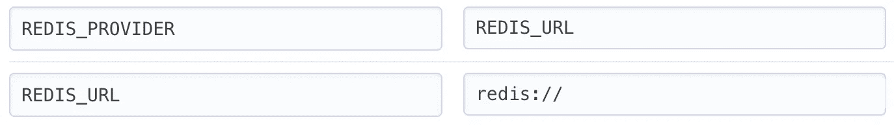

# 如何在 Rails 6 中使用 Sidekiq

> 原文：<https://betterprogramming.pub/how-to-use-sidekiq-in-rails-6-f3b76678362d>

## 深入探究最受欢迎的背景处理系统

【2021 年 2 月更新了 Ruby on Rails 6.1 和 Sidekiq 6.1.3，同时增加了部署到 Heroku 的分步指南。


如何在 Rails 6 中使用 Sidekiq

【2019 年 9 月，Sidekiq 发布了 6.x 版本，Sidekiq 有三个版本:开源版本、Sidekiq Pro 和 Sidekiq Enterprise。

Sidekiq 使用线程在同一进程中同时处理多个任务，并与 Rails 紧密集成，尽管 Rails 不是必需的。如果你正在寻找某种语言无关的东西，你应该看看同样由 Mike Perham(Sidekiq 的创造者)创建的 [Faktory](https://github.com/contribsys/faktory) 。

在[organically](https://www.organisely.app)，我们使用 Sidekiq 进行任何用户不需要即时反馈的长时间运行。我们还将 Sidekiq 用于可能由于网络错误而失败的作业，并且我们希望利用自动重试机制。

有组织地每天发送一批短信(使用 Twilio 的 SMS API)作为客户约会的提醒。虽然 Twilio 有非常可靠的 API，但网络错误是不可避免的，必须考虑在内。我们将每个 Twilio API 调用包装到一个 Sidekiq 作业中，如果 API 调用不成功，该作业将重试。



# 设置

如果你还没有在 macOS 上安装 Ruby on Rails 进行开发，请查看本教程[。](https://catalinionescu.dev/how-to-install-ruby-on-rails-on-macos-catalina)

通过将 gem 添加到您的 gem 文件来安装 Sidekiq。

```
gem 'sidekiq', '~> 6.1.3'
```

Sidekiq 只有一个依赖，那就是 Redis。如果您使用的是 Mac，可以使用 Homebrew 安装 Redis:

```
$ brew install redis
```

在`app/jobs`中创建一个新任务，以异步处理任务:

```
class MyJob
  include Sidekiq::Worker

  def perform(args)
    # block that will be retried in case of failure
  end
end
```

您可以调用这个作业作为`MyJob.perform_async(args)`。

用`bundle exec sidekiq`开始 Sidekiq 过程。

# 调用者

如果你使用的是 [Invoker](https://invoker.codemancers.com/) ，这里有一个配置文件可以用来设置 Sidekiq:

```
[sidekiq]
directory = /Users/work/my-project
command = RBENV_VERSION=$(cat .ruby-version) zsh -c "bundle exec sidekiq -c 2"
```

# 活动工单

Rails 4.2 中引入的活动作业是默认的 Rails 后台作业处理框架。缺省情况下，Active Job 会以串联方式运行这些作业，但是您可以将适配器设置为 Sidekiq，并利用可靠的作业执行环境。

```
# config/environments/production.rbconfig.active_job.queue_name_prefix = "test_app_#{Rails.env}"config.active_job.queue_adapter = :sidekiq
```

这种与活动作业紧密集成的酷之处在于，后台工作人员看起来更像 Rails。您将创建一个带有一些公共配置的基类，名为`ApplicationJob`。典型的 worker 实现如下所示:

```
class ExampleJob < ApplicationJob
  queue_as :default def perform
     # do some stuff
  end
end
```

# 赫罗库

登录您的 Heroku 仪表盘，然后转到应用的仪表盘，点击资源选项卡。接下来，搜索 Heroku Redis 插件并将其添加到您的项目中(它有一个免费版本)。



接下来，转到项目的设置选项卡，并单击显示配置变量。添加一个名为 REDIS_PROVIDER 的键(Sidekiq 正在寻找的连接 REDIS 的键)和值 REDIS_URL(由 Heroku Redis 插件创建的键的名称)。



在您的 Procfile 中，您将需要定义一个 worker 键，它将使用参数(`-c 2`)运行 Sidekiq。这代表并发性，我们指示 Sidekiq 并行运行 2 个 workers。我们这样做是因为 Sidekiq 的默认并发设置为 25，而免费版的 Heroku Redis(T2)有 20 个并发连接的限制。除此之外，需要记住的另一个限制是数据库允许的连接数(因为 Sidekiq workers 可能需要连接到数据库)。 [Heroku Postgres](https://elements.heroku.com/addons/heroku-postgresql) (免费版)也实施了 20 个连接的限制，但在这种情况下，我们需要注意 web 服务器也使用这些连接。

如果你想知道 Procfile 实际上是什么，直接从 [Heroku 文档](https://devcenter.heroku.com/articles/procfile)开始:

> Procfile 是一种机制，用于声明 Heroku 平台上应用程序的 dynos 运行哪些命令。它遵循流程模型。您可以使用 Procfile 来声明各种进程类型，例如您的 web 服务器、多种类型的工作进程、像时钟一样的单一进程，或者您希望在将新版本部署到生产环境之前运行的任务。

最后，您需要将以下 worker 配置添加到您的 Procfile 中。

```
web: bundle exec puma -p $PORT -C ./config/puma.rbworker: bundle exec sidekiq -c 2
```

Catalin ( [@cionescu1](https://twitter.com/cionescu1) )是 Ruby on Rails 的顾问，是免费约会管理软件 organiselly[的创始人，也是《现代 Rails——用 Ruby on Rails 构建 CRM](https://www.organisely.app/)一书的作者。