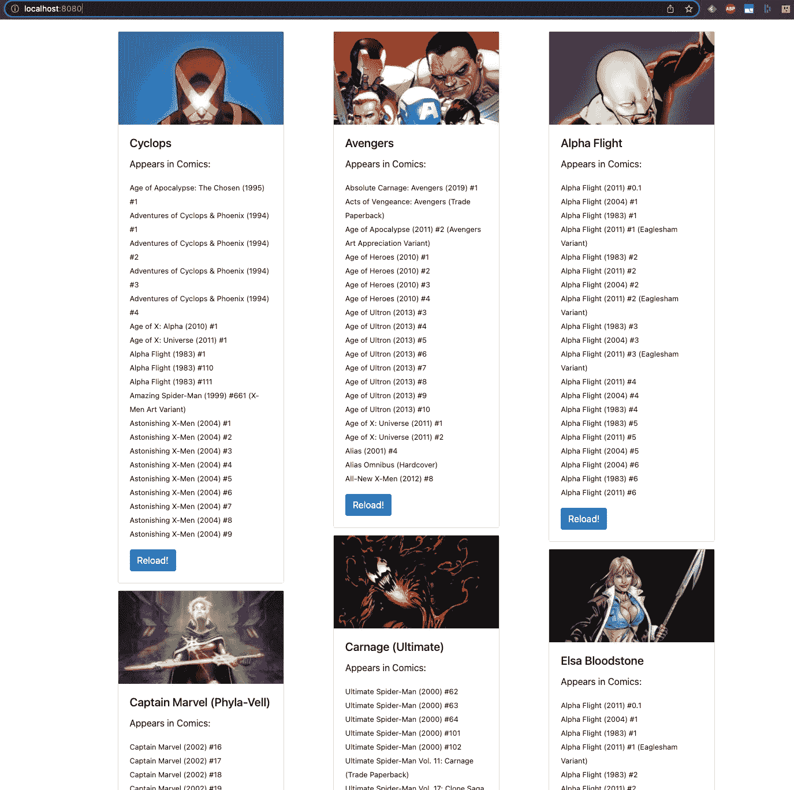
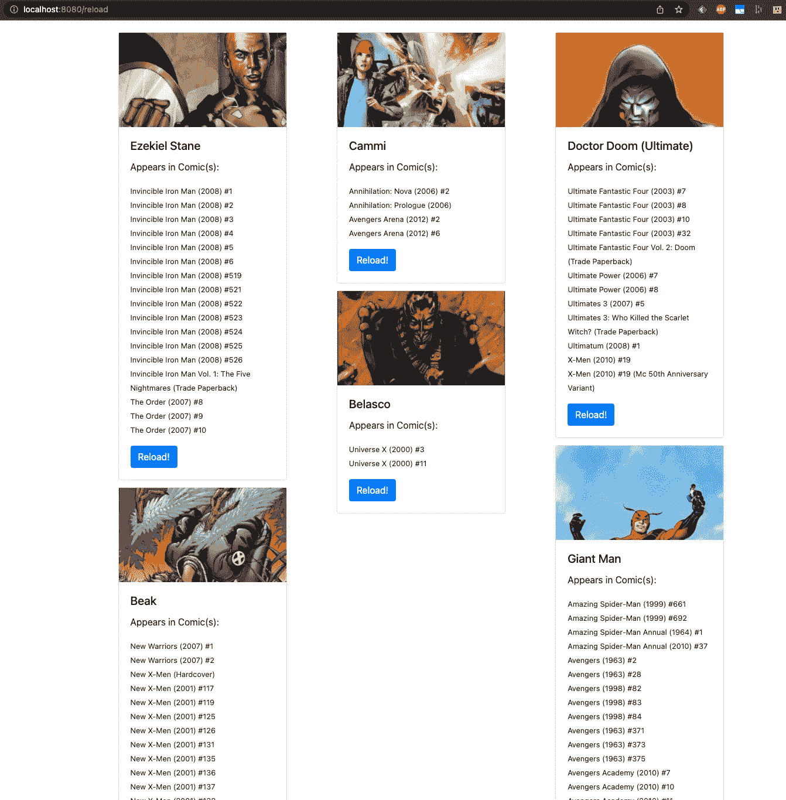

# 如何将 Skaffold 与 Docker 和 Kustomize 结合使用，为运行在 Kubernetes 中的有状态应用程序构建一个管道

> 原文：<https://betterprogramming.pub/how-to-use-skaffold-with-docker-and-kustomize-to-build-a-pipeline-for-stateful-applications-running-c74ca0e1c13a>

## 第 3 部分:让我们添加数据！


照片由[EJ·斯特拉特](https://unsplash.com/@xoforoct?utm_source=medium&utm_medium=referral)在 [Unsplash](https://unsplash.com?utm_source=medium&utm_medium=referral) 拍摄

这是“[如何为 Kubernetes 有状态应用](/how-to-build-a-ci-cd-pipeline-for-kubernetes-stateful-applications-aef6c8c5edc2)构建 CI/CD 管道”系列的最后一部分。到目前为止，我们已经部署和配置了:

*   草泽
*   MongoDB 社区运营商
*   翁达特

在本文中，我们将把应用程序和 MongoDB 数据库一起部署为 Kubernetes `StatefulSet`,使用 Operator 和 Skaffold 为我们的本地 k3s 集群创建一个持续开发管道。最后，我们将测试管道，并更新我们的真棒漫威应用程序！我们开始吧！

*注意:*如果你想继续，你可以在 Github 上找到我们使用的资源:

*   MongoDB 操作员清单:[https://github . com/vfiftyfive/MongoDB-community-operator-manifests](https://github.com/vfiftyfive/mongodb-community-operator-manifests)
*   应用代码、管道和包装配置:[https://github.com/vfiftyfive/FlaskMarvelApp](https://github.com/vfiftyfive/FlaskMarvelApp)
*   申请清单:[https://github.com/vfiftyfive/CFD12-Demo-Manifests](https://github.com/vfiftyfive/CFD12-Demo-Manifests)。使用`dev`分支。

# 创建 MongoDB 定制资源并定义数据服务需求

像往常一样，定制资源作为 YAML 文件传递给 Kubernetes。MongoDB 社区运营商 repo 在这里给出了几个例子[。您需要根据您的用例调整特定的参数。](https://github.com/mongodb/mongodb-kubernetes-operator/tree/master/config/samples)

在您之前克隆的应用程序清单 repo 的根目录下，您会发现我们使用的 MongoDB 定制资源。这是 Kustomize 在运行`kustomize build overlay/dev`后计算的结果。文件名为`mongodb-config.yaml`，具体如下:

```
apiVersion: mongodbcommunity.mongodb.com/v1
kind: MongoDBCommunity
metadata:
  name: mongodb
spec:
  **members: 3
  version: 5.0.5** security:
    authentication:
      modes:
      - SCRAM
  statefulSet:
    spec:
      selector: {}
      serviceName: mongodb
      volumeClaimTemplates:
      - metadata:
          name: data-volume
        spec:
          accessModes:
          - ReadWriteOnce
          resources:
            requests:
              storage: 1Gi
          **storageClassName: ondat-replicated**
      - metadata:
          name: logs-volume
        spec:
          accessModes:
          - ReadWriteOnce
          resources:
            requests:
              storage: 1Gi
          **storageClassName: ondat-replicated**
  type: ReplicaSet
  users:
  - **db: admin**
    name: admin
    **passwordSecretRef:
      name: admin-password-df8t2cdf9f**
    **roles:
    - db: admin
      name: clusterAdmin
    - db: admin
      name: userAdminAnyDatabase
    - db: admin
      name: dbAdminAnyDatabase
    - db: admin
      name: readWriteAnyDatabase**
    **scramCredentialsSecretName: admin**
```

我们已经用**粗体**突出了基本特性。定制资源定义集群中初始 MongoDB 节点的数量、MongoDB 的版本、配置 MongoDB 副本集、Kubernetes `StorageClass`，并指定数据库管理员用户名/密码和角色。它封装了创建数据库所需的信息，并在逻辑上表示了所需数据库配置的抽象。这些参数由 Kustomize 根据覆盖图中描述的目标环境动态计算。

`StorageClass`决定 MongoDB `StatefulSet`使用哪个 CSI 来管理它的数据。从开发到生产，在应用程序生命周期的每一步选择合适的提供商是至关重要的。“左移”的前提已经在[之前的博客](https://medium.com/@nvermande/3-reasons-to-shift-left-your-data-with-kubernetes-and-ondat-52a753343d0b?sk=bb23b2c30052fc3d91dbd967460abecb)中讨论过了，所以我就不深究了。这个想法是，从开发到生产，从他们的笔记本电脑到 100 节点的生产集群，开发人员需要一致的工具。他们应该能够在开发的每个阶段用相同的能力测试他们的代码。Ondat 为 Kubernetes 持久卷和其他企业功能提供了这种一致性，这些功能在大规模生产中运行有状态工作负载时至关重要。它包括同步复制、性能优化、传输中和静态的强加密，以及管理这些功能的 Kube-Native 方法。

`ondat-replicated` StorageClass 在 Kustomize 生成的清单中定义。Kubernetes API 在 Kustomize 计算之后获取的`StorageClass`配置如下:

```
apiVersion: storage.k8s.io/v1
kind: StorageClass
metadata:
  name: ondat-replicated
parameters:
  **csi.storage.k8s.io/fstype: xfs**
  csi.storage.k8s.io/secret-name: storageos-api
  csi.storage.k8s.io/secret-namespace: storageos
  **storageos.com/encryption: "true"
  storageos.com/replicas: "1"**
provisioner: csi.storageos.com
allowVolumeExpansion: true
reclaimPolicy: Delete
volumeBindingMode: Immediate
```

同样，我们在**粗体**中突出显示了基本特性。按照 MongoDB 的建议，我们将用于持久卷的默认文件系统更改为 XFS，以获得更好的可伸缩性和性能。我们还启用了加密，并将卷副本的数量设置为 1。这意味着，由 Ondat CSI 提供并由该`StorageClass`配置的每个永久卷将被格式化为 XFS，使用 AES-256 密码进行静态加密(传输中加密默认启用且不可更改)，并在 Ondat 数据网格中有一个副本可用。

# 部署数据库

数据库本身不需要手动部署。Skaffold 将处理应用程序部署工作流，其中包括 MongoDB 集群。惟一的先决条件是运行 MongoDB 操作符，并在 Kubernetes 中提供定制资源类型。使用以下命令检查操作员是否正在运行:

```
$ kubectl get pods -n mongo-operator
NAME                                           READY   STATUS  ...mongodb-kubernetes-operator-6d46dd4b74-ldfcc   1/1     Running ...
```

此外，检查自定义资源类型是否已定义:

```
$ kubectl  api-resources | grep mongo
mongodbcommunity  mdbc  mongodbcommunity.mongodb.com  ...
```

# 使用 Pymongo 处理数据库

在深入 Skaffold 的管道配置之前，让我们看看如何编写 Kubernetes `Job`和 FE 来访问 MongoDB 数据库。

`Pymongo`提供 Python 绑定与 MongoDB 交互。在撰写本文时，最新版本是 4.0.1，文档可从[https://pymongo.readthedocs.io/en/stable/index.html](https://pymongo.readthedocs.io/en/stable/index.html)获得。使用起来非常简单，这里有一个代码示例，展示了 Kubernetes `Job`如何连接到数据库，创建一个 MongoDB *集合*，并向其中添加一个 JSON 文档。

因为我们使用的是 Mongo 副本集，所以驱动程序需要一个种子列表。它将尝试在种子列表中查找集合的所有成员，但是操作没有阻塞。它无声无息地回来了。因此，如果您想捕捉任何连接错误，您应该将以下内容添加到您的代码中(来自文档):

在`add_mongo_document`函数代码中，我们指定了一个包含三个成员的种子列表，该列表通过环境变量传递给应用程序。这些变量包含在 Kubernetes `ConfigMap`中，它是由我们之前提到的 Kustomize `configMapGenerator`自动生成的。Kubernetes `Job`和 FE `Deployment`清单都包含对那个`ConfigMap`的引用。同样，可以通过运行`kustomize build overlay/dev`来检查。有趣的部分如下:

```
spec:
  containers:
  - envFrom:
    - configMapRef:
        name: mongo-config-b29f887ch6
```

您可以注意到 Kustomize 有效地生成了一个带有随机字符串后缀的惟一名称，这个名称被`Job`和`Deployment`清单引用。这些清单中定义的变量在`kustomization.yaml`文件的`configMagGenerator`部分中被指定为文字:

```
configMapGenerator:
- name: mongo-config
  literals:
  - MONGO_SEED0=mongodb-0.mongodb.default.svc.cluster.local
  - MONGO_SEED1=mongodb-1.mongodb.default.svc.cluster.local
  - MONGO_SEED2=mongodb-2.mongodb.default.svc.cluster.local
  - OFFSET=600
  - MONGO_USERNAME=admin
```

类似地，该功能所需的密码通过一个`Secret` 传递，其中密码值与一个名为*密码的键相关联。*

```
secretGenerator:
- name: admin-password
  literals:
  - password=mongo
```

接下来在第 10 行，`db.marvel`隐式定义了一个新的 MongoDB *集合*(相当于关系数据库表的 NoSQL)。

在第 11 行，`db.characters.insert_one(document)`在集合中创建新文档。来自漫威 API 端点的每个 JSON 响应都被解析为符合以下结构:

```
{
  "id": 10093467,
  "name": "Iron Fist (Danny Rand)",
  "thumbnail": "[http://i.annihil.us/u/prod/marvel](http://i.annihil.us/u/prod/marvel/i/mg/3/f0/52616788ebc63)...",
  "extension": "jpg",
  "comics":
    {
      "available": "98",
      "collectionURI": "[http://gateway.marvel.com/v1/public/cha](http://gateway.marvel.com/v1/public/characters/1009367/comics)...",
      "items": 
      [{
          "resourceURI": "[http://gateway.marvel.com/v1/public/](http://gateway.marvel.com/v1/public/comics/43504)...",
          "name": "A+X (2012) #5"
       },
       {  "resourceURI": "[http://gateway.marvel.com/v1/public/](http://gateway.marvel.com/v1/public/comics/77062)...",
          "name": "Absolute Carnage: Lethal Protectors (2019) #2"
       }
       ...
      "returned": 20
    }
}
```

# 安装和配置 Skaffold

安装 Skaffold 非常简单，只需按照这里的[所示的步骤进行](https://skaffold.dev/docs/install/)。下一步是通过运行`skaffold init`来配置 Skaffold。它生成一个名为`skaffold.yaml`的文件，该文件提供了一个标准的工作模板。该命令会问一些问题，但您可以选择任何答案，目标只是从一个非空的 YAML 文件开始…我的意思是谁喜欢从一个空的 YAML 配置开始:-)？

这是我们指定构建和部署选项的地方，最终配置如下所示(`skaffold.yaml`配置文件位于应用程序存储库的根目录):

```
apiVersion: skaffold/v2beta26
kind: Config
metadata:
  name: demo-marvel-app
build:
  artifacts:
  - image: vfiftyfive/flask_marvel
    custom:
      buildCommand: sh build.sh
  local:
    push: true
deploy:
  kustomize:
    paths: 
    - <path_to_dev_overlay>
```

定制构建命令是我前面提到的`build.sh`文件，Kustomize 路径是本地 *dev* 覆盖目录的路径。我们还将图片发布在 Docker Hub 上，这需要 Skaffold 了解您的 Docker Hub 证书。与 Docker Hub 集成最简单的方法是用`docker login`登录 Docker，然后通过运行`skaffold dev --default-repo=<your_registry>`配置 Skaffold 使用您的注册表，其中`<your_registry>` Docker Hub 是您的用户名。

一旦您设置了您的`KUBECONFIG`环境变量来连接到您的 dev Kubernetes 集群，剩下的唯一事情就是运行`skaffold dev`:

```
$ export KUBECONFIG=<path_to_kubeconfig_file>
$ skaffold dev
Listing files to watch...
 - vfiftyfive/flask_marvel
Generating tags...
 - vfiftyfive/flask_marvel -> vfiftyfive/flask_marvel:6f061f0
Checking cache...
 - vfiftyfive/flask_marvel: Not found. Building
Starting build...
Building [vfiftyfive/flask_marvel]...
+ docker buildx build --builder skaffold-builder --tag vfiftyfive/flask_marvel:6f061f0 --platform linux/amd64,linux/arm64 --push /Users/nvermande/Documents/Dev/Ondat/FlaskMarvelApp
#1 [internal] load build definition from Dockerfile
#1 transferring dockerfile: 299B 0.0s done
#1 DONE 0.1s#2 [internal] load .dockerignore
#2 transferring context: 2B 0.0s done
#2 DONE 0.0s#3 [linux/arm64 internal] load metadata for docker.io/library/python:3.9
#3 ......Tags used in deployment:
 - vfiftyfive/flask_marvel -> vfiftyfive/flask_marvel:6f061f0@sha256:629734c5e62206752f051e9f47fdc3bc6d1f61e399b9a89920c8d7d9f87ee0f8
Starting deploy...
 - storageclass.storage.k8s.io/ondat created
 - service/marvel-frontend created
 - service/mongodb created
 - deployment.apps/marvel-frontend created
 - statefulset.apps/mongodb created
 - job.batch/add-data-to-mongodb created
Waiting for deployments to stabilize...
 - deployment/marvel-frontend: creating container flask-marvel
    - pod/marvel-frontend-5bdd684d78-zpbvm: creating container flask-marvel
    - pod/marvel-frontend-5bdd684d78-2mf4m: creating container flask-marvel
 - statefulset/mongodb: creating container mongodb
    - pod/mongodb-0: creating container mongodb
 - deployment/marvel-frontend is ready. [1/2 deployment(s) still pending]...Generating tags...
 - vfiftyfive/flask_marvel -> vfiftyfive/flask_marvel:6f061f0
Checking cache...
 - vfiftyfive/flask_marvel: Found Remotely
Tags used in deployment:
 - vfiftyfive/flask_marvel -> vfiftyfive/flask_marvel:6f061f0@sha256:629734c5e62206752f051e9f47fdc3bc6d1f61e399b9a89920c8d7d9f87ee0f8
Starting deploy...
Waiting for deployments to stabilize...
 - statefulset/mongodb is ready. [1/2 deployment(s) still pending]
 - deployment/marvel-frontend is ready.
Deployments stabilized in 1.49 second
Watching for changes...
```

从上面的输出可以看出，Skaffold 构建了 Docker 映像，并使用 Kustomize 部署了 Kubernetes 清单，作为映像构建的结果，用特定的映像标记和摘要配置了新的 FE 映像。

Skaffold 还有另一个有趣的特性，那就是能够实时输出它所监控的`Pods`的日志。例如，如果您构建了一个 *foo* 和一个 *bar* 工件，Skaffold 将在它们被更新时显示 *foo* 和*bar*的输出。当 Skaffold 以守护模式运行时，可以使用上面的`dev`选项。这意味着当您开发应用程序时，您不必使用`kubectl`从多个地方收集容器的日志。Skaffold 将它们集中起来，然后发送到守护程序标准输出！我不得不承认很方便。

如果我们看看 Kubernetes 集群中现在正在运行什么，我们可以看到以下内容(年龄字段已被截断):

```
$ kubectl get pods
NAME                               READY   STATUS      RESTARTS   
add-data-to-mongodb-9brkw          0/1     Completed   0          
marvel-frontend-5bdd684d78-2mf4m   1/1     Running     0          
marvel-frontend-5bdd684d78-zpbvm   1/1     Running     0          
mongodb-0                          1/1     Running     0          
mongodb-1                          1/1     Running     0          
mongodb-2                          1/1     Running     0
```

Skaffold 已经部署了我们的应用程序运行所需的所有组件。在试图修改源代码之前，让我们检查一下应用程序是否工作正常。为此，我们只需使用`kubectl port-forward`,并用我们首选的浏览器在本地检查结果:

```
$ kubectl port-forward svc/marvel-frontend 8080
Forwarding from 127.0.0.1:8080 -> 80
Forwarding from [::1]:8080 -> 80
```

如果我们浏览到`[http://localhost:8080](http://localhost:8080)`，我们可以看到应用程序正在工作:



假设我们现在想要修改这个应用程序中的一些文本。我们想用“漫画”代替“漫画”。为此，只需编辑`app > templates > pages.html`下应用程序存储库中的 HTML 代码

将所有出现的“漫画”替换为“漫画”。以下是一个实例:

然后保存文件，您应该会看到来自 Skaffold 的以下输出:

```
Generating tags...
 - vfiftyfive/flask_marvel -> vfiftyfive/flask_marvel:186a97d
Checking cache...
 - vfiftyfive/flask_marvel: Found. Tagging
Tags used in deployment:
 - vfiftyfive/flask_marvel -> vfiftyfive/flask_marvel:186a97d@sha256:33034d0241d6fbd586f550766ae22ed8633f099b53cca9a4544510c856f77811
 - vfiftyfive/marvel_init_db -> vfiftyfive/marvel_init_db:186a97d@sha256:ca57d37157384fb83616708b69ee12e60b8023fa05cef2325b9537b13bd934ce
Starting deploy...
 - deployment.apps/marvel-frontend configured
Waiting for deployments to stabilize...
 - dev:deployment/marvel-frontend is ready.
Deployments stabilized in 4.263 seconds
Watching for changes...
```

在 Kubernetes 中，您应该看到新的前端容器被创建，旧的被销毁:

```
$ kubectl get pods -w
marvel-frontend-7d876b7bff-57vxb  1/1     Running      0 10s
marvel-frontend-7d876b7bff-wr9s9  1/1     Running      0 9s
marvel-frontend-7d876b7bff-6hnx5  1/1     Running      0 7s
marvel-frontend-65d655d644-fksdl  0/1     Terminating  0 7m23s
marvel-frontend-65d655d644-fksdl  0/1     Terminating  0 7m26s
marvel-frontend-65d655d644-fksdl  0/1     Terminating  0 7m26s
```

您可以浏览到相同的 URL 并查看更新后的应用程序:



# 结论

我们希望 Kubernetes 对有状态应用程序的开发生命周期的深入研究能够突出他们所面临的挑战。

首先，它们需要一个抽象层次来管理它们的配置和部署，这可以通过利用特定的操作符来实现。尽管如此，他们的数据库方法仍然缺乏标准，这可能会在需要微调时导致混乱和技术挑战。

其次，Kubernetes 提供了将基础设施需求封装成 YAML 的能力。因此，它们可以很容易地注入到 CI/CD 管道中，但需要大量的胶水来绘制不同的组件。Skaffold 是一个有价值的工具，它为构建阶段集成了 Docker 和定制脚本，为部署阶段集成了 Kustomize。在开发模式下，只要您在开发环境中本地保存了更改，Skaffold 就会更新相关的组件。

最后，Kubernetes 默认不提供高级存储功能。但是，在事实上的云操作系统上运行有状态的应用程序时，复制、加密、精简配置和持久卷的优化性能是关键要求。Ondat 提供数据平面来实现这些功能，同时与 Kubernetes 控制平面完全集成。无论 Kubernetes 集群位于何处(例如在您的本地数据中心、公共云中或在您的笔记本电脑上)，Ondat 都能提供分布式软件定义存储解决方案。然后，您可以利用关键数据服务来确保有状态应用程序的伸缩性、弹性和性能一致性。

# 我一路走来学到的东西

*   如果你在 Skaffold 有 Kubernetes `jobs`，使用`skaffold dev`时需要通过`--force`。这是因为一旦一个`job`存在于 Kubernetes 中，它的包含`image`属性的`template`部分就是不可变的。`force`选项删除它而不是更新它，就像你对`kubectl replace --force -f my-job.yaml`做的一样
*   MongoDB 社区 Kubernetes 操作员默认启用身份验证并创建一个用户。用户名是可配置的，但是记住它是由操作员管理的。通过 mongo 命令对该用户进行的任何手动修改都将被恢复。这是因为运营商依赖于确保定制资源配置占上风的协调循环。因此，例如，如果您需要向该用户添加角色，请从负责用户配置的自定义资源部分进行添加:

```
users:
    - name: admin
      db: admin
      passwordSecretRef:
        name: admin-password
      roles:
        - name: clusterAdmin
          db: admin
        - name: userAdminAnyDatabase
          db: admin
        **- name: dbAdminAnyDatabase
          db: admin
        - name: readWriteAnyDatabase
          db: admin**
      scramCredentialsSecretName: my-scram
```

我们添加了几个粗体的新角色，因此我们的管理员用户对所有数据库都有合适的权限。

*   操作员还希望用户`Secret`中有一个名为“password”的密钥。密码值代表用户密码。
*   在 Kustomize 中，每个 YAML 节点都需要在位于基目录中的清单中有一个 name 字段。如果您省略了基本文件夹中的名称，并在 Kustomization 文件中添加了一个补丁，该补丁将不会被应用。
*   当使用 Kustomize 用 Kustomize 生成器的输出值替换自定义资源中的特定域时，Kustomize 文件中需要一个配置节来定义附加映射。例如，如果您需要将 Kustomize `secretgenerator`生成的`Secret`的名称指定为`MongoDBCommunity`自定义资源`passwordSecretRef`字段的值，您需要告诉 Kustomize 每次运行到`passwordSecretRef`时，它必须用生成的 Kubernetes `Secret`名称的值替换它的值。

# 奖金

上周，我有幸在 CNCF 直播期间展示了本博客系列中使用的技术，还通过 Tekton 和 Kyverno 添加了完整的 Kubernetes-native CI/CD 管道。请点击下面的链接: