# 如何在 iOS 应用中使用 SnapKit

> 原文：<https://betterprogramming.pub/how-to-use-snapkit-in-your-ios-apps-cbe38c893b23>

## 告别样板自动布局代码，改用 SnapKit 库


Jonny Caspari 在 [Unsplash](https://unsplash.com/?utm_source=unsplash&utm_medium=referral&utm_content=creditCopyText) 上的照片

现在的大多数 iOS 项目都是从移除故事板和 Xib 开始逐渐展开的。开发人员更喜欢通过以编程方式编写约束来管理 UI 和布局。它已经成为避免合并冲突的最佳解决方案之一，尤其是在团队中工作时。

[自动布局](https://developer.apple.com/library/archive/documentation/UserExperience/Conceptual/AutolayoutPG/index.html#//apple_ref/doc/uid/TP40010853-CH7-SW1)功能在故事板和 Xib 中可用。它也可以用代码编写。一些开发人员更喜欢使用苹果[文档](https://developer.apple.com/library/archive/documentation/UserExperience/Conceptual/AutolayoutPG/ProgrammaticallyCreatingConstraints.html)中提供的纯 API，其他人(包括我)可能更喜欢使用包装器库，如 [Snapkit](http://snapkit.io/docs/) 、 [PureLayout](https://github.com/PureLayout/PureLayout) 和[制图](https://github.com/robb/Cartography)。

在本文中，我们不打算讨论如何使用所有的库或进行比较。相反，我们将仅仅讨论 SnapKit 库，集中于如何容易地学习和正确地编写约束。

让我们把这个教程分成几个副题。

1.  装置
2.  基本定位(左上、左下、全宽顶部、居中等。)
3.  超级视图与安全区域
4.  填料
5.  更新约束和动画
6.  使用乘数
7.  将约束附加到多个视图

# 卡扣套件

SnapKit 是一个功能强大的自动布局库，使用最少的代码来减少开发人员管理约束的工作量。它的设计是类型安全的，因此有助于减少构建健壮应用程序时的错误。

为了理解如何使用 SnapKit，我们首先需要熟悉 Storyboard 或 Xib 中常见的自动布局，以便我们能够正确地放置约束并避免约束冲突。例如，宽度和高度约束不应与前导和尾随或顶部和底部约束组合在一起。否则，它将有约束问题。

**请注意:**本文是用 snap kit 5 . 0 . 1 版本编写的。根据库的更新，您的版本可能会略有不同。如果有一个主要的版本更新，语法可能也会有所不同。

好极了，让我们详细地浏览一下 SnapKit，并从以编程方式放置约束中获得乐趣。首先，创建一个新项目，并使用 UIKit 选择“Storyboard”——但是不用担心，在本文结束之前，我们不会触及 story board。

# 1.装置

我建议我们使用 [CocoaPods](https://cocoapods.org/) 或 [Swift Package Manager](https://swift.org/package-manager/) 来轻松地获取库更新。

## 椰子足类

```
source 'https://github.com/CocoaPods/Specs.git'platform :ios, '10.0'use_frameworks!target '<Your Target Name>' dopod 'SnapKit', '~> 5.0.0'end
```

## Swift 软件包管理器

选择项目> Swift 包并点击“+”，然后添加`https://github.com/SnapKit/SnapKit.git`

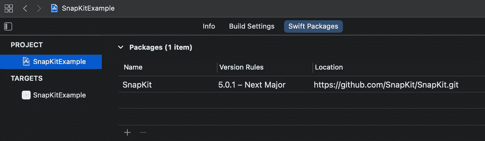

# 2.基本定位

基本定位包括左上、左下、上下、右下、顶宽、全幅、宽度、高度、居中、垂直居中和水平居中。

为了更好地理解，我宁愿举一些例子，而不是一个一个地讲解语法。

记住，要将两个约束附加到边上，我们首先需要指定宽度和高度。因此，在本例中，我们将创建几个框，并根据几个位置设置约束。看到下面的图像，我们想要实现的(四个框与约束在所有的角落和一个在中间)。

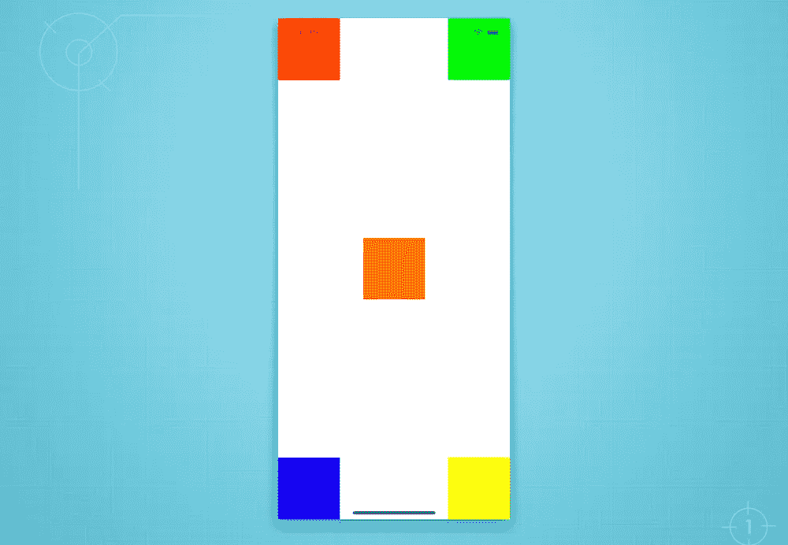

下面是带注释的代码。

总是将`addSubview()`视图放在约束之前，除非视图已经在`UIStackView`中。

## 从右向左(RTL)

你会注意到我用的是`.leading`而不是`.left`。是的，在你的约束中继续使用`.leading`或`.trailing`，这样它将自动支持 [RTL 模式](https://developer.apple.com/design/human-interface-guidelines/right-to-left/overview/introduction/)，并且不需要手动翻转视图。

## 垂直居中

现在，如何实现中间偏右或中间偏左？简单！SnapKit 有`.centerX`和`.centerY`，因此我们可以将其中一个或两个与`leading`、`trailing`、`top`或`bottom`组合。看下面的例子，我用`.centerY`修改了红色和绿色，使其垂直居中。你可以试着自己水平居中。

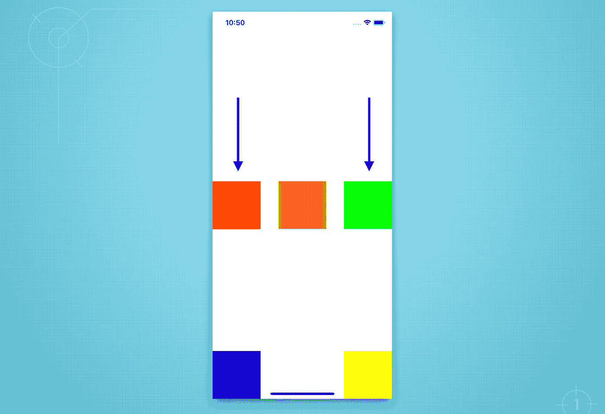

## 全宽顶部

请参见下面的示例，其中顶部的橙色框是全幅。我们只需要保持高度，将边缘附加到顶部，前导和尾随。

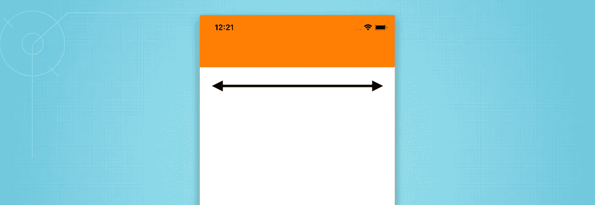

全宽顶部

# 3.超级视图与安全区域

从“超级视野”到“安全区域”很容易改变检查下面的例子，在这个例子中，角落里的所有盒子都被移出了安全区域。

基本上，语法`make.top.equalToSuperview()`等于`make.top.equalTo(view.snp.top)`，其中`view`是盒子超级视图。因此，我们所需要的只是将代码视图更改为安全区域语法。

```
make.top.equalTo(view.safeAreaLayoutGuide.snp.top)
```

看看下面更新的 UI 和代码。

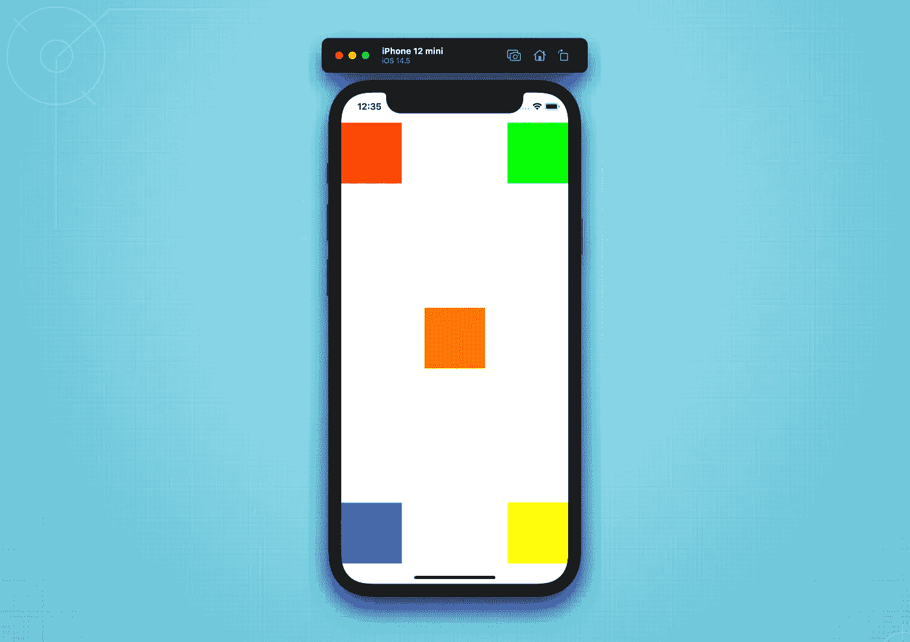

顶部和底部的安全区域

# 4.填料

为顶部、底部、前导和尾部添加填充有一些不同。

1)对于顶部和前导填充，偏移量的值始终大于 0。

2)对于尾部和底部填充，它总是小于 0。

请看下面的例子，首先让我们把填充分为两种常见的用法。

## 左上和右上

我们将为红框添加 80px 的`.top`和 40px 的`.leading`。此外，对于绿色框，我们将增加 80px。顶部和 40px 用于`.trailing`。看出区别了吗？只有尾部填充的值为-40px。

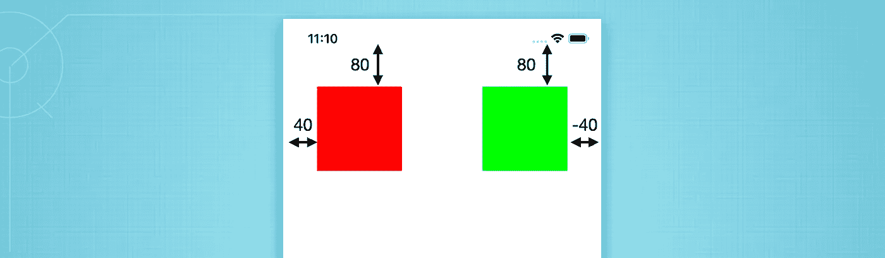

左上和右上

## 左下和右下

如上所述，底部和尾部偏移量总是有一个负值。

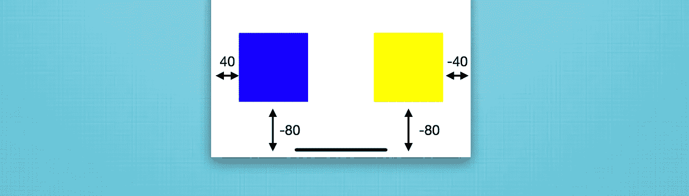

左下和右下

太好了。现在，我们已经学会了如何为这四个边添加填充。

再次注意，对于安全区域，我们只需要用`equalTo(view.safeAreaLayoutGuide.snp.top)`替换`equalToSuperView()`。

## 带插图的开头和结尾()

SnapKit 中的另一个技巧是将前导和尾随设置在一起。不用`offset(x)`和`offset(-x)`，我们可以一排用`inset()`。

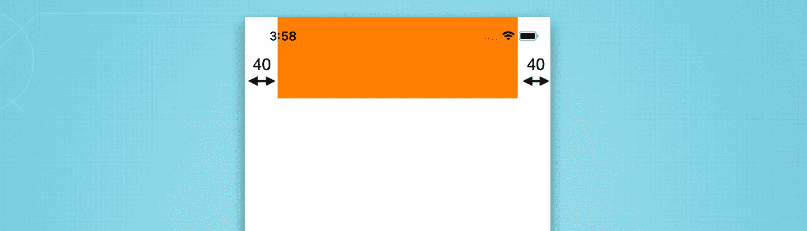

# 5.更新约束和动画

在 SnapKit 中，更新约束非常简单。我们不必维护一个变量。我们只需确保:

1.  之前已经添加了约束(存在)。否则，SnapKit 将在更新不存在的约束时引发错误。然后我们可以使用 SnapKit API 在闭包内进行修改。
2.  只需更新相关的约束，无需全部重写。

## 更新约束

请参见下面的示例，了解如何通过添加更多偏移来降低一点。我们将仅将顶部约束更新为 200 像素。

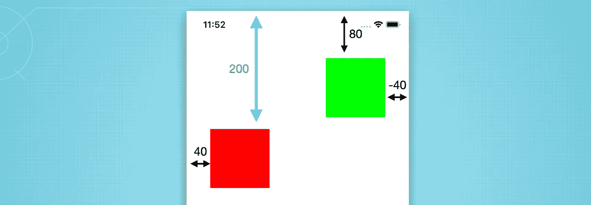

将顶部填充增加到 200 像素

## 动画约束更新

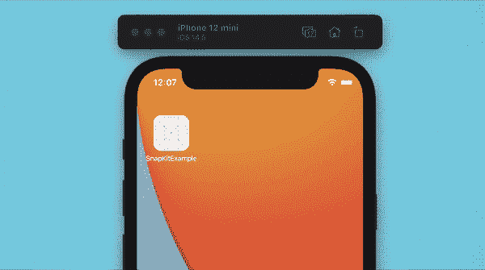

将更改包装在`animate()`闭包中，并调用`layoutIfNeeded()`。

哇，那太简单了！

# 6.使用乘数

乘数与宽度或高度以及父视图或另一个视图的比率相关。例如，我们将使用`multipliedBy()`使红色和绿色框的宽度为主视图宽度的一半(乘数= 0.5)。结果将类似于下面的例子。

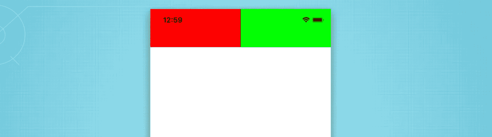

# 7.将约束附加到多个视图

这是一个非常有用的子主题，在实际场景中，一个视图可能以一定的填充大小附加到多个视图。

然而，你可能会注意到，在这个例子中，我们使用了`UIStackView`来用间距包装一些视图。它使我们的代码更加干净和易于管理，尤其是当我们需要执行快速变更的时候。为了快速预览，你可以尝试使用 UIKit 预览，正如在这个[教程](https://brontoxx.medium.com/uikit-live-preview-for-uiviewcontroller-and-uiview-f978fcc62a66)中所解释的。

看到下面的结果，我们将与代码开发。

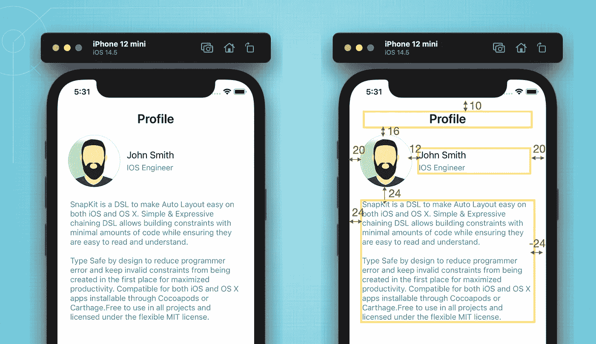

厉害！我们已经介绍了 SnapKit 中的所有基本功能。你可以试着在你的项目中一幕一幕地逐步实现它。

希望本文能帮助您提高开发技能。感谢阅读。非常欢迎反馈。编码快乐！

"学习，这是我们提高编码技能的方式."

# 参考

[https://developer . apple . com/design/human-interface-guides/right-to-left/overview/introduction/](https://developer.apple.com/design/human-interface-guidelines/right-to-left/overview/introduction/)

[https://developer . apple . com/library/archive/documentation/user experience/Conceptual/AutolayoutPG/index . html #//apple _ ref/doc/uid/TP 40010853-CH7-SW1](https://developer.apple.com/library/archive/documentation/UserExperience/Conceptual/AutolayoutPG/index.html#//apple_ref/doc/uid/TP40010853-CH7-SW1)

[https://developer . apple . com/library/archive/documentation/user experience/Conceptual/AutolayoutPG/programmaticallycreationconstraints . html](https://developer.apple.com/library/archive/documentation/UserExperience/Conceptual/AutolayoutPG/ProgrammaticallyCreatingConstraints.html)

[http://snapkit.io/docs/](http://snapkit.io/docs/)

[https://github.com/PureLayout/PureLayout](https://github.com/PureLayout/PureLayout)