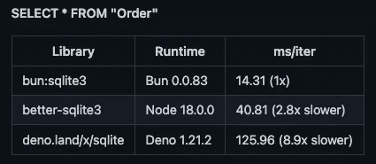

# 如何在 Bun、Deno 和 Node 中使用 SQLite

> 原文：<https://betterprogramming.pub/how-to-use-sqlite-in-bun-deno-and-node-66001a9c3dcb>

## 探究每种方法的优点和缺点


约翰·汤纳在 [Unsplash](https://unsplash.com?utm_source=medium&utm_medium=referral) 上的照片

# 什么是 SQLite？

SQLite 是一个提供关系数据库管理系统(RDBMS)的软件库。SQLite 中的 lite 意味着在设置、数据库管理和所需资源方面是轻量级的。

SQLite 是部署最广泛的 SQL 数据库引擎，它具有以下特性:

*   自包含:它需要来自操作系统或外部库的最少支持。因此很容易被嵌入 iPhones、Android 手机、游戏机、手持媒体播放器等。
*   无服务器:它与访问数据库的应用程序集成在一起。应用程序与 SQLite 数据库交互，并直接从存储在磁盘上的数据库文件中读取和写入。它不同于普通的 RDBMS，比如 [MySQL](https://en.wikipedia.org/wiki/MySQL) ，它需要一个单独的服务器进程来运行。SQLite 不需要服务器来运行。
*   零配置:没有要安装的包，没有要配置、启动和停止的服务器进程。SQLite 不使用任何配置文件。
*   事务性:所有事务都完全符合 ACID，即原子的、一致的、隔离的和持久的。

D.Richard Hipp 在 2000 年春天设计了 SQLite，数据库引擎是用 C 编程语言编写的。SQLite 1.0 于 2000 年 8 月 17 日发布。SQLite 3.0.0 于 2004 年 6 月 18 日发布。最新版本是 3.39.2。版本 3 维持了 18 年，[延续到](https://www.sqlite.org/changes.html)。

# 安装 SQLite

从 macOS X 10.4 及以上版本开始，SQLite 已经默认安装在 macOS 上。不过，这不是最新版本。下面是如何做到这一点:

运行`brew upgrade sqlite3`进行升级。

但是，它不会更新默认的 SQLite。而是更新`/usr/local/opt/sqlite/bin/sqlite3`。

家酿不会覆盖默认的 SQLite，因为它是 macOS 的默认 SQLite，覆盖它可能会以一些意想不到的方式破坏系统。

SQLite 也可以从[下载页面](https://www.sqlite.org/download.html)安装。`sqlite-tools-osx-x86–3390200.zip`是用于 Mac OS X (x86)的预编译二进制文件——管理 SQLite 数据库文件的命令行工具包，包括`sqldiff`、`sqlite3`和`sqlite3_analyzer`。

`sqlite3`是 SQLite 的命令行实用程序，它允许用户针对 SQLite 数据库手动执行 SQL 语句。

在本文中，我们将展示以下使用 SQLite 的方法:

*   在命令行 shell 中使用 SQLite
*   在 Bun 脚本中使用 SQLite
*   在 Deno 脚本中使用 SQLite
*   在节点脚本中使用 SQLite

我们将比较 Bun、Deno 和 Node 如何连接和使用 SQLite。

# 在命令行 Shell 中使用 SQLite

我们可以使用 macOS 默认的 SQLite，或者自制安装的 SQLite，或者下载的 SQLite 来运行命令。

在下面的例子中，我们使用自制安装的 SQLite。键入带有完整路径的`sqlite3`来启动命令行 shell:

如果显示的是`...>`，而不是执行结果，通常是由于缺少终止`;`或缺少匹配`'`造成的。

*   在第 1 行，`SELECT`语句用于执行一个简单的计算。
*   在第 2 行，它显示了结果`2`。
*   第 3 行没有终止。
*   第 4 行以`;`结束。
*   第 5 行显示了结果，`2`。
*   第 6 行没有终止。
*   第 7 行以`'`结束。
*   第 8 行以`;`结束。
*   在第 9 行，显示了结果，`2`。

除了 SQL 语句之外，命令行 shell 还支持点命令，这些命令在左边以`.`开始，前面没有空格。

SQLite 数据库是存储在磁盘上的文件。我们可以使用`sqlite3`来打开一个特定的数据库文件。如果文件不存在，将创建一个新文件。

*   在第 1 行，在当前目录中创建了一个新的数据库文件。
*   在第 4 行，执行`.databases`命令。
*   在第 5 行，它列出了附加数据库的名称和文件。

我们使用以下代码创建了`students`表，该表已经在一篇 [MySQL 文章](/set-up-and-use-mysql-in-create-react-app-environment-22a4c7dc077f)中使用过:

*   在第 1 行，创建了一个名为`students`的表。该表有`id`、`name`、`age`和`grade`列。此外`name`是一个最大长度为 255 的变长字符串。其他列是整数。
*   在第 2 行，执行`.tables`命令。
*   在第 3 行，它列出了表名。
*   在第 4 行，一条新记录被插入到`students`中。
*   在第 5 行，它选择来自`students`的数据。
*   在第 6 行，显示新添加的记录。

数据库文件存储在磁盘上:

SQLite 中的所有 SQL 命令都与 MySQL 相同。但是，SQLite 更加轻量级——自包含、无服务器、零配置和事务性。

# 在 Bun 脚本中使用 SQLite

Bun 是一个快速、现代、一体化的 JavaScript 运行时，内置了本机 bundler、transpiler、task runner 和 npm 客户端。Bun 是零配置的，支持开箱即用的 TypeScript。

`bun:sqlite`是一个高性能的 SQLite3 模块，可以用来执行 SQLite 语句。`bun:sqlite`内置于`bun.js`中，除了 Bun 本身没什么可安装的。在之前的一篇文章中，我们已经提供了如何安装 Bun 的详细步骤。

下面是创建`students`表的 Bun 脚本。

*   在第 1 行，`Database`是从`bun:sqlite`导入的。
*   在第 3 行，从文件`mybun.db`创建了一个数据库连接。如果文件不存在，将生成一个新文件。
*   在第 4–6 行，创建了一个名为`students`的表格。该表有`id`、`name`、`age`和`grade`栏。此外`name`是一个最大长度为 255 的变长字符串。其他列是整数。
*   在第 7 行，一条新记录被插入`students`。
*   在第 8 行，它选择来自`students`的数据，并在控制台上显示结果。

执行这个 TypeScript，我们会看到一个学生记录的结果数组(第 3 行)。由于 Bun 对它的速度很自豪，所以它总是显示执行命令的时间(第 2 行)。

执行后，数据库文件存储在磁盘上，代码如下:

对于我们的小代码片段，性能并不重要。不过 Bun 确实号称比 Node 和 Deno 快。



图片来自[https://github.com/oven-sh/bun#bunsqlite-benchmark](https://github.com/oven-sh/bun#bunsqlite-benchmark)

# 在 Deno 脚本中使用 SQLite

[Deno](https://en.wikipedia.org/wiki/Deno_(software)) 是基于 V8 JavaScript 引擎和 Rust 编程语言的 JavaScript、TypeScript 和 WebAssembly 的运行时。它有安全的默认值和良好的开发者体验。名字是 node 的变位词，也是 DEstroy NOde 的首字母缩写。

在 macOS 上，我们可以使用 homebrew 安装 Deno，命令如下:

```
% brew install deno
```

与节点支持命令`node`、`npm`和`npx`不同，Deno 只有一个可执行文件`deno`。关于 Deno 的更多细节，请查看这篇文章。

Deno 为 Deno 脚本提供托管服务`[https://deno.land/x](https://deno.land/x)`。它缓存存储在 GitHub 上的开源模块，并在一个易于记忆的域中提供服务。`[https://deno.land/x/sqlite/mod.ts](https://deno.land/x/sqlite/mod.ts)`是 Deno SQLite 模块，使用时下载到本地缓存。Deno 也是零配置。

下面是创建`students`表的 Deno 脚本:

*   第 1 行`DB`是从`[https://deno.land/x/sqlite/mod.ts](https://deno.land/x/sqlite/mod.ts.)` [导入的。](https://deno.land/x/sqlite/mod.ts.)
*   在第 3 行，从文件`mydeno.db`创建了一个新的数据库连接。如果文件不存在，将生成一个新文件。
*   在第 4–6 行，创建了一个名为`students`的表格。该表有`id`、`name`、`age`和`grade`栏。此外`name`是一个最大长度为 255 的变长字符串。其他列是整数。
*   在第 7 行，一条新记录被插入到`students`中。
*   在第 8 行，它选择来自`students`的数据，并在控制台上显示结果。

执行此类型脚本。由于 Deno 有安全的默认值，我们必须回答许多问题，以允许在`mydeno.db`(第 2-3 行)上读取，允许在`mydeno.db`(第 4-5 行)上写入，允许在`mydeno.db-journal`(第 6-7 行)上读取，允许在`mydeno.db-journal`(第 8-9 行)上写入。最终，我们会看到由 1 个学生记录组成的数组(第 10 行)。

执行后，数据库文件存储在磁盘上:

Deno 脚本的工作方式类似于 Bun 脚本。

# 在节点脚本中使用 SQLite

[Node](https://en.wikipedia.org/wiki/Node.js) 是一个开源、跨平台、后端的 JavaScript 运行时环境，运行在 JavaScript 引擎上，在 web 浏览器之外执行 JavaScript 代码，旨在构建可扩展的网络应用。

[节点可以通过 NVM](/5-major-features-of-node-js-18-5f4a164cc9fc) 安装。以下是安装节点 18.0.0 的示例:

`better-sqlite3`是 SQLite3 的节点包。因为节点不是零配置，所以必须首先安装软件包。

我们重用 [Create React App](/an-in-depth-guide-for-create-react-app-5-cra-5-b94b03c233f2) 作为工作环境:

```
% npx create-react-app my-app
% cd my-app
```

设置`better-sqlite3`:

```
% npm install better-sqlite3
```

`better-sqlite3`成为`package.json`中`[dependencies](/package-jsons-dependencies-in-depth-a1f0637a3129)`的一部分:

由于 Node 不支持现成的 TypeScript，我们将编写一个 JavaScript 文件来简化设置。

另外，[节点不支持开箱即用的 es 模块](/what-might-be-coming-in-npm-9-6985cf2678a6)。一种解决方案是以扩展名`.mjs`结束脚本名称，以指示它使用 ES2015 模块符号。

下面是创建`students`表的节点脚本:

*   在第 1 行，`Database`是从`better-sqlite3`导入的。
*   在第 3 行，从文件`mynode.db`创建了一个新的数据库连接。如果文件不存在，将生成一个新文件。
*   在第 4–6 行，创建了一个名为`students`的表。该表有`id`、`name`、`age`和`grade`列。此外`name`是一个最大长度为 255 的变长字符串。其他列是整数。
*   在第 7 行，一条新记录被插入`students`。
*   在第 8 行，它选择来自`students`的数据，并在控制台上显示结果。

执行这段 JavaScript。`better-sqlite3`沿途回显 SQL 语句(第 2 行、第 3 行和第 4 行)。最后，我们看到一个学生记录的结果数组(第 5 行)。

执行后，数据库文件存储在磁盘上。代码如下:

与 Bun 或 Deno 脚本相比，Node 脚本需要更多的设置。

# 结论

我们已经看到 SQLite 是一个轻量级的关系数据库管理系统。它是独立的、无服务器的、零配置的和事务性的。

我们就如何连接和使用 SQLite 对 Bun、Deno 和 Node 进行了比较。显然，Bun 和 Deno 更先进，因为它们支持现成的 TypeScript，并且是零配置的。

是时候搬出 Node 了吗？Bun 或者 [Deno 准备好黄金时段](/is-deno-ready-for-primetime-a1ea5cd4bea1)了吗？

感谢阅读。

```
**Want to Connect?**If you are interested, check out [my directory of web development articles](https://jenniferfubook.medium.com/jennifer-fus-web-development-publications-1a887e4454af).
```