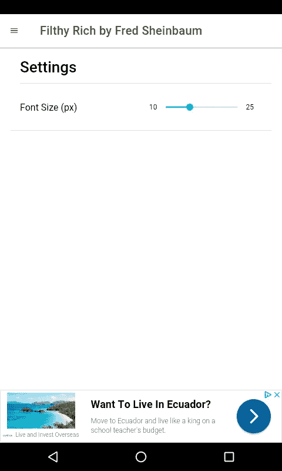
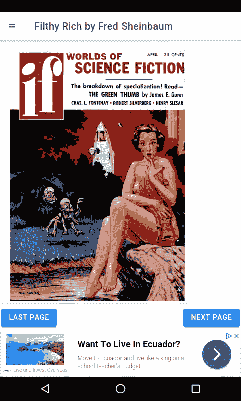

# 如何在你的 Ionic 应用中使用 SQLite

> 原文：<https://betterprogramming.pub/how-to-use-sqlite-in-your-ionic-app-ef441f4933ca>

## 将古腾堡项目中的开源书籍转化为应用程序


SQLite 是一个用于 Android 应用程序的通用数据库，因为它很小，可移植，并且使用通用的 SQL 语法。大多数数据库驱动的 Android 应用程序都使用 SQLite。使用 SQLite 原生插件将它集成到 Ionic 应用程序中也很容易。

古腾堡计划是一项数字化和存档文化作品的志愿者工作，其图书馆中包含大量书籍。它既存储有版权的书籍，也存储公共领域的书籍。它们有多种格式可供任何人下载。然而，它们不能作为独立的应用程序使用。

在这一块，我们将把它们转换成一个应用程序。您可以添加许多功能，如字体大小调整、书签、文本到语音等。然而，我们将保持简单。我们的应用程序将允许你阅读这本书，调整字体大小，并保存字体设置。

为了实现这一点，我们将它构建为一个 Ionic 应用程序，它使用 Angular 框架作为其基础。这允许你构建一个 Angular 应用程序，作为一个具有一些原生功能的 Android 应用程序。

因为我们的应用程序是一本书，它只需要一个简单的本地特性，SQLite 数据库访问。为了将古腾堡电子书转换为应用程序，我们提取 ePub 文件，将提取的内容加载到 SQLite 数据库中，将内容转储到`.sql`文件中，然后通过 Ionic 的 SQLitePorter 本机插件将其导入到我们的应用程序中。

在这个练习中，我们将下载古腾堡的《肮脏的财富》一书，并将其转换成 Android 应用程序。

ePub 只是一个带有一些额外元数据的 ZIP 存档，所以我们可以使用任何存档工具提取它。解压缩之后，您应该会看到一堆 HTML 文件。然后我们编写以下 Python 脚本:

该脚本读取提取的 HTML 文件，并将其加载到 SQLite 数据库中，每个条目一个文件。在加载之前，我们用普通的 div 标签替换 body 标签，因为我们的应用程序中已经有一个 body 标签。此外，我们改变了图像路径到`assets`文件夹，这样它们可以留在我们的应用程序项目文件夹的`assets`文件夹中。

我们通过运行以下命令来运行脚本:

```
C:\epub-to-sqlite\epub-to-sqlite.py C:\epub-to-sqlite\pg59849-images\OEBPS filthy-rich
```

假设所有东西都在这些文件夹中的正确位置，它应该是成功的。如果没有，请相应地更改路径。`filthy-rich`是数据库名称。`C:\epub-to-sqlite\pg59849-images\OEBPS`是 ePub 的 HTML 文件所在的位置。

接下来，我们用 DB Browser for SQLite 打开 SQLite 文件，可以在 https://sqlitebrowser.org[的](https://sqlitebrowser.org/)买到。打开我们生成的 SQLite 数据库，然后单击文件菜单和路径，导出→数据库到 SQL 文件并转储`sections`表。将 every 保留为默认值。确保下拉菜单上的最后一个选项是“覆盖旧模式”(删除表，然后创建表)。这确保书籍的内容总是在加载时导入。

现在我们可以编写应用程序了。如果你不熟悉构建 Ionic 应用程序，这里的[是一篇很好的文章供你阅读。](https://medium.com/@hohanga/how-to-build-android-apps-with-ionic-framework-5e3c2fdf2a1)

我们像往常一样用`ionic new filthy-rich sidemenu`搭建应用程序，其中`filthy-rich`是应用程序名称。然后，我们将 SQLite 转储文件复制到 app 文件夹中的一个新文件中。将新文件命名为`sql.ts`。

现在是时候翻开新的一页了。运行`ionic g component homePage`、`ionic g component endPage`和`ionic g component sectionPage`。我们需要存储当前页面被集中读取的状态，所以我们必须使用`@ngrx/store`。这可以通过运行`npm i @ngrx/store.`来安装

当我们运行`ng add @ngrx/store`时，你应该会看到一个`reducers`文件夹。在那里，应该有一个`index.ts`文件。我们还必须为我们的 reducer 创建一个文件来存储当前页面。这是通过将当前目录更改为`reducers`文件夹并运行`ng g class pageReducer`来完成的。

打开 Genymotion 仿真器后，我们通过运行`ionic cordova run android -l`来运行我们的应用程序，如这里的[所示](https://medium.com/@hohanga/how-to-build-android-apps-with-ionic-framework-5e3c2fdf2a1)，其中`-l`用于实时重新加载。

现在我们添加一些代码。在`page-reducer.ts`中增加:

在`reducers/index.ts`中，我们应该有:

在`home-page.component.ts`中，我们用以下内容替换现有内容:

我们利用 SQLite 插件打开数据库，加载每个部分，并显示标题。`currentPage`存储在本地存储器中。在`home-page.component.html`中，我们有:

这将显示每个部分的标题以及指向主页和设置页面的链接。

在`end-page.component.html`中，我们有:

在`section-page.component.html`中，我们有:

我们获取字体大小和当前页面，这样我们就可以显示当前页面，并且根据您所在的页面，显示后退和前进按钮。如果您在倒数第二页，那么“下一页”按钮将转到最后一页。如果没有，则进入下一页。右侧部分将从查询参数中的部分编号中检索。

`section-page.component.html`将有:

这将显示内容。

在`app.component.ts`中，我们有:

这是我们的应用程序的入口点，所以我们使用 SQLitePorter 将所有数据加载到数据库中，因为没有办法使用预加载数据的数据库。

在`app.component.html`我们有:

这将显示我们的侧菜单。

在`app.module.ts`我们有:

在`app.routing.module.ts`中，我们有自己的路线:

我们现在可以导航到我们的页面。

最后，我们有一个设置页面来保存书籍文本的字体大小。

在`settings-page.component.ts`中，我们有:

那么在`settings-page.component.html`中我们有:

`ion-range`滑块用于调整字体大小并保存。

最后，我们将图像从提取的 ePub 复制到`assets`文件夹中，这样我们就可以看到图像了。

最后我们得到了这个:



最终产品在此发布[。](https://play.google.com/store/apps/details?id=com.filthyrich.book)

**注意:只制作像这样的来自公共领域书籍的应用。将受版权保护的书籍转换成应用程序是非法的。**