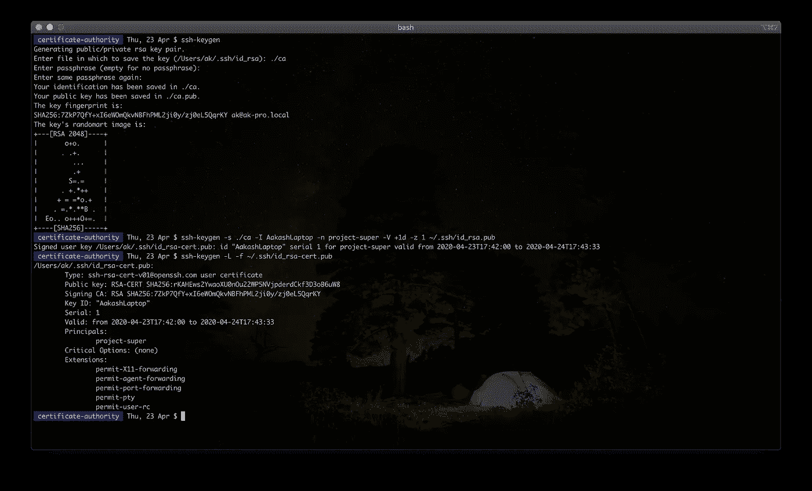
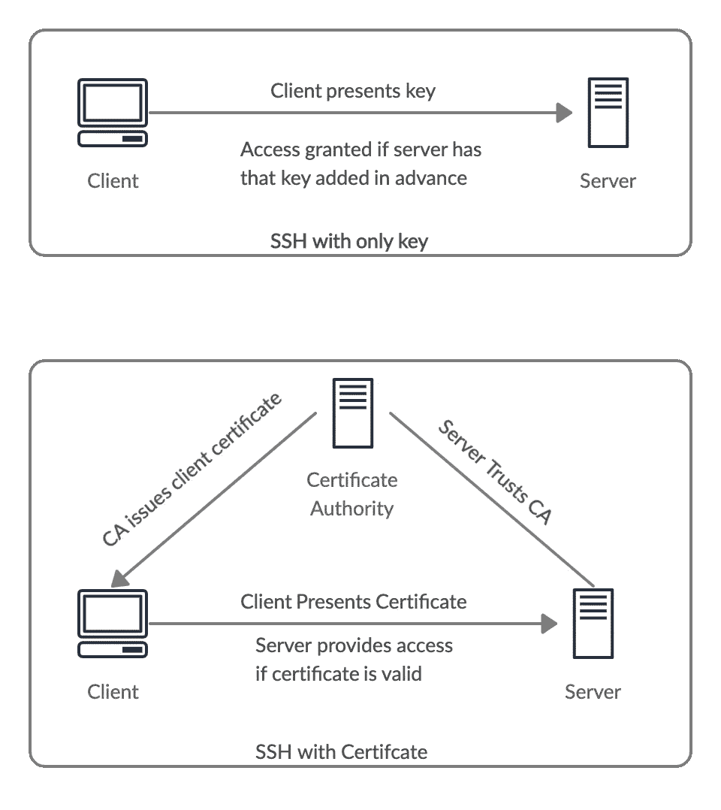
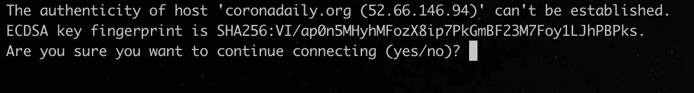
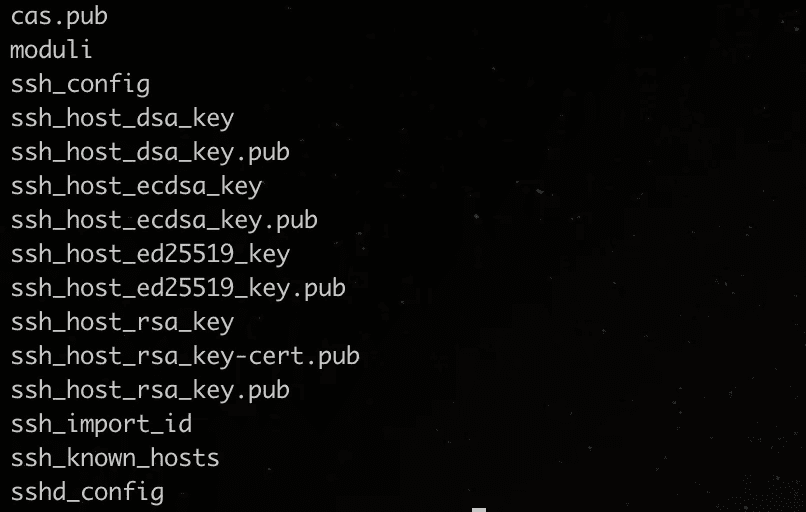
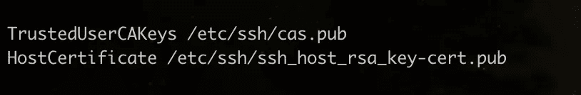
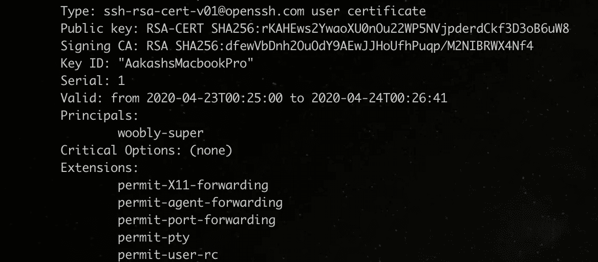

# 如何使用 SSH 证书实现可伸缩、安全和更加透明的服务器访问

> 原文：<https://betterprogramming.pub/how-to-use-ssh-certificates-for-scalable-secure-and-more-transparent-server-access-720a87af6617>

## 更好的 SSH

图片来源:作者

SSH 是几乎所有访问服务器的人使用的标准工具。然而很少有人知道 SSH 证书。我们仍然坚持将我们的公钥复制并粘贴到服务器上，这不是最有效、可伸缩或透明的方法。

复制粘贴钥匙这种好的老办法有什么问题？

*   **可伸缩性**:当有多台服务器和多个用户时，可管理性不是很好。
*   **安全性:**不检查服务器的身份。当您连接到`myserver.com`时，无法确定您实际上是在连接您想要的服务器。还有，一旦你把用户的公钥加到了服务器上，就没办法再有 2FA 了，这在现在是非常必要的。
*   **灵活性**:没有办法给基于时间的访问。有时，您可能需要一个小时左右的访问时间。你不能真的这么做。
*   **透明度**:在`/var/log/auth.log`可以找到`ssh`认证日志。试着找出谁在什么时候登录了服务器。这是可行的，但不是一件容易的事。如果不容易搞清楚，那就是不透明。

那么 SSH 证书如何解决这个问题呢？让我们设置基于证书的身份验证并找出答案。

使用简单的密钥 SSH，有两个玩家:

*   客户端(即您的 PC/笔记本电脑)
*   计算机网络服务器

当服务器识别出客户端的公钥，并且客户端可以证明它实际上是公钥的所有者时，客户端登录到服务器。

对于 SSH 证书，我们还有一个玩家:

*   认证机构(CA)

证书颁发机构的作用是什么？服务器不再需要识别每个客户端的公钥，而只需要识别认证机构(或 CA 的公钥)。

现在，如果我们不将客户机的公钥添加到服务器，服务器如何决定将访问权授予谁呢？

CA 向客户端颁发证书，客户端将该证书提交给服务器。如果服务器识别出发布 CA 的证书并且该证书是有效的(即，具有有效的签名、未过期以及一些其他重要的事情)，则服务器允许访问。

这里需要注意的更重要的一点是，使用证书不会消除密钥。密钥仍然以同样的方式用于加密。为一些附加功能添加证书，如访问管理、访问过期等。

# 设置步骤

设置 SSH 证书基础设施的步骤:

1.  设置证书颁发机构。
2.  配置服务器以识别 CA。
3.  颁发客户端证书。

# **1。建立一个认证机构**

证书颁发机构就是一对公钥和私钥。私钥用于签署证书，公钥将通过安全通道分发，用于验证证书的签名。

当公钥应该公开共享时，为什么要通过安全渠道分发呢？

这里的问题不是公钥的机密性(它不是机密的)。我们的问题是公钥的完整性。如果没有安全地分发，它可能被篡改或被另一个密钥替换。如果服务器配置了错误的公钥(其私钥在其他人手中)，则服务器信任该其他人。

为了实现，您可以在本地机器上创建一个 CA。

使用以下方法生成密钥对:

`ssh-keygen -t rsa -f ca_key`

这将在目录中创建两个文件:公钥`ca_key.pub`和私钥`ca_key`。并且您有自己的证书颁发机构。使用正确的权限保护此目录。

# 2.配置服务器以识别 CA

要用新创建的 CA 配置服务器，只需在 SSH 配置`/etc/ssh/sshd_config`中添加 CA 的公钥`TrustedUserCAKeys`。

创建一个文件`/etc/ssh/ca.pub`并将 CA 的公钥粘贴到这个文件中。

现在在`/etc/ssh/sshd_config`的末尾加上`TrustedUserCAKeys /etc/ssh/ca.pub`。

确保使用`sudo service sshd restart`重启`sshd`服务。

并且您已经将服务器配置为信任您的 CA。

# 3.颁发客户端证书

这将在 CA 服务器上完成。我假设您现在使用本地系统作为 CA。

转到您生成 CA 密钥的 CA 文件夹。您将使用 CA 的私钥签署证书。您还需要传递客户端的公钥(将被签名)和一些其他参数。

您的默认 SSH public 可以在`~/.ssh/id_rsa.pub`找到，假设它存在。

*   `-s`:用于签署证书的私钥
*   身份(这将在所有日志中显示，所以要让它有意义，比如开发人员的名字。)
*   `-n` : principals(表示用户在服务器上可以访问什么，接受多个逗号分隔的值。)
*   `-V`:有效期(`+1d`表示从现在开始到以后一天内有效。)
*   `-z`:序列号(当您向单个客户端颁发多个证书时，这有助于跟踪。它也将与身份一起被记录。)

该命令将在`Users/aakash/.ssh/id_rsa-cert.pub`生成一个证书。

现在你可以在`ubuntu@myserver.com`简单地 SSH，你就会被允许访问，但只是从现在开始到以后的某一天。证书将在此之后过期，您将不再拥有访问权限。在那之后你需要得到一个新的证书。

让我们暂停一下，看看我们解决了哪些问题。

*   **可伸缩性**:您可以创建一个 CA 服务器(确保该服务器的安全性，如果可能的话，只允许通过 VPN 或本地网络访问),公开一个 web 应用程序，该应用程序将对组织用户进行身份验证，请求一个 2FA，然后相应地颁发证书。如果你使用 G 套件的话，可能需要一个支持 2FA 的 Google OAuth。这个系统变得非常可扩展。
*   **安全性**:通过在短时间内颁发证书，您可以最大限度地降低在笔记本电脑丢失或被盗的情况下未经授权访问服务器的风险。
*   **灵活性**:通过您可以配置证书的所有选项，您实现了灵活性。
*   **透明性**:现在当你检查日志的时候，你会看到这样的消息:`Accepted publickey for ubuntu from 106.202.115.141 port 48343 ssh2: RSA-CERT ID AakashsLaptop (serial 1) CA RSA SHA256:dfewVbDnh2OuOdY9AEwJJHoUfhPuqp/M2NIBRWX4Nf4`，这显然是调试容易多了。

但是在我们当前的设置中仍然有两个问题:

*   **主机验证**:我们目前的设置仍然没有任何验证主机身份的规定。
*   **多台服务器同名**:很有可能你有多台服务器同名(`ubuntu`、`root`)。如果您使用主体`ubuntu`颁发证书，您将为`ubuntu`用户授予对信任您的 CA 的所有服务器的访问权。

# 主机验证

当您第一次连接到服务器时，您将看到如下消息:

这表示您正在连接的服务器无法验证，尽管它实际上是您想要连接的服务器。您应该手动将这个密钥指纹(公钥的 SHA256 哈希)与服务器的公钥进行匹配。你做过吗？大多数时候，答案是否定的。

一旦你说是，它会把公钥保存在`~/.ssh/known_hosts`里，再也不会问你了。如果您想看到这个消息，只需转到这个文件并删除您正在连接的服务器行。

您已经看到了当前方法的问题所在，所以现在尝试证书方法。正如您向客户端颁发证书一样，您也将向主机颁发证书。有一点小小的不同。对于主机证书，包含客户端被授权的`usernames`的主体将包含`hostnames`。

您必须将服务器的主机公钥复制到 CA 的文件中进行签名，然后将签名的证书传输回服务器。你可以在`/etc/ssh/`中找到服务器的主机密钥。一个`ls`命令会给出这样的内容:

您会注意到有许多主机键。这是因为服务器必须支持不同类型的算法。为了这个教程，就挑`ssh_host_rsa_key.pub`吧。

将其复制到 CA 服务器上的文件中，并运行命令:

`-h`:表示您正在签署主机密钥的标志

`-Z`:将证书绑定到主机(这里我使用`*.mydomain.com`来表示`mydomain.com`的所有子域)

这将创建一个`ssh_host_rsa_key-cert.pub`，您必须将它复制到服务器(在`/etc/ssh/`目录中)。您还需要将它作为`HostCertifcate`添加到`sshd_config`中，就像这样:

重新启动`sshd`服务后，配置中的更改才会反映出来。

现在服务器有了主机证书，我们还需要配置客户机信任 CA 的公钥。在`~/.ssh/known_hosts`中添加一行 CA 的公钥，如下所示:

现在连接`ssh ubuntu@dev.mydomain.com`时，主机会出示主机证书。您将不再看到“无法验证主机真实性”消息，因为主机验证是自动处理的。如果你还是看到这条消息，不要盲目点击是。检查你为什么面临这个问题。

# **多个服务器使用相同的用户名**

当您使用用户名发布证书时，比方说`root`，您将允许访问所有信任您的证书颁发机构的服务器。

您需要为主体创建一个策略并将它们映射到用户名，而不是在主体中发布证书`username`。您可以通过使用`AuthorizedPrincipalsFile`来完成此操作。只需将此添加到服务器的`sshd_config`中:

`AuthorizedPrincipalsFile /etc/ssh/auth_principals/%u`

当你`ssh ubuntu@myserver.com`时，证书服务器将查看`woobly-super`是否在文件`etc/ssh/auth_principals/ubuntu`中(注意配置中的`%u`)。如果文件有`woobly-super`，那么您将被登录。

您可以使用 ssh-keygen -L -f <cert_path>获取证书信息</cert_path>

让我们设计一个委托人策略。一个典型的场景是，一些用户被允许基于角色访问一些服务器，一些用户被允许访问一个项目中的所有服务器。

通常，一些开发人员只允许访问开发服务器，DBA 只允许访问数据库服务器，QA 只允许访问测试服务器，一小部分人可以访问所有的服务器，包括生产服务器。

一种方法是为每个组创建委托人，并相应地使用`principles`发布证书:

*   `project-dev`:项目开发者
*   `project-dba`:数据库管理员
*   `project-qa`:项目测试人员
*   `project-super`:应该可以访问所有服务器的人

现在，对于不同类型的服务器，创建主体文件(`/etc/ssh/auth_principals/ubuntu`)并像这样放置主体:(`\n`用于下一行，因为您必须每行放置一个主体)

*   开发服务器:`project-dev\nproject-super`
*   数据库服务器:`project-dba\nproject-super`
*   测试服务器:`project-qa\nproject-super`
*   生产服务器:`project-super`

这可以根据您的需求而有所不同。也许开发人员也可以访问数据库服务器，或者测试服务器，或者其他一些可能性——做相应的调整。

警告:即使在使用`AuthorizedPrincipalsFile`时，如果在 principals 中使用用户名(比如说`ubuntu`)提交证书，它仍然可以工作。所以一定不要用`usernames`签发证书。

您还可以通过`Critical Options`中的`force-command`来限制执行什么命令。假设某人只被允许在服务器上部署。你可以为此出具证明。

一开始可能会让人不知所措，但其好处超过了任何最初的复杂性。这就是 SSH 证书如何提供可伸缩、安全、灵活和透明的基础设施。