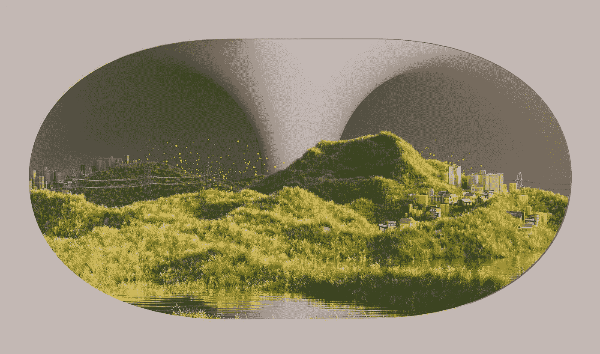
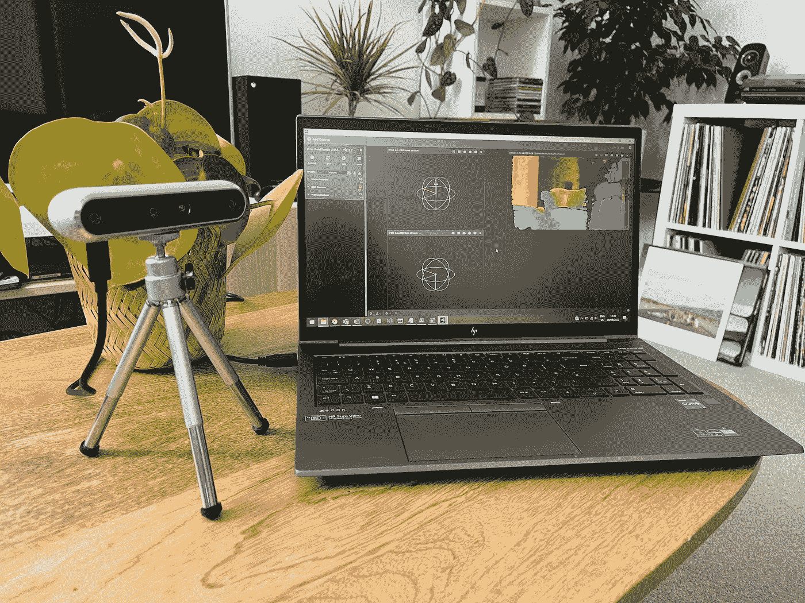
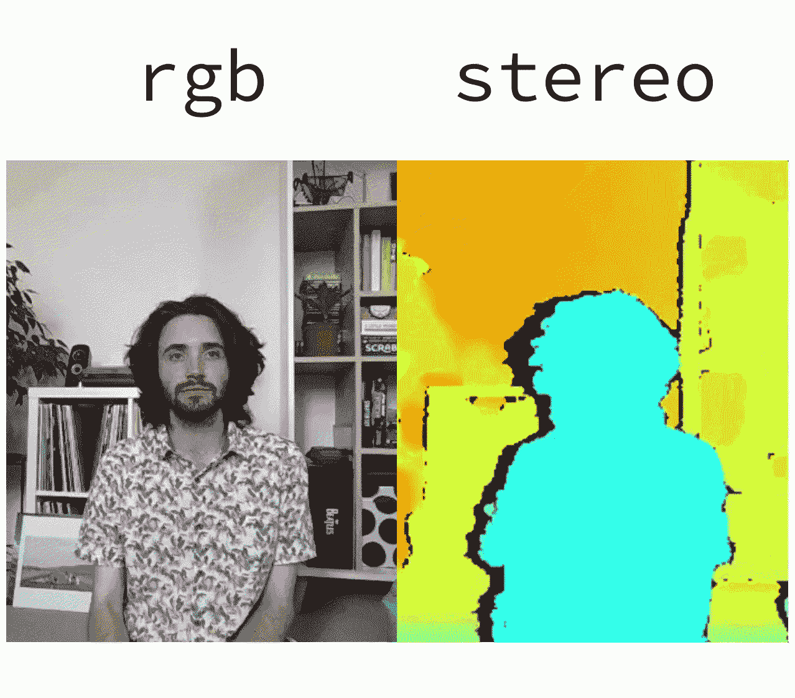
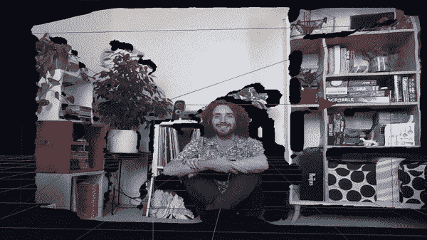
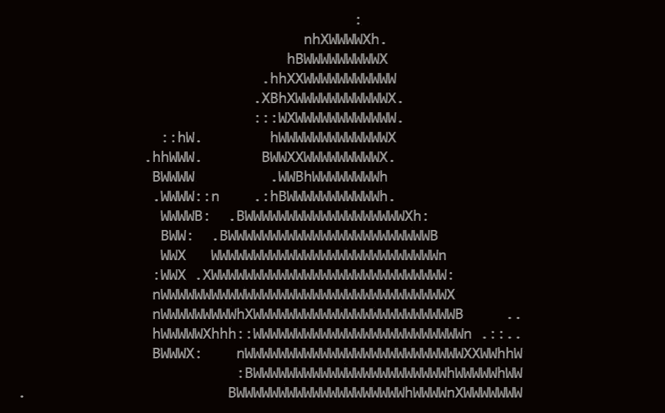

# 如何用立体相机看 3D！

> 原文：<https://betterprogramming.pub/how-to-use-stereo-cameras-to-see-in-3d-8dfd955a1824>

## AR/VR/3D

## 标准相机缺乏深度感知，但这对于英特尔的 RealSense 立体相机来说不是问题



照片由 [DeepMind](https://unsplash.com/@deepmind?utm_source=unsplash&utm_medium=referral&utm_content=creditCopyText) 在 [Unsplash](https://unsplash.com/@deepmind?utm_source=unsplash&utm_medium=referral&utm_content=creditCopyText) 上拍摄

*你*是如何理解深度的？是什么让你的眼睛能够判断一个物体是近是远？只有一个镜头的标准相机(或者可能是独眼巨人)对距离没有概念。然而，通过模仿我们并增加第二只眼睛，相机可以开始了解事物有多远。虽然这是对我们视觉的巨大简化(你闭着一只眼睛仍然有深度感知)，但这是立体相机的指导原则。如果两只眼睛能让你看到深度，那么两台相机也应该如此！像这样的相机被称为“立体”相机——这篇文章是关于英特尔制造立体相机的尝试。



英特尔实感 D455 和实感查看器软件

让我们想想计算机如何理解深度的另一种(可能更著名)方法:激光雷达传感器。这些工作原理是激光从表面反弹，通过了解激光返回传感器需要多长时间，你可以计算出物体有多远。激光雷达非常精确，但它也有一些局限性。这项技术不能在阳光直射或黑色表面上工作。你可能会问:如果激光雷达有两大缺点，为什么它会被如此广泛地使用？你怎么能把它用在自动驾驶汽车上呢？

通常，激光雷达不会单独使用，而是与其他摄影测量方法结合使用，以生成 3D 模型或了解世界。我们可以将激光雷达与另一种感知深度的方法进行比较:立体相机。事实上，英特尔正在停止他们的激光雷达相机消费系列，选择只专注于立体。立体相机在阳光下工作良好，表面为黑色，即使它们缺乏激光雷达可以达到的分辨率。

最近，我有机会与开发立体摄像机的英特尔团队成员谈论这项技术。后来，我很想知道更多关于它们是如何工作的，以及我们会发现哪些局限性。它们有多精确？它们的易用性如何？我们能用它们生成 3D 模型吗？本文是我研究一系列生成 3D 模型的方法并更好地理解计算机视觉技术的系列文章的一部分。通过在公共场所工作，希望其他正在学习的人可以在这里找到有用的东西。英特尔的网站给出了大量令人兴奋的使用案例，让我们开始看看它们，以及如何使用相机。

# 在 3D 中观看

安装 [SDK](https://github.com/IntelRealSense/librealsense/releases/tag/v2.50.0) 让我们可以访问 RealSense Viewer，这是与相机交互的主要方式(无需使用代码)。在这里，我们可以访问相机接收的标准(rgb)输入，以及来自立体相机配置的深度信息。让我们看看我在 rgb 和立体声中的样子:



我，在正常的 RGB 更多，然后我，但有深度知觉。

虽然左边的 rgb 图像可以被识别为“普通”照片，但立体图像包含一条新的信息——深度。我们看到蓝色代表离屏幕更近的东西，橙色代表离屏幕更远的东西。黑色的“阴影”是我身后的空间，相机看不到，因此无法收集深度数据。目前，大胆的颜色给人一种缺乏分辨率的印象(颜色似乎模糊了颗粒信息)，但事实并非如此。正如我们将在后面看到的，大量的信息正在被收集。

# 制作模型

现在我们可以理解相机接收数据的形式，我们可以尝试用它做些什么。一个用例是从数据中创建 3D 模型，这正是我们将要开始的地方。RealSense viewer *几乎*有能力做到这一点，但还没有完全实现。让我们尝试一下，然后研究如何更进一步。

## 用手

我之前做的 gif 是在 RealSense 认为的 2D 模式下完成的。它是二维的，从某种意义上说，即使我们有深度信息，我们也没有输出一个可以移动的三维模型。切换到 3D 模式可以让我们创建一个可以移动的场景。然而，这里的主要限制是你不能移动摄像机来收集更多的数据。相机和视图中的对象必须保持静止。相比之下，你可以阅读我在 NVIDIA 的 NeRF 工具包上的[上一篇文章](https://towardsdatascience.com/using-ai-to-generate-3d-models-2634398c0799?source=your_stories_page-------------------------------------&gi=e19623e4a965)，在那里你可以用手机生成身临其境的 3D 模型。因此，通过查看器中的可用选项，我们将生成如下所示的 3D 模型:



一个 3D 版的我，在我的客厅里，由 RealSense 相机制作。

嘿，看，又是我！正如我之前提到的，尽管上一张图片中的热图看起来像是相机没有收集到太多数据，但我们可以从这里看到我们收集到了。即使我们没有移动相机，让它从一个新的角度来看这个场景，我们可以从书架上看到，在较小的程度上，我也可以看到，已经收集了很多深度数据。令人印象深刻，尤其是因为我们还没有移动摄像机。

需要指出的是:虽然获得这些以前的图片很容易，但它确实让我重新考虑了一些事情。英特尔提供了一系列 RealSense 相机，在购买相机之前考虑您想要做的应用非常重要。产品线中的不同相机提供不同的快门选项或过滤器，但重要的是，它们对物体聚焦的长度也不同。D455(我们拥有的那款)只能聚焦于半米以外的物体，而 D435 系列可以“看到”更近的物体。因此，我没有包括任何特写图像——靠近 D455 的物体将完全处于阴影中。点击查看更多关于此[的信息。](https://www.intelrealsense.com/compare-depth-cameras/)

现在，我们做的这个 3D 模型可以拿来做一些更有用的东西。如果我们参考[这个](https://www.andreasjakl.com/capturing-3d-point-cloud-intel-realsense-converting-mesh-meshlab/)教程，我们可以(I)导出这个模型，(ii)导入到 [MeshLab](https://www.meshlab.net/) ，然后(iii)用这个把它转换成可以在 AR 或者 VR 中看到的东西。尽管如此，我们仍然缺乏创建一个完整的 360 度 3D 模型的能力。接下来让我们看看如何潜在地做到这一点。

## 其他选项

在 RealSense viewer 之外，自己编写一些代码，它们是一系列程序，可以帮助您生成物体的完整 3D 模型:

*   他们有一个非常酷的程序，可以生成 3D 版本的你，用于 AR/VR。然而，他们的应用程序目前不支持 D455。
*   [LIPScan](https://www.lips-hci.com/lipscan-3d) :这确实支持 D455，并且被设计成制作在它前面旋转的物体的 3D 模型。
*   [dot3d](https://www.dotproduct3d.com/dot3d.html) :从网站上看，这似乎是最成熟的解决方案，兼容 android 平板电脑，并暗示将兼容 IOS。

现在，这些是付费产品(尽管有免费试用)，这将有助于简化制作模型的过程。然而，另一个选择是坐下来自己写一些代码！

# 计算机编程语言

正如我们所看到的，已经有一系列选项可以从相机数据创建 3D 模型。然而，你自己也可以这样做。您可以通过 Python API 访问摄像机中的信息，从而将摄像机集成到您的应用程序中。由英特尔开发的库[pyraelsense 2](https://pypi.org/project/pyrealsense2/)，提供了一系列示例来帮助我们入门。

首先，您(I)创建一个对象来控制摄像机，(ii)配置它，(iii)在摄像机进入时抓取它们，(iv)应用您的应用程序逻辑。基于英特尔提供的一个示例，我在下面附上了一些代码来详细说明这四个步骤:

这是一个很好的 API，本质上几乎是开放的 CV-y。我心中有一个项目，利用图书馆，了解更多关于相机的局限性。它可以用来引导一辆[遥控车](https://www.amazon.co.uk/SunFounder-Raspberry-Smart-Robot-Car/dp/B06XYZRBNJ)，一辆非常基础的无人驾驶汽车。这样做的第一步是了解什么时候事情接近了，这样你就可以踩刹车了。首先(接着英特尔的例子)，您可以可视化`depth`和`frames`，将它们上面的信息打印到终端:



我的 ASCII 艺术版本，由 RealSense 深度数据制成。

现在，如果你真的真的很努力，你会看到我在向你招手！在这里，我们打印出字符串，如果相机感应到它一米内的东西！

# 现在怎么办？

虽然我们非常关注 3D 摄影测量，但我看到了其他非 3D 建模领域的巨大潜力。通过 Python 访问数据允许您开始设计其他应用程序。

*   通过将一个摄像头对准一个表面，你可以使该区域具有触摸功能。通过了解某人何时何地触摸了表面，你可以让它做出反应。例如，当有人敲你的标准木门时，它可能会在你房子的某个地方触发警报。
*   我认为一个令人兴奋的领域是使用相机来理解距离。计算在三维空间中运动的两个物体之间的距离是困难的。像这样的技术似乎很适合做这件事。英特尔在他们的网站上专门推出了 Tensorflow——你可以通过 tensor flow 来检测物体，然后使用相机对深度的固有理解来计算它们之间的距离。
*   因为你知道深度(和距离)，你可以计算物体的大小。在你的工厂里，你可以了解每个盒子的大小，并使用它来构建一个应用程序，检测盒子是否在错误的位置。

我们在开头提到了自动驾驶汽车。现代汽车充满了这样的传感器。当汽车在我们的世界中行驶时，它会通过计算它看到的深度和距离来不断尝试理解道路。我认为，使用 Python API，你可以用树莓派和遥控车制作一个非常简单的版本。

# 结论

RealSense 相机为计算机提供了一种了解深度和距离的简单方法。我们已经设法相当容易和快速地生成一系列图像和 3D 模型，这些图像和 3D 模型依赖于从相机收集的数据的深度。这样做，而不是激光雷达，有它的好处。也就是说，我们可以使用我们在户外构建的解决方案，它将识别黑色物体。不过你需要小心选择正确的相机，英特尔提供的每个相机都可以看到不同距离的东西。

这款相机真的很酷——获得精确的深度数据有很多应用程序，价格合理(与外面的许多计算机视觉技术相比)，非常小，有一些漂亮的软件和精心制作的 API。英特尔提供的产品范围非常广泛，总有一款相机可以满足您的需求。如果有一种更简单的方法从 RealSense 中提取 3D 模型就好了(我曾经读到过这样的功能曾经包括在内)，但是 Python API 和其他软件确实可以让你做到这一点。甚至有能力将多个摄像机连接在一起，同时捕捉多个角度。不过，我在这里只是触及了表面，我将返回到 Python API 来将一个摄像机附加到一辆汽车上，并让多个摄像机同时工作！

```
**Want to Connect?**You can also get in touch here: [LinkedIn](https://www.linkedin.com/in/andrew-blance/) | [Twitter](https://twitter.com/andrewblance)
```

# 参考

*   real sense SDK:[https://github . com/Intel real sense/libreal sense/releases/tag/v 2 . 50 . 0](https://github.com/IntelRealSense/librealsense/releases/tag/v2.50.0)
*   实感范围:【https://www.intelrealsense.com/compare-depth-cameras/ 
*   网格转换教程:[https://www . andreasjakl . com/capture-3d-point-cloud-Intel-real sense-converting-mesh-mesh lab/](https://www.andreasjakl.com/capturing-3d-point-cloud-intel-realsense-converting-mesh-meshlab/)
*   itseez 3d:[https://itseez3d.com/realsense-scanner-2-0.html](https://itseez3d.com/realsense-scanner-2-0.html)