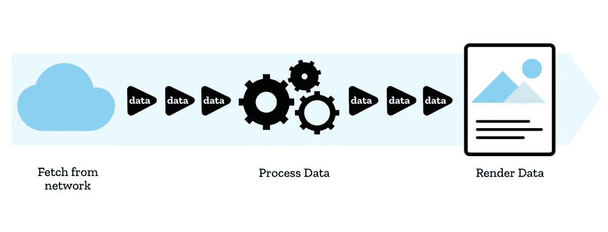

# 如何在 Node.js 中使用流

> 原文：<https://betterprogramming.pub/how-to-use-streams-in-node-js-ad1b73409d37>

## 什么、为什么和如何


由[贾尚·德沃尔](https://unsplash.com/@jachan_devol?utm_source=medium&utm_medium=referral)在 [Unsplash](https://unsplash.com?utm_source=medium&utm_medium=referral) 上拍摄的照片

Node.js 中的大多数异步编程都是使用 promises 完成的，但是如果您需要解耦数据和时间域，该怎么办呢？数据可能会连续生成，或者数据太大而无法一次性处理。承诺在这些情况下不起作用，流是首选的替代方案。我们将详细描述流，并查看具体的例子。到本文结束时，您将知道为什么以及如何使用它们。

流的一些常见应用有:

*   物联网传感器等实时数据处理
*   记录
*   实时广告平台
*   (直播)视频流
*   音频流
*   处理大文件
*   大型数据(基础)迁移


照片由[马丁·亚当斯](https://unsplash.com/@martinadams?utm_source=medium&utm_medium=referral)在 [Unsplash](https://unsplash.com?utm_source=medium&utm_medium=referral) 上拍摄

从 1.0 之前的早期版本开始，流就已经是 Node.js 的一个特性，并且比承诺的时间还早。作为一个范例，它不是 Node.js 独有的。( Linux)终端 stdin 和管道操作符是一种数据流形式，网络套接字也是如此。Node.js 流为这些现有范例提供了一个很好的抽象。

流顾名思义。数据将从一个应用/线程/套接字流到下一个。数据在接收时即被处理—以块为单位。流可以从各种数据源和接收器中读取或写入，包括文件、网络套接字和标准输入/标准输出。流可以通过管道连接在一起，以便一个流的输出成为另一个流的输入。这可用于创建复杂的数据处理管道。

目前，JavaScript 中流有两种相互竞争的标准。

WebStreams 是一个相对较新的本地 API，允许您直接访问和操作浏览器的媒体流(通常通过网络摄像头或麦克风)。

另一方面，Node.js 流已经存在了很长时间。Node.js 最近对 stream API 进行了改进，使其更易于使用，更像一个函数构造。在本文中，我们将重点关注 Node.js 流。



来自[https://developer . Mozilla . org/en-US/docs/Web/API/Streams _ API](https://developer.mozilla.org/en-US/docs/Web/API/Streams_API)

流是扩展`EventEmitter`的对象。有三种基本的流结构:

*   `Readable` stream:可以读取的数据生产者。
*   流:一个数据接收器。我们可以向这个流中写入数据。
*   `Transform` stream:既可读又可写的流，具有转换数据的功能。

我们可以自己扩展这些流对象来创建新的源和接收器，尽管更常见的是实现转换流。

从 Node.js v12 开始，可以从任何(异步)可迭代对象中创建一个`Readable`，这使得使用流进行函数式编程变得更加容易。

默认情况下，流以缓冲或字符串模式运行，但是它们可以选择以[对象模式](https://nodejs.org/api/stream.html#object-mode)运行。

现在我们知道了什么是流，让我们更深入地挖掘一些用例及优点。

# 更低的内存使用率

当数据到达时，处理数据将降低内存需求，垃圾收集器必须做得更少，从而导致更快的服务器和更低的基础设施成本。通过下面的例子，这种工作方式将变得更加清晰。

假设我们从 S3 下载一个文件，将它存储在一个局部变量中，然后发送给客户端，这是一个常见的用例。

```
const handler = (req, res, next)=>{
  let data = await S3.getObject(params).promise()
  res.send(data);
} 
```

假设文件大小为 1mb；这意味着 Node.js 运行时必须在下载文件时为文件分配 1 Mb 的内存，并在下载完成后通过等待响应套接字发送文件。当文件被发送后，它必须释放内存。当数据以较小的块到达时，分配和清理内存是一种浪费，因为我们可以立即发送这些数据。

第二个例子展示了我们如何将数据从 S3 直接逐块传输到响应套接字。我们省略了局部变量，使用的内存会更少，到达第一个字节的时间也会减少。

对于单个请求，差异很小，但是在一个繁忙的服务器上，这些差异会很快增加。

```
const handler = (req, res, next)=>{
  S3.getObject(params).createReadStream()
  .pipe(res)
}
```

# 反压力

想象一下这样一种情况，我们有一个快速的生产者和一个慢速的消费者，比方说，一部移动电话作为客户端的连接不稳定。

对于传统的分离的生产者和消费者，服务器上的内存使用会增加，因为电话连接不能足够快地处理数据。当我们使用管道流来避免这个问题时，下游管道将提供反压力。每个上游连接都将根据链中最慢链路的吞吐量进行调节。可以使用高水位线值配置流，以设置内部缓冲区/缓存。

# 数据转换

Node.js 中的一个基本示例是从文件流通过管道传输到服务器输出流。它确实像它看起来的那样:读取一个文件，并在读取的同时写入响应流。

```
const {createReadStream} = require('fs');

handler(req, res, next){
   createReadStream('myFile.txt).pipe(res)
}
```

但是如果我们想在阅读时对文件内容做些什么呢？我们可以创建一个转换流。

```
const { Transform } = require('node:stream');

const myTransform = new Transform({
  transform(chunk, encoding, callback) {
     callback(chunk.toUppercase())
  }
});

handler(req, res, next){
   createReadStream('myFile.txt).myTransform.pipe(res)
}
```

请注意，我们可以用上面的简写构造函数创建我们自己的流，或者扩展`Transform` (或者可读/可写)类，并添加我们自己的方法和功能。

上面例子的问题是错误没有很好地传播，必须在每个管道调用中处理，这就把我们带到了数据管道。

# 数据管道

管道方法负责错误处理和清除。使用管道，我们不必手动从一个`Readable`到`Writable`进行管道传输，也不必为每个流捕捉错误。

```
const { pipeline } = require('node:stream');
const fs = require('node:fs');

pipeline(
  fs.createReadStream('archive.tar'),
  zlib.createGzip(),
  fs.createWriteStream('archive.tar.gz'),
  (err) => {
    if (err) {
      console.error('Pipeline failed.', err);
    } else {
      console.log('Pipeline succeeded.');
    }
  }
);
```

管道返回一个可写流，该流将通过管道传输到一个`Writable`流。它将回调作为最后一个参数(尽管有一个基于承诺的版本)。回调用于处理错误。不得不提的是，当流水线出现错误时，所有的流都会被销毁，包括最后的`Writable`流。

当使用服务器响应作为管道中的最后一个流时，当出现错误时，您将无法向客户端发送错误消息，因为在出现错误的情况下，响应会被销毁。简单的解决方案是通过管道将管道流传输到响应流。

```
const { finished } = require('node:stream/promises');

async function handler(req, res, next){
  pipeline(
    stream1,
    stream2,
    (err) => {
       console.log(error);
       res.status(500).end('something went wrong')
    }
  )
  .pipe(res);
}

await finished(res);
//do more work
```

在这个例子中，如果正在进行的操作出错，响应流不会被破坏。它将可以优雅地处理对客户端的响应。

在上面的例子中，我们看到了 finished 方法的使用，当参数中的流完成处理时，它解析一个承诺。

# 在命令行应用程序和实用程序中使用

Node.js' `process.stdout`是一个可写的流，而`process.stdin`是一个可读的流，这意味着我们可以通过管道将各种数据传输到 Node.js 进程，也可以从 Node.js 进程接收数据。

看看这个六行图像缩放器，例如:

```
const { createReadStream } = require('node:fs');
const sharp = require('sharp');
const resizer = sharp().resize(200, 200).png();

createReadStream(process.argv[2])
  .pipe(resizer)
  .pipe(process.stdout);
```

我们可以称之为:

```
# node resizer.js input-img.png > out.png
```

它接受一个参数，该参数是一个现有图像的路径，然后创建一个可读的流，通过管道将其传递给一个 [sharp](https://www.npmjs.com/package/sharp) 实例，然后将调整大小的图像写入输出流。

命令行命令显示了我们如何使用`> out.png`部分将原始输出写入文件。

# 映射/减少/过滤

在 Node.js 17 中，引入了几个实验性的特性，使流更具功能性。有了这些方法，用原生 Node.js 代码替换 RXjs 将成为可能。

这个来自 Node.js 文档的例子展示了流是如何超越流数据而成为实用工具的强大部分的。

```
import { Readable } from 'node:stream';
import { stat } from 'node:fs/promises';

Readable.from(['a', 'b', 'c', 'd'])
  .map((x) => x.toUpperCase())
  .forEach((x:any)=>console.log(x))

const pairs = await Readable.from(['a', 'b', 'c']).asIndexedPairs().toArray();
console.log(pairs); // [[0, 'a'], [1, 'b'], [2, 'c']]
```

有了 map 函数，我们不再需要创建自己的转换流，我们的代码将变得更加简洁。

查看文档，请注意这些函数中有些返回承诺，有些返回`Readable`。

# 并行数据处理

但是对于这些流函数来说，有一个并发选项有多好呢？现在我们有了类似于 Scala 或 F#的功能，例如，并行数组函数。如果我们有 I/O 繁重的任务需要拆分，或者有 CPU 密集型的计算需要在 web workers 中运行，这就允许我们决定并行运行多少任务。

这是我非常兴奋的一个特性。有了新的功能特性，您可以定义想要使用的并发性。假设您必须发出十个 HTTP 请求，并且在某个管道中进行十次文件写入。由于这些操作非常不同，您可能希望为每个操作分配更多或更少的线程。

```
// With an asynchronous predicate, making at most 2 file checks at a time.
const anyBigFile = await Readable.from([
  'file1',
  'file2',
  'file3',
]).some(async (fileName) => {
  const stats = await stat(fileName);
  return stat.size > 1024 * 1024;
}, { concurrency: 2 });
```

# CSV 解析

Node.js 有一个叫 readline 的模块，可以逐行处理一个`Readable`流。它可以用来读取终端应用程序中的命令行输入，或者从流中解析 CSV，如下例所示。我以前曾用它将大型数据集导入数据库，其中的 CSV 文件来自 S3 存储桶。

这些文件从 S3 流式传输，使用 readline 模块将文件分割成记录。多个转换流在将数据直接传输到 Postgres 数据库之前对其进行净化和处理。它的效果非常好，我们能够将数据库迁移的持续时间从几天缩短到几个小时。

是的，这是一个相当大的数据集。

```
const fs = require('fs');
const readline = require('readline');

  const fileStream = fs.createReadStream('input.csv');

  const rl = readline.createInterface({
    input: fileStream,
    crlfDelay: Infinity
  });

 for await (const line of rl) {
    // process the line as CSV
   const arr = line.split(',')   
 }
```

我希望您对 streams 的功能有所了解。请阅读[文档](https://nodejs.org/api/stream.html)获取更多有用的提示。这个主题大得足以写一整本书。请在评论中告诉我你是如何在应用程序中使用流的。

[*如果你喜欢你所读的，考虑加入 Medium，多读一些文章。你的一部分稿费用来支持像我这样的作者。点击这里加入。*](https://medium.com/@laurent.zuijdwijk/membership)