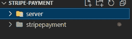
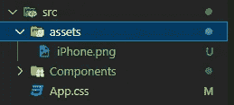
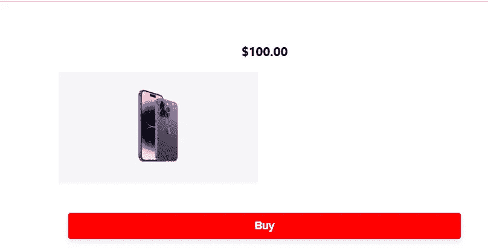
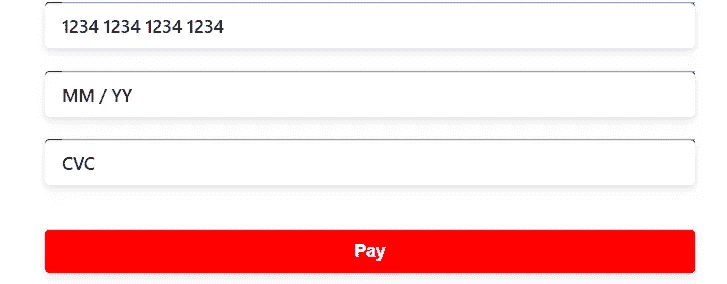
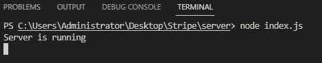
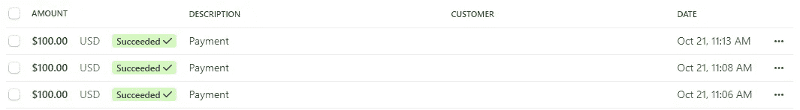
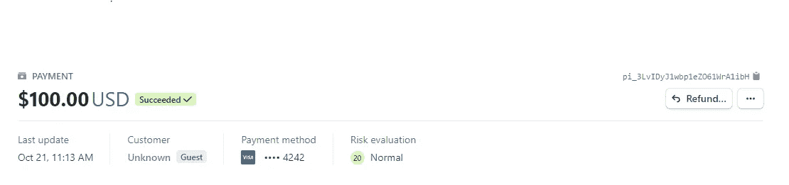

# 如何在 React.js 中使用 Stripe

> 原文：<https://betterprogramming.pub/how-to-use-stripe-in-react-js-c209d0541fb4>

## React.js 中对 Stripe 支付平台如何工作的深入探讨


作者照片

构建提供服务的 web 应用程序，如电子商务网站和其他软件即服务(SaaS) web 应用程序，需要包含一种付款方法，使您能够安全地向用户收取费用。

Stripe 支付平台是在 web 应用程序上安全处理用户支付的最佳媒介之一。在本文中，我将展示为什么它被列为最佳支付平台之一，以及如何在 React.js 应用程序中使用它。

# 什么是条纹

Stripe 是一个支付处理平台，充当第三方支付处理器或支付网关平台。因此，企业主使用 Stripe 来处理客户的借记卡和信用卡，以便在线支付商品或服务。

Stripe 受到超过 5 亿个全球组织、公司和主要品牌的信任和使用，从初创品牌到财富 500 强。使用 Stripe 支付平台的一些最受欢迎的品牌是 Lyft、亚马逊和 Shopify。

Stripe 自创建以来吸引了大量用户的原因之一是它能够处理全球 135 种货币。

此外，Stripe 是一个易于使用的工具，可以轻松集成，因为它的在线开发工具 JSON 具有简单的指南，令人印象深刻，并且是公开的。

Stripe 可在许多交易中用于将资金从客户账户转移到企业所有者的银行账户。例如，在线零售商店使用 Stripe 通过处理器安全地捕获客户的借记卡或信用卡详细信息，该处理器将从客户账户向临时商家账户收集交易资金。最后，这些处理后的资金将被转移到企业所有者的银行账户。

Stripe 兼容 Python、PHP、Ruby 等主流后端编程语言和 Node.js 等流行后端框架。

要在应用程序中使用 Stripe，您需要获得一个 REST API 密钥。当您开立条带帐户时，可以从您的仪表板访问这些 API 密钥，API 密钥有两种类型。其中一个键是测试键，可以在开发人员环境中用于测试，而另一个键是在您希望应用程序投入使用时使用的。

当您将银行帐户链接到您的 Stripe 帐户并激活您的帐户时，将向您提供生产 API 密钥。

在接下来的小节中，我将向您展示如何将 Stripe 支持的服务器端 Node.js 应用程序连接到前端 React.js 应用程序，但是首先，让我们创建并设置我们的项目。

在此之前，前往[dashboard.stripe.com/register.](https://dashboard.stripe.com/register?)创建您的 stripe 帐户。如果你想要一个活动的 API 密匙，你可以激活它，但是现在，测试 API 密匙就可以了

# 创建并设置您的项目

第一步是创建一个项目文件夹。在这个文件夹中，您将创建一个作为项目前端的`React.js`应用程序。因此，在与您的项目文件夹相同的级别运行下面的命令来创建`React.js`应用程序:

`npx create-react-app Stripe-payment`

上面的命令将创建一个名为`Stripe-payment`的文件夹，在您的项目文件夹中包含启动和运行 React.js 应用程序所需的所有文件和文件夹。

在这个`React.js`文件夹中，你需要安装一些软件包。这些包对于将`React.js`应用程序连接到 Stripe API 非常重要。因此，运行下面的命令来安装这些软件包:

```
npm install --save @stripe/react-stripe-js @stripe/stripe-js
```

您还需要一个后端应用程序作为您的服务器。在这种情况下，我们将使用 Node.js。因此，在与您的`React.js`应用程序相同的级别创建一个新文件夹，并将其命名为`Server`:



然后导航到`Server` 文件夹，用下面的命令初始化 node.js 应用程序:

```
npm init --yes
```

上面的命令将创建一个 package.json 文件，其中包含默认设置，如包名、版本和许可。您还将安装一些包，使您能够在这个应用程序中为 Stripe 设置一个后端服务器。

所以运行下面的命令来安装这些包:

```
npm install body-parser cors dotenv stripe-js express
```

至此，我们完成了项目中重要内容的设置，下一步是创建服务器应用程序的前端。

# 为条带设置前端应用程序

第一步是创建一个文件夹并命名为`Components`，这个文件夹将包含我们前端应用程序中的组件。我们的应用程序将有一个`PaymentForm`组件和一个`Stripe` 组件，在`Components` 文件夹中创建一个`Stripe.jsx`文件和一个`PaymentForm.jsx` 文件。我们将从`Stripe` 组件开始，所以在 `Stripe.jsx` 文件中，添加下面的代码来创建一个`Stripe` 组件:

在这个组件中，您将使用条带`Elements provider`包装 PaymentForm 组件。Stripe `Elements provider`将允许你在`PaymentForm` 组件中使用 Stripe `Elements components`。您还需要初始化一个 Stripe 对象，为此，您将使用 loadStripe，因此用下面的代码导入`loadStripe` 和`Elements`提供程序:

现在，您可以使用 `loadStripe`初始化 stripe 对象，方法是创建您的可发布密钥并将其从 Stripe 传递到在变量中调用的`loadStripe` 函数中。此外，您可以将`PaymentForm` 组件(我们尚未创建)导入到 `Stripe` 组件中，并用`Elements provider`包装它。因此，将下面的代码添加到您的`Stripe` 组件中:

请记住使用 stripe 中的可发布密钥。你可以从你的仪表板上得到你的可发布密钥，去开发者那里，在 API 密钥下检查，然后用我们的 API 密钥替换上面代码中的 API 密钥。

至此，我们完成了 `Stripe` 组件，现在我们可以转到`PaymentForm` 组件，所以进入`PaymentForm.jsx` 文件并编写下面的代码来创建一个`PaymentForm` 组件:

在 PaymentForm 组件中，我们将使用 stripe 中的元素创建一个支付表单，因此添加下面的代码来导入这些元素和 axios，以便向后端服务器发出 post 请求:

现在，您必须检查事务是否成功，因此使用`useState`钩子创建 `success` 状态，然后您必须使用从 stripe-react-js 导入的 useStripe 钩子和`Elements components`创建一个 stripe 变量。

您还需要创建 `elements`变量，您将在您的应用程序中使用该变量来收集和处理用户的付款细节，并且您将使用从 stripe-react-js 导入的 `useElements`钩子来创建该变量。

因此，在 PaymentForm 组件中添加下面的代码来创建`success` 状态、`stripe` 变量和 `elements` 变量:

有了这些，我们可以创建一个 `handleSubmit`函数，当用户提交支付表单时将调用该函数，但是现在，用下面的代码设置支付表单及其收集用户卡详细信息的字段:

从上面的代码中，您检查了交易是否成功。如果交易不成功，您将继续显示支付表单，但是如果交易成功，您将显示“支付成功”文本。

用下面的代码创建`handleSubmit`函数:

从上面的代码中，您用自己创建的 `stripe`变量创建了一个卡类型的支付方法。然后您检查交易是否成功，没有错误。如果没有错误，那么您的应用程序将向`localhost:4000/payment` URL 发送一个 post 请求，其中包含产品的金额。

Stripe 使用美分表示美元交易金额，因此您必须以美分输入等值的美元金额。因此，由于我们的产品售价为 100 美元，等价金额为 10，000 美分。如果有错误，那么您的应用程序将显示一条错误消息。

最后，在`PaymentForm.jsx`文件中，添加下面的代码，为您的支付表单提供一些基本样式:

然后用下面的代码在`index.css`文件中为整个应用程序添加一个通用样式:

为了呈现您的表单，您现在可以在`App.js`中导入`Stripe`组件，然后如果客户点击购买您的产品，就有条件地呈现它。要检查客户是否点击购买了您的产品，您还需要为此创建一个状态。

你可以调用这个状态`showForm.`这个状态最初会被设置为 false，但是当客户点击`BUY`按钮时，它会被设置为 true，然后付款表单就会出现。

你还需要你的产品的形象。你的顾客需要看到他们将要购买的东西。如果您已经有一个产品页面，则可以使用产品页面来实现此目的。否则，请下载您要销售的图片，然后创建一个资产文件夹，您可以在其中拖放该图片:



因此，导入`useState, Stripe`组件，并在您的`App.js`文件中使用下面的代码导入您想要销售的图像:

现在，您可以创建 `showForm`状态，并使用它有条件地显示带有以下代码的付款表单:

您现在可以保存 `App.js, Stripe.jsx, and PaymentForm.jsx`文件，然后使用下面的命令运行您的应用程序:
`npm start`

您应该会在浏览器中看到类似这样的内容:



如果你点击“购买”按钮，你会看到付款表格，然后你会看到类似下面的内容:



在构建后端服务器之前，此表单不起作用。但是我们已经完成了前端。您现在可以打开服务器文件夹并创建一个`index.js`文件

# 为条带设置后端应用程序

我们将从导入之前安装在服务器文件夹中的那些库开始这一部分。我们将使用它们创建一个将在`port 4000`上运行的服务器应用程序。因此，使用下面的代码来导入库:

好了，使用上面的代码，您在第 1 行导入了 express 库。您利用 express 库创建了一个服务器应用程序，然后在第 2 行，您导入了`dotenv`库，您将使用它在一个环境变量文件中存储您的密钥。您还导入了 `stripe`库，您将使用它来创建您的支付意向。最后，导入`cors`库，这对前端应用程序和服务器应用程序之间的资源共享很重要。

`index.js`文件中的下一步是用 express 库创建一个服务器应用程序，然后利用这个服务器应用程序中的 body-parser 和 cors 库，所以将下面的代码添加到您的`index.js`文件中:

现在您有了一个正在运行的服务器应用程序，它使用`body-parser`库发送 JSON 响应，使用`cors`进行资源共享。另外，您的服务器应用程序正在运行`port 4000`。因此，如果您运行命令`node index.js`，它将触发您的`index.js`文件，您应该在终端的控制台中看到“服务器正在运行”。



很好。现在，您可以通过添加下面的代码来创建 post 端点，该端点将创建您的支付意图和客户交易的详细信息。就在那下面，您在`cors` 库中使用的代码行:

从上面的代码中，您创建了一个支付帖子 URL 并向其传递了 `cors`库和一个箭头函数。在这个箭头函数中，您创建了一个 try，catch 块。

在 try 块下，您创建了一个支付描述，其中包含交易金额和其他有关用户交易成功的重要细节。因此，现在保存`index.js`文件并运行下面的命令来启动您的服务器应用程序:

```
node index.js
```

如果您的服务器仍在运行，您可以取消它并运行上面的命令。转到浏览器并刷新您的`React.js`应用程序。

填写条纹测试卡号`4242 4242 4242 4242`，作为您的卡号，并随机选择一个日期作为您的卡到期日期，然后 424 作为您的卡 CVC 号。

当你点击“购买”按钮，你会看到“付款成功”的文字，这意味着你的交易是成功的。

但是如果你尝试使用另一个随机数作为你的卡号，你会在控制台得到一个错误。这是因为您仍处于测试模式。默认情况下，当您创建一个 Stripe 帐户而没有使用您的银行帐户激活它时，您将获得一个测试帐户进行测试。

如果您想要一个 live 帐户，您需要激活您的 Stripe 帐户并获得一个 live API 密钥。

现在，如果您返回到您的 Stripe 控制面板，并转到您的付款页面，您将看到您的用户已经完成的所有交易，包括您刚刚完成的交易:



如果您单击任何一项交易，就会看到每项交易的详细描述:



右上角还有一个退款按钮，如果交易出现问题，您可以用它来退还客户的资金。

# 结论

Stripe 是一个重要的支付处理平台，帮助企业主轻松地从客户那里收取在线商品和服务的费用。

Stripe 易于使用，可以与流行的后端语言和框架一起使用，我刚刚向您展示了如何在连接到 Node.js 后端服务器的 React.js 应用程序中使用它。

我还讨论了 Stripe 以及它如何帮助企业更快发展。因此，在本文中，您学习了如何在`React.js`中使用 Stripe，以及如何在 Node.js 后端应用程序中设置 Stripe。

感谢您通读这篇文章。希望对你有帮助。如果你有任何问题或建议，请在评论区留下。