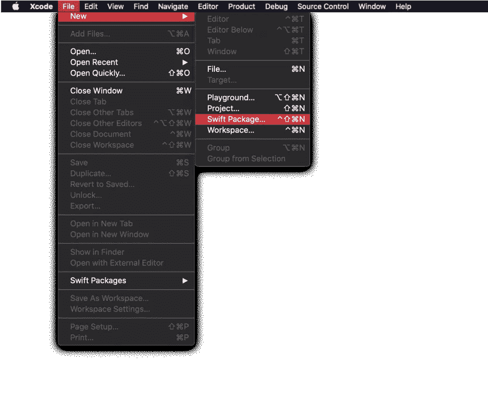
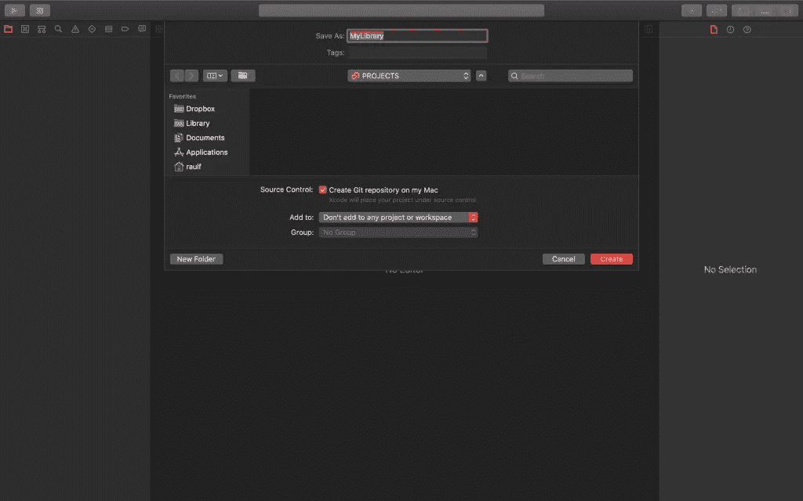
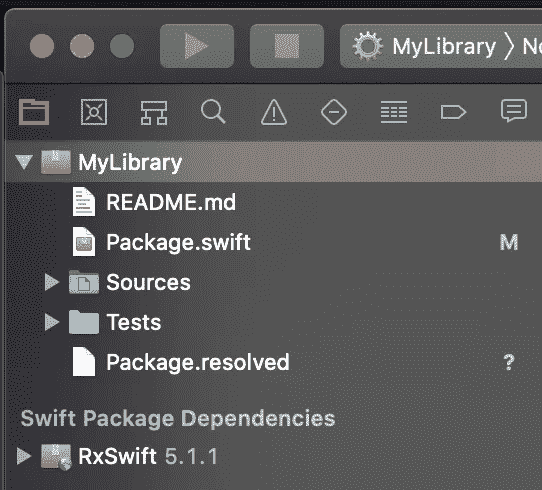
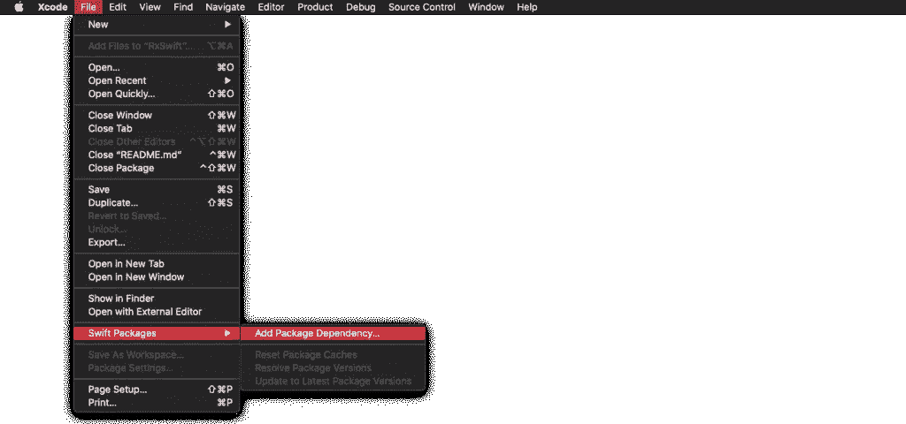
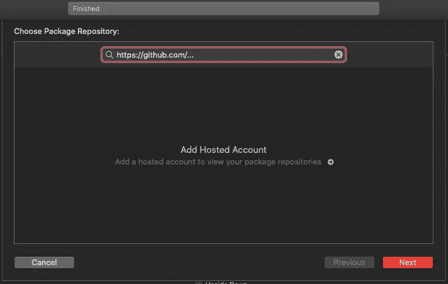

# 如何使用 Swift 软件包管理器

> 原文：<https://betterprogramming.pub/how-to-use-swift-package-manager-9235d8324f7e>

## 让椰子和迦太基从你的项目中退出

Swift Package Manager (SPM)是苹果在 2015 年与 Swift 一起发布的 Swift 的依赖管理器，加入了其他知名的依赖管理器，如 [CocoaPods](https://cocoapods.org/) 和 [Carthage](https://github.com/Carthage/Carthage) 。然而，直到 Xcode 11 的发布，这个工具才被集成到 Xcode 本身中，这使得它更容易使用。现在，我们将学习如何使用 Swift Package Manager。

# Swift 套餐

Swift 包由一系列包含源代码和清单的文件组成，一个名为`Package.swift`的文件(在根目录中找到)，它定义了包的名称、内容等等。当我们编译这些文件时，我们生成一个单独的模块，然后可以共享(例如从 GitHub)导入到其他项目中。这些文件被编译成一个模块，然后可以被其他项目导入。

# 如何创建 Swift 包

使用 Xcode 11，很容易创建 Swift 包。在 Xcode 菜单中，选择文件>新建> Swift 包:



然后我们给项目命名并创建它:



就这么简单—我们现在已经生成了一个 Swift 包。我们在屏幕上首先看到的是`Package.swift`文件的内容:

```
import PackageDescription

let package = Package(
    name: "MyLibrary",
    products: [
        // Products define the executables and libraries produced by a package, and make them visible to other packages.
        .library(
            name: "MyLibrary",
            targets: ["MyLibrary"]),
    ],
    dependencies: [
        // Dependencies declare other packages that this package depends on.
        // .package(url: /* package url */, from: "1.0.0"),
    ],
    targets: [
        // Targets are the basic building blocks of a package. A target can define a module or a test suite.
        // Targets can depend on other targets in this package, and on products in packages which this package depends on.
        .target(
            name: "MyLibrary",
            dependencies: []),
        .testTarget(
            name: "MyLibraryTests",
            dependencies: ["MyLibrary"]),
    ]
)
```

在这个宣言中我们发现:

*   `name`—项目名称。
*   `products` **—** 定义项目中定义的哪些可执行文件和库对其他包可见。
*   `dependencies` —这里定义了我们项目所依赖的其他包。
*   `targets` —这是我们向主项目添加新依赖项的地方。

# 添加依赖项:示例

例如，假设我们想要创建一个 Swift 包，并且我们知道我们将使用`RxSwift`库。首先，我们访问`RxSwift` GitHub 存储库。如果我们深入到它指示如何安装的地方，我们会看到它为我们提供了 *Cocoapods* 、 *Carthage、*和 *Swift 包管理器*的选项。后者是我们感兴趣的，在那里我们可以观察我们必须添加到我们的 Swift 产品包中的依赖关系和目标:

```
let package = Package(
  name: "RxTestProject",
  dependencies: [
    .package(url: "https://github.com/ReactiveX/RxSwift.git", from: "5.0.0")
  ],
  targets: [
    .target(name: "RxTestProject", dependencies: ["RxSwift", "RxCocoa"])
  ]
)
```

因此，在我们的`Package.swift`中，我们将这些值相加，如下所示:

```
import PackageDescription

let package = Package(
    name: "MyLibrary",
    products: [
        // Products define the executables and libraries produced by a package, and make them visible to other packages.
        .library(
            name: "MyLibrary",
            targets: ["MyLibrary"]),
    ],
    dependencies: [
        // Dependencies declare other packages that this package depends on.
        .package(url: "https://github.com/ReactiveX/RxSwift.git", from: "5.0.0")
    ],
    targets: [
        // Targets are the basic building blocks of a package. A target can define a module or a test suite.
        // Targets can depend on other targets in this package, and on products in packages which this package depends on.
        .target(
            name: "MyLibrary",
            dependencies: ["RxSwift", "RxCocoa"]),
        .testTarget(
            name: "MyLibraryTests",
            dependencies: ["MyLibrary"]),
    ]
)
```

值`from: “5.0.0”`告诉我们哪个版本的 RxSwift 将包含在我们的项目中。也就是说，将包括等于或高于 5.0.0 的 RxSwift 的最新版本。但是，我们也可以指明只包含某个版本、分支甚至修订版:

```
// Version of a package
.package (url: "https://github.com/ReactiveX/RxSwift.git", .exact ("5.1.0"))

// Version of a certain branch (for example, develop)
.package (url: "https://github.com/ReactiveX/RxSwift.git", .branch ("develop"))

// Version of a certain revision (commit):
.package (url: "https://github.com/ReactiveX/RxSwift.git", .revision ("002d325b0bdee94e"))
```

将依赖项添加到我们的项目后，当我们构建它时，我们会看到侧面导航菜单中出现一个新部分(“Swift Package Dependencies”)，指示我们已添加到项目中的依赖项(在本例中为`RxSwift`)。



# 平台设置

在`Package.swift`文件中，我们还可以指出我们的项目是为哪个平台或操作系统指定的。例如，如果我们希望我们的 Swift 产品包仅用于 iOS 12+操作系统，我们可以这样表示:

```
let package = Package(
    name: "MyLibrary",
    platforms: [.iOS(.v12)],
    products: [
      ...
```

如[苹果文档](https://developer.apple.com/documentation/swift_packages/platform)所示，支持的不同平台有:

*   ios
*   Linux 操作系统
*   马科斯
*   tvOS
*   watchOS

我们也可以定义多个平台。例如:

```
let package = Package(
    name: "MyLibrary",
    platforms: [.iOS(.v12), .macOS(.v10_15)],
    products: [
      ...
```

# 向我们的 Swift 产品包添加代码

一旦我们配置了项目，我们就可以添加代码了。记住——我们希望在导入 Swift 包*的项目中使用的类和方法必须声明为 public* 。一旦我们完成了项目并将它上传到一个存储库(比如 GitHub 或 GitLab)，我们就可以下载它并将其包含在其他项目中。

# 如何向我们的应用程序添加 Swift 包

要将我们创建的 Swift 包添加到应用程序中，我们只需执行以下操作(只要我们使用 Xcode 11):

*   从顶部菜单我们进入文件> Swift 包>添加包依赖:



*   在出现的窗口中，我们添加项目 URL 并按“OK”(这将把 Swift 包下载到我们的项目中):



*   无论我们想在哪里使用它，我们只需导入它们:

```
#import MyLibray
```

# 结论

随着 Swift Package Manager 添加到 Xcode 11，为我们的项目创建和添加依赖关系变得非常容易。这开辟了一种新的方式，例如，调整我们的应用程序——从单一的应用程序到由模块组成的应用程序——并帮助我们更容易地在项目之间共享代码。