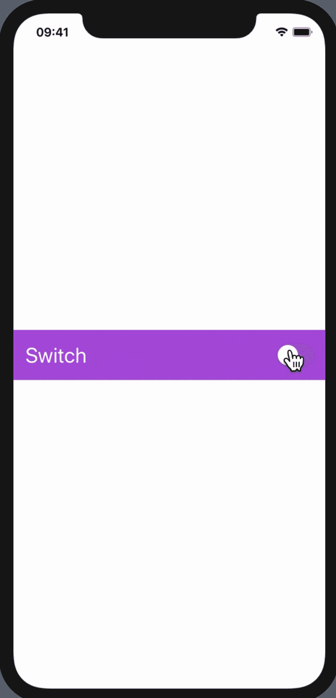

# 如何在 SwiftUI 中使用切换或切换

> 原文：<https://betterprogramming.pub/how-to-use-switch-or-toggle-in-swiftui-b1a0f857ed5c>

众所周知，苹果已经发布了 SwiftUI，用于使用 SwiftUI 的功能在所有苹果平台上构建用户界面。让我们看看我们将在本文中构建什么。



# 步骤 1:如何创建您的 SwiftUI 项目

在 XCode 中，进入文件→新建→项目→单视图 App →下一步→选择用户界面→ SwiftUI →下一步→选择你想要的项目位置→完成。

# 步骤 2: ContentView.swift

默认的`SwiftUI(ContentView)` 文件会出现以下代码:

```
**import** SwiftUI
**struct** ContentView: View {**var** body: **some** View {
    Text(”Hello World!”)
  }
}**struct** ContentView_Previews: PreviewProvider { **static** **var** previews: **some** View {
     ContentView()
   }
}
```

在右边，您可以看到 UI 的预览。

如果你看不到预览，去调整编辑器选项，选择画布(或按下 option+command+enter) *。* 之后，确保画布正在显示 UI 预览。


# 步骤 3:创建用户界面

在`ContentView`主体内，定义垂直堆栈，它将包含一个开关。

## 如何在 SwiftUI 中创建切换

你可以通过简单地输入`Toggle()`来创建一个开关。

要配置 toggle，我们必须传递参数。参数名为`Binding<Bool>`类型的`isOn`，它定义了切换的状态(即，是开还是关)。在切换体中，我们可以定义显示在切换视图旁边的文本。

## 创建切换时如何传递绑定<bool>参数</bool>

要了解什么是绑定，推荐你先过一遍这篇[绑定文章](https://medium.com/@rathodmayur93/what-is-binding-in-swiftui-how-to-use-it-206d22affd9a)。

我们需要定义类型为`Bool`的`@State`变量，它将包含切换状态的值。我们可以这样定义`@State`变量:

```
@State **private** **var** isToggle : Bool = **false**
```

由于我们需要传递参数`Binding<Bool>`的值，我们只需将`prefix $` 添加到我们的状态变量中，它将返回`Binding<Bool>`的值。

要访问绑定值，我们必须定义`@State`变量，然后添加前缀`$`来访问绑定值。所以会像`$isToggle (Bindning<Bool> value)`一样。

## $符号是做什么的？

`$`与属性委托结合使用。

它不是运算符，而是前缀。`@State`实际上是一种引用类型实例的方式。稍后，它会将这个实例属性转换成一个计算属性，其 getter 和 setter 是它自己的某个计算属性(它的`wrappedValue`)的 getter 和 setter。

现在，当我们说`$isToggle`时，你做*而不是*得到一个状态结构；你得到一个绑定结构。为什么？这是因为属性包装器有一种机制来指定名称的返回值应该是什么。

因此，简而言之，如果我们写`isToggle`，我们正在访问一个`Bool`值，但是当我们键入`$isToggl` e，我们正在访问一个`Binding<Bool>`值。

现在，让我们看看切换视图的最终代码:

```
**import** SwiftUI**struct** ContentView: View {@State **private** **var** isToggle : Bool = **false
   var** body: **some** View {
   VStack {
      Toggle(isOn: $isToggle){
         Text(“Switch “)
            .font(.title)
            .foregroundColor(Color.white)
      }
    }.padding()
     .background(isToggle ? Color.orange : Color.purple)
  }
}**struct** ContentView_Previews: PreviewProvider {
   **static** **var** previews: **some** View {
      ContentView()
   }
}
```

# 资源

你可以在 [GitHub](https://github.com/rathodmayur93/SwiftUIBindingDemo) 上找到代码。