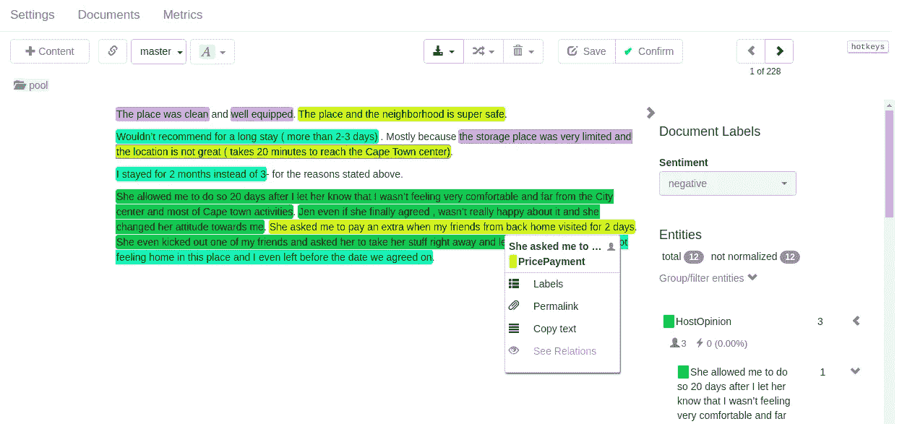
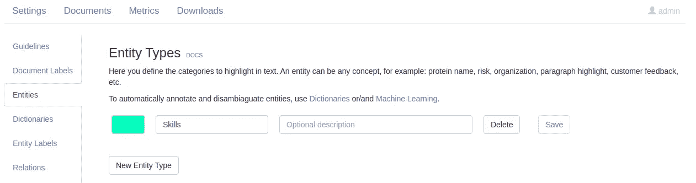
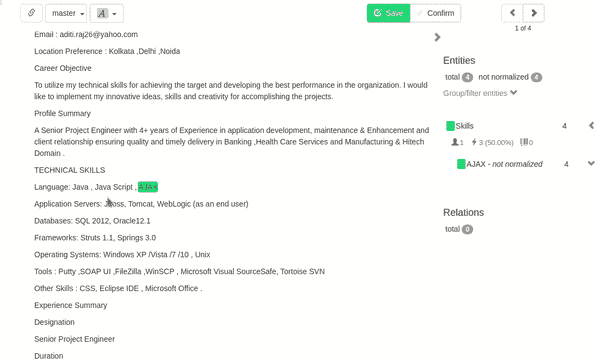
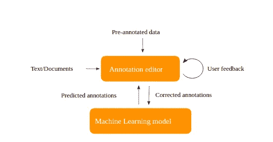

# 如何在数据科学项目中使用 Tagtog

> 原文：<https://betterprogramming.pub/how-to-use-tagtog-for-your-data-science-projects-dcdb9dddf442>

## 一个简单但功能强大的文本注释工具

照片由[安格拉·坎普](https://unsplash.com/@angelekamp?utm_source=medium&utm_medium=referral)在 [Unsplash](https://unsplash.com?utm_source=medium&utm_medium=referral) 拍摄。

数据标注是人工智能世界的重要组成部分。这是训练机器学习模型正确解释不同类型输入的过程。例如，你可以训练一个模型来识别图像中的人脸，或者教机器人理解人类的请求。在用足够的正确注释的数据训练模型之后，它可以开始识别新呈现的数据中的模式。

有许多文本注释工具可以帮助您简化注释任务。在本文中，我将介绍 [tagtog](https://tagtog.net/) ，一个用于数据科学项目的易用工具。

我们开始吧！

# 概观

tagtog 是一个用户友好的基于网络的文本注释工具。我真正喜欢它的是，与其他工具不同，你不需要安装任何东西，因为它运行在云上。你只需要建立一个新账户，然后开始你的项目。但是如果你需要在私有云环境下运行，你可以使用他们的 Docker 镜像。

这个工具提供了免费的特性，包括手动注释、用 Webhooks 训练你自己的模型等等。自动注释、原生 PDF 注释和客户支持等更高级的功能需要付费。

## 基本特征

*   公共数据集是可用的——它免费提供一堆预先注释的数据集。例如，下面是来自[公寓评论数据集](https://tagtog.net/JaqenNLP/ApartmentReviews/pool)的情感分析:

数据集中带标签的数据

*   多种文件格式支持——您可以上传支持格式[的文件](https://docs.tagtog.net/ioformats.html)，例如`CSV`、`TXT`、`HTML`，或者简单地插入纯文本。
*   快速手动文本注释—您只需突出显示单词/句子并分配必要的标签。它会立即识别并注释相同的单词。这加快了注释过程。

假设您正在文档中寻找编程技能和职位。从创建一些实体开始:

创建实体

手动过程如下所示:

注释文本

*   训练您自己的模型——tagtog 使您能够从本地训练的模型中导入带注释的数据。然后，您可以在注释编辑器中查看它，并进行必要的修改。最后，使用他们的 [API](https://docs.tagtog.net/API_documents_v1.html) 下载审查过的文档，并重新训练你的模型。

培训流程如下所示:

图片来自 [tagtog](https://docs.tagtog.net/) 。

查看官方[教程](https://docs.tagtog.net/quick-tutorials.html)获取完整示例。

*   [Webhooks](https://docs.tagtog.net/projects.html#webhooks) 帮助您将外部模型与 tagtog 集成。它们在文档上传/保存事件时被触发。这样，您的后端会收到关于更改的通知。
*   实体标签改进了文本分类。例如，如果您有一个*城市*实体，您可以提供附加信息，例如*国家*或*人口*。
*   文档标签—同样，您可以指定一个标签，根据您感兴趣的特定主题对文档进行分类。比如你在对不同岗位的简历进行分类，你可以创建一个`enum`类型的文档标签，比如*程序员*、*服务台代理*等。
*   关系-可以在两个实体之间设置双向关系。比如*职位*和*公司*。
*   协作——在项目中与朋友一起工作。您可以在不同用户的注释编辑器之间切换，以查看他们的更改。它类似于 Git 分支。

# 结论

现在，您已经熟悉了 tagtog 的基本免费特性，并且知道使用它可以实现什么。这对于快速文本注释和训练您自己的模型来说非常有用。

请注意，有各种类型的文本处理技术。[务实的程序员](https://medium.com/u/a78b7a43dc4a?source=post_page-----dcdb9dddf442--------------------------------)有一整本关于[数据科学和 Python](https://medium.com/pragmatic-programmers/table-of-contents-6aea3dc3b0ce) 的书。其中一章描述了[文本处理程序](https://medium.com/pragmatic-programmers/processing-texts-in-natural-languagesyour-turn-3a86d9318305)。你可以获得更多的想法和灵感来训练你的模型。

我希望你今天学到了一些新东西。感谢您的阅读，下次再见！