# 如何使用 HTML Canvas 元素制作令人惊叹的东西(第 1 部分)

> 原文：<https://betterprogramming.pub/how-to-use-the-html-canvas-element-to-make-awesome-stuff-3e1b66d4080e>

## 创建你的画布并在上面画画

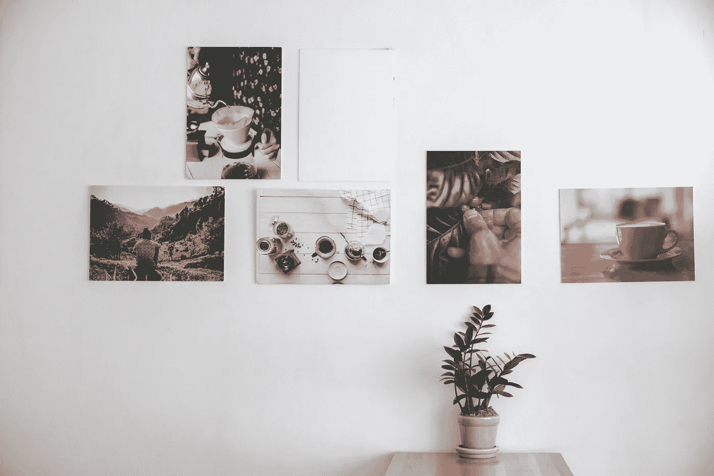

由 [Ratapan Anantawat](https://unsplash.com/@rtp_atw?utm_source=unsplash&utm_medium=referral&utm_content=creditCopyText) 在 [Unsplash](https://unsplash.com/s/photos/canvas?utm_source=unsplash&utm_medium=referral&utm_content=creditCopyText) 上拍摄的照片

这个教程将会很长，所以我会把它分成两部分来组织。第一部分将着重于创建你的画布并在上面绘图。第二部分将深入如何动画画布。

# 第一部分。创建您的画布并在画布上绘画

本周是 Flatiron School 的项目周，在我当前的模块中，我们的重点是 JavaScript，特别是如何对 Rails 后端进行 API 获取和操作 DOM。

在试图弄清楚我想为我的项目做些什么的过程中，我发现自己在探索如何利用 HTML5 `Canvas`元素来制作一个有趣的游戏。

# 什么是画布？

`Canvas`是一个 HTML 元素，当它被注入到你的 HTML 主体中时，用来在你的网页上绘制图形。

`canvas`标签只是一个容器，用来保存你想在其中创建或操作的图形。为了完整地构建你的图形，你需要使用 Javascript。

我创建了一个项目文件夹，并在其中添加了一个名为`index.html`的文件。在这个`index.html`中，我已经插入了画布元素。

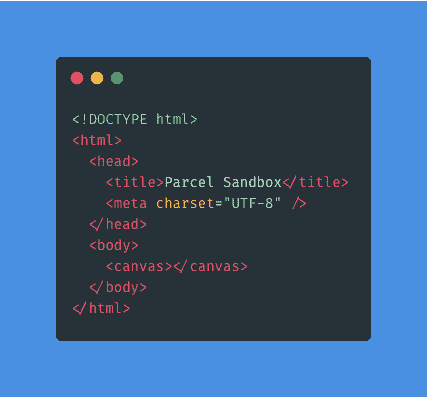

标签`canvas` 在你的 HTML 页面上是一个空白区域。你还看不到任何东西，但它就在那里。如果您在浏览器中打开`index.html`并打开 inspector 窗口，您会看到页面上有一个画布。

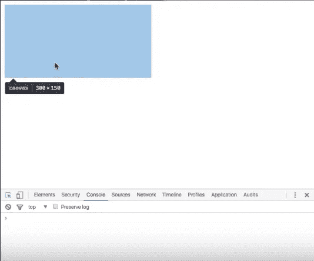

直到你给你的`canvas`元素添加细节，比如`width`和`height`，你才会开始看到你的创作变得栩栩如生。

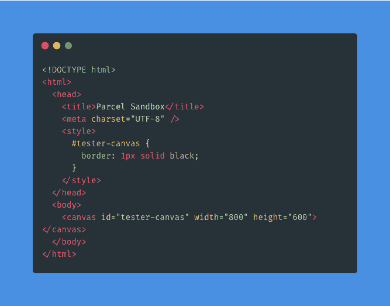

这里我在`canvas` 标签上加了一个`id`叫做`tester-canvas`，一个 800 的`width`和一个 600 的`height`。

`height`和`width`设置我的画布的大小，`id`将允许我选择特定的画布，以便我可以在`index.html` *的头部添加一个`style` 标签。*

这将允许我编辑和添加属性，如边界厚度，颜色等画布。我加了一个`1px solid black border`。

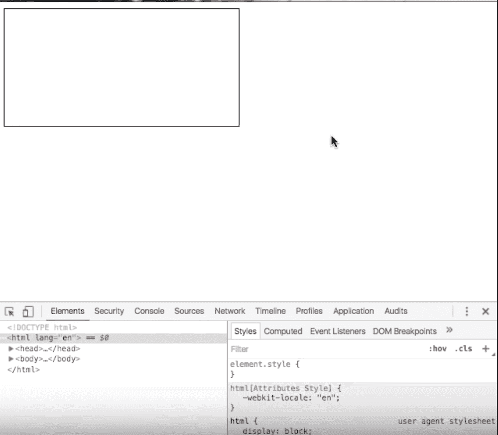

瞧啊。我可以在页面上看到我的画布！

然而，我想确保我的画布占据了整个窗口页面，因为我希望我的设计适合整个屏幕。然而，这取决于你想要你的画布的大小。

因为我想确保我的画布适合整个浏览器窗口，而不仅仅是我目前拥有的小矩形，所以我将使用 JavaScript 来实现这一点。原因是我可以访问窗口对象。

为此，我创建了一个`test_canvas.js`文件，它与我的`index.html`在同一个目录下，以便于组织。

我在以我的`test-canvas.js`文件为源的`index.html`文件的主体中添加了一个`script` 标签。这样，我在 JavaScript 文件中使用的任何函数或方法都可以访问我的`index.html`文件中的内容，并且可以在浏览器中看到。

我已经删除了画布的`width`和`height`，它们之前在`canvas` 标签中。

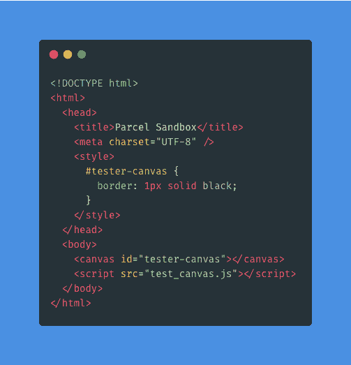

在我的`test_canvas.js`文件里面，我需要先找到我的`canvas` 元素。当我将 canvas 元素添加到 HTML 中时，我给了它一个`id`。这样，我可以使用`document.querySelector()` 或`getElementByID()`来获取特定的元素并将其保存到变量中。

如果您打算在 HTML 文件中有多个画布，并希望这些画布有不同的样式选项，这将很有帮助。

我还将在一个名为`canvasSize`的函数中将我的画布'`width`和`height`设置为`window object` *'* s `width`和`height` 。

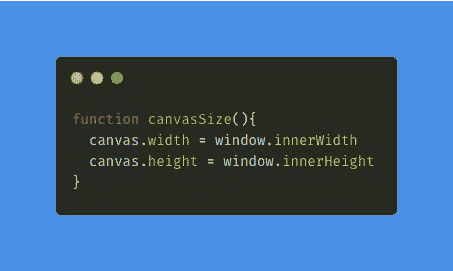

我还将 HTML 的正文边距设置为 0。

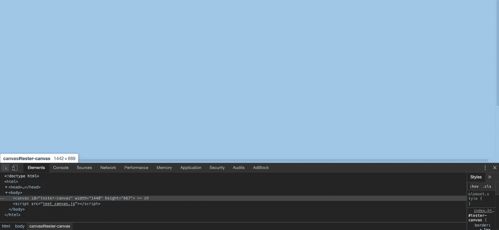

现在我的画布在整个屏幕上

这就是你如何创建一个画布以及调整画布大小的方法。

现在，虽然这很棒，但最重要的是用我们的画布做东西，要做到这一点，我们必须在上面画画。这是有趣的事情开始了！

# 如何在你的画布上画画

为了开始在画布上绘图，我们将使用`***.***getContext()`方法。`.getContext()` 方法将允许您以各种不同的方式在画布上绘图，并为您提供各种功能和方法来绘制圆形、正方形和其他形状。

查看 MDN 上的`.getContext()` [的文档，看看可以使用哪些上下文类型。为了简单起见，我将使用`2d` 上下文类型*。*我可以使用的一个方法是因为`.getContext()` 是`***.***`](https://developer.mozilla.org/en-US/docs/Web/API/HTMLCanvasElement/getContext)`[fillRect()](https://developer.mozilla.org/en-US/docs/Web/API/CanvasRenderingContext2D/fillRect)`，它需要四个参数:

*   `x`:矩形起点的 x 轴坐标。
*   `y`:矩形起点的 y 轴坐标。
*   `width`:矩形的宽度。正值在右边，负值在左边。
*   `height`:矩形的高度。正值向下，负值向上。

`.fillRect()`会如其名。它将填充我们的矩形，这样我们就可以在浏览器上看到它。我将创建一个名为`canvasContext`的变量，并用`.getContext()`和一个参数`2d`将它赋给我们的画布变量。

然后，在`canvasContext`变量上，我会使用`.fillRect()` 方法。这将产生两个矩形。

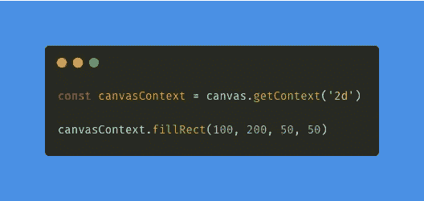

你可能会问自己:“好，太好了。我有这个造型，但是怎么定制呢？”

我们可以这样做的一个方法是通过`.[fillStyle](https://developer.mozilla.org/en-US/docs/Web/API/CanvasRenderingContext2D/fillStyle)`属性。属性将为你的形状分配一种纯色、渐变或图案。我鼓励你尝试改变颜色。

注意:你制作的形状将采用它前面的`.fillStyle`属性。所以每次`.fillRect()`方法前我都有。

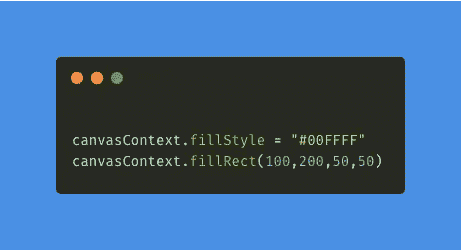

这是我们添加 fillStyle 后的形状。

为了让我们的图形绘制更加动态，我给自己创建的函数`drawRect`添加了参数。

`drawRect`有两个参数，`x`和`y`，它们允许我在调用函数时为`.fillRect()`方法添加自己的坐标。

这很棒，因为它允许我只调用函数本身，而不是每次我们需要创建一个新的矩形时重写代码。您可以向该函数添加第三个参数，让您添加一种颜色。

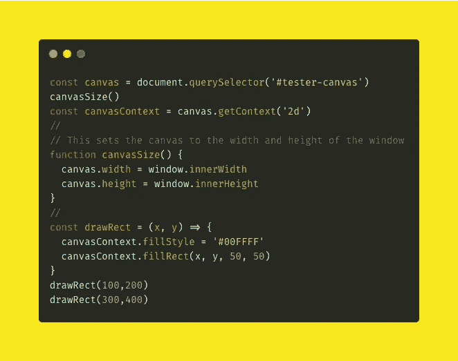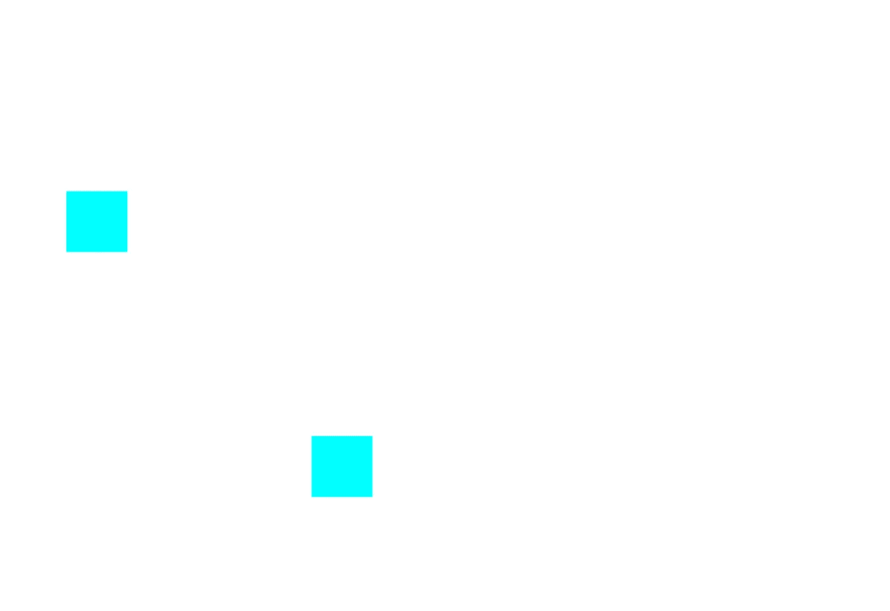

# 结论

在第二部分，我将在我们的设计中插入圆形。我将使用一个 JavaScript `for-loop` 来实现这个*。*

如果您不熟悉如何使用`for-loop`，请查看 MDN 上的文档[。](https://developer.mozilla.org/en-US/docs/Web/JavaScript/Guide/Loops_and_iteration#for_statement)

我将向你展示如何用 animate 方法制作这些圆形的动画，除了我们现在有的矩形和正方形。