# 如何使用 HTML Canvas 元素制作令人惊叹的东西(第 2 部分)

> 原文：<https://betterprogramming.pub/how-to-use-the-html-canvas-element-to-make-awesome-stuff-part-ii-2baa658320ff>

## 使用 for 循环和动画绘制形状

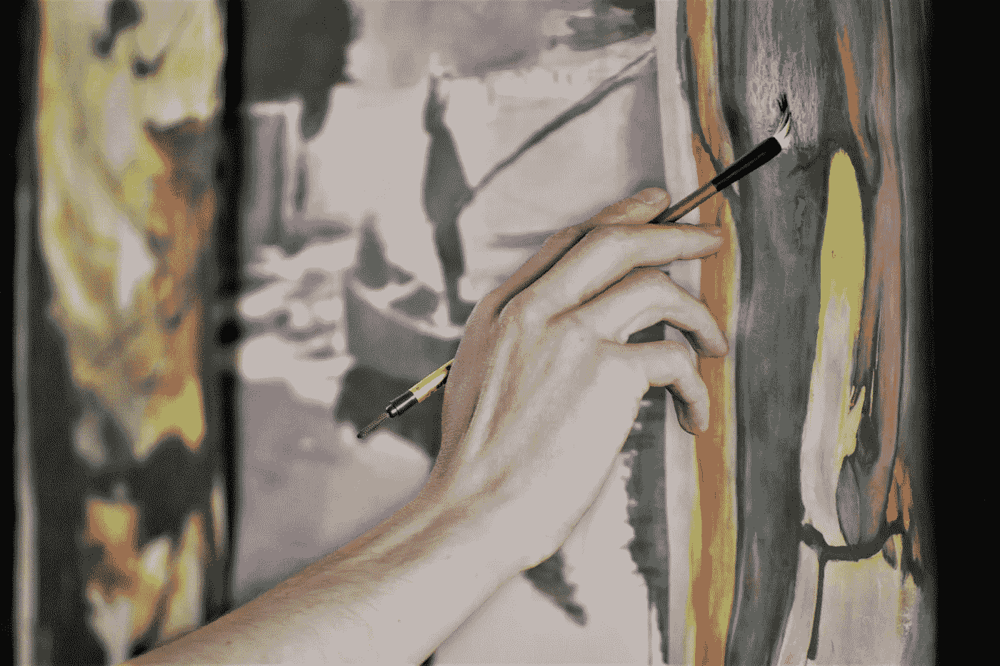

照片由[西尔维亚·巴索](https://unsplash.com/@szilviabasso?utm_source=unsplash&utm_medium=referral&utm_content=creditCopyText)在 [Unsplash](https://unsplash.com/s/photos/canvas?utm_source=unsplash&utm_medium=referral&utm_content=creditCopyText) 上拍摄

# 第二部分。使用 for 循环和动画绘制形状

在这篇博客的第一部分中，我展示了如何使用`canvas`元素在浏览器中创建形状。

我们首先制作可以在 DOM 上看到的正方形和长方形，并编辑它们的属性，比如大小和颜色。现在，我将向你展示如何制作这些形状的动画。

首先，让我们看一下到目前为止我们拥有的代码。

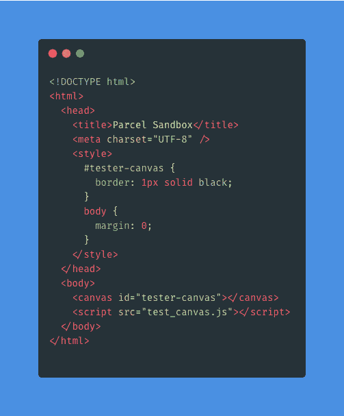

我们的 Index.html 档案

我们的形状

要添加圆圈，我们将使用`.arc()`方法。方法[的文档可以在 MDN](https://developer.mozilla.org/en-US/docs/Web/API/CanvasRenderingContext2D/arc) 上找到。**`.arc()`方法有五个必需的参数和一个可选的第六个参数:**

*   **`x`:圆弧中心的水平坐标。**
*   **`y`:圆弧中心的纵坐标。**
*   **`radius`:圆弧的半径。必须是正面的。**
*   **`startAngle`:圆弧开始的角度，以弧度为单位，从正 x 轴开始测量。**
*   **`endAngle`:圆弧结束的角度，以弧度表示，从正 x 轴开始测量。**
*   **`anticlockwise`:可选`[Boolean](https://developer.mozilla.org/en-US/docs/Web/JavaScript/Reference/Global_Objects/Boolean)`。如果`true`，在开始和结束角度之间逆时针绘制圆弧。默认为`false`(顺时针)。**

**`x`和`y`参数类似于`.fillRect()`方法的参数，这是我们在第一部分中创建矩形和正方形所需要的。**

**`X`和`y`对应于浏览器窗口中圆的坐标位置。`startAngle`我将从 0°开始，因为我们希望我们的圆从 0°角度开始，`endAngle`将是等于 2π弧度或 360°的`2 * Math.PI`。**

**我鼓励你试验一下`endAngle`和`startAngle`，看看你改变值*会得到什么。***

**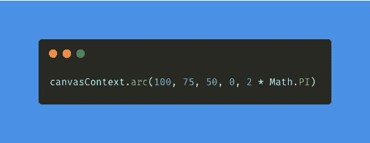**

**当您将此方法添加到代码中时，您将不会在浏览器中看到任何内容。这将类似于我们在第一部分中最初制作画布时看不到画布的情况。**

**要看到这个圆，我们必须给它添加一个填充或描边属性，在这个例子中，我将使用`[.fill()](https://developer.mozilla.org/en-US/docs/Web/API/CanvasRenderingContext2D/fill)`。这将使我们的圈子可见。**

**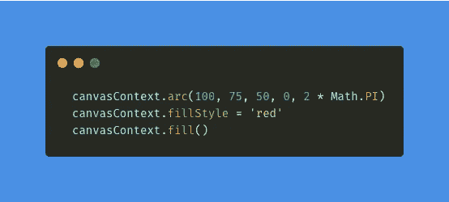**

**现在，如果我想改变我的圆圈的颜色呢？**

**我们将使用`[.fillStyle](https://developer.mozilla.org/en-US/docs/Web/API/CanvasRenderingContext2D/strokeStyle)`属性。这可用于任何形状，因为它将改变该形状的笔画颜色、渐变或图案。在我们的圆的例子中，我想把它变成红色。**

**注意:您制作的形状将采用它前面的`.fillStyle`属性。所以我每个`.fill()`方法前都有。**

**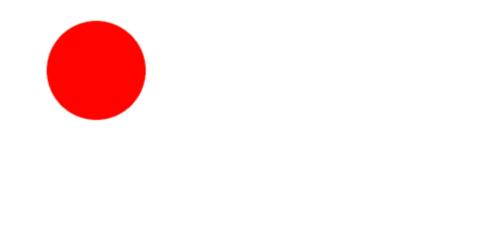**

**还记得我提到过使用`for-loop`来创建圆吗？**

**如果您不熟悉如何使用`for-loop`，请查阅[文档](https://developer.mozilla.org/en-US/docs/Web/JavaScript/Guide/Loops_and_iteration#for_statement)。我们将使用一个`for-loop`来添加圆。**

**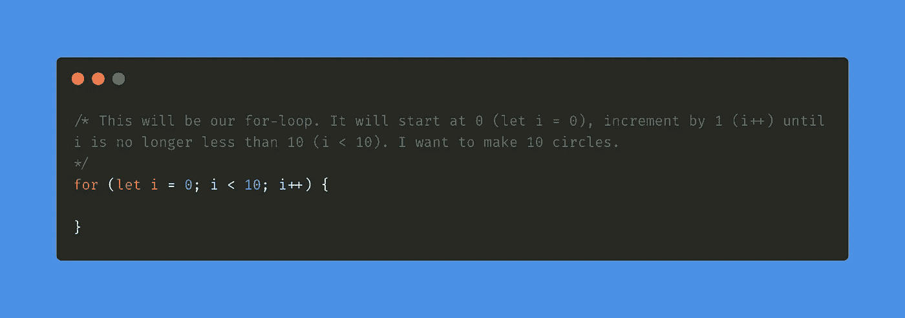**

**把 10 改成你想要的任何正整数，看看会发生什么。**

**在花括号内，(或者，正如我的导师所说的，“卷毛男孩”)，我们将放入前一个图像的代码。**

**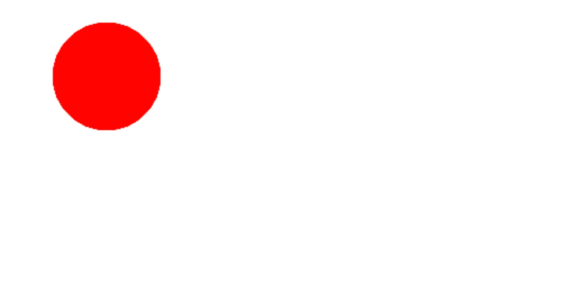**

**为什么什么都没发生？？**

**我们的循环正在工作，但是我们不会在循环的每次迭代中改变`x`和`y`参数。这个圆正在绕着自己转十圈。**

**为了改变这一点，我们可以对我们的`x`和`y`值使用`Math.random()`方法。并且，为了确保这些圆仍然是圆，我将引入`[.beginPath()](https://developer.mozilla.org/en-US/docs/Web/API/CanvasRenderingContext2D/beginPath)`，它将确保在循环的每次迭代中，一个新的圆以它自己的路径被创建。**

**如果你不确定这到底是什么意思，试着在不添加`.beginPath()`的情况下运行这个循环，看看你会得到什么。**

**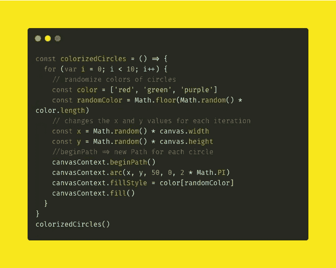**

**我添加了一个颜色数组来随机化圆圈的颜色，并在填充样式中使用它**

**我会把这个做成一个函数叫做`colorizedCircles`。**

**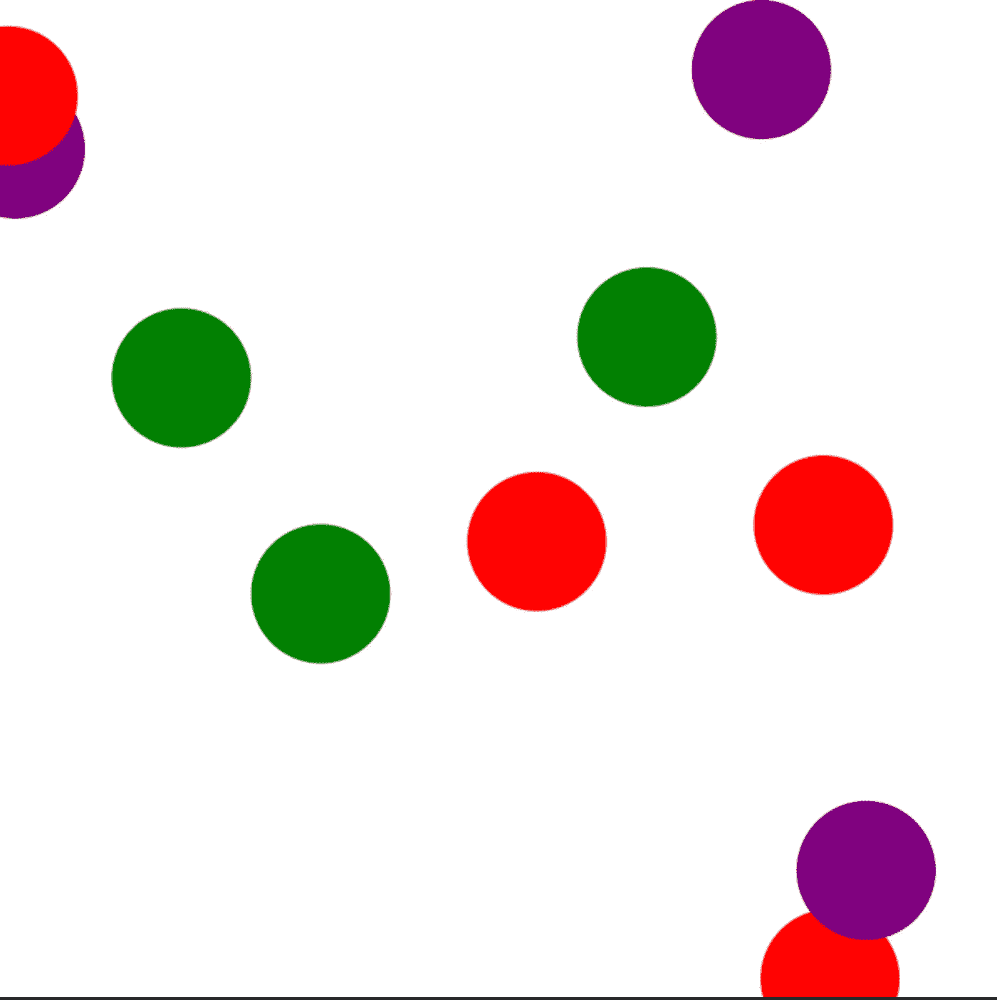**

**现在你知道了如何实现一个基本的`for-loop`来一次制作多个形状，让我们开始制作动画的有趣部分吧！**

# **为您的形状制作动画**

**好了，我们终于开始用 JavaScript 制作动画的有趣部分了。**

**我们将使用`[.requestAnimationFrame()](https://developer.mozilla.org/en-US/docs/Web/API/window/requestAnimationFrame)`方法。这告诉浏览器你希望动画出现，浏览器的工作就是在制作另一个动画之前调用一个函数来更新动画。**

**`.requestAnimationFrame()`接受一个参数，这是一个回调(根据 MDN):**

> **"`callback`:该为下一次重画更新动画时调用的函数。回调函数通过一个参数传递，一个类似于`[performance.now()](https://developer.mozilla.org/en-US/docs/Web/API/Performance/now)`返回的`[DOMHighResTimeStamp](https://developer.mozilla.org/en-US/docs/Web/API/DOMHighResTimeStamp)`，指示`requestAnimationFrame()`开始执行回调函数的时间点。**

**其工作原理是刷新页面，每次刷新时，形状移动`x`、`y`值。我们首先要开始增加我们的圆的`x`和`y`值，并观察它的移动。**

**我将创建一个名为`animateShape`的函数。我将在函数外部设置一个变量`x`和`y`，只要函数运行，我将让`x`递增 0.5，让`y`递增 1。**

**试着改变这些值。你可能会注意到它会影响圆圈移动的速度。**

**我将创建另一个名为`drawCircle`的函数，它负责创建我们的圈子。然后，我将在我的`animateShape`函数中调用`drawCircle`，这样它将为我们刚刚创建的圆制作动画。**

**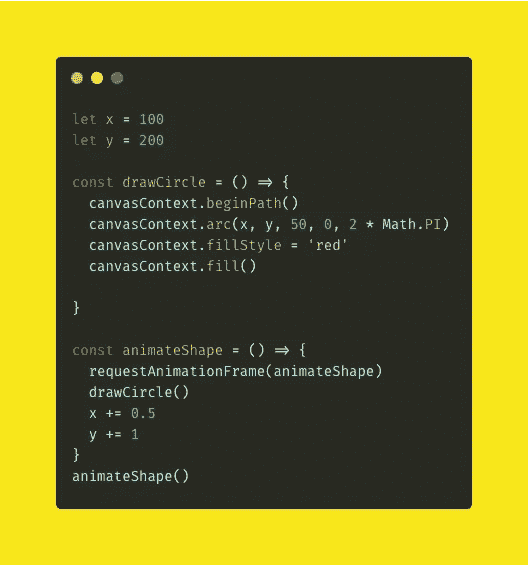******

**这真的很酷，但我们的形状正在变成一个移动的斑点，这实际上不是我们此刻想要的。**

**相反，我们需要画布在呈现新形状之前清空页面。这类似于当我们最初用我们的随机循环制作我们的圆时，为什么我们需要使用`.beginPath()`方法。**

**为了解决这个问题，我们需要使用`.[clearRect()](https://developer.mozilla.org/en-US/docs/Web/API/CanvasRenderingContext2D/clearRect)`方法。这将在每个新页面刷新之前清空我们的画布，然后在上面绘图。**

**`.clearRect()`采用四个参数:**

*   **`x`:矩形起点的 x 轴坐标。**
*   **`y`:矩形起点的 y 轴坐标。**
*   **`width`:矩形的宽度。正值在右边，负值在左边。**
*   **`height`:矩形的高度。正值向下，负值向上。**

**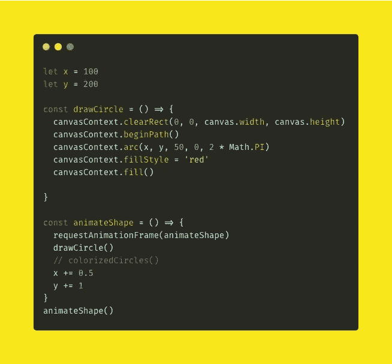**

**在前面的 clearRect()中添加。beginPath()**

**为了得到一个新的圆形渲染，我们应该使`.clearRect()`中的`x`和`y`值保持为 0，并使另外两个参数等于画布的宽度和高度。**

# **边注**

**将动作分解成更小的功能的好处在于，您可以在不同的地方调用它们并重用它们。(对于调试较大的代码来说，这也很好。)**

**在代码中，我有我们之前注释掉的`colorizedCircles`函数。尝试取消注释`colorizedCircles`函数，注释掉`drawCircle`函数，看看会发生什么。**

****警告**:如果你对闪光动作敏感，不要这样做:例如，如果你有癫痫症。**

**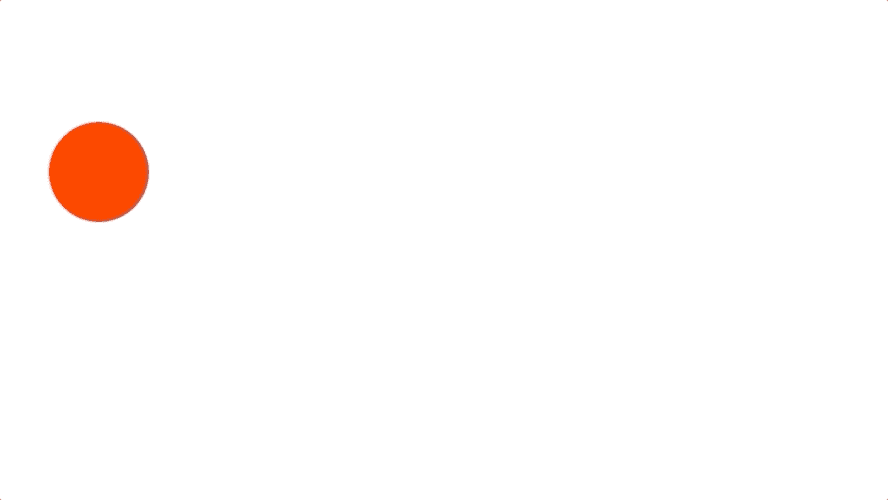**

**这是加上`.clearRect()`的结果。然而，球离开了屏幕。**

**为了解决这个问题，我们需要在函数中添加一个条件，将我们的形状限制在窗口内。当实现这个条件时，有几件事情需要考虑:**

1.  **随着我们的形状增加它的`x`和`y`值，如上面的代码所示，随着`x`和`y`值变大，它继续朝那个方向前进。**
2.  **我们的形状应该在什么点上决定停下来，向相反的方向前进？**

**在上面的第一点中，我提到过`x`和`y`的值在增加，并且形状在那个方向上继续。我们该如何阻止？**

**一种方法是将我们正在增加的`x`或`y`值变成一个负数。让我们创建另一个名为`y1`的变量，它等于 3。**

**然后，代替我们的`y`变量增加`+= 1`，我们将让它增加我们设置为`y1`的值。这样，我们可以很容易地改变我们的条件的`y1` 值。**

**在上面的第二点中，我提到了考虑圆的半径。确保，如果你想让圆在圆的边缘从屏幕上弹开，你在条件中输入`y + center`，并在`.arc()`函数的半径参数中输入我们的`center` 变量。**

**现在，在我们的`if statement`中，如果`y + center`大于窗口的高度，那么反转形状的方向。由于`y1`等于 3，所以现在会变成-3。**

**我们添加圆心/半径的原因是，圆不会从圆心处的窗口反弹，而是从圆的边缘反弹。**

**我们还在条件的右边添加了一个`[||](https://www.w3schools.com/js/js_comparisons.asp)`。这就要说到`y — center < 0`。这将检查`y - center`是否小于 0。如果是这样，将-3 转回正 3，然后向另一个方向走。**

**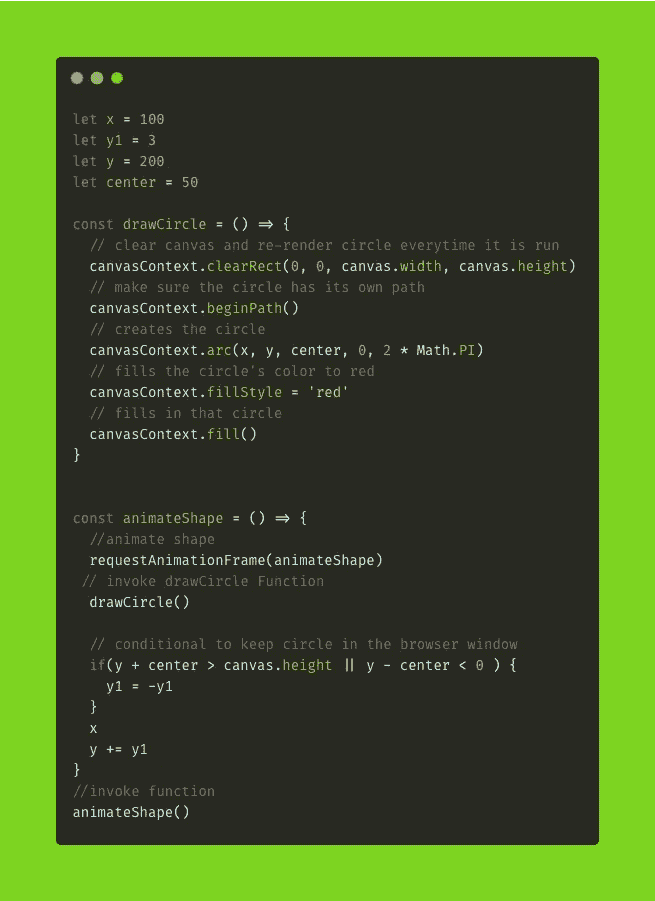****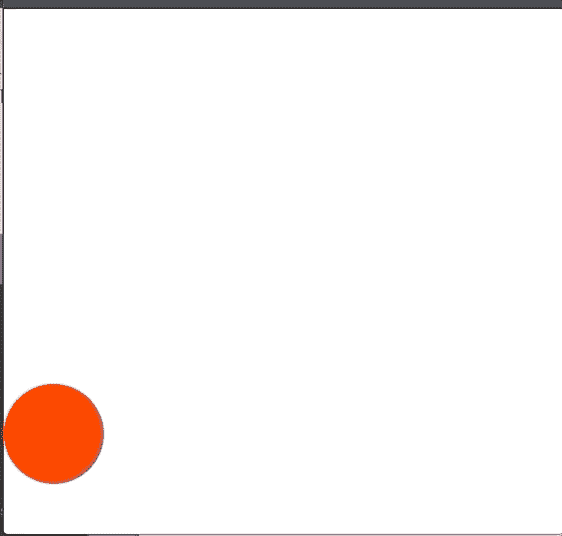**

**挑战:根据上面的代码示例，如果它横向反弹，如何让它停留在窗口内？**

# **结论**

**希望本教程能够给你一个创建和动画基本形状的概述。我希望这给了你工具去尝试其他形状以及如何制作动画。**

**查看 MDN 文档:[画布动画简介](https://developer.mozilla.org/en-US/docs/Web/API/Canvas_API/Tutorial/Basic_animations)。**

**另外，另一个很棒的资源是一个名为 [Three.js](https://threejs.org/) 的 JS 库。这可以帮助您制作 3D 形状。**