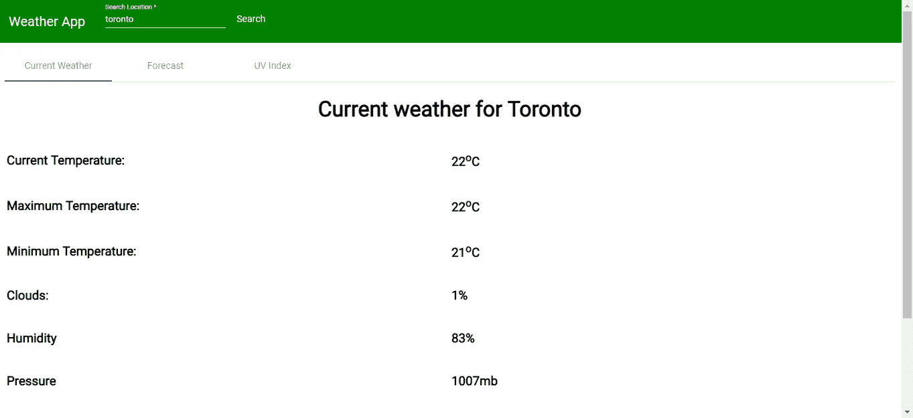
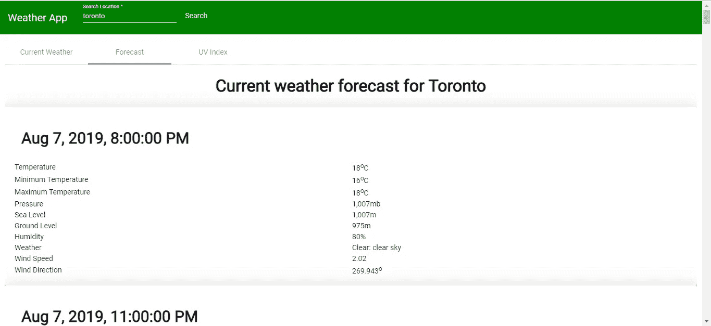
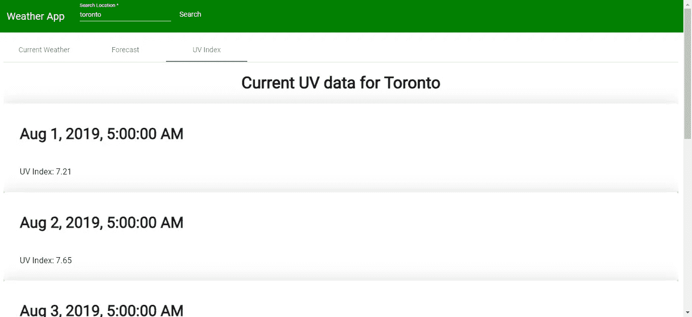

# 如何使用 OpenWeatherMap API 制作 Angular 中的天气 App

> 原文：<https://betterprogramming.pub/how-to-use-the-openweathermap-api-to-make-a-weather-app-f8d67b22c3ca>

## 使用 Angular 在几分钟内建立一个天气应用程序


[在](https://unsplash.com/@wimvanteinde)[上坡](https://unsplash.com/photos/uj7eb7CgqRk)上没有一个

OpenWeather 是一个天气网站，它提供自己的免费 API 供人们使用。它对于构建我们自己使用的小型天气应用程序来说非常方便。在这个故事中，我们将使用 OpenWeatherMap API 构建自己的天气应用程序。

首先，在这里得到一个 API 键。

我们将使用 Angular 框架来构建应用程序。Angular 使用基于组件的架构来组织我们的代码。它还有一个 flux 库，在一个中心位置存储数据。它很有用，因为它可以做很多事情(结构化代码、路由等)。)，而且它有库(例如 Angular Material library)让我们的应用看起来很漂亮。它还有一个用 Angular CLI 搭建和构建应用程序的程序。

# 让我们开始建造吧

首先，我们运行`npm i -g @angular/cli`来安装 Angular CLI。然后，我们添加我们需要的库，使我们的应用程序功能和外观良好。为此，我们使用有角的材料。我们通过运行以下命令来实现这一点:

```
npm install --save @angular/material @angular/cdk @angular/animations
```

我们还需要通过运行以下命令来安装`@ngrx/store`:

```
npm install @ngrx/store --save
```

我们安装了`moment`,通过运行以下命令来格式化日期:

```
npm i moment
```

然后我们开始编写我们的应用程序。让我们添加一些组件:我们需要一个警报页面来显示紫外线指数，一个当前天气组件来显示当前天气，一个预测组件来显示预测，一个页面来保存所有内容，一个顶部栏来显示应用程序名称，以及一个搜索框。

现在，我们创建由应用程序的多个部分使用的代码。我们需要一个缩减器来集中存储数据。为此，创建一个名为`location-reducer.ts`的文件，并放入以下内容:

```
import { Action } from '[@ngrx/store](http://twitter.com/ngrx/store)';export const initialState = '';
export const SET_LOCATION = 'SET_LOCATION';export function locationReducer(state = initialState, action: any) {
    switch (action.type) {
        case SET_LOCATION:
            state = action.payload
            return state;
        default:
            return state;
    }
}
```

然后我们创建函数来获取天气数据。我们创建了一个名为`WeatherService`的角度服务。为此，请运行:

```
ng g service weather
```

在`weather.service.ts`中，我们输入:

```
import { Injectable } from '[@angular/core](http://twitter.com/angular/core)';
import { HttpClient } from '[@angular/common](http://twitter.com/angular/common)/http';
import { environment } from 'src/environments/environment';
import * as moment from 'moment';
const apiKey: string = environment.apiKey;[@Injectable](http://twitter.com/Injectable)({
  providedIn: 'root'
})
export class WeatherService { constructor(private http: HttpClient) { } getCurrentWeather(loc: string) {
    return this.http.get(`${environment.apiUrl}/weather?q=${loc}&appid=${apiKey}`)
  } getForecast(loc: string) {
    return this.http.get(`${environment.apiUrl}/forecast?q=${loc}&appid=${apiKey}`)
  } getUv(lat: number, lon: number) {
    let startDate = Math.round(+moment(new Date()).subtract(1, 'week').toDate() / 1000);
    let endDate = Math.round(+moment(new Date()).add(1, 'week').toDate() / 1000);
    return this.http.get(`${environment.apiUrl}/uvi/history?lat=${lat}&lon=${lon}&start=${startDate}&end=${endDate}&appid=${apiKey}`)
  }
}
```

在`environments/environment.ts`中，我们输入:

```
export const environment = {
  production: false,
  apiKey: 'api key',
  apiUrl: '[http://api.openweathermap.org/data/2.5'](http://api.openweathermap.org/data/2.5')
};
```

`apiKey`是你从网站上得到的密钥。

我们运行以下命令来生成组件:

```
ng g component uv
ng g component currentWeather
ng g component forecast
ng g component homePage
ng g component topBar
```

现在我们向组件添加代码:

在`uv.component.ts`中，我们把:

```
import { Component, OnInit } from '[@angular/core](http://twitter.com/angular/core)';
import { Observable } from 'rxjs';
import { Store, select } from '[@ngrx/store](http://twitter.com/ngrx/store)';
import { WeatherService } from '../weather.service';[@Component](http://twitter.com/Component)({
  selector: 'app-uv',
  templateUrl: './uv.component.html',
  styleUrls: ['./uv.component.css']
})
export class UvComponent implements OnInit {
  loc$: Observable<string>;
  loc: string;
  currentWeather: any = <any>{};
  uv: any[] = [];
  msg: string; constructor(
    private store: Store<any>,
    private weatherService: WeatherService
  ) {
    this.loc$ = store.pipe(select('loc'));
    this.loc$.subscribe(loc => {
      this.loc = loc;
      this.searchWeather(loc);
    })
  } ngOnInit() {
  } searchWeather(loc: string) {
    this.msg = '';
    this.currentWeather = {};
    this.weatherService.getCurrentWeather(loc)
      .subscribe(res => {
        this.currentWeather = res;
      }, err => {}, () => {
        this.searchUv(loc);
      })
  } searchUv(loc: string) {
    this.weatherService.getUv(this.currentWeather.coord.lat, this.currentWeather.coord.lon)
      .subscribe(res => {
        this.uv = res as any[];
      }, err => {})
  } resultFound() {
    return Object.keys(this.currentWeather).length > 0;
  }}
```

这将从 API 中获取 UV 指数。

在`uv.component.html`中，我们把:

```
<div *ngIf='resultFound()'>
  <h1 class="center">Current UV data for {{currentWeather.name}}</h1>
  <mat-card *ngFor='let l of uv' class="mat-elevation-z18">
    <mat-card-header>
      <mat-card-title>
        <h2>{{l.date_iso | date:'MMM d, y, h:mm:ss a'}}</h2>
      </mat-card-title>
    </mat-card-header>
    <mat-card-content>
      <mat-list>
        <mat-list-item>
          <span>
            UV Index: {{l.value}}
          </span>
        </mat-list-item>        
      </mat-list>
    </mat-card-content>
  </mat-card>
</div>
<div *ngIf='!resultFound()'>
  <h1 class="center">{{msg || 'Failed to get weather.'}}</h1>
</div>
```

为了格式化日期，我们写:

```
{{l.date_iso | date:'MMM d, y, h:mm:ss a'}}
```

这在角行话里叫管道。这是一种将一个物体转换成另一个物体的功能。它可以用在模板和逻辑代码中。

同样，在`current-weather.component.ts`中，我们把:

```
import { Component, OnInit } from '[@angular/core](http://twitter.com/angular/core)';
import { Observable } from 'rxjs';
import { Store, select } from '[@ngrx/store](http://twitter.com/ngrx/store)';
import { WeatherService } from '../weather.service';[@Component](http://twitter.com/Component)({
  selector: 'app-current-weather',
  templateUrl: './current-weather.component.html',
  styleUrls: ['./current-weather.component.css']
})
export class CurrentWeatherComponent implements OnInit { loc$: Observable<string>;
  loc: string;
  currentWeather: any = <any>{};
  msg: string; constructor(
    private store: Store<any>,
    private weatherService: WeatherService
  ) {
    this.loc$ = store.pipe(select('loc'));
    this.loc$.subscribe(loc => {
      this.loc = loc;
      this.searchWeather(loc);
    })
  } ngOnInit() {
  } searchWeather(loc: string) {
    this.msg = '';
    this.currentWeather = {};
    this.weatherService.getCurrentWeather(loc)
      .subscribe(res => {
        this.currentWeather = res;
      }, err => {
        if (err.error && err.error.message) {
          alert(err.error.message);
          this.msg = err.error.message;
          return;
        }
        alert('Failed to get weather.');
      }, () => {})
  } resultFound() {
    return Object.keys(this.currentWeather).length > 0;
  }
}
```

这是我们获取当前天气的地方。在相应的模板`current-weather.component.html`中，我们放入:

```
<h1 class="center" *ngIf='resultFound()'>Current weather for {{currentWeather.name}}</h1>
<table *ngIf='resultFound()'>
  <tbody>
    <tr>
      <td>
        <h3>Current Temperature:</h3>
      </td>
      <td>
        <h3>{{currentWeather.main?.temp - 273.15 | number:'1.0-0'}}<sup>o</sup>C</h3>
      </td>
    </tr>
    <tr>
      <td>
        <h3>Maximum Temperature:</h3>
      </td>
      <td>
        <h3>{{currentWeather.main?.temp - 273.15 | number:'1.0-0'}}<sup>o</sup>C</h3>
      </td>
    </tr>
    <tr>
      <td>
        <h3>Minimum Temperature:</h3>
      </td>
      <td>
        <h3>{{currentWeather.main?.temp_min - 273.15 | number:'1.0-0'}}<sup>o</sup>C</h3>
      </td>
    </tr>
    <tr>
      <td>
        <h3>Clouds:</h3>
      </td>
      <td>
        <h3>{{currentWeather.clouds?.all}}%</h3>
      </td>
    </tr>
    <tr>
      <td>
        <h3>Humidity</h3>
      </td>
      <td>
        <h3>{{currentWeather.main?.humidity}}%</h3>
      </td>
    </tr>
    <tr>
      <td>
        <h3>Pressure</h3>
      </td>
      <td>
        <h3>{{currentWeather.main?.pressure}}mb</h3>
      </td>
    </tr>
    <tr>
      <td>
        <h3>Sunrise</h3>
      </td>
      <td>
        <h3>{{currentWeather.sys?.sunrise*1000 | date:'long'}}</h3>
      </td>
    </tr>
    <tr>
      <td>
        <h3>Sunset</h3>
      </td>
      <td>
        <h3>{{currentWeather.sys?.sunset*1000 | date:'long'}}</h3>
      </td>
    </tr>
    <tr>
      <td>
        <h3>Visibility</h3>
      </td>
      <td>
        <h3>{{currentWeather.visibility}}m</h3>
      </td>
    </tr>
  </tbody>
</table>
<div *ngIf='!resultFound()'>
  <h1 class="center">{{msg || 'Failed to get weather.'}}</h1>
</div>
```

它只是一个显示数据的表格。

在`forecast.component.ts`中，我们把:

```
import { Component, OnInit } from '[@angular/core](http://twitter.com/angular/core)';
import { Observable } from 'rxjs';
import { Store, select } from '[@ngrx/store](http://twitter.com/ngrx/store)';
import { WeatherService } from '../weather.service';[@Component](http://twitter.com/Component)({
  selector: 'app-forecast',
  templateUrl: './forecast.component.html',
  styleUrls: ['./forecast.component.css']
})
export class ForecastComponent implements OnInit {
  loc$: Observable<string>;
  loc: string;
  currentWeather: any = <any>{};
  forecast: any = <any>{};
  msg: string; constructor(
    private store: Store<any>,
    private weatherService: WeatherService
  ) {
    this.loc$ = store.pipe(select('loc'));
    this.loc$.subscribe(loc => {
      this.loc = loc;
      this.searchWeather(loc);
    })
  } ngOnInit() {
  } searchWeather(loc: string) {
    this.msg = '';
    this.currentWeather = {};
    this.weatherService.getCurrentWeather(loc)
      .subscribe(res => {
        this.currentWeather = res;
      }, err => {}, () => {
        this.searchForecast(loc);
      })
  } searchForecast(loc: string) {
    this.weatherService.getForecast(loc)
      .subscribe(res => {
        this.forecast = res;
      }, err => {})
  } resultFound() {
    return Object.keys(this.currentWeather).length > 0;
  }}
```

在对应的`forecast.component.html`模板中，我们放入:

```
<div *ngIf='resultFound()'>
  <h1 class="center">Current weather forecast for {{currentWeather.name}}</h1>
  <mat-card *ngFor='let l of forecast.list' class="mat-elevation-z18">
    <mat-card-header>
      <mat-card-title>
        <h2>{{l.dt*1000 | date:'MMM d, y, h:mm:ss a'}}</h2>
      </mat-card-title>
    </mat-card-header>
    <mat-card-content>
      <table *ngIf='resultFound()'>
        <tbody>
          <tr>
            <td>Temperature</td>
            <td>{{l.main?.temp - 273.15 | number:'1.0-0'}}<sup>o</sup>C</td>
          </tr>
          <tr>
            <td>Minimum Temperature</td>
            <td>{{l.main?.temp_min - 273.15 | number:'1.0-0'}}<sup>o</sup>C</td>
          </tr>
          <tr>
            <td>Maximum Temperature</td>
            <td>{{l.main?.temp_max - 273.15 | number:'1.0-0'}}<sup>o</sup>C</td>
          </tr>
          <tr>
            <td>Pressure</td>
            <td>{{l.main?.pressure | number:'1.0-0'}}mb</td>
          </tr>
          <tr>
            <td>Sea Level</td>
            <td>{{l.main?.sea_level | number:'1.0-0'}}m</td>
          </tr>
          <tr>
            <td>Ground Level</td>
            <td>{{l.main?.grnd_level | number:'1.0-0'}}m</td>
          </tr>
          <tr>
            <td>Humidity</td>
            <td> {{l.main?.humidity | number:'1.0-0'}}%</td>
          </tr>
          <tr>
            <td>Weather</td>
            <td>
              <ul>
                <li *ngFor='let w of l.weather'>
                  {{w?.main }}: {{w?.description }}
                </li>
              </ul>
            </td>
          </tr>
          <tr>
            <td>Wind Speed</td>
            <td>{{l.wind?.speed }}</td>
          </tr>
          <tr>
            <td>Wind Direction</td>
            <td>{{l.wind?.deg }}<sup>o</sup></td>
          </tr>
        </tbody>
      </table>
    </mat-card-content>
  </mat-card>
</div>
<div *ngIf='!resultFound()'>
  <h1 class="center">{{msg || 'Failed to get weather.'}}</h1>
</div>
```

在`home-page.component.ts`中，我们把:

```
import { Component, OnInit } from '[@angular/core](http://twitter.com/angular/core)';
import { Store, select } from '[@ngrx/store](http://twitter.com/ngrx/store)';
import { Observable } from 'rxjs';[@Component](http://twitter.com/Component)({
  selector: 'app-home-page',
  templateUrl: './home-page.component.html',
  styleUrls: ['./home-page.component.css']
})
export class HomePageComponent implements OnInit {
  loc$: Observable<string>;
  loc: string; constructor(private store: Store<any>) {
    this.loc$ = store.pipe(select('loc'));
    this.loc$.subscribe(loc => {
      this.loc = loc;
    })
  } ngOnInit() {
  }}
```

在`home-page.component.html`中，我们有:

```
<app-top-bar></app-top-bar>
<div id='container'>
    <div *ngIf='!loc' id='search'>
        <h1>Enter location to find weather info.</h1>
    </div>
    <mat-tab-group *ngIf='loc'>
        <mat-tab label="Current Weather">
            <app-current-weather></app-current-weather>
        </mat-tab>
        <mat-tab label="Forecast">
            <app-forecast></app-forecast>
        </mat-tab>
        <mat-tab label="UV Index">
            <app-uv></app-uv>
        </mat-tab>
    </mat-tab-group>
</div>
```

最后，在`top-bar.component.ts`中，我们有:

```
import { Component, OnInit } from '[@angular/core](http://twitter.com/angular/core)';
import { Store } from '[@ngrx/store](http://twitter.com/ngrx/store)';
import { SET_LOCATION } from '../location-reducer';
import { NgForm } from '[@angular/forms](http://twitter.com/angular/forms)';[@Component](http://twitter.com/Component)({
  selector: 'app-top-bar',
  templateUrl: './top-bar.component.html',
  styleUrls: ['./top-bar.component.css']
})
export class TopBarComponent implements OnInit {
  loc: string;constructor(private store: Store<any>) { }ngOnInit() {
  } search(searchForm: NgForm) {
    if (searchForm.invalid) {
      return;
    }
    this.store.dispatch({ type: SET_LOCATION, payload: this.loc });
  }}
```

在`top-bar.component.html`中，我们有:

```
<mat-toolbar>
  <span id='title'>Weather App</span>
  <form (ngSubmit)='search(searchForm)' #searchForm='ngForm'>
    <mat-form-field class="form-field">
      <input matInput placeholder="Search Location" [(ngModel)]='loc' #lo='ngModel' name='lo' required type='text'
        autocomplete="off">
      <mat-error *ngIf="lo.invalid && (lo.dirty || lo.touched)">
        <span *ngIf='lo.errors.required'>
          Location is required.
        </span>
      </mat-error>
    </mat-form-field>
    <button mat-button type='submit'>Search</button>
  </form>
</mat-toolbar>
```

在`top-bar.component.css`中，我们有:

```
#title{
    margin-right: 30px;
}.mat-form-field{
    font-size: 13px;
}.mat-button{
    height: 33px;
}.mat-toolbar{
    background-color: green;
    color: white;
}.mat-error, .mat-form-field-invalid .mat-input-element, .mat-warn .mat-input-element{
    color: white !important;
    border-bottom-color: white !important;
}.mat-focused .placeholder{
    color: white;
}::ng-deep .form-field.mat-form-field-appearance-legacy .mat-form-field-underline,
.form-field.mat-form-field-appearance-legacy .mat-form-field-ripple,
.form-field.mat-form-field-appearance-legacy.mat-focused
    .mat-form-field-underline,
.form-field.mat-form-field-appearance-legacy.mat-focused
    .mat-form-field-ripple {
    background-color: white !important;
    border-bottom-color: white !important;
}/** Overrides label color **/
::ng-deep .form-field.mat-form-field-appearance-legacy .mat-form-field-label,
.form-field.mat-form-field-appearance-legacy.mat-focused
    .mat-form-field-label {
    color: white !important;
    border-bottom-color: white !important;
}/** Overrides caret & text color **/
::ng-deep .form-field.mat-form-field-appearance-legacy .mat-input-element {
    caret-color: white !important;
    color: white !important;
    border-bottom-color: white !important;
}::ng-deep .mat-form-field-underline, ::ng-deep .mat-form-field-ripple {
    background-color: white !important;
}
```

让我们给顶栏添加一些颜色。

在`style.css`中，我们添加:

```
/* You can add global styles to this file, and also import other style files */
[@import](http://twitter.com/import) "~[@angular/material](http://twitter.com/angular/material)/prebuilt-themes/indigo-pink.css";
body{
    margin: 0px;
    font-family: 'Roboto', sans-serif;
}.center{
    text-align: center;
}table{
    width: 100%
}
```

这是我们导入材质设计主题进行造型的地方。在`index.html`中，让我们添加以下代码，这样我们就可以使用我们指定的 Roboto 字体:

```
<link href="https://fonts.googleapis.com/css?family=Roboto" rel="stylesheet">
```

注意我们有这个:

```
search(searchForm: NgForm) {
  if (searchForm.invalid) {
    return;
  }
  this.store.dispatch({ type: SET_LOCATION, payload: this.loc });
}
```

这就是搜索发生的地方。通过在商店中发送关键字，搜索关键字在整个应用程序中传播。无论我们在哪里看到…

```
this.loc$ = store.pipe(select('loc'));
this.loc$.subscribe(loc => {
  this.loc = loc;
})
```

…我们从 flux store 订阅最新的搜索关键字。我们不必担心在应用程序中传递数据来传播搜索关键字。这类似于下面的块:

```
this.loc$ = store.pipe(select('loc'));
this.loc$.subscribe(loc => {
  this.loc = loc;
  this.searchWeather(loc);
})
```

这将关键字发送到服务函数，该函数根据我们输入的关键字搜索天气数据。

任何以`mat`开头的都是有棱角的材质小部件。他们都是有风格的，所以我们不需要自己动手。

在`app.module.ts`中，我们将现有代码替换为:

```
import { BrowserModule } from '[@angular/platform-browser](http://twitter.com/angular/platform-browser)';
import { NgModule } from '[@angular/core](http://twitter.com/angular/core)';import { AppRoutingModule } from './app-routing.module';
import { AppComponent } from './app.component';
import { BrowserAnimationsModule } from '[@angular/platform-browser](http://twitter.com/angular/platform-browser)/animations';
import {
  MatButtonModule,
  MatToolbarModule,
  MatInputModule,
  MatTabsModule,
  MatCardModule,
  MatDividerModule,
  MatListModule
} from '[@angular/material](http://twitter.com/angular/material)';
import { HomePageComponent } from './home-page/home-page.component';
import { StoreModule } from '[@ngrx/store](http://twitter.com/ngrx/store)';
import { locationReducer } from './location-reducer';
import { TopBarComponent } from './top-bar/top-bar.component';
import { FormsModule } from '[@angular/forms](http://twitter.com/angular/forms)';
import { WeatherService } from './weather.service';
import { CurrentWeatherComponent } from './current-weather/current-weather.component';
import { ForecastComponent } from './forecast/forecast.component';
import { UvComponent } from './uv/uv.component';
import { AlertsComponent } from './alerts/alerts.component';
import { HttpClientModule } from '[@angular/common](http://twitter.com/angular/common)/http';[@NgModule](http://twitter.com/NgModule)({
  declarations: [
    AppComponent,
    HomePageComponent,
    TopBarComponent,
    CurrentWeatherComponent,
    ForecastComponent,
    UvComponent,
    AlertsComponent
  ],
  imports: [
    BrowserModule,
    AppRoutingModule,
    BrowserAnimationsModule,
    MatButtonModule,
    MatToolbarModule,
    StoreModule.forRoot({
      loc: locationReducer
    }),
    FormsModule,
    MatInputModule,
    MatTabsModule,
    MatCardModule,
    HttpClientModule,
    MatDividerModule,
    MatListModule
  ],
  providers: [
    WeatherService
  ],
  bootstrap: [AppComponent]
})
export class AppModule { }
```

包括角度材料和我们在主应用程序模块中编写的代码。

# 结果

最后，我们有:

