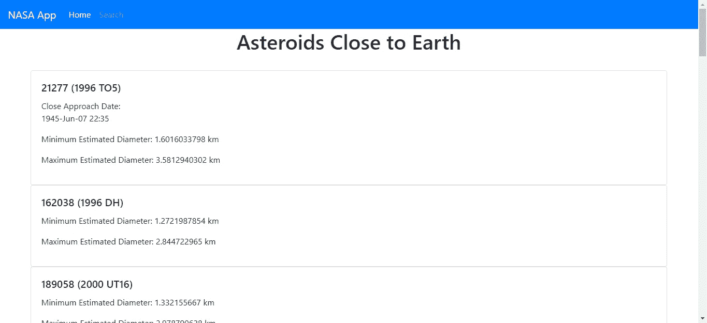
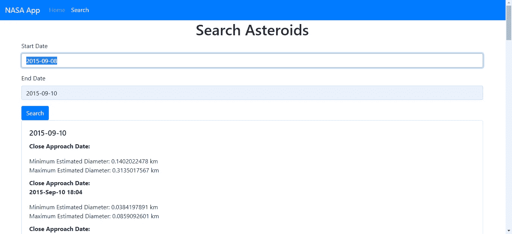

# 如何在您的 JavaScript 应用程序中使用可选的链接操作符

> 原文：<https://betterprogramming.pub/how-to-use-the-optional-chaining-operator-in-your-javascript-app-a08f28db13e9>

## Swift 的可选处理是 JavaScript


马修·惠勒在 [Unsplash](https://unsplash.com/search/photos/chain?utm_source=unsplash&utm_medium=referral&utm_content=creditCopyText) 上拍摄的照片

可选链接是一个被提议的特性，可能会被合并到 JavaScript 规范中。

操作符允许你遍历一个嵌套的对象来获得变量的值，而不用担心这些变量是否会被定义。

例如，在没有可选链接的情况下，如果您有以下对象:

```
const person = {
  name: 'Alice',
  cat: {
    name: 'Bob'
  }
};
```

如果你想得到猫的名字，你必须使用下面的代码:

```
const catName = person.cat.name;
```

如果`person`中的`cat`未定义或为空，JavaScript 解释器将抛出错误。使用可选的链接操作符，您可以编写:

```
const catName = person?.cat?.name;
```

如果`cat`未定义，则`catName`将为`null`。

它也适用于对象的关键点。代替`const catName = person?.cat?.name;`，我们可以写:

```
const catName = person?.['cat']?.['name'];
```

这种语法也适用于函数。例如，您可以写:

```
func?.('foo')
```

用字符串调用函数`func`，其中`func`可能未定义或为空。如果该函数不存在，它将不会运行。

为了进一步说明这个例子，并向您展示如何在实际应用程序中使用它，我们将构建一个 React 应用程序，它使用 [NASA API](https://api.nasa.gov/index.html) 来获取最新的小行星数据。

我们将使用 [Create React App](https://github.com/facebook/create-react-app) CLI 程序来构建应用程序。

由于可选链接只是一个提议的功能，CLI 目前还不支持它，所以我们必须自己做一些工作，安装一些包并对应用程序的 [Babel](https://babeljs.io/) 配置进行一些更改，以启用可选链接。

首先，我们运行`npx create-react-app nasa-app`来创建包含初始文件的项目文件夹。

接下来，我们安装`npm i -D @babel/plugin-proposal-optional-chaining customize-cra react-app-rewired`开始定制 Create React App，以支持可选的链接语法。

接下来，我们必须添加新的配置文件并编辑现有的文件，以让我们的应用程序运行并使用该语法进行构建。

首先，我们添加一个名为`config-overrides.js`的文件，并添加以下内容:

```
const { useBabelRc, override, useEslintRc } = require("customize-cra");module.exports = override(useBabelRc());
```

让我们使用`.babelrc`配置文件。

然后，我们在项目的根文件夹中创建`.babelrc`文件，并添加:

```
{
    "plugins": [
        [
            "[@babel/plugin-proposal-optional-](http://twitter.com/babel/plugin-proposal-optional-)chaining"
        ],
    ]
}
```

这将在我们的项目中增加对可选链接语法的支持。

接下来，我们必须切换到使用`react-app-rewired`而不是通常的`react-script`程序来运行和构建我们的应用程序。

为此，在`package.json`的`scripts`部分，我们放置:

```
"scripts": {
    "start": "react-app-rewired start",
    "build": "react-app-rewired build",
    "test": "react-app-rewired test --env=jsdom",
    "eject": "react-scripts eject"
}
```

在这里，我们用`react-app-rewired`替换了使用`react-script`运行和构建我们的应用程序的原始脚本。

现在我们可以使用可选的链接语法来构建我们的应用程序。

首先，我们必须安装一些软件包。

运行`npm i axios bootstrap react-bootstrap formik yup react-router-dom`安装 [axios](https://github.com/axios/axios) HTTP 客户端， [React Bootstrap](https://react-bootstrap.github.io/) 用于样式化， [Formik](https://github.com/jaredpalmer/formik) 和 [Yup](https://www.npmjs.com/package/yup) 用于构建表单和添加表单验证， [React Router](https://reacttraining.com/react-router/) 用于将 URL 路由到我们构建的页面。

现在我们可以写一些代码了。在`App.js`中，我们将现有代码替换为:

```
import React from "react";
import { Router, Route } from "react-router-dom";
import HomePage from "./HomePage";
import AsteroidsSearchPage from "./AsteroidsSearchPage";
import { createBrowserHistory as createHistory } from "history";
import "./App.css";
import TopBar from "./TopBar";
const history = createHistory();function App() {
  return (
    <div className="App">
      <Router history={history}>
        <TopBar />
        <Route path="/" exact component={HomePage} />
        <Route path="/search" exact component={AsteroidsSearchPage} />
      </Router>
    </div>
  );
}export default App;
```

这样我们就可以从客户端路由到我们的页面。在`App.css`中，我们将现有代码替换为:

```
.center {
  text-align: center;
}
```

接下来，我们开始构建新页面。在`src`文件夹中创建一个名为`AsteroidSearchPage.js`的文件，并添加:

```
import React, { useState, useEffect } from "react";
import { Formik } from "formik";
import Form from "react-bootstrap/Form";
import Col from "react-bootstrap/Col";
import Button from "react-bootstrap/Button";
import * as yup from "yup";
import Card from "react-bootstrap/Card";
import "./AsteroidsSearchPage.css";
import { searchFeed } from "./requests";const schema = yup.object({
  startDate: yup
    .string()
    .required("Start date is required")
    .matches(
      /([12]\d{3}-(0[1-9]|1[0-2])-(0[1-9]|[12]\d|3[01]))/,
      "Invalid start date"
    ),
  endDate: yup
    .string()
    .required("End date is required")
    .matches(
      /([12]\d{3}-(0[1-9]|1[0-2])-(0[1-9]|[12]\d|3[01]))/,
      "Invalid end date"
    ),
});function AsteroidsSearchPage() {
  const [feed, setFeed] = useState({});
  const [error, setError] = useState("");const handleSubmit = async evt => {
    const isValid = await schema.validate(evt);
    if (!isValid) {
      return;
    }
    try {
      const response = await searchFeed(evt);
      setFeed(response.data.near_earth_objects);
    } catch (ex) {
      alert(ex?.response?.data?.error_message);
    }
  };return (
    <div className="AsteroidsSearchPage">
      <h1 className="center">Search Asteroids</h1>
      <Formik validationSchema={schema} onSubmit={handleSubmit}>
        {({
          handleSubmit,
          handleChange,
          handleBlur,
          values,
          touched,
          isInvalid,
          errors,
        }) => (
          <Form noValidate onSubmit={handleSubmit}>
            <Form.Row>
              <Form.Group as={Col} md="12" controlId="startDate">
                <Form.Label>Start Date</Form.Label>
                <Form.Control
                  type="text"
                  name="startDate"
                  placeholder="YYYY-MM-DD"
                  value={values.startDate || ""}
                  onChange={handleChange}
                  isInvalid={touched.startDate && errors.startDate}
                />
                <Form.Control.Feedback type="invalid">
                  {errors.startDate}
                </Form.Control.Feedback>
              </Form.Group>
              <Form.Group as={Col} md="12" controlId="endDate">
                <Form.Label>End Date</Form.Label>
                <Form.Control
                  type="text"
                  name="endDate"
                  placeholder="YYYY-MM-DD"
                  value={values.endDate || ""}
                  onChange={handleChange}
                  isInvalid={touched.startDate && errors.endDate}
                /><Form.Control.Feedback type="invalid">
                  {errors.endDate}
                </Form.Control.Feedback>
              </Form.Group>
            </Form.Row>
            <Button type="submit" style={{ marginRight: "10px" }}>
              Search
            </Button>
          </Form>
        )}
      </Formik>
      {Object.keys(feed)?.map(key => {
        return (
          <Card style={{ width: "90vw", margin: "0 auto" }}>
            <Card.Body>
              <Card.Title>{key}</Card.Title>
              {feed?.[key]?.length > 0
                ? feed?.[key]?.map(f => {
                    return (
                      <div style={{ paddingBottom: "10px" }}>
                        {f?.close_approach_data?.length > 0 ? (
                          <div>
                            <b>
                              Close Approach Date:
                              {f?.close_approach_data?.map(d => {
                                return <p>{d?.close_approach_date_full}</p>;
                              })}
                            </b>
                          </div>
                        ) : null}
                        <div>
                          Minimum Estimated Diameter:{" "}
                          {
                            f?.estimated_diameter?.kilometers
                              ?.estimated_diameter_min
                          }{" "}
                          km
                        </div>
                        <div>
                          Maximum Estimated Diameter:{" "}
                          {
                            f?.estimated_diameter?.kilometers
                              ?.estimated_diameter_max
                          }{" "}
                          km
                          <br />
                        </div>
                      </div>
                    );
                  })
                : null}
            </Card.Body>
          </Card>
        );
      })}
    </div>
  );
}export default AsteroidsSearchPage;
```

我们在这里添加一个表单，通过日期范围从 NASA API 中搜索小行星数据。开始和结束日期字段都应该是 YYYY-MM-DD 格式，我们更改了表单验证以匹配`schema`对象中的格式。

一旦验证完成，通过调用`schema.validate`函数，我们进行搜索。响应有许多嵌套的对象，所以我们在结果卡的任何地方都使用可选的链接语法。

我们循环遍历`close_approach_data`数组，我们不假设它总是被定义或者长度大于零，对`map`函数的调用也是如此。我们不假设`map`函数总是被定义的。

我们还为`f?.estimated_diameter?.kilometers
?.estimated_diameter_min`和`f?.estimated_diameter?.kilometers
?.estimated_diameter_max`使用可选的链接语法。

嵌套层次越多，在没有可选链接语法的情况下成功遍历对象树的可能性就越小，因为嵌套对象未定义的可能性就越大。

另外，请注意可选的链接语法适用于返回的结果，如`Object.keys(feed)`

在我们应该在`src`文件夹中创建的`AsteroidSearchPage.css`中，我们放入:

```
.AsteroidsSearchPage{
  margin: 0 auto;
  width: 90vw;
}
```

给页面添加一些页边距。

接下来，我们构建主页。在`src`文件夹中创建一个名为`HomePage.js`的文件，并添加:

```
import React, { useState, useEffect } from "react";
import { browse } from "./requests";
import Card from "react-bootstrap/Card";
import "./HomePage.css";function HomePage() {
  const [initialized, setIntialized] = useState(false);
  const [feed, setFeed] = useState([]);const browserFeed = async () => {
    const response = await browse();
    setFeed(response.data.near_earth_objects);
    setIntialized(true);
  };useEffect(() => {
    if (!initialized) {
      browserFeed();
    }
  });
  return (
    <div className="HomePage">
      <h1 className='center'>Asteroids Close to Earth</h1>
      <br />
      {feed?.map(f => {
        return (
          <Card style={{ width: "90vw", margin: "0 auto" }}>
            <Card.Body>
              <Card.Title>{f?.name}</Card.Title>
              <div>
                {f?.close_approach_data?.length > 0 ? (
                  <div>
                    Close Approach Date:
                    {f?.close_approach_data?.map(d => {
                      return <p>{d?.close_approach_date_full}</p>;
                    })}
                  </div>
                ) : null}
                <p>
                  Minimum Estimated Diameter:{" "}
                  {f?.estimated_diameter?.kilometers?.estimated_diameter_min} km
                </p>
                <p>
                  Maximum Estimated Diameter:{" "}
                  {f?.estimated_diameter?.kilometers?.estimated_diameter_max} km
                </p>
              </div>
            </Card.Body>
          </Card>
        );
      })}
    </div>
  );
}export default HomePage;
```

这个页面非常类似于使用可选链接语法的`AsteroidSearchPage`组件。

接下来，在`src`文件夹中创建`HomePage.css`并添加:

```
.HomePage{
  text-align: left;
}
```

向左对齐文本。

接下来，我们在`src`文件夹中创建`requests.js`并添加:

```
const APIURL = "[https://api.nasa.gov/neo/rest/v1](https://api.nasa.gov/neo/rest/v1)";
const axios = require("axios");export const searchFeed = data =>
  axios.get(
    `${APIURL}/feed?start_date=${data.startDate}&end_date=${data.endDate}&api_key=${process.env.REACT_APP_APIKEY}`
  );export const browse = () =>
  axios.get(`${APIURL}/neo/browse?api_key=${process.env.REACT_APP_APIKEY}`);
```

添加向 NASA API 发出 HTTP 请求的函数，以获取小行星数据并搜索它们。

当您使用`REACT_APP_APIKEY`作为键将 API 键添加到项目的`.env`文件时，`process.env.REACT_APP_APIKEY`具有 API 键。在 NASA 注册一个 [API 密匙](https://api.nasa.gov/#apply-for-an-api-key)。

最后，我们将`TopBar.js`添加到`src`文件夹，并添加:

```
import React from "react";
import Navbar from "react-bootstrap/Navbar";
import Nav from "react-bootstrap/Nav";
import { withRouter } from "react-router-dom";function TopBar({ location }) {
  const { pathname } = location;
  return (
    <Navbar bg="primary" expand="lg" variant="dark">
      <Navbar.Brand href="#home">NASA App</Navbar.Brand>
      <Navbar.Toggle aria-controls="basic-navbar-nav" />
      <Navbar.Collapse id="basic-navbar-nav">
        <Nav className="mr-auto">
          <Nav.Link href="/" active={pathname == "/"}>
            Home
          </Nav.Link>
          <Nav.Link href="/search" active={pathname.includes("/search")}>
            Search
          </Nav.Link>
        </Nav>
      </Navbar.Collapse>
    </Navbar>
  );
}export default withRouter(TopBar);
```

这是我们应用程序中每个页面顶部的导航栏。我们通过检查页面的当前 URL 来设置`active`属性，这样我们就可以在链接中得到高亮显示。

完成后，我们得到:

