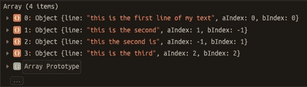

# 如何在 Javascript 中使用 PatienceDiff 方法

> 原文：<https://betterprogramming.pub/how-to-use-the-patiencediff-method-in-javascript-36e36be8ebd3>

## 处理用户输入和文档的 JavaScript 爱好者的必备知识


帕特里克·托马索在 Unsplash[上的照片](https://unsplash.com?utm_source=medium&utm_medium=referral)

当您处理用户定义的输入时，您可能会发现，比较文本可以加快某些功能的速度，甚至是应用程序中的一项关键功能。例如，如果您正在处理一个需要实时处理用户输入的编辑器，那么最好只查找和处理被修改的文本块，而不是递归地处理整个文本。

在自然语言处理方面也可能需要它，我想到的第一个用例将适用于 Jasper 这样的应用程序，开发人员可以比较他们的 ML 模型的输出和用户写的句子。根据两种文本之间的差异，微调 ML 模型以匹配用户的写作风格。

当代码变得太长而无法手动分析时，您可能还想用它来比较调整后的代码块与原始代码块。

# PatienceDiff 方法是什么？

正如您所看到的，寻找两个文本之间的差异有各种用例，知道如何使用 PatienceDiff JavaScript 实现可以节省您的时间，因为这是一种将两个文本块中的行匹配起来的复杂方法，允许您将它们分成更小的片段。在对两个文档应用 Patience Diff 方法后，我们将很容易找到第二个文档与第一个文档不同的行。

另一件值得注意的事情是，我们将在 PatienceDiff 函数中传递要处理的数组，这意味着它不仅适用于文本行(尽管这是它的主要用例)，还适用于单个字符的变体，只是将文本作为逐字符数组传递，而不是逐行传递。

Patience diff 的工作原理以及它与大多数 diff 方法相比的优势在[这篇小博文](https://bramcohen.livejournal.com/73318.html)中有详细描述。主要是，最大的实际优势是耐心差异不会匹配空白行或两个完全重写的文本之间的共同字符。

# JavaScript 实现

耐心差异的 JavaScript 实现可以在[这里](https://github.com/jonTrent/PatienceDiff/blob/dev/PatienceDiff.js)找到。现在可以导入这个 JavaScript 文件并使用`patienceDiff()`函数。让我们来看看如何使用它。

使用这个函数非常简单，假设我们有两个文本数组`textOne`和`textTwo`，我们现在可以如下调用耐心差异:`patienceDiff(textOne, textTwo)`。现在我们来看一个更实际的例子。

我们定义两个文本数组，然后调用`patienceDiff`函数并记录 diff ( `diff.lines`)的结果:

```
const textOne = ['this is the first line of my text', '**this is the second**', 'this is the third']
const textTwo = ['this is the first line of my text', '**this the second is**', 'this is the third']const diff = patienceDiff(textOne, textTwo)
console.log(diff.lines)
```

根据您对差异的理解，输出可能与您想象的不同:



这是什么？
如果你还记得的话，patience diff 做的事情是将两个文本块匹配起来；这正是这里发生的事情。从两个初始数组开始，Patience diff 创建了一个数组，将两个文本的所有唯一行放在一起。事实上，只有索引 1 行(`textOne[1]`和`textTwo[1]`)在这个数组中被报告了两次，因为它是文本之间唯一发生变化的行。

为了正确地读取数组，您必须理解数组中每个对象的结构(`[line, aIndex, bIndex]`)。直观地说，`object.aIndex`表示第一次通过的数组中第`object.line`行的索引，在我们的例子中是`textOne`。另一方面，`object.bIndex`表示第二次传递的数组中行`object.line`的索引，在我们的例子中是`textTwo`。

当`object.bIndex`中的`-1`出现时，意味着`object.line`在第二次传递的数组(`textTwo`中不同，反之，当`object.aIndex`中的`-1`出现时，则相反。

## 实际例子

现在，我将向您介绍我在文章开头谈到的第一个用例的实现:我们有一个文本的两个版本，我们希望找到在最新版本中发生变化的行。这些要更新的行将作为文本第二个版本中已更改的行的索引数组返回。

*   在第[1，2]行中，我定义了文本的两个版本
*   在第[5，6]行中，我使用了耐心差异并记录了输出数组
*   在第[9，15]行中，我启动了一个 forEach 循环:每当在`line.aIndex`或`line.bIndex`中发现一个`-1`，就在我们要更新的索引列表中添加`aIndex`和`bIndex`T5 的总和。**为什么会这样？**我们需要找到当前行的索引(因为它是需要更新的行)，我们也知道`line.aIndex`或`line.bIndex`将始终是`-1`，因为`line`已经通过了 if 条件，这意味着`aIndex`和`bIndex`的和将始终是`lineIndex-1`，所以我们用一个`+1`来平衡等式。这不是一个完美的解决方案，但是在我们的例子中非常好，因为我们不需要再次调用`diff.lines`数组来查询它的索引。
*   最后，在第[15，16]行，我从`toUpdate`列表中删除了所有重复的内容(我选择添加`aIndex`和`bIndex`以及 for 循环，然后删除其中一个，因为它给出了一个通用的解决方案，也适用于空白行删除)并记录了输出。

我希望这篇文章对你有用，一如既往地感谢你的阅读！