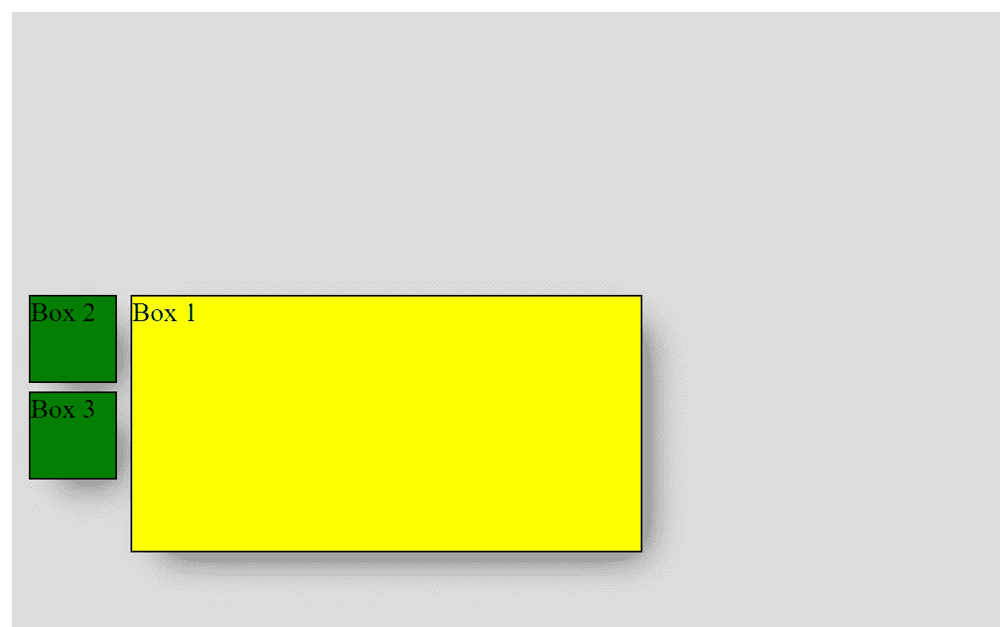
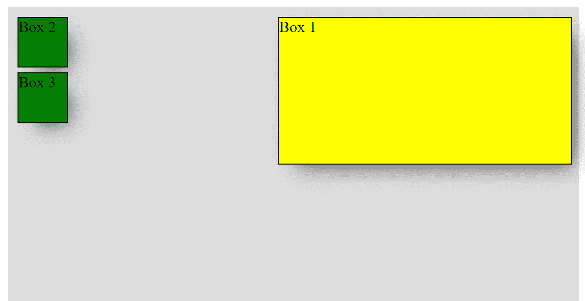

# 如何在 CSS 中使用 position 属性

> 原文：<https://betterprogramming.pub/how-to-use-the-position-property-in-css-926a3ea8a9b2>

## 一个 CSS 布局的基本原理在简单的盒子例子中演示

Aleks Dorohovich 在 [Unsplash](https://unsplash.com?utm_source=medium&utm_medium=referral) 上拍摄的照片。

CSS 在大多数开发人员中并不流行，这种技术的知识往往被低估。这就是为什么在设计元素时会有很多挫败感。

对与 DOM 中其他组件有不明确关系的元素进行样式化可能特别棘手。为了理解 CSS 定位是如何工作的，你应该了解一下基本原理。

元素的适当位置取决于大小写。您可能只想从默认位置移动特定元素及其子元素。在这种情况下，最好使用`position` 属性。

# 位置属性

该属性有助于操作选定元素的位置。有五种不同的位置值:

*   `static`
*   `relative`
*   `fixed`
*   `absolute`
*   `sticky`

现在您应该记住，元素是使用`top`、`bottom`、`left`和`right`属性来定位的。但是，除非先设置`position`属性，否则这些属性将不起作用。他们如何表现也取决于位置值，这是开发者最困惑的部分。

让我们用简单的例子来掌握这些价值观。

# 位置:静态

默认情况下，该值是为所有 HTML 元素设置的。这意味着它们是根据页面的正常流动来定位的。

另外，请记住，静态位置的元素不受`top`、`bottom`、`left`和`right`属性的影响。

现在，让我们看一个简单的例子，里面有一个容器和三个盒子:

这是我们的 CSS:

如上所述，`position: static`被设置为每个元素的默认值。因此，没有必要将其添加到 CSS 文件中。箱子按照正常流程堆放。

位置:静态

# 位置:相对

带有`position: relative`的元件相对于其正常位置定位。

现在，让我们试着将黄色盒子放在绿色盒子旁边。它应该是这样的:

位置:相对

因为我们想将黄色框从正常位置移开，所以我们必须以如下方式调整 CSS:

试着玩盒子，检查它们的行为。

# 位置:固定

带有`position: fixed`的元素相对于视口定位。这意味着即使页面滚动，它也总是停留在同一个地方。

需要记住的一个重要方面是，元素被从文档流中移除，因此它不会在页面上它通常所在的位置留下间隙。

让我们给我们的黄色盒子一个固定的位置:

这是结果:

位置:固定

现在，如果您滚动页面，黄色框将停留在视窗中。作为一个例子，这是一个网站的导航条应该如何使用。此外，由于前面提到的方面，绿色框被堆叠到顶部。

# 位置:绝对

带有`position: absolute`的元素相对于最近的祖先定位(而不是像`fixed`那样相对于视口定位)。

带有`position: absolute`的元素从文档流中移除，其他元素将表现得好像它不在那里，而所有其他位置属性将对它起作用。

注意:如果一个绝对定位的元素没有定位的祖先，它使用文档体并随着页面滚动移动。

现在，让我们修改我们的例子，将一个绿色的盒子移到黄色的盒子里。

让我们假设黄色盒子有`position: fixed`和`right: 10px`(与上面的例子相同)。

如果我们想把内部的绿色盒子移到黄色盒子下面会怎么样？同时，我们不想修改 HTML 文件。

我们可以通过给绿框`position: absolute`来实现:

如果滚动页面，两个框都将停留在视窗中。

# 位置:粘性

这个值是实验性的，因为还不是所有的浏览器都支持它。基于用户的滚动位置定位带有`position: sticky`的元素。

粘性元素根据滚动位置在`relative`和`fixed`之间切换。它相对定位，直到在视口中遇到给定的偏移位置。然后它“粘”在适当的位置(像`position: fixed`)。

# 实践空间

了解 CSS 有时会非常棘手和令人沮丧。掌握这些原则的唯一方法就是练习。写很多代码，创建简单的项目，随心所欲地设计元素。

如果您想提高您的定位技能，请随意使用[盒子](https://codepen.io/Dromedian_sk/pen/OJVbYVY)。

感谢阅读！